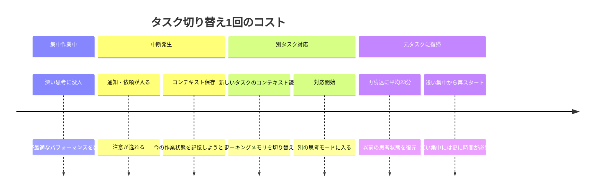
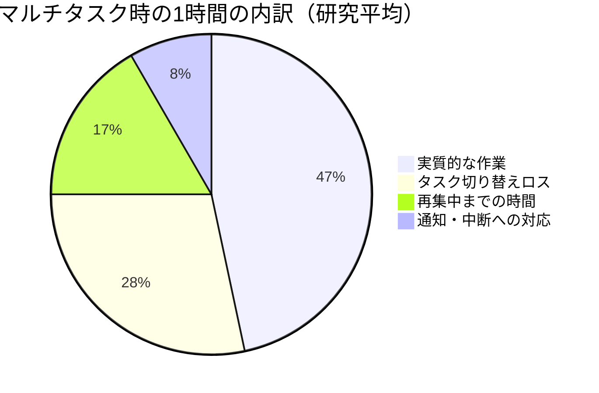

高橋さん（28歳・企画職）は、自分のことを「マルチタスクの達人」だと思っていた。Zoomミーティング中にSlackを返し、企画書を書きながらメールをチェックし、昼食を食べながら資料を読む。「同時に3つはいける」が口癖だった。ある日、上司に提出した企画書に、Slackで同僚に送るはずだった「了解です！」が紛れ込んでいた。上司の一言が刺さった。「高橋、お前は全部やってるつもりで、何一つ終わってないぞ」。

---

## 脳は「同時処理」ができない

「マルチタスクが得意」という自己認識は、脳科学的には**錯覚**です。

### スイッチング・コストの正体

私たちがマルチタスクだと思っているのは、実は**タスク間の高速切り替え（タスクスイッチング）**に過ぎません。AとBを同時に処理しているのではなく、A→B→A→B→Aと意識を往復させているだけ。そして、この切り替えのたびに脳は大きな代償を払っています。

**スイッチングコストの研究データ:**
- 中断されたタスクに再集中するまでの時間: **平均23分**（カリフォルニア大学アーバイン校の研究）
- タスク切り替え時のエラー率増加: **約40%**
- マルチタスク時のIQ低下: **一時的に10ポイント**（睡眠不足と同等のレベル）
- マルチタスカーの生産性低下: **シングルタスカーに比べて約50%**

### なぜ脳は騙されるのか

マルチタスクをしている最中、脳はドーパミンを分泌します。「忙しい自分」「たくさんこなしている自分」に対する小さな報酬です。しかし、これは**忙しさへの中毒**であり、実際の生産性とは無関係。むしろ、本当に重要な[ディープワーク](/blog/deep-work)の時間を奪っています。

---

## マルチタスクが引き起こす5つの問題

### 1. 浅い思考しかできなくなる

深く考えるには、一定時間の連続した集中が必要です。マルチタスクでは表面的な処理しかできず、創造性やイノベーションが生まれにくくなります。

### 2. ストレスホルモンが上昇し続ける

常に複数のことを気にしている状態は、コルチゾール（ストレスホルモン）を慢性的に上昇させます。これは疲労感、不眠、免疫力低下の原因になります。

### 3. 達成感が得られない

何かを完了させる前に次に移るため、「やり切った」という満足感がゼロ。常に「あれもやらなきゃ」「これも途中だ」という焦りが残ります。

### 4. ミスが増える

タスク切り替えのたびにワーキングメモリがリセットされるため、ケアレスミス、抜け漏れ、的外れな返答が増えます。

### 5. 時間の見積もりが狂う

マルチタスク中は「たくさんやっている感覚」があるため、実際の進捗を過大評価しがちです。結果、締め切り直前に慌てることになります。

1時間のうち、実質的に価値を生んでいるのはわずか**28分**。残り32分は切り替えコストに消えています。

---

## ケーススタディ: シングルタスクへの転換

### Case 1: 鈴木さん（35歳・Webディレクター）――残業が消えた

鈴木さんは5つのプロジェクトを同時に抱え、常にSlack、メール、タスク管理ツールを開いていた。画面には常に12個のタブが並び、1日の通知件数は200件を超えていた。

「毎日21時まで働いていたのに、何も終わった気がしなかった」と鈴木さんは言う。

**シングルタスクへの移行:**
- 午前中はSlackとメールを閉じ、最重要プロジェクト1つだけに集中
- 通知は全てオフ。確認は11時・14時・17時の3回のみ
- ブラウザのタブは作業中のプロジェクトに関するものだけ

**Before → After（1ヶ月後）:**
- 平均退社時間: 21:00 → 18:30
- プロジェクト完了率: 月60% → 月95%
- クライアントからのやり直し依頼: 月8件 → 月1件

「最初の1週間は不安でした。"すぐ返事しないと怒られるんじゃないか"って」と鈴木さんは振り返る。「でも誰も怒らなかった。むしろ、"最近のアウトプット、質が上がったね"と言われた」。

### Case 2: 伊藤さん（42歳・エンジニアリングマネージャー）――チーム生産性が2倍に

伊藤さんのチームでは、全員がSlack常時接続、即レスが当たり前の文化だった。コードを書いている最中でも、メンションが飛べば即座に対応する。チーム全体が慢性的な「浅い仕事」状態に陥っていた。

「コードレビューで明らかにおかしいバグを見逃していた。全員が中途半端な集中だった」と伊藤さんは語る。

**チーム単位での改革:**
- 「集中タイム」を導入: 10:00-12:00はSlack通知禁止、緊急時は電話のみ
- 会議は火曜と木曜の午後に集約。他の日は集中ブロック
- 「ちょっといい？」は15時以降のオフィスアワーで対応

**Before → After（3ヶ月後）:**
- スプリント完了率: 65% → 92%
- バグ発生率: 月平均12件 → 月平均3件
- チーム満足度調査: 3.2点 → 4.6点（5点満点）

### Case 3: 松本さん（31歳・営業職）――成約率が倍増

松本さんは移動中に電話し、商談中にメールを確認し、提案書を書きながらSNSをチェックしていた。「営業は効率命だから」が信条だった。しかし、商談中の「ながら確認」をクライアントに見られ、「松本さん、うちの話、聞いてます？」と言われたのが転機になった。

**シングルタスクへの転換:**
- 商談中は一切のデバイスを鞄にしまう
- 提案書は[ポモドーロ・テクニック](/blog/pomodoro-technique)で25分間集中して書く
- メール・電話の対応は移動時間にまとめる

**Before → After:**
- 成約率: 15% → 32%
- 提案書作成時間: 平均3時間 → 平均1.5時間
- クライアント満足度: 顕著に改善（紹介案件が増加）

「商談に100%集中するようになったら、相手の本音が聞こえるようになった」と松本さんは言う。

---

## シングルタスク実践の3段階

### レベル1: 環境を整える（今日からできる）

**物理的環境:**
- デスク上は現在のタスクに必要なものだけ
- スマホは引き出しか別室に置く
- 作業中は通知を全てオフにする

**デジタル環境:**
- ブラウザのタブは必要最小限（理想は1-3個）
- メーラーは閉じる（確認時間を決める）
- フルスクリーンモードで作業する

### レベル2: 時間をブロックする（1週間で習慣化）

**ポモドーロ・テクニック:**
- 25分: 一つのタスクに没入
- 5分: 完全な休憩（身体を動かす）
- 4セット後: 15-30分の長休憩

**ディープワークブロック:**
- 90分: 高い認知負荷の作業に長時間集中
- 20分: 完全な休息
- 1日2-3ブロックが限界

```mermaid
gantt
    title シングルタスク型の1日スケジュール
    dateFormat HH:mm
    axisFormat %H:%M
    section 午前（集中）
        ディープワーク1     :done, d1, 09:00, 90m
        休憩              :crit, b1, 10:30, 20m
        ディープワーク2     :done, d2, 10:50, 90m
    section 昼
        昼食・散歩         :active, l1, 12:20, 60m
    section 午後（対応）
        メール・Slack一括処理 :active, m1, 13:20, 30m
        会議ブロック        :active, mt1, 13:50, 60m
        ポモドーロ1         :done, p1, 14:50, 25m
        休憩              :crit, b2, 15:15, 5m
        ポモドーロ2         :done, p2, 15:20, 25m
        休憩              :crit, b3, 15:45, 5m
    section 夕方（整理）
        メール最終チェック   :active, m2, 15:50, 20m
        翌日の計画         :active, pl1, 16:10, 20m
```

### レベル3: 誘惑を管理する（習慣化のコツ）

作業中に「あ、あれもやらなきゃ」と思いついたら、即座に**「後でやるリスト」**にメモして、現在のタスクに戻ります。

**後でやるリストのルール:**
1. 横にメモ帳（紙でもデジタルでも）を常備
2. 浮かんだことは3秒で書き出す
3. 書いたら即座に今のタスクに戻る
4. 休憩時間にリストを確認して処理する

これは脳の「オープンループ」を閉じるテクニックです。「忘れたくない」という不安が集中を妨げるので、書くことで脳から追い出し、安心して目の前のタスクに没頭できます。

---

## マインドフルネスで集中筋を鍛える

シングルタスクの能力は、筋肉と同じで鍛えられます。

**1分間集中トレーニング（毎日）:**
1. 目の前の物（ペン、マグカップなど）を1つ選ぶ
2. 形、色、質感、重さをじっくり観察する
3. 雑念が浮かんだら、気づいて静かに観察に戻す
4. これを1分間続ける

**食事シングルタスク（週に3回）:**
- 食事中はスマホ、テレビ、読書を全てやめる
- 味、香り、食感だけに集中する
- 咀嚼をゆっくりと意識する

最初は30秒すら集中できないかもしれません。それが普通です。毎日続けることで、集中の「持久力」が着実に伸びていきます。

---

## よくある疑問と回答

**Q: 本当に緊急の連絡があったらどうする？**
A: 本当に緊急なら電話が来ます。Slackやメールの「緊急」は、ほとんどの場合1-2時間待てるものです。

**Q: 上司が即レスを求める文化の場合は？**
A: 「集中タイム」の概念を提案し、その時間帯は応答が遅れることを事前に伝えましょう。成果で示せば理解されます。

**Q: マルチタスクが必要な職種もあるのでは？**
A: 受付やコールセンターなど、反応速度が求められる業務はあります。しかし、それでも「創造的な業務」と「反応的な業務」を時間帯で分けることは可能です。

---

## 今日、1時間だけ試してみてください

まず1時間だけでいいので、以下を実践してください。

1. スマホを引き出しに入れる
2. 通知を全てオフにする
3. ブラウザのタブを必要なものだけに絞る
4. 目の前の1つのタスクだけに向き合う

きっと、久しぶりに「仕事をした」という実感が得られるはずです。

[朝のルーティン](/blog/morning-routine)に「集中タイムの確保」を組み込めば、シングルタスクが自然と習慣になります。また、[フィードバックの受け止め方](/blog/feedback-mindset)を身につけることで、「即レスしない自分」への周囲の反応にも冷静に対応できるようになります。

---

## 「集中できない自分」を変えたい方へ

マルチタスクの習慣は、意志の力だけでは変えにくいものです。環境設計、時間ブロックの具体的な方法、そしてあなたの仕事の特性に合わせた集中戦略を、体験セッションで一緒に組み立てましょう。1時間の集中がもたらす成果の違いを、実感してください。

[体験セッションに申し込む](/sessions)
