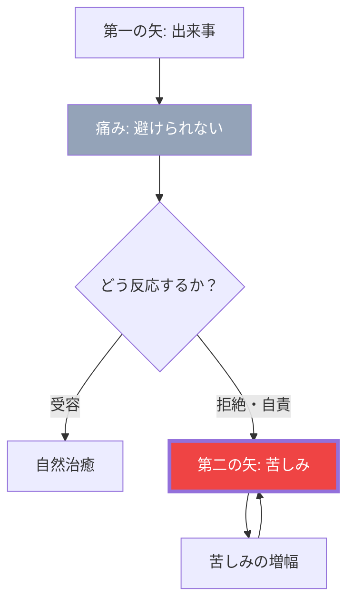

## 苦しみを2倍にしていませんか

仕事でミスをした。
→ 落ち込む（これは自然な反応）
→ 「なんて自分はダメなんだ」と自分を責める
→ 「こんな簡単なこともできないなんて」と追い打ちをかける
→ 「もう自分はダメだ」と絶望する

最初のミスは1つ。
でも、自分で自分を攻撃することで、苦しみが何倍にもなっています。

## 「第二の矢」の教え

仏教には「二本の矢」という教えがあります。

人生では、誰もが矢（苦しみ）を受けます。
これは避けられません。

しかし、多くの人は自分で第二の矢を射っています。
「最初の痛み」に対して「自分を責める」「将来を悲観する」「過去を悔やむ」という追加の矢を放つのです。

## 「第二の矢」の教え

### 第二の矢のメカニズム

第一の矢は避けられない。
でも、第二の矢を射るかどうかは、自分で選べます。

## 第二の矢のパターン

### パターン1: 自己批判

「なんてダメな人間なんだ」
「自分が悪い」
「もっとちゃんとすべきだった」

### パターン2: 反芻思考

同じ出来事を何度も頭の中で繰り返す。
「あのときこうすれば」「なぜあんなことを」

### パターン3: カタストロフィー化

「これで人生終わりだ」
「もう取り返しがつかない」
一つの出来事を破滅的に解釈する。

### パターン4: 感情の否定

「こんなことで落ち込むなんて弱い」
「怒ってはいけない」
感情を否定することで、かえって感情が長引く。

## 第二の矢を射らない方法

### 方法1: 感情を認める

「今、自分は落ち込んでいる」
「悲しいと感じている」

感情に名前をつけて、認める。
否定せず、ただ観察する。

### 方法2: 自分に優しい言葉をかける

友人がミスをしたら、何と声をかけますか？

「大丈夫、誰でも失敗はある」
「次があるよ」

自分にも同じ言葉をかけてあげてください。

### 方法3: 「今」に戻る

過去を悔やんでも、過去は変わらない。
未来を心配しても、未来はまだ来ない。

今、この瞬間にできることに集中する。

### 方法4: 一時停止する

感情的になったとき、すぐに反応しない。
深呼吸をして、6秒待つ。

衝動的な第二の矢を防ぐことができます。

## 痛みと苦しみの違い

**痛み（Pain）**は避けられない。
**苦しみ（Suffering）**は選択できる。

苦しみ = 痛み × 抵抗

痛みに抵抗すればするほど、苦しみは増幅します。
痛みを受け入れることで、苦しみは軽減できるのです。

今度何か辛いことがあったら、「第二の矢を射っていないか？」と自分に問いかけてみてください。
