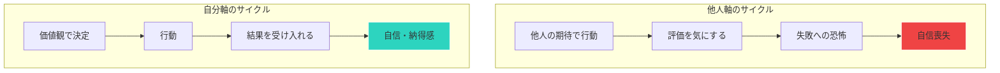

## 他人軸で生きている予兆

「みんながやっているから」
「親が喜ぶから」
「上司に言われたから」
「常識的にはこうだから」

こうした理由で意思決定していませんか？

それは「他人軸」で生きているサインです。

## 自分軸と他人軸の違い

### 他人軸

- 判断基準が外にある
- 他人の評価を気にする
- 周りと比較して一喜一憂する
- 嫌われることを恐れる
- 「正解」を探し続ける

### 自分軸

- 判断基準が内にある
- 自分の価値観に従う
- 自分のペースで進む
- 嫌われることを受け入れる
- 「納得解」を追求する

## なぜ他人軸になるのか

### 他人軸 vs 自分軸のサイクル

### 1. 教育の影響

「いい子でいなさい」「先生の言うことを聞きなさい」
幼少期から、他人の期待に応えることを教えられてきました。

### 2. 日本社会の同調圧力

「出る杭は打たれる」「空気を読め」
集団に合わせることが美徳とされる文化があります。

### 3. 失敗の恐怖

自分で決めて失敗したら、責任を負わなければならない。
他人の言うとおりにすれば、失敗しても言い訳ができる。

## 自分軸を取り戻す5つのステップ

### ステップ1: 自分の価値観を言語化する

「何を大切にしているか」を明確にする。

- 自由
- 挑戦
- 安定
- 貢献
- 成長
- 家族

上位3つの価値観を選び、意思決定の指針にします。

### ステップ2: 「なぜ？」を5回繰り返す

「転職したい」→ なぜ？
「給料を上げたい」→ なぜ？
「良い家に住みたい」→ なぜ？
「家族を幸せにしたい」→ なぜ？
「自分も幸せになりたい」

本当の理由にたどり着くまで深掘りします。

### ステップ3: 「誰の声か」を識別する

頭の中の声は、本当に自分の声ですか？

- 親の声
- 上司の声
- 社会の声
- 過去の自分の声

識別することで、自分の声を見つけやすくなります。

### ステップ4: 小さな自己決定を増やす

ランチのメニュー、休日の過ごし方、服の選択。
日常の小さなことから、「自分で決める」練習をする。

### ステップ5: 「期待」を手放す

他人の期待に応えることを手放す。
全員に好かれることは不可能だと受け入れる。

## 自分軸は「わがまま」ではない

自分軸で生きることは、他人を無視することではありません。

自分の価値観を大切にしながら、他者とも良好な関係を築く。
「自分も大切、相手も大切」というスタンスです。

まずは今日、一つ「自分で決める」ことをしてみてください。
その小さな一歩が、自分の人生を取り戻す始まりです。
