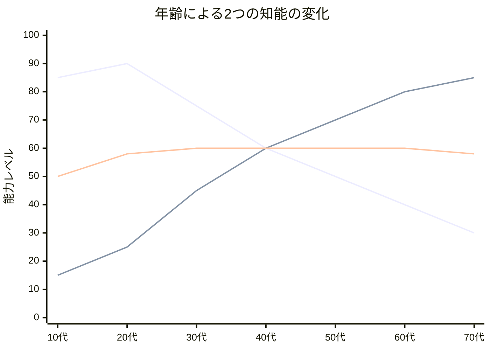
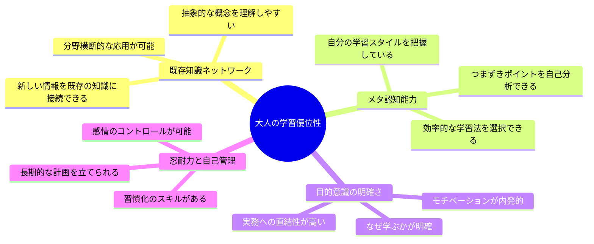
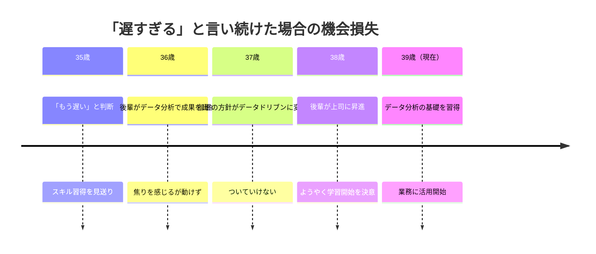

田中雅彦さん（42歳・製造業の品質管理マネージャー）は、息子のプログラミング教室の発表会で、小学4年生がPythonでゲームを作っているのを見た。帰りの車の中で、助手席の妻に言った。「俺も本当はプログラミングを学びたいんだ。でもさ、42歳だぞ。もう遅いだろ」。妻は即答した。「あなた、去年も同じこと言ってたよ。あのとき41歳で『もう遅い』って。来年は43歳で同じこと言うの？」。その一言が、田中さんの「年齢の呪い」を解き始めた。

## 「もう遅い」は本当か？――脳科学が出した答え

「もう若くないから」「今さら新しいことなんて」――あなたもこう感じたことはないだろうか。

実は、この思い込みは**科学的に完全に否定されている**。

1990年代以降の脳科学の飛躍的発展により、かつて「成人すると変化しない」と信じられていた脳の常識は完全に覆された。脳は何歳になっても新しい神経回路を形成し続ける。これを**神経可塑性（Neuroplasticity）**と呼ぶ。

2013年のハーバード大学の研究では、65歳以上の被験者がジャグリングを12週間練習した結果、脳の灰白質の体積が有意に増加したことが確認されている。つまり、脳は物理的に「作り変わる」のだ。

## 年齢×学習力の真実――2つの知能

「年を取ると頭が悪くなる」は半分正しく、半分間違っている。ここで理解すべきは、知能には2種類あるということだ。

**流動性知能**（新しい情報の処理速度、暗記力）は20代をピークに緩やかに低下する。一方、**結晶性知能**（経験に基づく判断力、知識の統合力、パターン認識）は年齢とともに向上し続ける。

注目すべきは**総合的な学習力はほぼ横ばい**という事実。つまり、学び方が変わるだけで、学ぶ力自体は失われない。

## 大人の学習における4つのアドバンテージ

子どもの脳が「白紙に自由に描ける」優位性を持つなら、大人の脳は「既存の絵に新しい要素を統合できる」優位性を持つ。これは学習において決定的な差を生む。

## ケーススタディ1: 42歳でプログラミングを始めた田中さん

冒頭の田中雅彦さんは、妻の一言をきっかけに行動を起こした。

最初の1ヶ月は惨憺たるものだった。オンライン学習サイトで「Hello World」を表示するだけで30分かかり、息子に「パパ、それ5分でできるよ」と言われた。

しかし田中さんには、10代の学生にはない武器があった。**20年間の品質管理の経験**だ。

「プログラミングの構造って、品質管理のフローチャートと同じじゃないか」

この気づきが転機になった。条件分岐はQC工程の判定基準、ループ処理は繰り返し検査、エラーハンドリングは異常値対応。既存の知識体系にプログラミングの概念を「接続」できたことで、学習速度は一気に加速した。

**田中さんの学習記録:**

| 期間 | 学習内容 | 成果 |
|------|----------|------|
| 1-2ヶ月目 | Python基礎 | Hello World、基本構文の理解 |
| 3-4ヶ月目 | データ処理 | ExcelデータのPython自動処理 |
| 5-6ヶ月目 | 業務自動化 | 品質検査レポートの自動生成ツール |
| 7-9ヶ月目 | Webアプリ | 社内品質ダッシュボードの構築 |
| 10-12ヶ月目 | 社内展開 | チーム全体の業務効率30%改善 |

「42歳だから遅い？むしろ、20年の業務経験があったから、何を自動化すべきかすぐにわかった。10代の子が1年でここまでの業務改善を実現することは難しいはずです」

田中さんは現在、社内のDX推進メンバーとして活躍している。年収は120万円アップした。

## ケーススタディ2: 55歳で英語を始めた佐藤恵子さん

佐藤恵子さん（55歳・地方の旅館女将）が英語を学び始めたきっかけは、外国人観光客の増加だった。

「いらっしゃいませ」の後が続かない。Google翻訳を見せるだけの対応に、佐藤さんは心苦しさを感じていた。

「55歳で英語なんて無理でしょう」と周囲は言った。実際、中学英語すら怪しいレベルだった。

しかし佐藤さんは、旅館経営30年で培った**「おもてなしのコミュニケーション」**という最強の武器を持っていた。

佐藤さんの学習法はユニークだった。英語の教科書ではなく、「旅館で使う100のフレーズ」を自分で作り、それだけを徹底的に練習した。

「文法は全然わからないけど、お客様に喜んでもらうフレーズだけは完璧にしたかった」

**佐藤さんの変化:**

- 学習開始前: 外国人客の対応は身振り手振りのみ。口コミ評価に「言葉が通じない」の指摘
- 6ヶ月後: チェックイン・チェックアウト、食事の説明、観光案内が英語で可能に
- 1年後: Booking.comの英語レビューに「The owner speaks English and is very kind」のコメントが増加。外国人宿泊者数が前年比40%増加
- 現在: 地域の旅館オーナー向け「おもてなし英語」講座を月1回開催

「55歳だからこそできたと思います。30年間お客様と向き合ってきたから、何を伝えれば喜ばれるかわかる。若い頃だったら、文法ばかり気にして、お客様の顔を見る余裕がなかったかもしれない」

## ケーススタディ3: 38歳で「遅すぎた」と気づいた山本さん

山本健太さん（38歳・広告代理店勤務）のケースは、少し異なる角度からの学びを提供する。

山本さんは35歳のとき、「もうデータサイエンスを学ぶには遅い」と判断し、新しいスキル習得を見送った。3年後の38歳、部署の半数がデータ分析ツールを使いこなしていた。後輩が自分の上司になった。

「35歳のときに始めていれば、今ごろ3年分のスキルが蓄積されていた。38歳の今、始めないと、41歳でまた同じ後悔をする」

山本さんはようやくデータサイエンスの学習を開始した。

「一番若い日は今日なんです。35歳のときに気づいていれば……でも、38歳で始めた自分を、41歳の自分は褒めてくれるはず」

## 年齢を超えて学ぶ5つのメソッド

3人のケーススタディから抽出された、大人の学習を成功させるメソッドを紹介する。

### メソッド1: 「接続学習法」――既存の知識に新しい知識をつなげる

田中さんが品質管理とプログラミングを接続したように、あなたの職業経験は最強の学習基盤になる。

**実践ステップ:**
1. 学びたいスキルの基本概念を10個リストアップする
2. それぞれについて「自分の仕事で似ているもの」を探す
3. その類似点を出発点にして学習を進める

営業経験者がマーケティングを学ぶなら、「顧客の課題発見→提案→クロージング」のフローはそのまま「ペルソナ設定→コンテンツ設計→CTA」に接続できる。

### メソッド2: 「目的駆動型学習」――ゴールから逆算する

佐藤さんが「旅館で使う100フレーズ」に特化したように、学ぶ範囲を絞り込む。

「プログラミングを学ぶ」→「業務の請求書作成を自動化するスクリプトを書く」
「英語を学ぶ」→「海外クライアントとのメールに30分以内で返信できるようになる」
「データ分析を学ぶ」→「月次売上レポートをExcelからPythonに移行する」

具体的であるほど、脳は「何を覚えるべきか」を選別しやすくなる。[目的設定と行動計画については、ファーストプリンシプル思考が役立つ](/blog/first-principles-thinking)。

### メソッド3: 「毎日20分の法則」――頻度で脳を書き換える

脳の神経回路は**反復頻度**によって強化される。週末に5時間まとめて学ぶより、毎日20分の方が神経回路の形成には効果的だ。

**科学的根拠:**
- エビングハウスの忘却曲線: 1日後に74%を忘却する。しかし翌日の復習で記憶保持率が大幅に改善
- 分散学習効果: 同じ総時間でも、分散させた方が長期記憶への定着率が高い
- 習慣のしきい値: ロンドン大学の研究では、平均66日間の反復で行動が自動化される

[ポモドーロ・テクニック](/blog/pomodoro-technique)を活用すれば、20分の学習を効率的にルーティン化できる。

### メソッド4: 「アウトプットファースト」――使って覚える

インプットだけでは知識は定着しない。学んだことを「使う」ことで、知識がスキルに変わる。

**アウトプットの段階:**

| レベル | アクション | 定着率 |
|--------|-----------|--------|
| 1 | 読む・聴く | 10-20% |
| 2 | メモを取る | 30-40% |
| 3 | 人に説明する | 50-70% |
| 4 | 実際にやってみる | 75-90% |
| 5 | 人に教える | 90%以上 |

田中さんがプログラミングを業務に即適用し、佐藤さんが学んだフレーズを翌日すぐにお客様に使ったように、「学んだ翌日に使う」を原則にしよう。

### メソッド5: 「失敗の再定義」――恥を学習に変換する

大人の学習で最大の障壁は、能力の限界ではなく**「恥をかきたくない」という心理**だ。

[インポスター症候群](/blog/imposter-syndrome)の記事でも触れたが、大人は「できる自分」のイメージを守りたがる。しかし学習とは本質的に「できない状態」から始まるプロセスだ。

田中さんは息子に「パパ、それ5分でできるよ」と言われた。佐藤さんは外国人客に通じない英語を何度も話した。二人とも恥をかいた。そして二人とも、その恥を燃料に変えた。

**実践のコツ:**
- 「完璧にできるようになってから始める」ではなく「始めてから完璧に近づける」
- 失敗の記録をつける。1ヶ月後に見返すと、成長の軌跡になっている
- 学習コミュニティに参加し、「初心者であること」を公言する

## 「始めるのに最も遅い日」は存在しない

歴史は、年齢が学びの障壁にならないことを繰り返し証明してきた。

- レイ・クロック（マクドナルド）: 52歳でフランチャイズ展開開始
- カーネル・サンダース（KFC）: 65歳でフライドチキンのフランチャイズ開始
- 安藤百福（日清食品）: 48歳でチキンラーメン、61歳でカップヌードル発明
- グランマ・モーゼス: 76歳で本格的に絵を描き始め、世界的画家に
- ヴェラ・ワン: 40歳でファッション業界に参入

彼らに共通しているのは、「遅い」と思ったその日に始めたこと。

## 今日から始める3つのアクション

**アクション1: 「封印リスト」を書く**
年齢を理由に諦めていたことを3つ書き出す。そのうち1つを選ぶ。

**アクション2: 20分だけやる**
選んだ1つについて、今日20分だけ最初の一歩を踏み出す。本を1章読む。動画を1本見る。アプリをインストールする。

**アクション3: 1年後の自分に手紙を書く**
「1年後、この学びがどうなっていてほしいか」を具体的に書く。[朝のルーティン](/blog/morning-routine)に組み込めば、毎日目に入る場所に置ける。

5年後のあなたは、今日のあなたを振り返ってこう思うだろう。

「あのとき始めておいてよかった」か、「あのとき始めていればよかった」か。

この記事を読んでいる今日が、あなたの人生で一番若い日だ。

---

## あなたの「もう遅い」を一緒に壊しませんか？

年齢を理由に諦めていることがあるなら、それは「始め方」を知らないだけかもしれません。

**体験コーチングセッション**では、あなたのキャリアや人生経験を活かした学習戦略を一緒に設計します。田中さんや佐藤さんのように、あなただけの「接続ポイント」を見つけましょう。

[今すぐ体験セッションに申し込む](/sessions)
