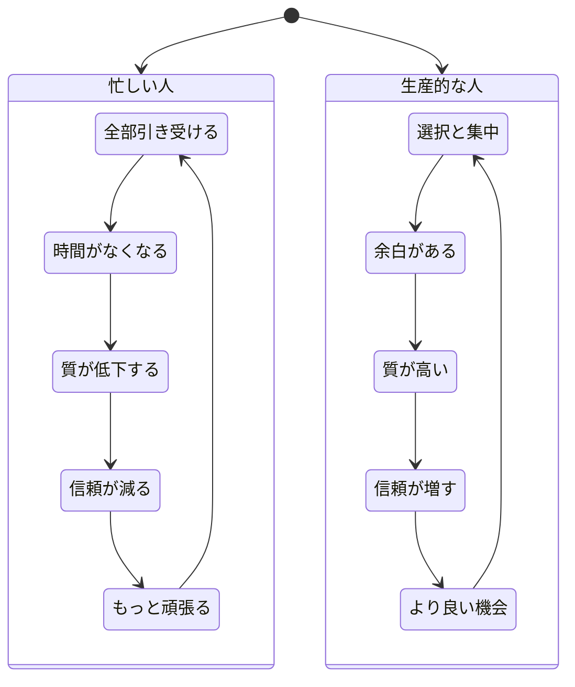
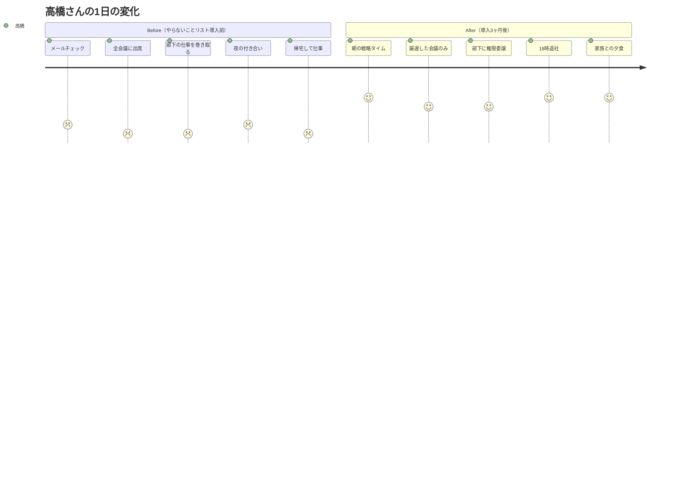

金曜日の夜20時。渡辺亮介さん（36歳・IT企業のプロジェクトマネージャー）は、妻からのLINEを見て固まった。「今日、娘の誕生日会だったの覚えてる？18時からって言ったよね」。渡辺さんはオフィスの椅子に座ったまま、天井を見上げた。娘の5歳の誕生日。2週間前からカレンダーに入れていた。なのに、18時の会議を断れなかった。理由は「忙しかったから」。帰宅した渡辺さんに、娘は泣きながら言った。「パパはいつも忙しいね。もう来なくていいよ」。

## 「忙しい」は呪いの言葉

「最近どう？」「忙しくてさ」。

この会話、今週何回しただろうか。日本のビジネスパーソンを対象にしたある調査では、1日に平均3.2回「忙しい」と口にしているという結果がある。年間に換算すると約1,170回。

問題は、この言葉が**単なる状況報告ではなく、思考停止のトリガー**になっていることだ。

「忙しいから運動できない」「忙しいから本が読めない」「忙しいから家族との時間が取れない」――こう言った瞬間、**「どうすればできるか？」という創造的な思考が完全に止まる**。

## 「忙しい」の正体を暴く

### 正体1: 優先順位の不在

「時間がない」は、ほとんどの場合、正確ではない。正確に言えば「その活動の優先順位が低い」ということだ。

NetflixやSNSを見る時間はあるのに、運動する時間がない。それは時間の問題ではなく、**選択の問題**である。

### 正体2: 「No」と言えない症候群

日本のビジネス文化では、頼まれた仕事を断ることに強い抵抗感がある。結果として、すべてを引き受け、すべてが中途半端になる。

### 正体3: 忙しさ=価値のバイアス

「忙しい」=「必要とされている」=「自分には価値がある」。

この無意識の等式が、忙しさを手放すことへの恐怖を生んでいる。暇であることは「価値がない」と感じてしまう。しかし実際は、本当に成果を出している人ほど**意図的に余白を確保している**。

## ケーススタディ1: 渡辺さんの「時間監査」革命

娘の誕生日を忘れた渡辺さんは、翌週から「時間監査」を始めた。

2週間、15分単位で自分の時間の使い方を全記録した。結果は衝撃的だった。

**渡辺さんの時間監査結果（1日平均）:**

| 活動 | 想定時間 | 実際の時間 | 差分 |
|------|----------|-----------|------|
| 会議 | 3時間 | 4.5時間 | +1.5時間 |
| メール・チャット対応 | 1時間 | 2.5時間 | +1.5時間 |
| 集中作業 | 4時間 | 1.5時間 | -2.5時間 |
| SNS・ニュース | 0分 | 45分 | +45分 |
| 移動（不要な対面会議）| 0分 | 40分 | +40分 |

「1日のうち、本当に価値を生んでいるのは1.5時間しかなかった。残りの時間は忙しく"見えている"だけだった」

渡辺さんが取ったアクションは3つ:

1. **会議の50%を「出席任意」に変更** → 週に5時間を確保
2. **メール・チャットの確認を1日3回に限定** → 日に1時間を確保
3. **毎日18時を「ハードストップ」に設定** → 家族との時間を死守

3ヶ月後、渡辺さんのチームの生産性は22%向上した。そして毎週金曜日は「パパの日」として娘と過ごしている。

「『忙しい』を封印してわかったのは、自分が忙しかったんじゃなくて、忙しく"していた"ということです」

## ケーススタディ2: 中村さんの「言い換え」実験

中村早紀さん（29歳・人材コンサル）は、「忙しい」が口癖だった自覚はなかった。同僚に指摘されて初めて気づいた。

「早紀ちゃん、今日だけで7回『忙しい』って言ったよ」

中村さんは1ヶ月間、「忙しい」を完全に封印し、代わりの言い回しを使う実験を始めた。

**中村さんの「言い換え」辞書:**

| 従来の表現 | 言い換え | 効果 |
|------------|---------|------|
| 「忙しくて無理」 | 「今は○○を優先しています」 | 自分の選択として伝わる |
| 「時間がない」 | 「今週は○○に時間を使っています」 | 具体的で誠実に聞こえる |
| 「忙しくて行けない」 | 「スケジュールを調整できるか確認しますね」 | 相手への敬意が伝わる |
| 「忙しかった」 | 「○○に集中していました」 | ポジティブな印象を与える |

1ヶ月後に起きた変化は、中村さん自身が驚くものだった。

「言葉を変えたら、思考が変わった。『忙しくて無理』と言っていたときは思考停止していたけど、『今は○○を優先しています』と言い始めたら、本当に自分が何を優先しているのか考えるようになった」

さらに予想外の効果があった。**周囲からの評価が上がった**のだ。

上司からの評価コメント: 「中村さんは最近、仕事の優先順位が明確で、コミュニケーションが的確になった」

「忙しい」を封印しただけで、人事評価が1段階上がった。

## ケーススタディ3: 高橋さんの「やらないことリスト」

高橋大輔さん（44歳・中小企業の経営者）は、文字通り朝6時から夜11時まで働いていた。健康診断でストレスによる胃潰瘍の兆候を指摘され、初めて「このままではまずい」と感じた。

高橋さんが作ったのは、ToDoリストではなく**「やらないことリスト」**だった。

**高橋さんのやらないことリスト（抜粋）:**

- 全社員とのメールに即レスしない（1日2回のまとめ返信に）
- 自分でできる仕事を自分でやらない（権限委譲する）
- 目的が不明確な飲み会に参加しない
- 完璧を目指さない（80点で出す）
- 日曜日に仕事をしない

**高橋さんの変化（数値）:**

- 労働時間: 17時間/日 → 10時間/日（41%削減）
- 売上: 前年比105%（減少せず）
- 社員満足度: 導入前52% → 導入6ヶ月後78%
- 体重: 82kg → 75kg（運動時間の確保で）

「経営者が忙しくしていると、社員も忙しくしないといけない空気になる。私が『やらないこと』を決めたら、社員も『やらないこと』を決め始めた。結果、会社全体が生産的になった」

[やらないことリストの詳しい作り方はこちら](/blog/not-to-do-list)。

## 時間の支配者になる5つのメソッド

### メソッド1: 時間監査（今日から）

渡辺さんのように、まず現状を把握する。

**やり方:**
1. スマホのタイマーアプリを使い、15分ごとにアラームを設定
2. アラームが鳴ったら「今何をしていたか」を1行メモ
3. 2週間続ける
4. 結果を「価値を生む活動」と「そうでない活動」に分類

ほとんどの人は、「自分が思っていたほど忙しくない」という事実に衝撃を受ける。

### メソッド2: 「忙しい」封印チャレンジ（1週間）

中村さんのように、1週間だけ「忙しい」を封印する。

**言い換えルール:**
- 「忙しくて○○できない」 → 「今は○○より□□を優先しています」
- 「忙しかった」 → 「○○に集中していました」
- 「忙しいから」 → 「今のスケジュールだと難しいので、来週なら可能です」

### メソッド3: やらないことリスト（今週中）

高橋さんのように、「やること」ではなく「やらないこと」を決める。

**3つの質問で判定:**
1. これをやめたら、1年後に困ることはあるか？
2. これは自分にしかできないことか？
3. これは目標達成に直接つながるか？

3つすべてに「No」なら、やらないことリストに追加する。[意思決定の疲れを減らす方法も参考に](/blog/decision-fatigue)。

### メソッド4: バッファタイムの確保

予定と予定の間に、意図的に**何も入れない15分**を作る。

この15分が、予定外の対応、移動時間の遅れ、前の会議の延長を吸収するクッションになる。バッファがないスケジュールは、1つの遅れがドミノ倒しを起こす。

### メソッド5: 2分ルール

2分以内で完了するタスクは、リストに入れずにその場で処理する。

メールの返信、ファイルの整理、承認ボタンのクリック。これらの小さなタスクが積み重なると、「やることが多い」=「忙しい」という錯覚を生む。即処理で心理的負荷を減らす。

## 「忙しい」の裏にある本当の問題

ウォーレン・バフェットはこう言った。

> 「成功する人と成功しない人の差は、Noと言えるかどうかだ」

「忙しい」の正体は、突き詰めれば**選択の放棄**だ。すべてにYesと言い、何も選ばず、結果として何も深くできない。

[ディープワーク](/blog/deep-work)の記事でも触れたように、本当に価値ある成果は、集中と余白から生まれる。忙しさからは生まれない。

## 今日から始める3つのアクション

**アクション1: 今日の「忙しい」をカウントする**
スマホのメモ帳に正の字を書くだけでいい。自分が1日に何回「忙しい」と言っているか、まず知ることから始める。

**アクション2: 明日から1週間、「忙しい」を封印する**
代わりに「今は○○を優先しています」を使う。思考の変化を体感してほしい。

**アクション3: 今週中に「やらないこと」を3つ決める**
ToDoリストに追加するのではなく、ToDoリストから3つ削除する。

渡辺さんは娘の笑顔を取り戻した。中村さんは人事評価が上がった。高橋さんは健康と会社の生産性の両方を手に入れた。

3人に共通しているのは、「忙しい」を封印したこと。たった1つの言葉を変えただけで、時間の使い方が、そして人生が変わった。

---

## あなたの「忙しい」の正体、一緒に見つけませんか？

「忙しい」の裏に隠れている本当の課題は、自分一人では見つけにくいものです。

**体験コーチングセッション**では、あなたの時間の使い方を一緒に監査し、「やめるべきこと」「優先すべきこと」を明確にします。渡辺さんのように、1日に2時間の余白を作る方法を見つけましょう。

[体験セッションで時間の使い方を見直す](/sessions)
