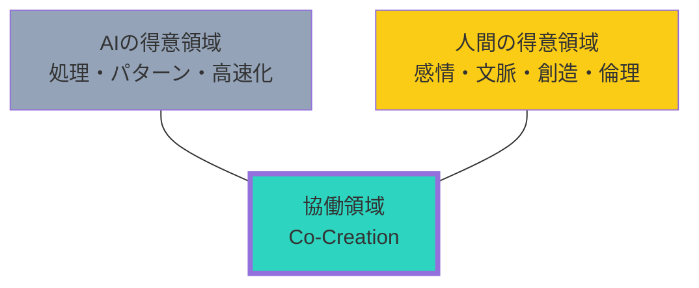

## AIは脅威か、味方か

「AIに仕事を奪われる」
「〇〇の仕事は10年後になくなる」

こうしたニュースが不安を煽ります。
でも、本当にそうでしょうか？

## AIが得意なこと、苦手なこと

### AIが得意なこと

- 大量のデータ処理
- パターン認識
- 繰り返し作業の自動化
- 24時間365日の稼働
- 一貫した品質の維持

### AIが苦手なこと

- 文脈を踏まえた判断
- 感情を伴うコミュニケーション
- 創造的な問題解決
- 倫理的な判断
- 未知の状況への対応

## 代替されない3つのスキル

### AIと人間の協働領域

### スキル1: コミュニケーション力

人間同士の信頼関係を築く力。
交渉、説得、共感、傾聴。

AIが文章を作れても、心を動かすプレゼンはできません。
AIがデータを分析しても、クライアントの本音を引き出すのは人間の仕事です。

### スキル2: 創造性

既存の枠組みを超えた発想。
異なる分野の知識を組み合わせる力。

AIは過去のデータから学習しますが、
本当に新しいものを生み出すのは人間の創造性です。

### スキル3: 複雑な問題解決

文脈を理解し、利害関係者を調整し、不確実な中で判断を下す。
組織の政治を読み、人を動かす。

こうした複雑な問題は、AIには任せられません。

## AIと共に働くスキル

### 1. AIを使いこなす力

プロンプトエンジニアリング、AIツールの選定、出力の評価。
AIを「ツール」として使いこなす力が差別化になります。

### 2. AIの限界を理解する力

AIの出力を鵜呑みにしない。
間違いを見抜き、修正する力。

### 3. AIでは代替できない価値を提供する力

人間にしかできないことに集中する。
AIに任せられることはAIに任せ、自分のリソースを高付加価値な活動に使う。

## 未来への準備

### 1. 学び続ける

テクノロジーは進化し続ける。
学び続ける姿勢が、変化への適応力を高めます。

### 2. 人間関係に投資する

AIが発達するほど、人間らしさの価値が上がる。
信頼関係、ネットワーク、コミュニティへの投資を怠らない。

### 3. 複合スキルを持つ

一つの専門性だけでなく、複数のスキルを掛け合わせる。
「営業 × AI」「デザイン × データ分析」「マネジメント × プログラミング」

## 恐れるより、活用する

AIを恐れるより、AIを味方につけましょう。

AIにできることは任せ、人間にしかできないことに集中する。
それが、AI時代を生き抜く最良の戦略です。
