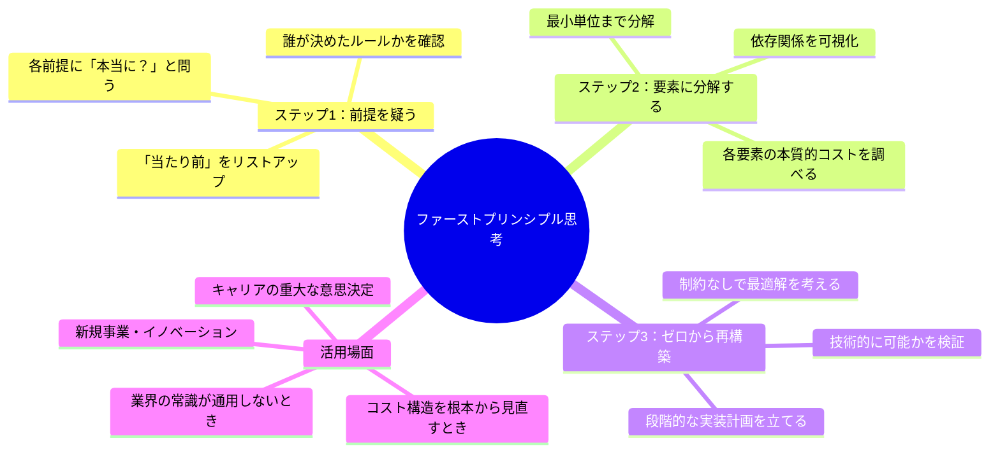
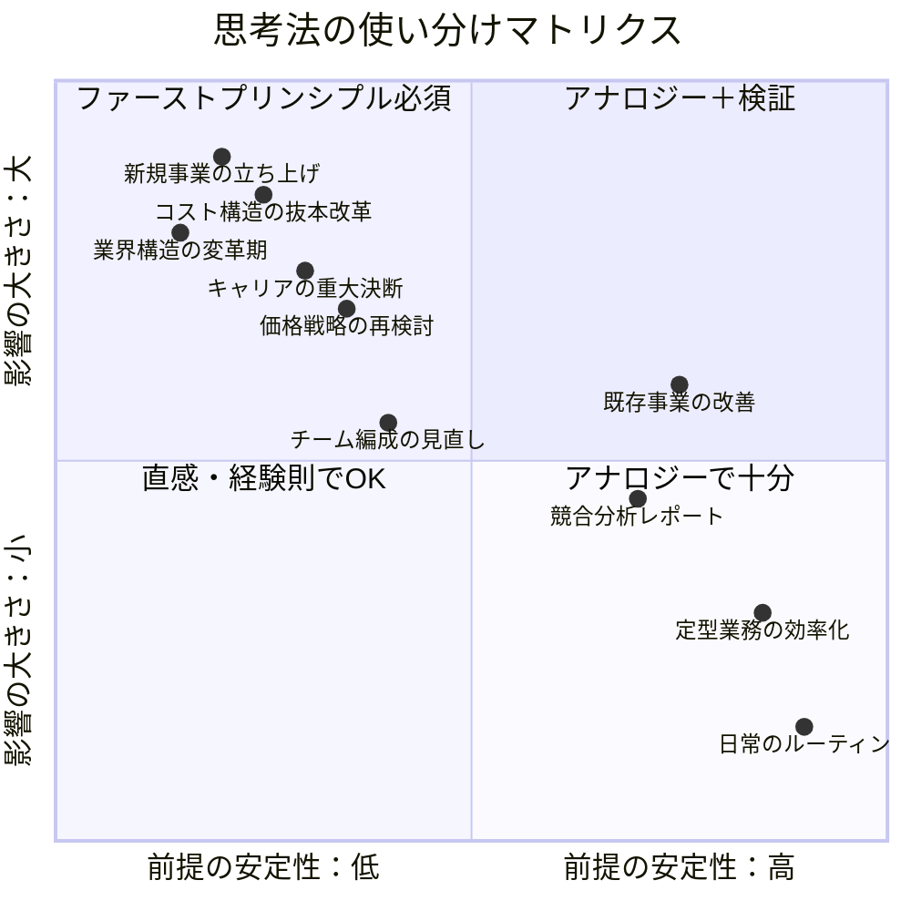

「バッテリーのコストを下げる方法は？」

2002年、SpaceXの創業間もないイーロン・マスクに、あるエンジニアがこう尋ねました。「現在のバッテリーパックは1kWhあたり600ドルです。業界の価格推移から見て、10年後には400ドルくらいまで下がるでしょう」

マスクは首を横に振りました。

「バッテリーの材料は何だ？ コバルト、ニッケル、リチウム、カーボン、あとは分離材とケース。ロンドン金属取引所でそれぞれの原材料価格を調べろ。全部足したらいくらになる？」

答えは**1kWhあたり約80ドル**でした。

「なら、80ドルに近づけない理由は何だ？ 既存のサプライチェーンか？ 製造プロセスか？ それぞれの制約を潰していけばいい」

これが**ファーストプリンシプル思考（第一原理思考）**です。「業界ではこういうものだ」という常識を一切無視し、物事を最も基本的な要素に分解して、ゼロから組み立て直す。マスクはこの思考法でロケットのコストを10分の1に下げ、電気自動車を大衆化し、衛星インターネットを実現しました。

しかし、この思考法はシリコンバレーの天才だけのものではありません。日本のビジネスシーンでも、驚くほど強力に機能します。

## アナロジー思考 vs ファーストプリンシプル思考

私たちの日常の思考のほとんどは「アナロジー思考（類推思考）」で動いています。「他社がこうやっているから、うちもこうしよう」「前回はこうだったから、今回もこうだろう」。これは効率的で、ほとんどの場面で十分に機能します。

しかし、アナロジー思考には致命的な弱点があります。**前提が変わったとき、間違った結論に導く**ということです。

## ケース1：「飲食店は立地が命」を疑った河野さん

河野さん（仮名・41歳）は、東京で小さなイタリアンレストランを経営していました。コロナ禍で売上が激減し、家賃月額85万円の一等地の店舗を維持できるか瀬戸際に追い込まれていました。

「飲食店は立地が命」——これが業界の常識です。河野さんも当然そう信じていました。

セッションで私は河野さんにファーストプリンシプル思考を提案しました。「飲食店ビジネスの本質を、最も基本的な要素に分解してみましょう」

**河野さんの分解作業：**

飲食店ビジネスとは何か？
- 「食材を仕入れ、調理し、おいしい料理を提供し、対価を得ること」

必要な要素は？
- 食材（原価率30%）
- 調理技術（シェフの腕）
- 提供場所（→ ここに家賃85万円）
- 顧客との接点（→ 立地による集客）
- 体験価値（雰囲気、サービス）

「提供場所」に月85万円かかっている。しかし、**顧客が本当に求めているのは「場所」なのか？**

河野さんは気づきました。常連客の多くは「河野さんの料理が食べたい」のであって、「あの場所で食べたい」わけではない。

**河野さんの再構築：**

1. 一等地の店舗を閉鎖（家賃85万円→0円）
2. 住宅街の1階テナントに移転（家賃18万円）
3. 完全予約制に変更（食品ロス削減、原価率25%に改善）
4. Instagram・Google Mapでの情報発信を強化
5. 月2回の「出張シェフ」サービスを開始

結果は劇的でした。

| 指標 | 移転前 | 移転後（6ヶ月） |
|------|--------|----------------|
| 月間売上 | 320万円 | 280万円 |
| 家賃 | 85万円 | 18万円 |
| 原価率 | 30% | 25% |
| 営業利益 | 12万円 | 92万円 |
| 労働時間/月 | 280時間 | 180時間 |

売上は12%減ったにもかかわらず、利益は**7.6倍**に増加。労働時間は100時間減りました。

「立地が命という常識を疑わなかったら、今頃廃業していたかもしれない」と河野さんは振り返ります。

## ケース2：「研修は講師が教えるもの」を解体した坂本さん

坂本さん（仮名・36歳）は、大手製造業の人材開発部門のリーダー。年間研修予算2,000万円を管理していましたが、研修後のアンケートでは「満足度は高いが、行動変容につながらない」という悩みを抱えていました。

業界の常識では「優秀な講師を呼べば効果が上がる」とされ、坂本さんも毎年講師選びに時間をかけていました。しかし、外部講師のフィーは1日40〜80万円。コストは上がるのに、効果測定の数値は改善しない。

ファーストプリンシプルで分解してみましょう。

**「研修」の本質は何か？**
- 「社員の知識・スキル・行動を変化させること」

**そのために本当に必要な要素は？**
- 新しい知識のインプット
- 安全な環境での実践
- フィードバックと振り返り
- 継続的な習慣化のサポート

**従来の集合研修が提供しているのは？**
- 新しい知識のインプット → 提供している（ただし一方向的）
- 安全な環境での実践 → ほぼ提供していない（時間不足）
- フィードバックと振り返り → ほぼ提供していない（一回きり）
- 継続的な習慣化のサポート → まったく提供していない

**衝撃的な事実：従来の研修は、4つの必要要素のうち1つしか満たしていなかった。**

坂本さんはゼロから研修プログラムを再設計しました。

**坂本さんの再構築：**

1. **知識インプット**：外部講師の講義をオンデマンド動画に置き換え（コスト1/10）
2. **実践の場**：月2回の社内ペアワークショップ（先輩社員がファシリテーター）
3. **フィードバック**：AIツールによるロールプレイ練習と即時フィードバック
4. **習慣化**：3ヶ月間の週次マイクロチャレンジ（Slackで進捗共有）

| 指標 | 従来型研修 | 再設計後 |
|------|-----------|---------|
| 年間コスト | 2,000万円 | 600万円 |
| 行動変容率（3ヶ月後） | 12% | 58% |
| 社員満足度 | 4.1/5.0 | 4.4/5.0 |
| 投資対効果（ROI） | 測定困難 | 340% |

予算を70%削減しながら、行動変容率は**4.8倍**に向上。坂本さんは社内表彰を受け、この方法論は全社に展開されました。

## いつファーストプリンシプルを使い、いつアナロジーで十分か

ファーストプリンシプル思考は強力ですが、すべての場面で使うべきではありません。ゼロから考えるのは時間とエネルギーを消費します。重要なのは**使い分け**です。

**ファーストプリンシプルを使うべき場面：**
- 業界の常識が通用しなくなったとき
- コスト構造を根本から見直す必要があるとき
- 「なぜこうなっているのか」を誰も説明できないとき
- 人生やキャリアの重大な岐路に立っているとき

**アナロジー思考で十分な場面：**
- 前提条件が安定していて変化が少ないとき
- 過去の成功パターンが明確に存在するとき
- スピードが求められる日常的な判断
- リスクが限定的な意思決定

## ファーストプリンシプル思考の実践フレームワーク

日常のビジネスシーンでファーストプリンシプル思考を実践するための、具体的な5ステップを紹介します。

### ステップ1：「当たり前」をリストアップする

まず、対象となる問題について「業界の常識」「社内の慣例」「自分の思い込み」をすべて書き出します。

例（人事部門の場合）：
- 「採用は面接で判断する」
- 「評価は年2回の面談で行う」
- 「研修は外部講師に依頼する」
- 「昇進は勤続年数に基づく」

### ステップ2：各前提に「本当に？」と問う

リストアップした各項目に対して、「なぜそうなっているのか？」「誰がそう決めたのか？」「物理法則や法律で決まっているのか、それとも慣習か？」を問います。

物理法則や法律で決まっていること → 変えられない制約
慣習や思い込みで決まっていること → **変えられる可能性がある**

### ステップ3：本質的な目的に立ち返る

「そもそも何のためにやっているのか？」を問います。手段と目的を混同していないかを確認します。

- 面接の目的 → 候補者の適性を評価すること（面接は手段の一つに過ぎない）
- 研修の目的 → 社員の行動を変えること（講義は手段の一つに過ぎない）

### ステップ4：制約なしで理想解を描く

「もし一切の制約がなかったら、この目的を達成する最善の方法は何か？」を考えます。予算、人員、技術、時間の制約を一旦すべて外します。

### ステップ5：現実の制約を戻して実装計画を作る

理想解から逆算して、現実の制約の中で実現可能な計画を段階的に組み立てます。100%の理想は無理でも、60%なら今すぐ始められるかもしれません。

## 日本企業でファーストプリンシプルが効きやすい理由

実は、ファーストプリンシプル思考は日本企業で特に大きな効果を発揮します。なぜなら、日本企業には「前例踏襲」の文化が深く根付いているからです。

「前任者がこうしていたから」「業界の標準がこうだから」「お客様が期待しているから」——これらの前提を一つ一つ検証してみると、驚くほど多くの慣習が「誰かがいつか始めた理由が不明のルール」であることがわかります。

トヨタの「なぜなぜ分析」も、本質的にはファーストプリンシプルの変形です。トヨタが世界トップの製造業になれたのは、「業界の常識」を受け入れるのではなく、「なぜそうなっているのか」を徹底的に問い続けたからです。

ソニーの井深大が「ポケットに入るラジオ」を構想したとき、業界の常識は「ラジオは家具サイズの据え置き型」でした。ユニクロの柳井正がSPA（製造小売）モデルを導入したとき、アパレルの常識は「メーカーと小売は別の業態」でした。

彼らに共通するのは、**業界の常識を「変えられない物理法則」と「変えられる慣習」に仕分けた**こと。そして慣習を疑い、ゼロから最適解を組み立てたことです。

## 今日から始めるファーストプリンシプル・トレーニング

### トレーニング1：「コスト分解エクササイズ」

身近な商品やサービスのコスト構造を、原材料レベルまで分解してみましょう。「なぜこの値段なのか？」を問い、原材料費・製造費・流通費・マーケティング費・利益に分解します。

### トレーニング2：「前提リスト」の作成

今携わっている仕事について、「当たり前」だと思っていることを10個リストアップし、それぞれ「物理法則・法律」か「慣習・思い込み」かに分類します。

### トレーニング3：「ゼロベース再設計」

分類した慣習の中から1つ選び、「もしゼロから設計するなら？」を考えます。15分のタイマーをセットして、制約なしの理想解を書き出します。

## まとめ：常識を疑うことは、常識を否定することではない

ファーストプリンシプル思考は「常識は全部間違っている」と主張するものではありません。多くの常識は、長年の経験と知恵の結晶であり、尊重すべきものです。

しかし、**常識を「検証済みの前提」として扱うのか、「未検証の思い込み」として扱うのかで、思考の自由度はまったく変わります。**

河野さんは「立地が命」を疑うことで利益を7.6倍にしました。坂本さんは「講師が教えるもの」を疑うことで研修効果を4.8倍にしました。二人とも、業界を否定したのではなく、**前提を検証し、本質に立ち返った**のです。

あなたの仕事の中にも、「なぜそうなっているか、実は誰も説明できない常識」が眠っているはずです。それを見つけ、分解し、ゼロから組み立て直す。その先に、今までとはまったく違う解が見えてきます。

---

**関連記事：**
- [クリティカルシンキングで思考の質を高める](/blog/critical-thinking) - 前提を疑う力の土台
- [システム思考で全体像をつかむ](/blog/systems-thinking) - 要素間の関係性を読み解く
- [創造的思考で新しい価値を生む](/blog/creative-thinking) - ゼロからの再構築力

---

## あなたの「前提」を一緒に検証しませんか？

「業界の常識に縛られている気がする」「自分のキャリアの前提を見直したい」という方へ。

**体験セッション（無料）**では、あなたが無意識に受け入れている前提を一緒に洗い出し、ファーストプリンシプルで再検討します。「当たり前」を疑った先に、新しい可能性が見えるかもしれません。

[→ 体験セッションに申し込む](/sessions)
