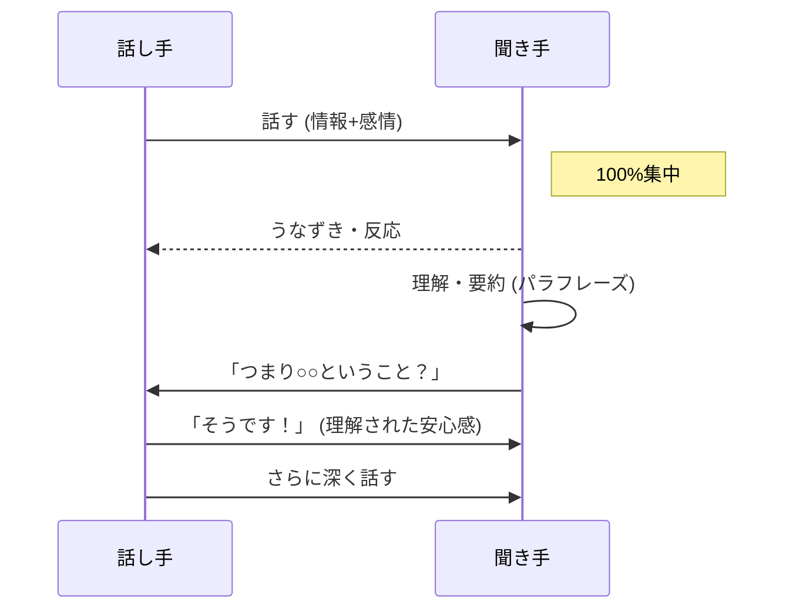

## 話を聞いてくれる人が少ない

最後に「この人は本当に話を聞いてくれている」と感じたのはいつですか？

多くの人は、相手の話を聞きながら、次に自分が何を言うかを考えています。
それは「聞いている」のではなく「待っている」だけ。

## アクティブリスニングとは

ただ黙って聞くのではなく、能動的に相手の話に参加する聞き方。

相手の言葉だけでなく、感情、意図、背景まで理解しようとする姿勢です。

## なぜ聞く力が重要か

### 1. 信頼関係が築ける

「この人は自分を理解しようとしている」と感じると、信頼が生まれます。
信頼があれば、協力を得やすくなります。

### 2. 情報が集まる

聞き上手な人には、情報が集まります。
他の人が知らない情報を得られることで、判断の質が上がります。

### 3. 相手の自己解決を促す

人は話しながら考えを整理します。
良い聞き手がいると、自分で答えにたどり着くことも多い。

## アクティブリスニングの5つの技術

### 聞く力の循環

### 技術1: 100%の注意を向ける

スマホを置く、PCを閉じる、相手を見る。
「あなたの話を聞く準備ができている」と態度で示す。

### 技術2: うなずきとあいづち

「うん」「なるほど」「それで？」
小さな反応が、相手に「聞いている」というシグナルを送ります。

### 技術3: パラフレーズ（言い換え）

「つまり、こういうことですか？」
相手の話を自分の言葉で要約する。

理解を確認すると同時に、相手に「聞いてもらえている」と感じさせます。

### 技術4: 感情を反映する

「それは悔しかったですね」
「嬉しかったんですね」

事実だけでなく、感情を受け止める言葉を返す。

### 技術5: オープンクエスチョン

「はい/いいえ」で答えられない質問をする。

- 「どう感じました？」
- 「なぜそう思いましたか？」
- 「その後どうなりましたか？」

相手が深く考え、話すきっかけを作ります。

## やってはいけないこと

### 1. 話を遮る

相手が話している途中で口を挟まない。
言いたいことがあっても、最後まで聞く。

### 2. アドバイスを急ぐ

「こうすればいい」とすぐに解決策を示さない。
まずは聞き切る。

### 3. 自分の話にすり替える

「私もそうだったよ」と、話題を奪わない。
相手の話を最優先にする。

### 4. 評価・判断する

「それは間違っている」とジャッジしない。
まずは相手の世界観を理解しようとする。

## まず3分、本気で聞いてみる

次に誰かと話すとき、3分間だけ「本気で聞く」ことに集中してみてください。

自分が何を言うかは考えず、相手を理解することだけに集中する。
その体験が、聞くことの力を教えてくれるはずです。
