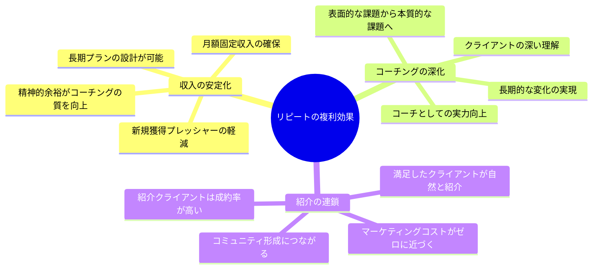
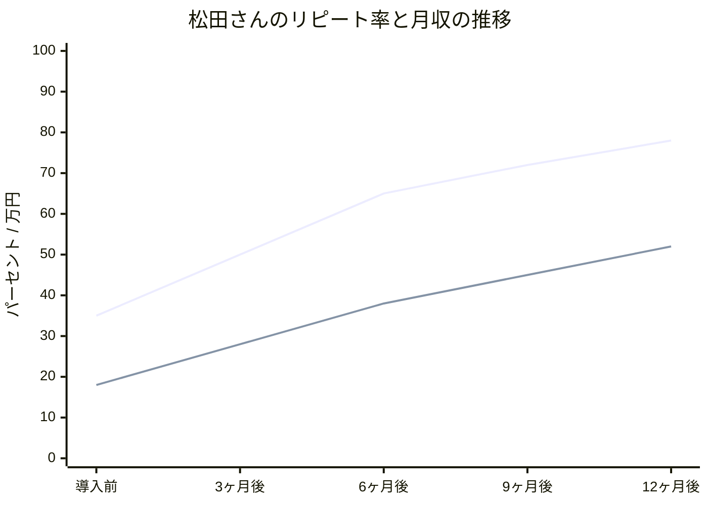
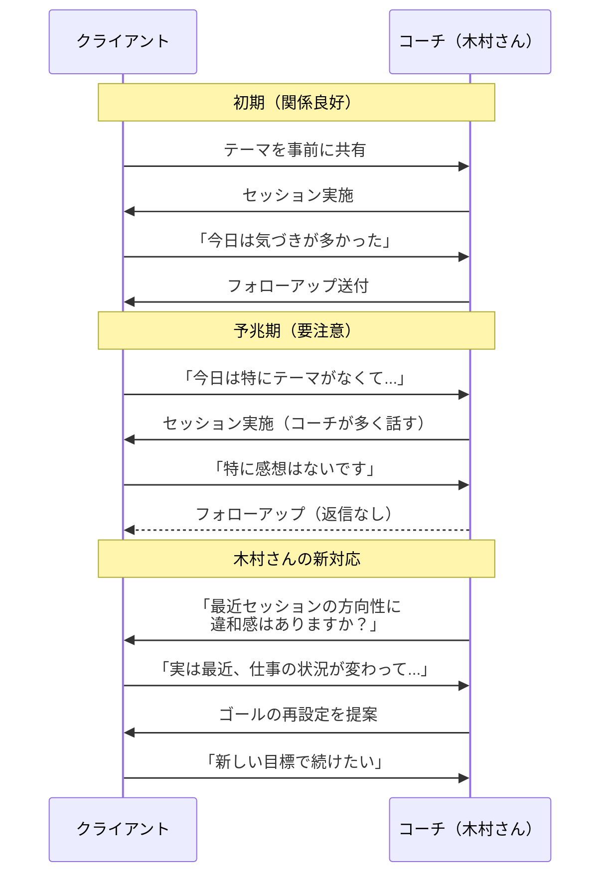

独立コーチ2年目の松田彩香さん（34歳）は、月曜の朝、クライアント管理スプレッドシートを開いて頭を抱えた。過去1年で獲得した新規クライアント24名のうち、3ヶ月以上継続しているのはわずか8名。リピート率33%。毎月の収入は新規獲得の有無で激しく変動し、先月は手取り12万円まで落ち込んだ。「新しいクライアントを取り続けなきゃ」と焦るほど、既存クライアントへの対応が雑になる悪循環に陥っていた。そんな松田さんに、メンターコーチが一言だった。「新規を追うのをやめなさい。今いる8人を大切にしなさい」。

## 新規獲得コストvsリピートコスト――数字が語る真実

マーケティングの世界には「1:5の法則」がある。新規顧客の獲得コストは、既存顧客の維持コストの**5倍**かかるという法則だ。

コーチングビジネスに当てはめると、その差はさらに顕著になる。

**コスト比較（独立コーチの場合）:**

| 項目 | 新規クライアント獲得 | 既存クライアント継続 |
|------|---------------------|---------------------|
| SNS運用・発信 | 月20時間 | 0時間 |
| 体験セッション | 1件1時間（成約率30%） | 0時間 |
| 信頼構築期間 | 1-3ヶ月 | 構築済み |
| クライアント理解 | 初回からスタート | 深い理解あり |
| 紹介可能性 | 低い | 高い |
| 1件あたりの営業時間 | 約10時間 | 約0.5時間 |

つまり、既存クライアントの継続は、新規獲得の**20分の1のコスト**で実現できる。

それなのに、多くのコーチが新規獲得に全エネルギーを注いでいる。

## リピートが生む3つの複利効果

## ケーススタディ1: 松田さんのリピート率革命（35%→78%）

メンターのアドバイスを受けた松田さんは、新規獲得の活動を一時停止し、既存8名のクライアントに全力で向き合うことを決めた。

### 松田さんが変えた3つのこと

**変更1: 「セッション0」の導入**

従来、初回セッションからいきなりコーチングを開始していた。これを改め、有料セッション開始前に「セッション0（オリエンテーション）」を45分設けた。

セッション0の内容:
- クライアントのゴールと成功の定義を明文化
- コーチとクライアントの役割と責任を明確化
- コミュニケーションの頻度と方法を合意
- 3ヶ月後の「中間レビュー」を予約
- 「合わないと感じたら率直に教えてください」と伝える

「最後の一言が一番大事でした。『いつでも言っていい』と伝えることで、クライアントが不満を溜め込まなくなった」と松田さんは言う。

**変更2: セッション後の48時間フォローアップ**

セッション終了後、48時間以内に必ず以下の内容をメールで送る:

1. セッションの要約（3行以内）
2. 合意したアクションアイテム
3. 次回セッションまでに考えてほしい問い
4. クライアントの印象的な発言の引用（「○○さんが仰った『△△』という言葉が印象的でした」）

「4番目が特に効果的でした。自分の言葉を引用されると、クライアントは『ちゃんと聴いてもらえている』と感じるんです」

**変更3: 四半期レビューの実施**

3ヶ月ごとに、通常セッションとは別に「振り返りセッション」を無料で実施。

振り返りの構造:
- これまでの成果を一覧にして共有
- クライアント自身の言葉で変化を語ってもらう
- 満足度を5段階で確認
- 次の3ヶ月のゴールを共に設計

**松田さんの成果:**

12ヶ月で月収は12万円から52万円に成長。そのうち新規獲得に費やした時間は月にわずか5時間。クライアントの75%が既存クライアントからの紹介だった。

## ケーススタディ2: 木村さんの「解約予兆」早期発見

木村拓也さん（41歳・企業向けエグゼクティブコーチ）は、ある月に3名のクライアントが立て続けに契約を終了した。

「突然やめると言われた」と感じたが、振り返ると**予兆はあった**。

木村さんが気づいた「解約の4つのサイン」:

1. **セッション前の準備が雑になる** — 「今日は特にテーマがなくて...」が2回連続
2. **セッション中の発言量が減る** — コーチが話す割合が60%を超え始める
3. **スケジュール変更が増える** — 月に2回以上のリスケ
4. **フィードバックを言わなくなる** — 「特にないです」「大丈夫です」が増える

木村さんは、これらの予兆を検知した時点で**直接的な対話**を行うようにした。

具体的な声かけ:
- 「最近、セッションの進め方に違和感はありますか？率直に教えていただけると嬉しいです」
- 「お仕事の状況が変わったようですね。コーチングのゴールも見直してみませんか？」
- 「セッションの頻度や時間帯を変えることもできます。何が一番やりやすいですか？」

この対応を導入した結果、木村さんの解約率は月平均8%から2%に低下した。

「ほとんどの解約は、不満が溜まって爆発した結果です。小さな違和感の段階で拾えれば、対応できることがほとんどです」

## ケーススタディ3: 吉田さんの「卒業デザイン」

吉田美咲さん（38歳・キャリアコーチ）は、あえて「長期的に続けること」をゴールにしない方針を取っている。

「クライアントがコーチングを必要としなくなることが、コーチングの成功だと思っています」

一見、リピートビジネスと矛盾するように聞こえる。しかし吉田さんの6ヶ月後のリピート率は85%を超えている。

**吉田さんの「卒業デザイン」フレームワーク:**

最初のセッションで、クライアントに3つの質問をする。

1. 「コーチングが必要なくなった状態とは、どんな状態ですか？」
2. 「その状態に到達したら、次に何をしたいですか？」
3. 「コーチングを卒業する日を一緒にデザインしましょう」

「卒業」という言葉を使うことで、クライアントは「ずっと依存するもの」ではなく「成長して自立するもの」としてコーチングを捉える。

結果として起きること:
- クライアントの主体性が高まり、セッションの質が向上する
- 「卒業」に向けた明確なロードマップがあるため、途中で離脱する理由がない
- 卒業後も「次のステージ」として新しいテーマで再契約するケースが60%以上
- 卒業したクライアントが最も強力な紹介者になる

「『いつまでも来てください』と言うコーチより、『卒業を目指しましょう』と言うコーチの方が、結果的に長く関係が続くんです」

## リピート率を高める実践フレームワーク

3人のケーススタディから抽出された、リピート率向上のためのフレームワークを紹介する。

### フェーズ1: 契約前（期待値の設計）

**チェックリスト:**
- クライアントの「成功の定義」を明文化したか
- コーチとクライアントの役割を説明したか
- コミュニケーションの頻度と方法を合意したか
- 「合わないと感じたら教えてほしい」と伝えたか
- 中間レビューの日程を仮予約したか

[初回のアイスブレイクで本音を引き出す方法はこちら](/blog/icebreak-draw-out-honest-thoughts)。

### フェーズ2: 契約中（関係の深化）

**毎セッション後:**
- 48時間以内のフォローアップメール
- クライアントの言葉の引用を含める
- 次回までの問いを提示

**四半期ごと:**
- 成果の可視化と共有
- 満足度の確認（5段階評価 + 自由記述）
- ゴールの見直しと再設定

**常に:**
- 解約の4つのサインを監視
- 予兆があれば直接的な対話を行う

### フェーズ3: 契約満了時（卒業デザイン）

**3つの選択肢を提示:**
1. 新しいテーマで継続（テーマ変更型）
2. 頻度を変えて継続（メンテナンス型：月1回など）
3. 卒業（成功として祝う）

どの選択肢でも、「紹介カード」を渡す。「もし周囲で悩んでいる方がいたら、体験セッションをご紹介ください」。

### 収益モデルの選択

| モデル | 特徴 | 月収の安定性 | 適したクライアント |
|--------|------|-------------|-------------------|
| 月額サブスク型 | 毎月定額で月2-4回 | 高い | 継続的な成長を求める人 |
| ブロック契約型 | 6-12回パッケージ | 中程度 | 明確なゴールがある人 |
| 卒業デザイン型 | ゴール達成で卒業 | 変動あり | 自立を目指す人 |
| ハイブリッド型 | 上記の組み合わせ | 最も安定 | 多様なクライアント層 |

松田さんは月額サブスク型、木村さんはブロック契約型、吉田さんは卒業デザイン型をメインに据えている。自分のコーチングスタイルとクライアント層に合ったモデルを選ぶことが重要だ。

## 今日から始める3つのアクション

**アクション1: 既存クライアント全員に「感謝メール」を送る**
今週中に、現在のクライアント全員に「一緒に取り組めていることへの感謝」を伝えるメールを送る。特にそのクライアントの印象的な変化や言葉に触れること。

**アクション2: 次回セッションで「満足度チェック」を行う**
「率直に教えてほしいのですが、今のコーチングの進め方に満足していますか？改善してほしい点はありますか？」と聞く。言いにくそうなら、匿名アンケートフォームを用意する。

**アクション3: 「セッション0」のテンプレートを作成する**
新規クライアントとの初回に使う、オリエンテーション用のテンプレートを1枚にまとめる。ゴール、役割、コミュニケーション方法、レビュー日程の4要素を含める。

コーチングビジネスの持続可能性は、新規獲得力ではなくリピート率で決まる。[フィードバックを成長の燃料にする方法](/blog/feedback-mindset)を身につければ、クライアントとの関係はさらに深まるだろう。

松田さんは言う。「新規を追いかけるのをやめた日が、コーチとして本当のスタートだった」。

---

## あなたのコーチングビジネス、リピート率は何%ですか？

クライアントとの関係構築に課題を感じているなら、一度立ち止まって戦略を見直す価値があります。

**体験コーチングセッション**では、あなたのコーチングビジネスの現状を分析し、リピート率を高めるための具体的な施策を一緒に設計します。松田さんのように、既存クライアントから愛されるコーチを目指しましょう。

[体験セッションでビジネス戦略を見直す](/sessions)
