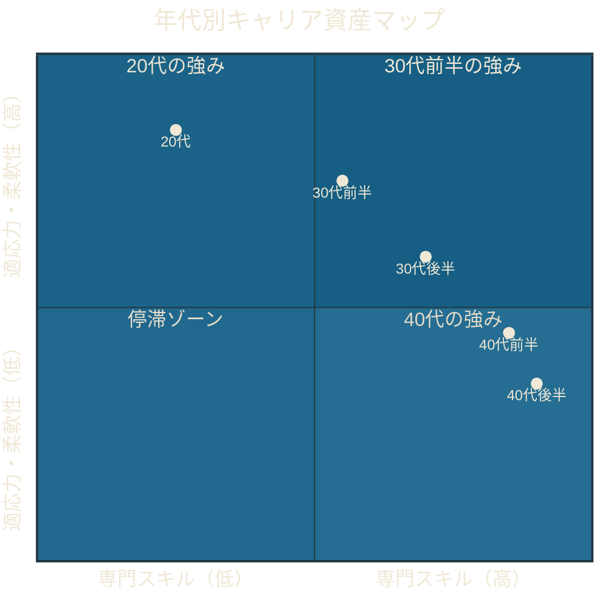
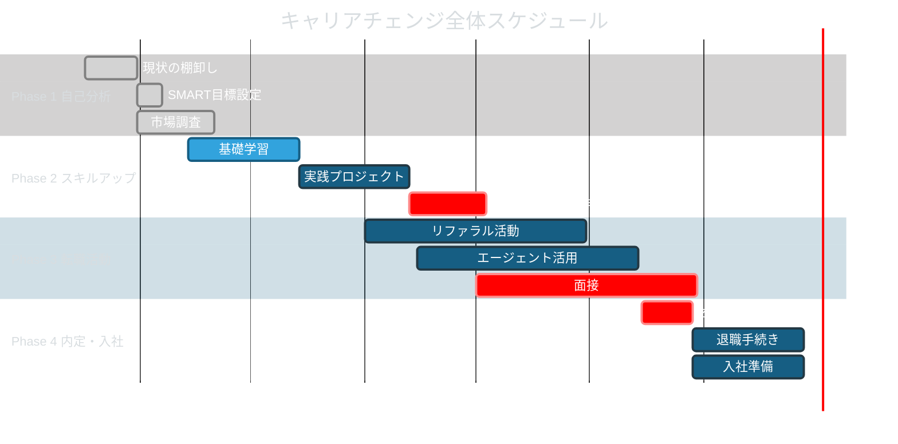

「正直に言うと、転職の面接で年齢を聞かれるたびに、胃が痛くなっていました」

山田さん（36歳）は、大手メーカーの経理部で10年。安定した給与、福利厚生、慣れた仕事。傍から見れば何の不満もない環境だった。しかし、毎朝の通勤電車で感じていたのは「このまま定年まで、同じ仕事を続けるのだろうか」という静かな焦燥感。

転職を決意してから内定を獲得するまで、5ヶ月。現在はIT企業の経営企画部で、年収は前職から**80万円アップ**。何より、「毎朝、仕事が楽しみだと思えるようになった」と山田さんは笑う。

30代からのキャリアチェンジは、決して遅くない。むしろ、10年以上の実務経験を持つ30代・40代だからこそ、戦略次第で大きな飛躍ができる。

この記事では、実際に転職を成功させた人の事例とともに、キャリアチェンジの全プロセスを解説する。

---

## なぜ30代からでもキャリアチェンジできるのか

### 年代別の強みを理解する

「若い人の方が有利」は思い込みだ。年代ごとに異なる武器がある。

**30代の強み：**
- 実務経験に裏打ちされた専門性がある
- まだ新しいスキルを柔軟に吸収できる
- 業界を超えたネットワークが形成されている
- 人生の方向性が見え始め、本気の目標を持てる

**40代の強み：**
- 深い専門性と業界知識
- マネジメント・リーダーシップ経験
- 人間関係構築のスキル
- 「何が本当に大切か」を知っている

> 30代・40代のキャリアチェンジは「ゼロからのスタート」ではない。積み上げた経験を、新しいフィールドに「翻訳」する作業だ。

---

## キャリアチェンジの4つのフェーズ

### Phase 1: 自己分析と目標設定（1ヶ月）

#### 現状の棚卸し

まず、自分が持っている「見えない資産」を可視化する。

| 分析項目 | 問いかけ | 記入例 |
|----------|---------|--------|
| **職務スキル** | 今の仕事で身につけた専門スキルは？ | 財務分析、Excel VBA、決算業務 |
| **ポータブルスキル** | 業界を問わず使えるスキルは？ | プロジェクト管理、交渉、資料作成 |
| **実績** | 数字で語れる成果は？ | 決算期間を2週間短縮、コスト15%削減 |
| **人脈** | どんな業界の人とつながりがある？ | 金融、IT、コンサル |
| **価値観** | 仕事で最も大切にしていることは？ | 成長実感、チームへの貢献 |

#### SMART目標の設定

漠然と「転職したい」ではなく、SMART基準で具体化する。

- **S** (Specific): IT企業の経営企画職に転職する
- **M** (Measurable): 年収600万円以上を実現する
- **A** (Achievable): 経理の分析スキルをビジネス企画に転用する
- **R** (Relevant): 「事業を動かす仕事がしたい」という目標と合致
- **T** (Time-bound): 6ヶ月以内に内定を獲得する

#### 市場調査

ターゲット業界と職種のリサーチを行う。

| 調査方法 | 何を見るか | 得られる情報 |
|----------|-----------|-------------|
| 求人サイト | 求人の必須条件・歓迎条件 | スキルギャップの特定 |
| LinkedIn | 転職成功者のキャリアパス | 実現可能なルートの発見 |
| 業界レポート | 成長市場・衰退市場 | タイミングの見極め |
| 転職エージェント | 市場の温度感 | 自分の市場価値 |

### Phase 2: スキルギャップ解消とポートフォリオ作成（2〜3ヶ月）

#### スキルギャップの特定と学習計画

**週間スケジュール例：**
- 平日: 2時間（仕事後の19:00〜21:00）
- 土日: 4時間（10:00〜14:00）

**3ヶ月の学習ロードマップ：**

| 期間 | 目標 | 具体的な内容 |
|------|------|-------------|
| **第1ヶ月** | 基礎知識の習得 | 新分野の書籍5冊、オンライン講座 |
| **第2ヶ月** | 実践プロジェクト | 個人開発、ボランティア、副業的実践 |
| **第3ヶ月** | アウトプット | ポートフォリオ完成、面接準備 |

#### ポートフォリオの構成

**必要な書類：**
1. **職務経歴書** -- 成果を数字で語る（「売上管理を担当」ではなく「売上管理の効率化で月40時間の工数削減を実現」）
2. **スキルマトリックス** -- 保有スキルと習得中スキルを一覧化
3. **実績集** -- 個人プロジェクトやOSS活動のURL
4. **自己紹介文** -- 200文字で「なぜ転職するのか」を明確に伝える

### Phase 3: 転職活動の実践（2〜3ヶ月）

#### 3つのチャネルを並行活用

**チャネル1：リファラル（紹介）**
- 元同僚、友人、知人に「転職を考えている」と伝える
- 1人から3〜5人の紹介を目指す
- 紹介経由の転職は入社後の定着率が高い

**チャネル2：転職エージェント**
- 業界特化型のエージェントを2〜3社利用
- 自分の市場価値を客観的に把握できる
- 非公開求人にアクセスできる

**チャネル3：ダイレクト応募**
- 企業のキャリアページから直接応募
- LinkedInでの発信を通じたスカウト獲得
- 業界イベントでの人脈構築

### Phase 4: 内定獲得と入社準備（1〜2ヶ月）

---

## 成功事例に学ぶ3つのパターン

### 事例1：山田さん（36歳）大手メーカー経理 → IT企業 経営企画

冒頭で紹介した山田さんのケース。転職の決め手は「経理で培った数字の分析力を、より上流の意思決定に使いたい」という明確な動機だった。

**成功のポイント：**
- 経理スキルを「経営判断のための分析力」に再定義
- 転職前にSQLとBIツールの基礎を独学（2ヶ月）
- 面接では「前職で発見した経営課題と改善提案」を語った

**結果：** 年収80万円アップ、仕事の満足度は自己評価で10段階中3→8に

### 事例2：木村さん（42歳）広告代理店営業 → EdTech企業 事業開発

20年間、広告営業一筋だった木村さん。「40代で異業種なんて無謀だ」と周囲に止められたが、教育への情熱を諦められなかった。

**成功のポイント：**
- 「広告営業のクライアントワーク」と「教育事業のパートナー開拓」の共通項を見出した
- 副業として教育系NPOでボランティアを6ヶ月間経験
- 転職エージェントではなく、業界イベントで直接社長と知り合い口説かれた

**結果：** 年収は横ばいだが、「毎日仕事が楽しくて仕方ない。月曜日が待ち遠しい」と語る

### 事例3：佐々木さん（33歳）SE → フリーランスコンサルタント

「会社員のままでは、自分の市場価値が見えない」と感じた佐々木さん。転職ではなくフリーランスという選択をした。

**成功のポイント：**
- 在職中に副業としてコンサル案件を月2件受注し、需要を検証
- 半年分の生活費を貯蓄してから独立
- 前職の同僚からの紹介で最初の大型案件を獲得

**結果：** 初年度で年収1.4倍、2年目で2倍に。「独立して初めて、自分のスキルの価値を実感した」

---

## 避けるべき8つの落とし穴

### 1. 準備不足での見切り発車
転職活動は「準備8割、実行2割」。スキルの棚卸しとポートフォリオ作成に十分な時間をかけよう。

### 2. 「逃げの転職」になっている
現職の不満を解消するためだけの転職は、新しい職場でも同じ問題にぶつかる。「何から逃げたいか」ではなく「何を実現したいか」で判断する。

### 3. 年収だけで判断する
年収100万アップでも、労働時間が1.5倍になれば時給は下がる。年収・労働時間・成長機会・職場文化を総合的に評価しよう。

### 4. ネットワークを活用しない
紹介経由の転職は、成功率と定着率が格段に高い。「転職を考えている」と言うのは恥ずかしいことではない。

### 5. 自己評価が過大または過小
客観的なフィードバックを複数の人から得ること。転職エージェントの市場評価も参考になる。

### 6. ターゲットを絞りすぎる
「この会社しかない」と思い込むと、視野が狭くなる。複数の選択肢を持つことで、冷静な判断ができる。

### 7. 入社後のギャップを想定しない
入社前の文化調査を十分に行い、「最初の3ヶ月で何を達成するか」を明確にしておく。

### 8. 失敗後に再挑戦しない
不採用は「能力不足」ではなく「マッチしなかった」だけ。フィードバックを活かし、3ヶ月以内に再挑戦しよう。

---

## 転職前チェックリスト

### 活動開始前
- [ ] 現在のスキルと実績を棚卸しした
- [ ] SMART基準で目標を設定した
- [ ] ターゲット業界のリサーチを完了した
- [ ] スキルギャップを特定し、学習計画を立てた

### 活動中
- [ ] 職務経歴書を「成果ベース」で作成した
- [ ] LinkedInプロフィールを更新した
- [ ] 転職エージェント2〜3社に登録した
- [ ] 面接での自己紹介（60秒版）を練習した
- [ ] 企業ごとの質問リストを準備した

### 内定後
- [ ] 年収だけでなく総合条件を比較した
- [ ] 入社後3ヶ月の目標を設定した
- [ ] 現職の引き継ぎ計画を立てた
- [ ] メンターになってくれる人を見つけた

---

## まとめ：経験は「重り」ではなく「翼」になる

30代・40代のキャリアチェンジは「大きなリスク」に見えるかもしれない。しかし、本当のリスクは「変わらないこと」だ。毎朝の通勤電車で感じる違和感を10年間無視し続ける方が、はるかに大きな代償を払うことになる。

あなたが積み上げてきた10年、15年、20年の経験は、新しいフィールドへの「翼」になる。

**まずは今日、一つだけやってみよう：** 自分の職務経歴を「成果ベース」で5つ書き出す。それが、キャリアチェンジの最初の一歩だ。

転職活動中に「自分なんて...」と感じたら、[インポスター症候群との向き合い方](/blog/overcome-imposter-syndrome)を読んでみてほしい。その感情は、あなたが真剣に挑戦している証拠だ。

---

## キャリアの方向性を一緒に考えませんか？

キャリアチェンジは一人で悩むと、堂々巡りになりがちです。**体験セッション（無料）**では、あなたの経験と強みを棚卸しし、最適なキャリア戦略を一緒に設計します。

[→ 体験セッションの詳細を見る](/sessions)
