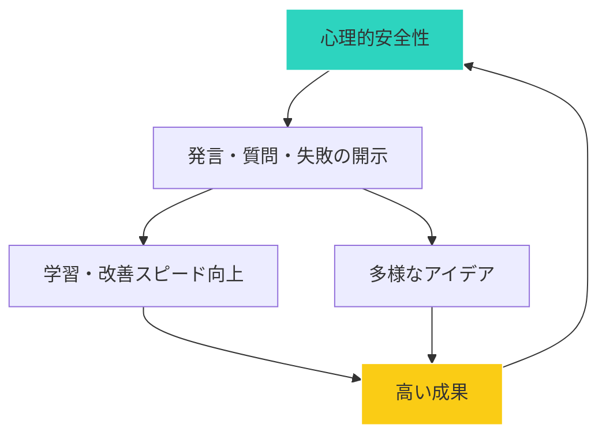

## Googleが発見した「最高のチーム」の秘密

Googleは「Project Aristotle」という調査で、生産性の高いチームの共通点を調べました。

結論は意外なものでした。
最も重要なのは、メンバーの能力でも、リーダーのカリスマ性でもなく、**心理的安全性**だったのです。

## 心理的安全性とは

ハーバード・ビジネススクールのエイミー・エドモンドソン教授が提唱した概念。

「このチームでは、対人リスクを取っても安全だ」という共有された信念。

つまり、失敗しても責められない、意見を言っても馬鹿にされない、質問しても無能だと思われない、という安心感です。

## 心理的安全性が低いとどうなるか

### 1. 問題が隠される

ミスを報告すると責められる環境では、問題を隠すようになります。
小さな問題が大きくなるまで発覚しません。

### 2. イノベーションが生まれない

新しいアイデアを出しても否定されると思うと、誰も発言しなくなります。
「無難な選択」だけが生き残ります。

### 3. 学習が起こらない

質問することを恥ずかしいと思うと、わからないままにしてしまいます。
成長が止まります。

## 心理的安全性が高いチームの特徴

### 心理的安全性と成果の関係

### 1. 失敗をオープンに話せる

「こんなミスをした」「これがうまくいかなかった」を共有できる。
失敗は学びとして扱われる。

### 2. 質問が歓迎される

「初歩的な質問ですが...」が許容される。
わからないことを聞ける。

### 3. 異論が言える

「私は違う意見です」が言える。
多様な視点が検討される。

### 4. お互いを尊重している

役職や経験に関係なく、一人ひとりの意見が尊重される。

## リーダーができること

### 1. 自分から弱さを見せる

「私もわからないことがある」「こんな失敗をした」と、自己開示する。
完璧でなくていいことを示す。

### 2. 質問を歓迎する

質問されたら感謝する。「良い質問ですね」と反応する。
質問しにくい雰囲気を作らない。

### 3. 失敗を学びに変える

ミスを責めるのではなく「何を学べるか」を問う。
責任追及より原因分析を優先する。

### 4. 発言を引き出す

「〇〇さんはどう思いますか？」と意見を求める。
発言しやすい場を作る。

## メンバーができること

- 他者の意見を否定しない
- 感謝と承認を伝える
- 自分も率直に意見を言う
- 失敗を責めない

心理的安全性は、リーダーだけでなく、全員で作るものです。

まずは自分のチームが「安心して発言できる場」かどうか、振り返ってみてください。
