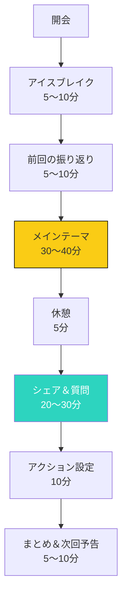

## 個別コーチングの限界

個別コーチング（1対1）には、多くのメリットがあります：
- パーソナライズされたサポート
- 深い信頼関係の構築
- 柔軟な対応

しかし、ビジネスとして見ると、明らかな限界があります。

### 個別コーチングの課題

```mermaid
xychart-beta
    title コーチングモデルの時間収益性（1ヶ月）
    x-axis 個別コーチング, グループコーチング(5人), グループコーチング(10人)
    y-axis 月間収益（万円）
    bar [10, 25, 40]
    bar [10, 25, 40]
```

**個別コーチングの限界**:
1. **時間の限界**: 1時間＝1クライアントしか対応できない
2. **収入の天井**: 1日のコーチング可能数に制限される
3. **拡張の困難さ**: クライアント数に比例して自分の時間が増える
4. **価格の限界**: 高価格帯になりがちで、ニッチに絞られる

## グループコーチングのメリット

グループコーチングは、これらの限界を解決する強力な方法です。

### 5つの主要メリット

**1. スケーラビリティ**

1回のセッションで複数のクライアントをサポート
- 個別: 1時間＝1クライアント
- グループ: 1時間＝5〜15クライアント

**2. 収益性向上**

単位時間あたりの収益が向上：
- 月間10セッション（個別）：10時間×1万円＝10万円
- 月間10セッション（グループ10人）：10時間×5,000円×10人＝50万円

**3. 学びの強化**

グループの動的学習効果：
- 他の参加者の視点を得られる
- 質問とフィードバックが充実
- 成功事例の共有

**4. コミュニティ形成**

参加者同士のつながり：
- 同じ課題を持つ仲間ができる
- 互いに励まし合える環境
- 長期的な関係構築

**5. 新規顧客獲得の容易さ**

グループコーチングの魅力：
- 参加費が手頃
- 他の参加者の体験を見て安心できる
- 参加者の紹介が期待できる

## グループコーチングの設計

### セッションの構造



### 設計の5要素

**1. テーマ設定**

参加者にとって魅力的なテーマを選定：
- 具体的な課題解決
- ターゲット層の明確化
- 期間（1日、3ヶ月、6ヶ月など）

**2. グループサイズ**

最適なグループサイズ：
- **最小**: 4〜5人（最低人数）
- **最適**: 8〜12人（バランス重視）
- **最大**: 15〜20人（大型ワークショップ型）

**3. フォーマット決定**

主要なフォーマット：
- **講義型**: 講師が一方的に情報提供
- **ワークショップ型**: 参加者主体の実践活動
- **コーチング型**: 参加者ごとの課題解決サポート
- **ハイブリッド型**: これらを組み合わせ

**4. 開催頻度と期間**

**頻度**:
- 週1回（短期集中型）
- 月2回（標準型）
- 月1回（長期継続型）

**期間**:
- 1日ワンデイ（入門）
- 4〜6週間（短期）
- 3ヶ月〜6ヶ月（中期）
- 1年以上（長期）

**5. オフライン vs オンライン**

| 要素 | オフライン | オンライン |
|-----|-----------|----------|
| **参加費** | 高い（会場費含む） | 安い |
| **地理的制約** | あり | なし |
| **柔軟性** | 低い | 高い |
| **つながり** | 強い | 中程度 |
| **録画配信** | 不可 | 可能 |

## 参加者募集とマネジメント

### 招集方法

**1. 既存クライアントからの紹介**

既存1対1クライアントに案内：
- 「グループコーチングも始めます」
- 好意のあるクライアントからスタート
- 参加特典（割引など）を提供

**2. ソーシャルメディア**

効果的なSNS活用：
- 参加者の声（テスティモニアル）
- テーマの魅力発信
- 参加体験の共有

**3. メールマーケティング**

ニュースレターへの案内：
- メールリストへの配信
- シークエンスメール（興味喚起→紹介→申込）
- 早期割引などのインセンティブ

**4. 協力パートナー**

関連ビジネスとの提携：
- 企業研修として提案
- コミュニティとの提携
- インフルエンサーとの協業

### 参加者管理

**1. スクリーング**

適切な参加者選定：
- 目的意識の確認
- コミットメントの確認
- グループへの適合性

**2. オンボーディング**

参加前の準備：
- 期待値の設定
- ガイドラインの共有
- ツールの導入（Slack、Notionなど）

**3. セッション中のファシリテーション**

効果的な進行：
- タイムキーピング
- 沈黙の活用
- 質問への対応
- コンフリクトの解決

**4. 参加後のフォローアップ**

関係継続のアクション：
- セッションのまとめ共有
- アクションアイテムの確認
- フィードバック収集
- 次回の案内

## 収益モデルの決定

### 主要な価格モデル

| モデル | 説明 | 最適ケース |
|--------|------|-----------|
| **一回単価** | 1回ごとの参加費 | 入門、体験型 |
| **パッケージ** | 全期間一括支払い | 中期〜長期 |
| **月額サブスク** | 月々固定料金 | 長期継続型 |
| **階層価格** | コースにより異なる | 多様なニーズ |

### 価格設定のポイント

**1. 目標月間収益から逆算**

例：月間50万円の収益を想定
- グループサイズ：10人
- 月間セッション数：4回
- 単価：50万円 ÷ 10人 ÷ 4回＝12,500円/回
- パッケージ価格：12,500円 × 4回＝50,000円

**2. 競合調査**

同様のグループコーチングの価格を調査：
- 同テーマ、同規模
- 参加者層
- 提供価値

**3. 早期割引とインセンティブ**

募集段階での優遇：
- 早期割引：最初の5名様30%オフ
- 友達紹介：1名紹介で5,000円クーポン
- 全額支払い：月払いより10%オフ

### 収益性のシミュレーション

```mermaid
xychart-beta
    title グループコーチングの月間収益シミュレーション
    x-axis 10名, 15名, 20名
    y-axis 月間収益（万円）
    line [50, 75, 100]
    bar [50, 75, 100]
```

**仮定**:
- グループサイズ：10〜20名
- 参加費：5,000円/回
- 月間セッション：10回

**結果**:
- 10名：10名 × 5,000円 × 10回＝50万円
- 15名：15名 × 5,000円 × 10回＝75万円
- 20名：20名 × 5,000円 × 10回＝100万円

## オンライン開催のテクニック

### ツールの選定

| ツール | 特徴 | 用途 |
|--------|------|------|
| **Zoom** | 定番、安定性良好 | セッション開催 |
| **Google Meet** | 無料で使用可能 | 小規模グループ |
| **Slack** | テキストベースのつながり | グループコミュニティ |
| **Notion** | 情報共有・資料管理 | セッション資料 |
| **Miro** | オンラインホワイトボード | ワークショップ |
| **Loom** | 動画配信・録画 | セッション録画 |

### オンライン開催のポイント

**1. 事前準備**

- テストセッションの実施
- 参加者へのツールガイド提供
- バックアッププランの用意

**2. セッション中**

- カメラのON推奨
- 定期的な休憩
- 参加者の発言を促す
- チャット機能の活用

**3. 参加後**

- 録画の共有（適用範囲内）
- 資料の配布
- アンケート実施

## 今日から始めるアクション

### アクション1: テーマの決定

既存のクライアントからよく聞かれる課題をトピックにしましょう。

### アクション2: 最小限のグループからスタート

5名の小規模グループから開始しましょう。

### アクション3: 参加者募集

既存のネットワークから5名を募集しましょう。

## まとめ

グループコーチングは、スケーラブルなビジネスモデルです。

個別コーチングのメリットを保ちつつ、収益性と拡張性を実現できます。

今日から、小さく始めましょう。

5名のグループから、1つのテーマから。

1年後、あなたは個別コーチングだけでなく、グループコーチングも収益化しています。

---

## 💬 一歩踏み出したいあなたへ

この記事のテーマについて、もっと深く揘り下げたいと思いませんか？

**体験セッション（無料）**では、あなたの状況に合わせた具体的なアドバイスをお伝えします。

[→ 体験セッションの詳細を見る](/sessions)

