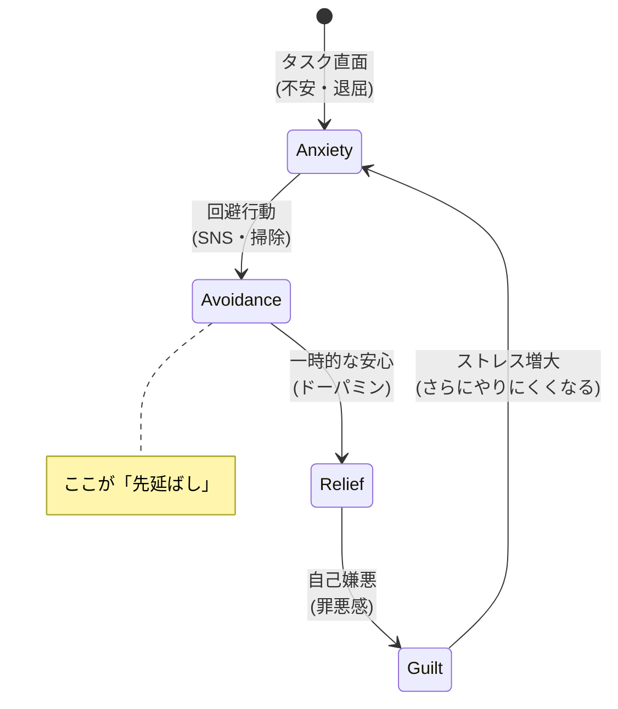

## 先延ばしは怠けではない

「やらなきゃいけないのに、やれない」
「締め切りギリギリになって焦る」
「なぜ自分はこんなにダメなんだ」

先延ばし（プロクラスティネーション）は、意志の弱さや怠けではありません。
実は、感情調整の問題なのです。

## 先延ばしの正体

研究によると、先延ばしは「不快な感情からの一時的な回避」です。

タスクを見ると不安、恐怖、退屈といったネガティブな感情が湧く。
その感情を避けるために、別のこと（SNS、動画、掃除など）に逃げる。

つまり、先延ばしとは「感情の問題」であり、「時間管理の問題」ではないのです。

### 先延ばしの「負のループ」

## なぜ大事なことほど先延ばすのか

### 1. 重要なものは失敗が怖い

大切なプロジェクトほど、失敗したときのダメージが大きい。
だから、始めること自体を避けてしまう。

### 2. 完璧主義の罠

「やるなら完璧に」と思うと、ハードルが上がる。
ハードルが高いほど、着手しにくくなる。

### 3. 報酬が遠い

今日レポートを書いても、成果が出るのは数週間後。
脳は遠い報酬より、目の前の快楽を優先します。

## 先延ばしを克服する方法

### 方法1: 感情を認める

「このタスクに取り組みたくない」という感情を認める。
否定せず、「そう感じているんだな」と受け止める。

### 方法2: 5分だけ始める

「とりあえず5分だけやる」とハードルを下げる。
始めてしまえば、意外と続くことが多い。

### 方法3: タスクを分解する

「レポートを書く」を「アウトラインを作る」「1段落だけ書く」に分解。
小さなステップにすることで、始めやすくなります。

### 方法4: 環境を整える

誘惑を遠ざける。
スマホを別の部屋に置く、作業用のカフェに行く、など。

### 方法5: 自分を許す

先延ばしした自分を責めると、ストレスが増え、さらに先延ばしする悪循環に。
「次はこうしよう」と前を向く。

### 方法6: アカウンタビリティを作る

誰かに宣言する、進捗を報告する。
他者の目があると、やらざるを得なくなります。

## 先延ばしのメリットを使う

実は、適度な先延ばしには創造性を高める効果もあります。

熟考の時間として、無意識にアイデアを醸成している。
締め切りのプレッシャーが集中力を高める。

問題は「過度な」先延ばし。
自分を追い詰めるほどの先延ばしを避けることが目標です。

完璧を目指さず、「まず始める」ことを意識してみてください。
