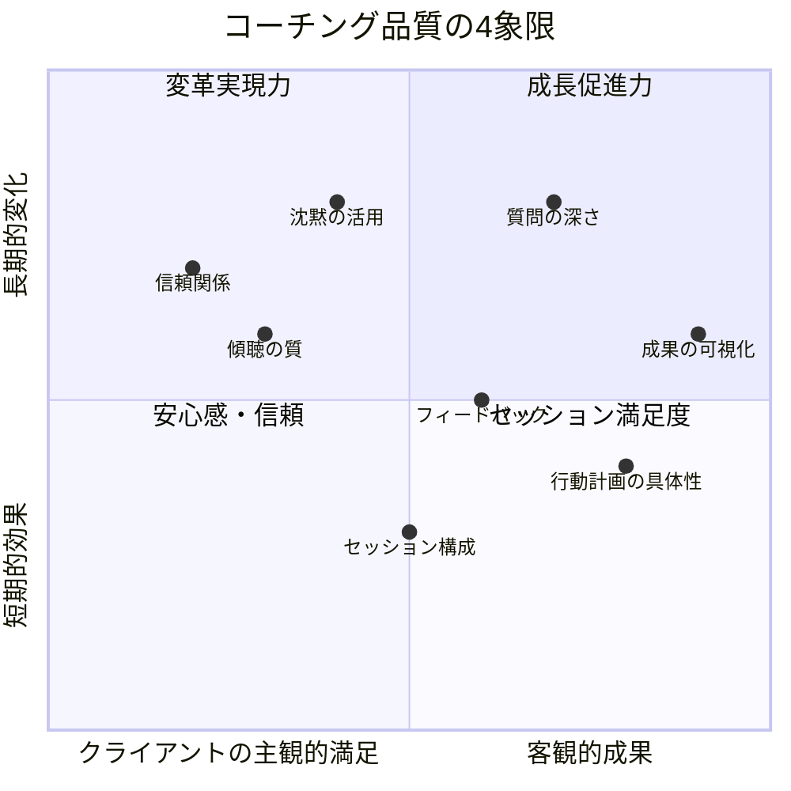
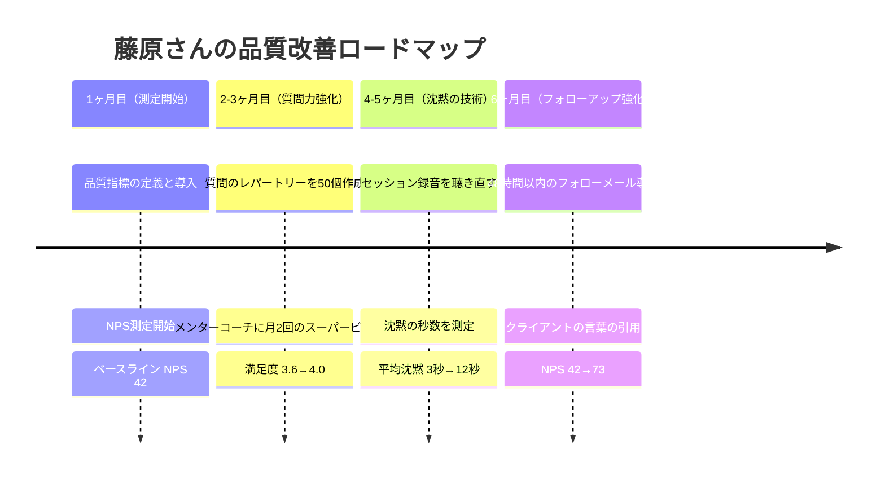
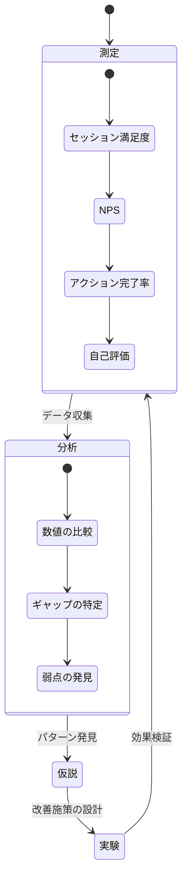

水曜日の夜21時。コーチ歴5年目の藤原健一さん（39歳）は、クライアントから届いた1通のメールを読み返していた。「藤原さんのコーチングは悪くないんですが、正直なところ、他のコーチに変えようかと思っています。理由は具体的にはわからないんですが、何か物足りない感じがして...」。藤原さんにとって、これは初めてのネガティブなフィードバックではなかった。過去1年で3名のクライアントが同じような理由で離れていた。「悪くない。でも物足りない」。藤原さんは思った。「自分のコーチングの品質を、自分自身が把握できていないのかもしれない」。

## 「悪くない」では生き残れない時代

コーチング市場は年々拡大している。それは同時に、コーチの数も急増していることを意味する。

日本のコーチング市場において、クライアントがコーチを選ぶ基準は変わりつつある。かつては「資格の有無」が重視されたが、今は**「実際のセッション品質」と「得られた変化の大きさ」**で評価される。

「悪くないコーチ」は淘汰される。「明らかに良いコーチ」だけが選ばれ続ける。

問題は、「品質」を曖昧なまま放置しているコーチが圧倒的に多いことだ。

## コーチング品質の4つの柱

品質は測定できなければ改善できない。まず、「コーチングの品質」を構成する4つの要素を明確にしよう。

**4つの柱:**

1. **効果性** — クライアントに実際の変化をもたらしているか
2. **信頼性** — 安心して本音を話せる場を作れているか
3. **一貫性** — 毎回のセッションで期待値を満たせているか
4. **成長促進力** — クライアントの長期的な成長を促進できているか

## ケーススタディ1: 藤原さんの「品質測定」改革

冒頭の藤原さんは、「品質を測定する仕組み」を持っていなかった。クライアントの満足度は「なんとなく」でしか把握していなかった。

藤原さんがまず行ったのは、**品質指標の定義と測定の仕組み作り**だった。

**藤原さんが導入した品質指標:**

| 指標 | 測定方法 | 頻度 |
|------|---------|------|
| セッション満足度 | 5段階評価（セッション後） | 毎回 |
| NPS（推奨度） | 「友人に推奨しますか？」0-10 | 四半期 |
| 目標進捗率 | クライアント自己評価 | 月1回 |
| アクション完了率 | 合意したアクションの実行割合 | 毎回 |
| セッション準備度 | クライアントの事前準備状況 | 毎回 |
| コーチ自己評価 | 自身のセッション満足度5段階 | 毎回 |

「測定を始めて気づいたのは、自分のセッション満足度が4.2なのに対し、クライアントの満足度は3.6だった。自分では良いセッションだと思っていても、クライアントはそう感じていなかった。この0.6のギャップが、"物足りなさ"の正体でした」

### 藤原さんが特定した3つの弱点

測定データから、藤原さんは自分の弱点を特定した。

1. **質問が浅い** — 「どう思いますか？」「なぜですか？」という表層的な質問が多い
2. **沈黙に耐えられない** — クライアントが考えている間に、すぐに次の質問を投げてしまう
3. **フォローアップが弱い** — セッション後のフォローがメモ共有だけ

**藤原さんの改善プロセス:**

6ヶ月で、藤原さんのNPSは42から73に改善。「物足りない」というフィードバックは完全になくなり、代わりに「毎回のセッションで新しい発見がある」という声に変わった。

## ケーススタディ2: 河野さんの「質問の革命」

河野明日香さん（45歳・ライフコーチ歴8年）は、コーチング資格を3つ持つベテランだ。しかし最近、セッションが「型にはまっている」感覚があった。

「GROWモデルに沿って質問すればセッションは成立する。でも、クライアントの目が輝く瞬間が減った気がする」

河野さんは、自分のセッションを録音し（クライアントの許可を得て）、質問のパターンを分析した。

**分析結果:**
- 1セッションあたりの質問数: 平均22個
- そのうち「はい/いいえ」で答えられる質問: 9個（41%）
- クライアントが10秒以上考えた質問: わずか3個（14%）
- クライアントが涙したり、声のトーンが変わった質問: 1個（5%）

「22個も質問しているのに、本当にクライアントの内面に響いた質問がたった1個。質問が多すぎて、浅いんだ」

河野さんは質問の数を**半分に減らし、質を倍にする**挑戦を始めた。

**河野さんの「質問の3層モデル」:**

| 層 | 質問タイプ | 例 | 効果 |
|----|----------|-----|------|
| 表層 | 事実確認 | 「何がありましたか？」 | 状況把握 |
| 中層 | 感情探索 | 「そのとき、体のどこに何を感じましたか？」 | 感情の自覚 |
| 深層 | 信念への問い | 「その判断の奥にある、あなたが大切にしている価値観は何ですか？」 | 自己認識の深化 |

「以前は表層の質問を10個投げて、中層に2個、深層に1個だった。今は表層3個、中層4個、深層3個にバランスを変えた。質問は減ったけど、クライアントの気づきは3倍に増えた」

**Before/After:**

- Before: 質問22個/セッション、クライアントの深い気づき1回
- After: 質問12個/セッション、クライアントの深い気づき4回
- クライアントの声: 「以前より沈黙が多いのに、以前より深い場所に到達している気がする」

## ケーススタディ3: 小林さんの「セッション設計」の体系化

小林誠さん（50歳・エグゼクティブコーチ）は、年間200セッション以上をこなすハイボリュームコーチだ。しかし、セッションの質にバラつきがあることを自覚していた。

「月曜の朝は調子がいいけど、金曜の夕方は疲れて質が落ちる。クライアントによって準備の深さが変わる。これではプロとして失格です」

小林さんが構築したのは、**セッション品質を安定させる「3フェーズ・システム」**だった。

**フェーズ1: セッション前（15分）**

- 前回セッションのメモを再読
- クライアントの「今」の状況を3行で仮説化
- 今日のセッションで投げたい「1つの深い質問」を準備
- 自身の心身状態を10点満点で自己評価（7点以下なら5分の瞑想）

**フェーズ2: セッション中（60分）**

- 最初の5分: チェックイン（クライアントの今の状態を確認）
- 中盤45分: テーマの探求（準備した深い質問を軸に展開）
- 最後の10分: 振り返りとアクション設定

**フェーズ3: セッション後（10分）**

- セッションメモの作成（気づき、感情の変化、アクション）
- コーチ自身の自己評価（5段階）
- フォローアップメールの下書き
- 次回セッションに向けたメモ

「このシステムを導入してから、金曜夕方のセッションでも月曜朝と同じ品質を出せるようになった。準備が品質を担保するんです」

**小林さんの品質安定度（自己評価の標準偏差）:**
- 導入前: 平均3.8、標準偏差1.2（バラつき大）
- 導入後: 平均4.3、標準偏差0.4（安定）

## 品質を高める3つの技術

3つのケーススタディから、コーチングの品質を高める核心技術を整理する。

### 技術1: 質問の深度を上げる

表層的な質問は「情報」を引き出す。深層的な質問は「洞察」を引き出す。

**実践方法:**
- 「なぜ？」の代わりに「何がそう感じさせているのですか？」を使う
- 「どう思いますか？」の代わりに「その考えの奥にある前提は何ですか？」を使う
- クライアントの言葉をそのまま返す:「『怖い』と仰いましたね。その恐れを擬人化するとしたら、何と言っていますか？」

[ティーチングからコーチングへの転換については、こちらの記事が参考になる](/blog/shift-teaching-to-coaching)。

### 技術2: 沈黙を武器にする

多くのコーチが沈黙を恐れる。しかし、沈黙はコーチングにおける最強のツールの1つだ。

**沈黙の3つの効果:**
1. クライアントが思考を深める時間を確保する
2. 感情が表面化する空間を作る
3. コーチの質問の重みを増す

**実践方法:**
- 質問を投げた後、最低10秒は待つ（心の中でゆっくり10を数える）
- クライアントが話し終わった後も、3秒の間を置く
- 沈黙の間、クライアントの表情と体の動きを観察する

藤原さんのデータが示すように、沈黙の平均秒数を3秒から12秒に延ばすだけで、セッションの深さは劇的に変わる。

### 技術3: フィードバックループを構築する

品質は測定と改善のサイクルでしか向上しない。

**月次品質レビューのテンプレート:**

1. 今月のベストセッションは？何がうまくいった？
2. 今月のワーストセッションは？何が原因だった？
3. クライアントからの印象的なフィードバックは？
4. 自己評価の平均値と先月との比較は？
5. 来月、最も強化したいスキルは？
6. そのために何を実践するか？

## コーチングの品質チェックリスト

### セッション前
- 前回のメモを再読したか
- 今日の「1つの深い質問」を準備したか
- 自身の心身状態を確認したか（7点以下なら調整）
- クライアントの最近の状況を把握しているか

### セッション中
- 深層まで到達する質問をしたか
- 10秒以上の沈黙を少なくとも3回は取ったか
- クライアントの感情の変化を観察できたか
- アクションプランが具体的で測定可能か
- 最後の振り返りでクライアント自身の言葉を引き出したか

### セッション後
- 48時間以内にフォローアップを送ったか
- セッションの自己評価をつけたか
- 次回に向けたメモを残したか
- 月次レビューにデータを追加したか

## 今日から始める3つのアクション

**アクション1: 次のセッションで「沈黙10秒」を試す**
質問を投げた後、心の中で10を数える。クライアントの反応を観察する。これだけでセッションの深さが変わることを体感してほしい。

**アクション2: セッション後に自己評価をつける**
5段階で「今日のセッションの質」を記録する。1ヶ月続ければ、自分の品質のパターンが見えてくる。曜日、時間帯、クライアントとの相性――データが教えてくれることは多い。

**アクション3: 今月中にメンターコーチのスーパービジョンを1回受ける**
自分のセッションを第三者に見てもらう。藤原さんが自己評価とクライアント評価のギャップに気づいたように、客観的な視点は品質改善の最大の触媒になる。[成長マインドセット](/blog/growth-mindset)を持って、フィードバックを受け入れよう。

藤原さんは「物足りない」というフィードバックを受けた日を、「コーチとしてのセカンドスタート」と呼んでいる。品質に向き合うことを避け続ければ、「悪くないコーチ」で終わる。品質に真正面から向き合えば、「選ばれ続けるコーチ」になれる。

---

## あなたのコーチングの「物足りなさ」、一緒に特定しませんか？

品質を高めたいと思いながら、何から手をつければいいかわからない。そんなコーチのための場があります。

**体験コーチングセッション**では、あなたのコーチングの現状を一緒に分析し、最もインパクトのある改善ポイントを特定します。藤原さんのように、0.6のギャップを見つけることが、劇的な品質向上の第一歩です。

[体験セッションでコーチングの品質を見直す](/sessions)
