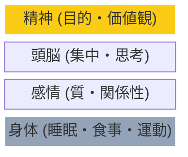

## 時間があっても動けない

「時間はあるのに、何もできなかった」
「休日なのに、ダラダラして終わってしまった」

こんな経験はありませんか？

問題は時間ではなく、エネルギーかもしれません。

## エネルギーマネジメントとは

ジム・ローヤーとトニー・シュワルツが提唱した概念。

生産性を高めるには、時間の使い方より「エネルギーの使い方」が重要だという考え方です。

時間は有限で増やせない。
でも、エネルギーは管理によって増やすことができます。

## 4つのエネルギー源

### エネルギーのピラミッド

### 1. 体のエネルギー

睡眠、食事、運動によって左右される。
すべてのエネルギーの土台。

### 2. 感情のエネルギー

ポジティブな感情がエネルギーを生み、ネガティブな感情がエネルギーを奪う。

### 3. 頭のエネルギー

集中力、注意力、思考力。
マルチタスクや情報過多で消耗する。

### 4. 精神のエネルギー

目的意識、価値観との一致。
「なぜこれをやるのか」が明確なときに湧いてくる。

## エネルギーを高める方法

### 体のエネルギー

- 7〜8時間の睡眠を確保する
- 適度な運動を習慣にする
- 血糖値を安定させる食事をとる
- 水分を十分に摂る

### 感情のエネルギー

- ポジティブな人と過ごす時間を増やす
- 感謝の習慣を持つ
- 自分を楽しませる時間を作る
- ストレス発散方法を持つ

### 頭のエネルギー

- 集中作業は朝に行う
- マルチタスクを避ける
- 情報インプットを制限する
- こまめに休憩を取る

### 精神のエネルギー

- 自分の価値観を明確にする
- 目的と結びついた仕事をする
- 貢献できていると実感する

## エネルギーのリズムを意識する

人には自然なエネルギーリズムがあります。

多くの人は、午前中にエネルギーがピークになり、午後に下がる。
このリズムに合わせて、仕事の種類を配置しましょう。

- 午前：創造的な仕事、難しいタスク
- 午後：ルーティン作業、会議
- 夕方：軽い作業、整理

## 回復の時間を計画する

エネルギーは使えば減ります。
回復の時間を意識的に計画しましょう。

- 90分ごとに5〜10分の休憩
- 昼食は仕事から離れて取る
- 週に1日は完全休養日を設ける

全力で働くためには、全力で休むことも必要です。

あなたのエネルギーを最も消耗しているものは何ですか？
まずはそこから見直してみてください。
