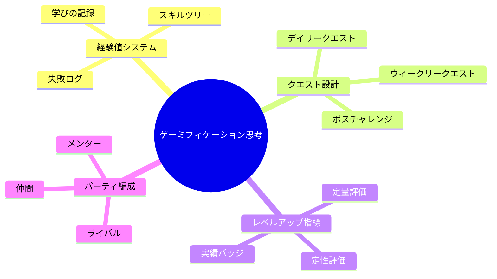
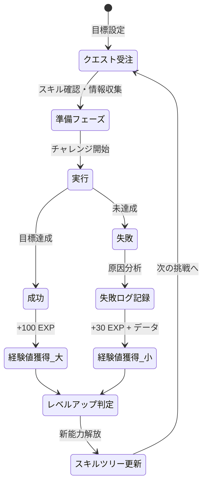
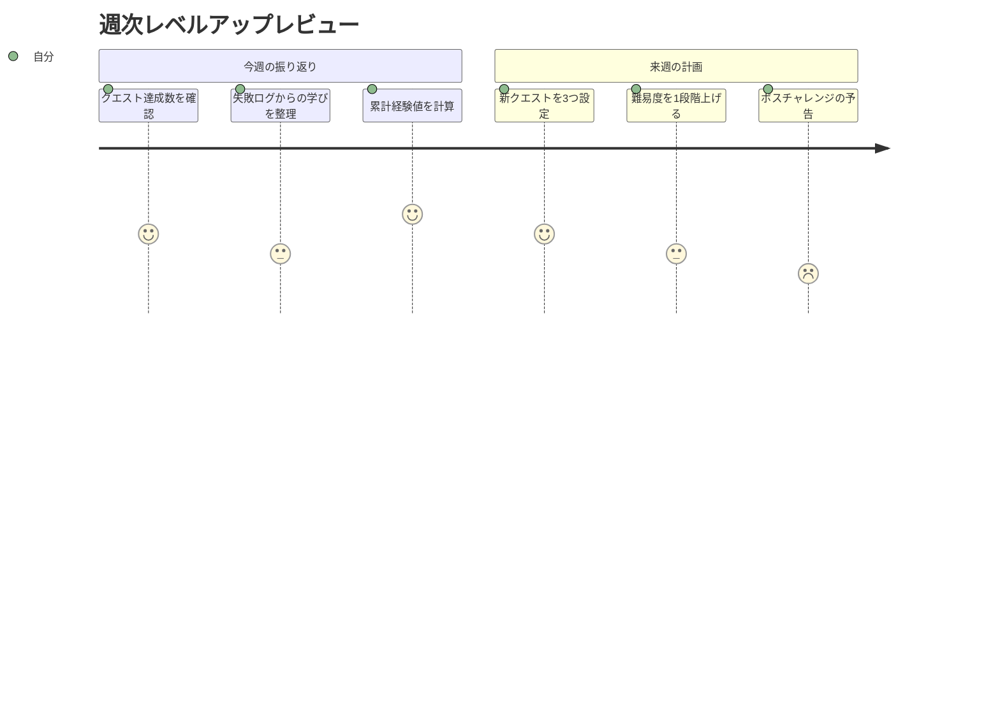

「すみません、頭が真っ白になって……」——プレゼン中にフリーズした佐藤健太（32歳・Webエンジニア）は、会議室を出た瞬間、もう二度と人前で話すまいと誓った。その夜、自暴自棄でRPGゲームを起動した彼は、ボス戦で3回全滅しながらも「もう1回」とコントローラーを握り直す自分に気づく。「なんでゲームの失敗は平気なのに、仕事の失敗はこんなに怖いんだ？」——この問いが、彼の人生を変えるきっかけになった。

## なぜゲームの失敗は怖くないのか

ゲームと現実の失敗を比べたとき、**恐怖の正体**は「失うもの」の認知にあります。

ゲームでは負けても経験値が残る。リトライのコストはほぼゼロ。一方、現実の失敗は「評価が下がる」「信頼を失う」「取り返しがつかない」と感じてしまう。

しかし、実際にはどうでしょうか。

カリフォルニア大学の研究（2023年）によれば、**ビジネスにおける失敗の87%は、6ヶ月後には周囲の記憶からほぼ消えている**とされています。つまり私たちが恐れている「取り返しのつかない事態」は、実際にはほとんど起こらないのです。

ゲーミフィケーション思考とは、この認知のギャップを埋めるフレームワークです。現実の挑戦に対しても、ゲームのように「経験値を獲得する過程」として捉え直すことで、失敗への恐怖を建設的なエネルギーに変換します。

## ゲーミフィケーション思考の全体フレームワーク



このフレームワークの核心は、**あらゆる行動結果を「経験値」に変換する思考回路**を作ることです。勝っても負けても経験値は増える。この前提に立てば、「やらない」が唯一の負けパターンになります。

## 成長のゲームループ：挑戦から経験値への変換プロセス

ゲーミフィケーション思考では、すべての挑戦を以下のループで処理します。



重要なのは、**失敗ルートにも必ず経験値が発生する**設計です。ゲームでは「経験値ゼロ」の行動は存在しません。現実でも同じ。唯一経験値がゼロなのは「何もしないこと」だけです。

## ケーススタディ1：プレゼン恐怖症を克服した佐藤健太の場合

冒頭の佐藤健太は、あのプレゼン失敗の翌週から「経験値ノート」をつけ始めました。

### Before：失敗前の状態

- プレゼン経験：年1回の部署発表のみ
- 恐怖レベル：人前に立つだけで手が震える
- 回避行動：「資料だけ送ります」が口癖
- 自己評価：「自分はプレゼンに向いていない」

### 経験値ノートの実践

佐藤さんが実際につけた経験値ノートの一部です。

| 日付 | クエスト | 結果 | 獲得EXP | 学び |
|------|---------|------|---------|------|
| Week 1 | チームMTGで1回発言 | 成功 | +20 | 声が小さかったが、内容は伝わった |
| Week 2 | 3人の前で5分共有 | 成功 | +30 | アイコンタクトを意識できた |
| Week 3 | 10人の前で提案 | 失敗 | +15 | 質問に答えられず焦った→想定Q&Aを用意すべき |
| Week 4 | 同じ10人でリトライ | 成功 | +50 | Q&A準備が効いた。前回の失敗データが活きた |
| Week 6 | 部長含む20人で発表 | 成功 | +80 | 緊張したが「経験値稼ぎ」と思えた |

### After：3ヶ月後の変化

- プレゼン実施回数：月2-3回（自ら志願）
- 恐怖レベル：「緊張はするが、楽しめる」
- 口癖の変化：「僕が説明します」
- 自己評価：「失敗しても次のデータが取れる」

佐藤さんはこう語ります。「ゲームだと思えば、レベル1でラスボスに挑む人はいない。まずスライムから倒せばいいって気づいたら、急に楽になりました」

## ケーススタディ2：転職活動で28社不採用から逆転した山田美咲の場合

山田美咲（29歳・事務職）は、キャリアチェンジを目指してIT企業に応募し続けていました。しかし結果は28社連続で不採用。

「もう無理なのかな」と諦めかけたとき、友人から「RPGで28回負けたら引退する？」と言われてハッとしました。

### 失敗ログの転換点

山田さんは28社分の不採用理由を「失敗ログ」として分析し直しました。

**パターン分析の結果：**
- 書類選考落ち（18社）→ ポートフォリオが弱い（経験値不足エリア特定）
- 1次面接落ち（7社）→ 技術質問に答えられない（スキルツリーの穴）
- 最終面接落ち（3社）→ 志望動機が抽象的（クエスト目的の不明確さ）

「28回の失敗は、28個のデータポイントだったんです」と山田さん。そこから彼女は**3つの弱点に絞って経験値を稼ぐ戦略**に切り替えました。

1. ポートフォリオ強化（個人開発を3つ完成）
2. 技術力アップ（毎日1時間のコーディング演習）
3. 志望動機の具体化（各企業のプロダクトを実際に使い込む）

**結果：**29社目で書類通過、30社目で内定。さらに32社目から年収50万円アップのオファーが届きました。

山田さんは言います。「28回の"全滅"があったから、29回目以降の戦い方がわかった。あれは無駄じゃなくて、最高の攻略情報でした」

## ケーススタディ3：売上ゼロから月商200万円を達成した中村拓也の場合

中村拓也（35歳・フリーランスデザイナー）は、独立して最初の3ヶ月間、売上ゼロでした。

「会社員に戻ろうか」と考えていた矢先、息子（7歳）がゲームで何度もゲームオーバーになりながら笑顔で「もう1回！」と言っている姿を見て、自分の状況を重ね合わせました。

### クエストボード方式の導入

中村さんは、営業活動を「クエストボード」として管理し始めました。

**デイリークエスト（毎日）：**
- SNSで作品を1つ投稿する（+5 EXP）
- ポートフォリオに1作品追加（+10 EXP）
- 既存の知り合い1人に近況報告（+5 EXP）

**ウィークリークエスト（毎週）：**
- 新規見込み客に3件提案（+30 EXP）
- 勉強会・イベントに1回参加（+20 EXP）
- 制作実績のケーススタディを1本書く（+25 EXP）

**ボスチャレンジ（月1回）：**
- 大手企業への直接提案（+100 EXP）
- 自主制作プロジェクトの完成（+80 EXP）

### 経験値の蓄積と結果

| 期間 | 累計EXP | 売上 | 主な出来事 |
|------|---------|------|-----------|
| 1ヶ月目 | 350 | 0円 | SNSフォロワー+200、提案12件→全滅 |
| 2ヶ月目 | 780 | 5万円 | 知り合い経由で小案件獲得 |
| 3ヶ月目 | 1,200 | 15万円 | SNS経由で2件受注 |
| 6ヶ月目 | 3,500 | 80万円 | リピーター3社、紹介案件増加 |
| 12ヶ月目 | 8,200 | 200万円 | 法人契約2社、チーム化開始 |

「売上ゼロの3ヶ月間も、経験値は着実に貯まっていた。目に見える成果がなくても"レベルは上がっている"と思えたから続けられた」と中村さんは振り返ります。

## 実践ガイド：ゲーミフィケーション思考を今日から始める5ステップ

### ステップ1：自分の「現在レベル」を把握する（所要時間：15分）

まず、挑戦したい分野での自分の現在地を正直に評価します。

**レベル判定シート：**
- Lv.1（初心者）：知識はあるが実践経験なし
- Lv.5（見習い）：数回の実践経験あり、基本は理解
- Lv.10（中級者）：定期的に実践、一定の成果あり
- Lv.20（上級者）：安定した成果、他者に教えられる
- Lv.30（達人）：独自のスタイルを確立、業界で認知

レベルを低く見積もることがポイントです。ゲームでもLv.1からスタートすることに恥ずかしさはありません。

### ステップ2：経験値ノートを作る（所要時間：10分）

ノートでもスプレッドシートでもアプリでも構いません。以下の項目を記録できる場所を用意します。

**記録テンプレート：**
```
【日付】
【クエスト名】（何に挑戦したか）
【難易度】★☆☆☆☆ 〜 ★★★★★
【結果】成功 / 部分成功 / 失敗
【獲得EXP】自己評価で10〜100
【学びのドロップアイテム】（何を得たか）
【次回への作戦メモ】
```

### ステップ3：最初のクエストを設定する（所要時間：5分）

いきなりボス戦に挑む必要はありません。**確実にクリアできる難易度のクエスト**から始めましょう。

良いクエスト設計の原則は、[ポモドーロ・テクニック](/blog/pomodoro-technique)の考え方と同じく、**小さく区切って達成感を積み重ねる**ことです。

**クエスト設計の例：**
- 「今日の会議で1回だけ質問する」（難易度★☆☆☆☆）
- 「気になっていたツールを30分触ってみる」（難易度★☆☆☆☆）
- 「同僚にランチに誘う」（難易度★★☆☆☆）
- 「上司に改善提案をメールで送る」（難易度★★★☆☆）

### ステップ4：失敗したときの「ログ回収」を習慣化する

失敗したとき、感情的になる前に**5分だけ**時間を取って「失敗ログ」を書きます。

**失敗ログのフォーマット：**
1. 何が起きたか（事実のみ、感情を入れない）
2. 想定と違った点はどこか
3. 次回、違うやり方をするとしたら何か
4. この経験から得た「ドロップアイテム」は何か

このプロセスは、[フィードバック・マインドセット](/blog/feedback-mindset)の実践そのものです。失敗を「評価」ではなく「データ」として扱う訓練になります。

### ステップ5：週次レビューで「レベルアップ判定」を行う

毎週末に15分だけ、その週の経験値を振り返ります。



週次レビューでは、経験値の「量」だけでなく「質」にも注目します。同じ難易度のクエストばかりこなしていないか？ 新しいスキルツリーを開拓しているか？ 意識的にレベルデザインを調整していくことで、成長速度が加速します。

## よくある質問：ゲーミフィケーション思考のつまずきポイント

### 「ゲームと現実は違う」と感じてしまう

その通りです。現実にはリセットボタンはありません。しかし、**ゲームと同じ部分**に注目することがこの思考法のポイントです。「経験を積めば上達する」「失敗にはパターンがある」「段階的に難易度を上げれば攻略できる」——これらはゲームでも現実でも変わりません。

### 「失敗を前向きに捉えられない」

最初から前向きに捉える必要はありません。まずは**記録するだけ**で十分です。佐藤さんも最初の2週間は「記録するのも嫌だった」と語っています。しかし記録が溜まってくると、パターンが見えてきて、自然と分析的な視点が生まれます。

[グロース・マインドセット](/blog/growth-mindset)の研究でも、能力は固定ではなく成長するものだという信念が、実際のパフォーマンスを向上させることが実証されています。経験値ノートは、この信念を日常的に強化するツールになります。

### 「周りの人にゲーム感覚でやってると思われたくない」

経験値ノートは完全にプライベートなものです。周囲に見せる必要はありません。ただし、「失敗を恐れずに挑戦する人」という姿勢は自然と周囲に伝わります。中村さんのケースでも、クエストボードの存在を知っている人はいませんでしたが、「最近の中村さん、アクティブだね」と評判になりました。

## ゲーミフィケーション思考を支える科学的根拠

この思考法は単なる「気の持ちよう」ではなく、心理学的な裏付けがあります。

**自己決定理論（Deci & Ryan）：** 人は「自律性」「有能感」「関係性」の3つが満たされると内発的動機づけが高まる。クエスト設計は自律性を、レベルアップ指標は有能感を、パーティ編成は関係性を満たします。

**フロー理論（Csikszentmihalyi）：** スキルレベルと挑戦の難易度のバランスが取れたとき、人は「フロー状態」に入る。段階的な難易度設計は、まさにこのバランスを最適化するものです。これは[ディープワーク](/blog/deep-work)の実践とも深く関連しています。

**成長マインドセット（Dweck）：** 能力は努力で伸びるという信念を持つ人は、失敗を学習機会として捉える傾向がある。経験値ノートは、この信念を行動レベルで実践するツールです。

## 今日のクエスト：最初の一歩を踏み出す

ここまで読んだあなたに、最初のクエストを提案します。

**デイリークエスト：「今日、一つだけ"小さな不快"を選ぶ」**

- 苦手な人に挨拶する
- 会議で自分の意見を30秒だけ話す
- 新しいツールを1つインストールして触ってみる
- 断られる可能性がある依頼を1つする

難易度は★☆☆☆☆で十分です。大事なのは「経験値ゼロの日を作らない」こと。

RPGの主人公は、最初のスライム戦から物語が始まります。あなたの物語も、今日の小さなクエストから始まります。結果がどうであれ、挑戦した時点で経験値は獲得済みです。

---

## あなたの「経験値稼ぎ」を加速させませんか？

「ゲーミフィケーション思考に興味があるけれど、自分のケースでどう設計すればいいかわからない」——そんな方のために、体験セッションをご用意しています。あなたの現在レベル・挑戦したい分野・過去の失敗パターンを一緒に分析し、**最初の1ヶ月のクエストマップ**を一緒に設計します。

[あなた専用のクエストマップを作る（体験セッション）](/sessions)
