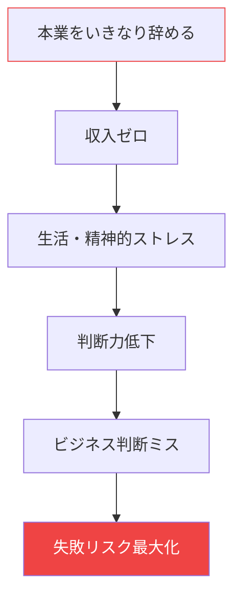
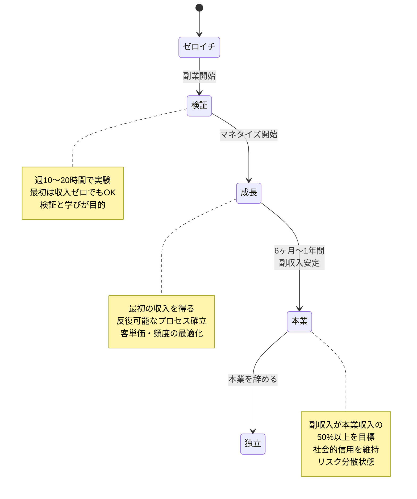

## 副業・起業の現実

「本業を辞めて独立したい」
「自分のビジネスを始めたい」

多くの人がこう考えていますが、いきなり飛び込むのはリスクが大きすぎます。

実際、起業して最初の1年を乗り越えられる人は30%以下とも言われています。

では、どうすれば安全に副業から本業への移行を成功させることができるのでしょうか？

## いきなり辞めるべきではない

### 飛び込みのリスク



いきなり本業を辞めることには、以下のリスクがあります：

1. **収入不安**：ビジネスの安定する前に収入が途絶える
2. **精神的プレッシャー**：生活費を稼がなければならないプレッシャーで判断が歪む
3. **人脈の喪失**：本業でのコネクションが活かせなくなる
4. **学びの機会損失**：会社での経験がビジネスに活かせる

## ゼロイチから本業への安全な移行ステップ

### 移行の3段階モデル



### ステップ1: ゼロイチ（実験期）

**期間**: 最初の3〜6ヶ月
**時間**: 週10〜15時間
**目標**: マーケット検証とスキル検証

**やるべきこと**:
- 具体的な課題解決を提供する
- 5〜10人の顧客と実際に仕事をする
- 無料または低価格で提供してもOK
- 「何が売れるか」を発見する

**成功の指標**:
- 少なくとも3人から「もっと知りたい」「ありがとう」と言われる
- 提供価値に自信が持てる
- 顧客の課題が明確にわかる

### ステップ2: マネタイズ開始（成長期）

**期間**: 3〜6ヶ月
**時間**: 週15〜25時間
**目標**: 反復可能な収益モデルの確立

**やるべきこと**:
- 有料サービスの開始
- 定額プラン（サブスクリプション）の検討
- セールスプロセスの標準化
- 口コミ・紹介を促す仕組み

**成功の指標**:
- 月10〜20万円の安定した副収入
- 5〜10人のリピート顧客
- 新規顧客獲得コストが明確

### ステップ3: 並行稼働（準備期）

**期間**: 6ヶ月〜1年
**時間**: 週20〜30時間
**目標**: 副収入が本業収入の50〜100%を達成

**やるべきこと**:
- チームメンバーの検討（必要な場合）
- 会社設立・個人事業主の手続き
- 税金・保険の準備
- 本業を辞めるタイミングの計画

**成功の指標**:
- 副収入が本業収入の50%以上
- 3ヶ月連続で目標収入を達成
- 自信を持って「やめられる」と言える

## 失敗を防ぐための注意点

### 注意点1: 本業を大切にする

副業を始めたからといって本業をおろそかにしてはいけません。

- 副業の時間は平日の朝・夜に確保
- 本業の経験を副業に活かす
- 本業での人脈を損なわない

### 注意点2: 過度な借金をしない

起業に必要な初期投資は、最小限に抑えましょう。

- 最初はゼロ〜50万円でスタート
- 大規模な広告・投資はマネタイズが安定してから
- 顧客からの前受金は慎重に扱う

### 注意点3: 健康と人間関係を犠牲にしない

- 週末は休息を確保
- 家族・パートナーと話し合う
- メンタルヘルスを優先

## 最初の収益化のタイミング

### 収益化の判断基準

```mermaid
decisiongraph TD
    顧客から「ありがとう」と言われたか
    提供価値に自信を持てるか
    3人以上の実践事例があるか
    課題解決のプロセスが明確か
    再来月もやりたいと思えるか

    顧客から「ありがとう」と言われたか -- YES --> 提供価値に自信を持てるか
    顧客から「ありがとう」と言われたか -- NO --> まだ実験を続ける

    提供価値に自信を持てるか -- YES --> 3人以上の実践事例があるか
    提供価値に自信を持てるか -- NO --> さらに価値を磨く

    3人以上の実践事例があるか -- YES --> 課題解決のプロセスが明確か
    3人以上の実践事例があるか -- NO --> さらに実践を積む

    課題解決のプロセスが明確か -- YES --> 再来月もやりたいと思えるか
    課題解決のプロセスが明確か -- NO --> プロセスを文書化する

    再来月もやりたいと思えるか -- YES --> 有料サービスを開始
    再来月もやりたいと思えるか -- NO --> もう少し検証

    有料サービスを開始 --> ステップ2: 成長期へ
```

## 今日から始めるアクション

### アクション1: 週10時間のスケジュールを作る

平日: 朝1時間 + 夜1〜2時間 = 週10〜12時間
週末: 3〜5時間

### アクション2: 5人の「課題」をリストアップする

あなたが解決できる、具体的な課題を5つ書き出す。

### アクション3: 1人の「最初の実験顧客」を見つける

無料または低価格でもOK。実際に課題を解決する体験をする。

## まとめ

副業から本業への移行は、急ぐ必要はありません。

むしろ、**「いかに安全に、着実に進めるか」**が成功の鍵です。

今日から小さく始めましょう。週10時間、まずは実験から。

1年後、あなたは「あのときゆっくり始めてよかった」と思っているはずです。
