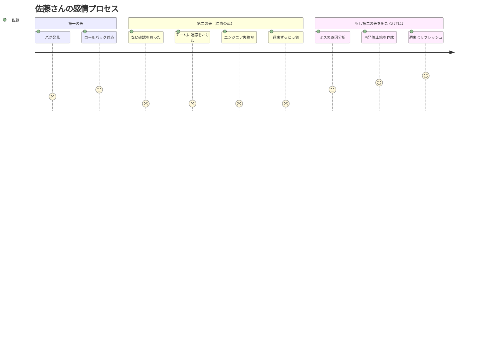
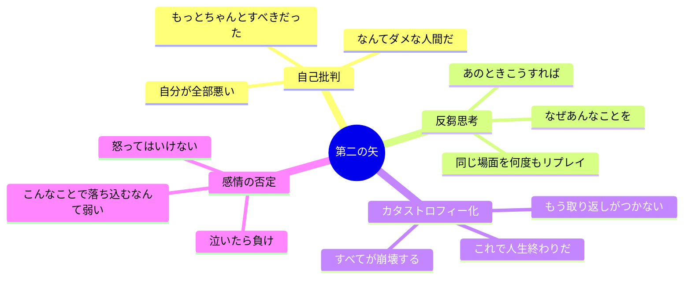
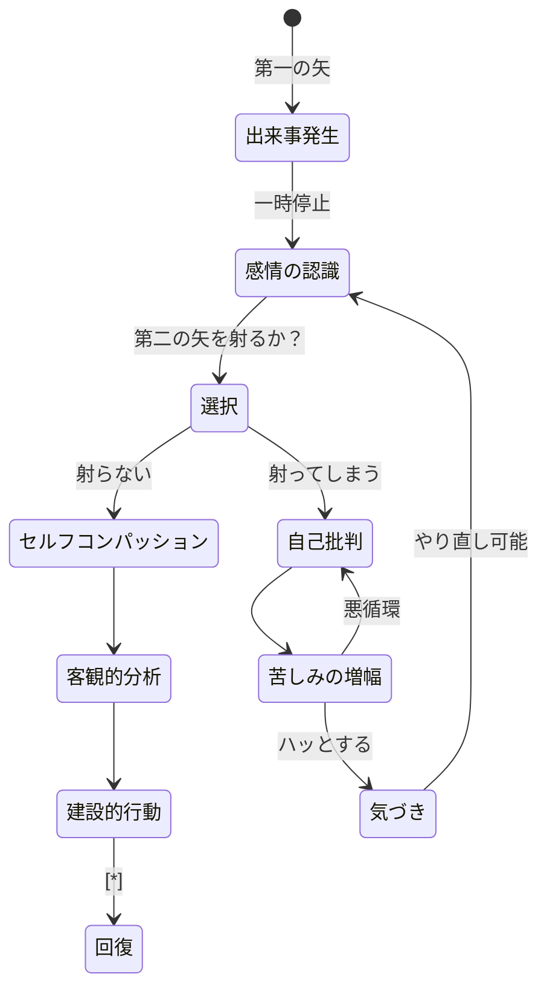

佐藤さん（34歳・システムエンジニア）は、金曜日の夕方、本番環境にデプロイしたコードにバグがあることに気づいた。すぐにロールバックして事なきを得たものの、そこから週末が地獄になった。「なんであの確認を怠ったんだ」「チームに迷惑をかけた」「自分はエンジニア失格だ」――土日の48時間、頭の中でひたすら自分を責め続けた。月曜日、出社した佐藤さんの顔色は真っ青。上司に聞かれた。「佐藤くん、バグの件はもう対応済みだよね？ そんなに気にしなくていいよ」。たった一つのバグは、すでに修正されていた。しかし、佐藤さんが自分に射った「第二の矢」は、まだ刺さったままだった。

## 第一の矢と第二の矢 -- 2500年前からの洞察

仏教の経典「箭経（せんきょう）」に、こんな教えがあります。

> 「誰もが第一の矢（痛み）を受ける。しかし、賢者は第二の矢を射たない」

**第一の矢**とは、人生で避けられない痛みのことです。仕事のミス、人間関係のトラブル、病気、失業。これらは生きている限り、誰にでも降りかかります。

**第二の矢**とは、その痛みに対する自分の反応によって生じる「追加の苦しみ」です。自己批判、反芻思考、カタストロフィー化、感情の否定。本来なら避けられたはずの苦しみを、自分で自分に追加してしまうのです。

重要な公式があります。

**苦しみ = 痛み x 抵抗**

痛みに抵抗すればするほど、苦しみは掛け算で増幅します。逆に、痛みを受け入れることができれば、苦しみは最小限に抑えられるのです。

## 第二の矢の4つのパターン

自分がどのパターンで第二の矢を射っているか、認識することが最初のステップです。

### パターン1: 自己批判

「なんてダメな人間なんだ」「自分が悪い」「もっとちゃんとすべきだった」

出来事への批判ではなく、自分の人格そのものを攻撃するのが特徴です。一つのミスが「自分は価値のない人間だ」という全人格的な否定にすり替わります。

### パターン2: 反芻思考

同じ出来事を何度も頭の中で再生する。「あのときこうすれば」「なぜあんなことを」。研究によれば、反芻思考は問題解決に全く貢献しないばかりか、うつ病のリスクを2倍以上に高めます。

### パターン3: カタストロフィー化

「これで人生終わりだ」「もう取り返しがつかない」。一つの出来事を、現実とはかけ離れた破滅的なシナリオに拡大解釈します。

### パターン4: 感情の否定

「こんなことで落ち込むなんて弱い」「怒ってはいけない」。感情そのものを否定すると、かえって感情は長引きます。押し殺した感情は、別の形で噴出します。

## 第二の矢がもたらす「二次被害」

第二の矢は、単に気分が悪くなるだけではありません。具体的で深刻な二次被害をもたらします。

**問題解決力の低下**: 感情的な嵐の中では、冷静な判断ができません。第一の矢だけなら解決できたはずの問題が、第二の矢によって手がつけられなくなります。

**身体的健康の悪化**: 慢性的なストレスは免疫機能を低下させ、睡眠の質を悪化させ、心臓疾患のリスクを高めます。ある研究では、自己批判的な反芻思考を続けた被験者は、コルチゾール（ストレスホルモン）が平均40%上昇したと報告されています。

**人間関係への波及**: 自分を責め続けている人は、周囲にもイライラをぶつけがちです。佐藤さんのケースでも、週末に妻に八つ当たりしてしまい、夫婦関係にもヒビが入りかけました。

**機会損失**: 第二の矢に心を奪われている間に、問題解決や新しい機会に気づけなくなります。反芻思考に週末の48時間を費やす代わりに、再発防止策を考えることもできたはずです。

## ケーススタディ: 3人の「第二の矢」体験

### ケース1: 山田さん（28歳・マーケター） -- 自己批判からの脱出

山田さんは、担当していたキャンペーンの成果が目標の60%にとどまった。「私のリサーチが甘かったせいだ。マーケターとして終わっている」と自分を責め、次のキャンペーンにも自信を持てなくなった。

**転機**: 上司との1on1で、「山田さん、結果の分析レポートは素晴らしかったよ。次に活かせるデータが取れたじゃない」と言われた。山田さんは気づいた。自分は「結果が60%だった」という事実（第一の矢）に対して、「マーケターとして終わっている」という第二の矢を射っていた。

**Before**: 失敗 → 「自分は無能だ」→ 次の仕事にも消極的に → さらに成果が下がる悪循環
**After**: 失敗 → 「何が学べるか」→ 分析レポートを充実 → 次回の成功率が35%向上

### ケース2: 中村さん（41歳・管理職） -- 反芻思考ループの断ち切り

中村さんは、部下の前で役員から厳しい指摘を受けた。その夜から、同じ場面が頭の中で繰り返し再生される。「あのとき、もっとうまく返答できたはずだ」「部下に示しがつかない」。3日間、寝る前に必ず同じ場面を反芻し、睡眠時間が平均2時間短くなった。

**転機**: 妻に「同じ話を3日も聞いているけど、考えるたびに解決策は出たの？」と聞かれ、ハッとした。反芻思考は問題を解決しないどころか、体調を悪化させているだけだった。

**対処法**: 反芻が始まったら「この考えは、問題解決に役立っているか？」と自問する。答えがNoなら、「今ここ」に意識を戻す。中村さんは通勤時の散歩（10分）に切り替え、反芻ループを物理的に断ち切った。

### ケース3: 鈴木さん（37歳・フリーランス） -- カタストロフィー化の現実検証

鈴木さんは、主要クライアント1社から契約終了の通知を受けた。売上の30%を占めるクライアントだった。「もう生活できない」「フリーランスは無理だったんだ」「家族を路頭に迷わせる」。

**転機**: コーチングセッションで、「最悪の場合、何が起きますか？具体的に数字で書き出してみましょう」と言われた。

書き出した結果:
- 月収30%減 → 貯金で6ヶ月はカバーできる
- 営業活動をすれば、1〜2ヶ月で新規クライアント獲得の見込みあり
- 最悪でも、一時的にアルバイトすれば生活は維持できる

「人生終わりだ」と感じていた状況は、冷静に分析すれば「3ヶ月の営業強化期間」に過ぎなかった。実際、鈴木さんは2ヶ月後に失った売上を超える新規契約を獲得した。

## 第二の矢を射らないための5つの実践法

### 実践1: 6秒ルール -- まず一時停止する

感情的になったとき、すぐに反応しない。深呼吸をして、6秒待つ。神経科学の研究によれば、怒りや悲しみの衝動は6秒でピークを過ぎます。この「6秒の間」が、第二の矢を射るか射らないかの分岐点です。

**具体的なやり方**: 感情が湧いたら、「1...2...3...4...5...6」とゆっくり数える。その間に深呼吸を2回。これだけで、衝動的な第二の矢を防げます。

### 実践2: 感情のラベリング -- 名前をつけて距離を取る

「今、自分は怒りを感じている」「悲しいという感情が湧いている」。感情に名前をつけて、第三者的に観察する。

UCLA の研究チームが発見したところによると、感情に名前をつける（ラベリングする）だけで、扁桃体の活動が最大50%低下します。つまり、「怒っている」と言語化するだけで、怒りの強度が半減するのです。

ポイントは「自分は怒っている」ではなく「怒りという感情がある」という表現。自分と感情の間に距離を置くことで、感情に飲み込まれにくくなります。

### 実践3: セルフコンパッション -- 友人にかける言葉を自分にも

友人が同じミスをしたら、何と声をかけますか？

「大丈夫、誰でも失敗はあるよ」「次に活かせばいいじゃない」「あなたのせいだけじゃないよ」

自分には厳しいのに、友人には優しい。この非対称性こそが、第二の矢の正体です。自分にも、友人に向けるのと同じ言葉をかけてあげてください。

### 実践4: 5年後の視点 -- 時間軸をずらす

今の問題を、5年後の自分から見たらどれくらい大きく見えるか想像してみてください。

中村さんの「役員からの叱責」も、5年後には「あの経験があったから成長できた」というエピソードに変わっているかもしれません。多くの場合、今は大変に感じても、長期的には小さな出来事に過ぎません。

「これもまた過ぎ去る」。この言葉を心の中で繰り返すだけで、第二の矢のエネルギーは弱まります。

### 実践5: 事実と解釈の分離 -- 何が「本当に」起きたか

不運が起きたとき、まず「今、実際に何が起きたか」を客観的に記述します。感情を含まない事実だけを書き出します。

| 事実（第一の矢） | 解釈（第二の矢） |
|---|---|
| プレゼンで質問に答えられなかった | 自分は無能だ |
| 契約が1件解除された | もう生活できない |
| 上司に指摘を受けた | 嫌われている |

事実と解釈を分離するだけで、「第二の矢を射っていた」ことに気づけます。事実は変えられませんが、解釈は選べるのです。

## 今日から始める「第二の矢」防止ワーク

以下のワークを、今週1回だけ試してみてください。5分で完了します。

**ステップ1**: 最近あった嫌な出来事を一つ思い出す
**ステップ2**: 「第一の矢」（事実）を1文で書く
**ステップ3**: 「第二の矢」（自分の反応）を書き出す
**ステップ4**: 第二の矢が、4つのパターン（自己批判・反芻・カタストロフィー化・感情否定）のどれに当てはまるか確認する
**ステップ5**: 友人にかけるような言葉を、自分に向けて1文書く

このワークは[レジリエンスを高める習慣](/blog/resilience)とも深く関連しています。また、第二の矢を射りやすい人は[インポスター症候群](/blog/imposter-syndrome)の傾向がある場合も多いので、併せて確認してみてください。

第二の矢の背景には、過去の意思決定への執着がある場合もあります。[サンクコスト効果](/blog/sunk-cost-fallacy)を理解することで、「過去は変えられない」という前提をより深く受け入れられるようになります。

---

## あなたの「第二の矢」、一緒に見つけませんか？

第二の矢は、自分では気づきにくいもの。長年の思考パターンに染み込んでいるからです。体験セッションでは、あなたが無意識に射っている第二の矢のパターンを一緒に特定し、具体的な対処法をお伝えします。「自分を責めるクセをやめたい」と思ったら、まず一度お話ししましょう。

[→ 体験セッションの詳細を見る](/sessions)
