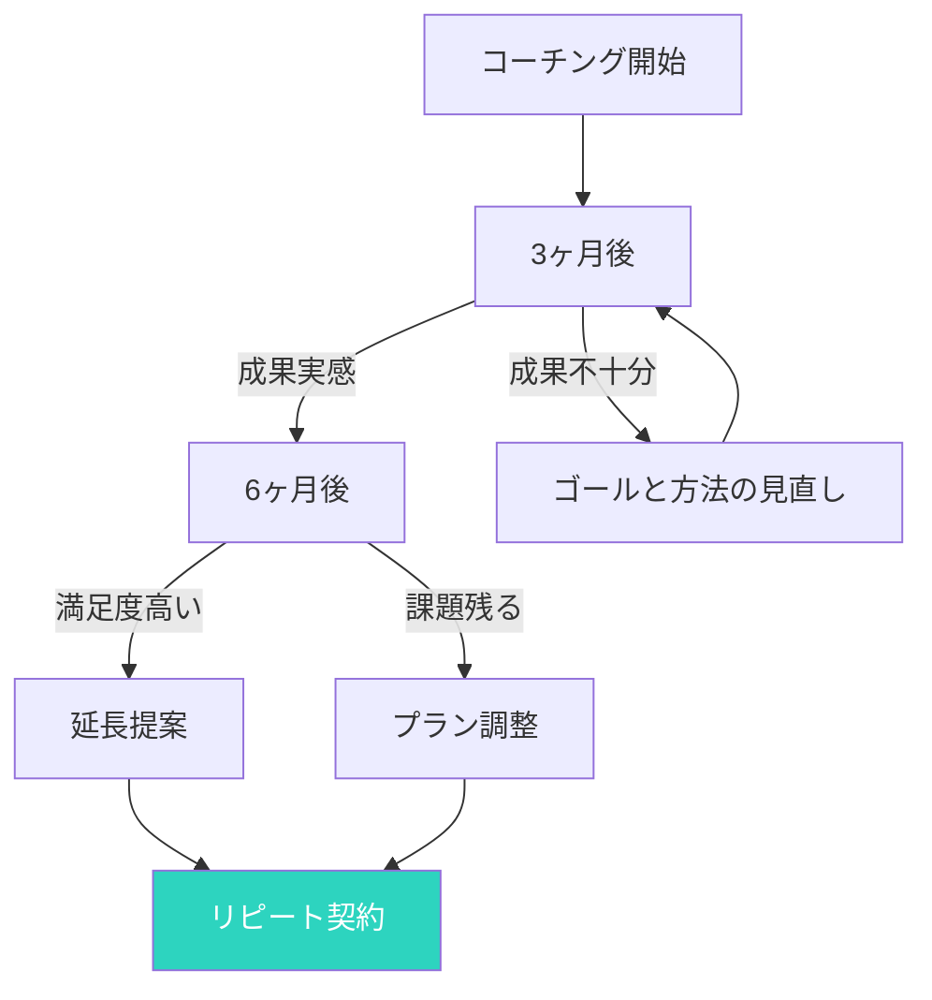

## 新規 vs リピートのコスト差

多くのコーチが、新しいクライアントを獲得することに注力します。

しかし、ビジネスの持続可能性において、既存クライアントとの長期的関係を築くことの方がはるかに重要です。

### コスト比較

```mermaid
xychart-beta
    title 新規獲得 vs リピートのコスト比較（相対）
    x-axis 新規顧客獲得, 既存顧客リピート
    y-axis コスト
    bar [100, 10]
```

- **新規獲得**: マーケティング、セールス、オンボーディング
- **リピート**: すでに信頼関係が確立済み、コストは最小限

## なぜ長期的関係が重要か

### 3つの利益

1. **収入の安定化**
   - 毎月固定の収入が確保できる
   - 新規獲得のプレッシャーが減る

2. **コーチングの質が高まる**
   - クライアントの深い理解ができる
   - 長期的な課題への解決が可能

3. **紹介・口コミが増える**
   - 満足したクライアントが自然と紹介してくれる
   - 信頼度の高い紹介客を獲得できる

## 長期的関係を築く5つのステップ

### ステップ1: 期待値の明確な設定

最初のコーチングセッションで、以下を明確にしましょう。

- コーチングのゴールと成果指標
- コミットメント（頻度、期間、準備）
- お互いの役割と責任
- フィードバックの頻度と方法

### セッション0のチェックリスト

```mermaid
checklist
    title セッション0で確認すべきこと
    目標と成果指標 : クライアントのゴールは明確か
    コミットメント : 頻度、期間、準備で合意できたか
    役割と責任 : コーチとクライアントの役割を共有したか
    フィードバック方法 : 定期的なフィードバックの方法を合意したか
    成功の定義 : どのような状態を「成功」とするか
```

### ステップ2: 定期的な満足度確認

毎3〜4ヶ月、または特定のマイルストーンで満足度を確認しましょう。

**確認すべきポイント**:
- コーチングの進捗状況
- クライアントの期待と実際の成果のギャップ
- コーチングのスタイルへの満足度
- 改善してほしい点

**簡単な満足度アンケート例**:
1. 今のコーチングの進捗に満足していますか？（1〜5）
2. コーチングの頻度は適切ですか？（1〜5）
3. 何か改善してほしい点はありますか？（自由記述）
4. 次に進みたい方向はありますか？（自由記述）

### ステップ3: 長期的なゴールとのつながり

クライアントが短期的なゴールを達成したら、長期的なゴールとのつながりを確認しましょう。

**会話の例**:
「この3ヶ月で〇〇を達成できましたね。次は、1年後にどんな状態になりたいですか？」

### ステップ4: フォローアップの徹底

セッションの後、必ずフォローアップしましょう。

**フォローアップの内容**:
- セッションのまとめとアクションアイテム
- 次回の予定と準備事項
- クライアントへのフィードバック
- 必要なリソース・資料

### ステップ5: 成果の可視化と共有

定期的に、これまでの成果を可視化して共有しましょう。

**成果可視化の方法**:
- 前回の課題 vs 今の状態
- 達成したアクションアイテム
- 定性的・定量的な変化
- クライアント自身の言葉での変化

## アップセルのタイミング

### 適切なタイミングを見極める



**延長提案のタイミング**:
- コーチングのゴールを達成した時
- 新しいゴールが見つかった時
- クライアントが成果を強く実感している時

**提案の方法**:
「これまで、〇〇を達成できましたね。次の3ヶ月で、どのようなゴールに取り組みたいですか？」

## 解約を防ぐためのアクション

### 解約の予兆を見逃さない

以下のサインに気づいたら、すぐに対応しましょう。

- セッションへの準備不足
- セッション中の発言が減る
- スケジュールの変更が増える
- フィードバックを言わなくなる

### 予兆に対するアクション

1. **直接聞く**
   「最近、セッションに来るのが少し大変ですか？」

2. **期待を再確認する**
   「現在のコーチングで、あなたの期待に応えられていますか？」

3. **柔軟に対応する**
   頻度、時間、方法を調整する提案をする

## 長期的関係のビジネスモデル

### 3つの主要モデル

| モデル | 特徴 | 適したクライアント |
|--------|------|-------------------|
| **月額プラン** | 毎月固定料金で利用可能 | 継続的なサポートを求める |
| **ブロック契約** | 6ヶ月〜1年のパッケージ | 具体的なゴールを持つ |
| **オンデマンド** | 必要な時だけ利用 | 一時的な課題解決 |

### 月額プランのメリット

- 安定した収入が確保できる
- クライアントのコスト予測ができる
- 長期的な関係が築きやすい

## 今日から始めるアクション

### アクション1: 既存クライアントへのフォローアップ

今週、全既存クライアントにフォローアップメールを送りましょう。

### アクション2: 満足度アンケートの導入

次のセッションで、簡単な満足度を確認しましょう。

### アクション3: 成果の可視化

クライアント一人ずつ、これまでの成果をまとめましょう。

## まとめ

長期的な関係を築くことは、ビジネスの持続可能性とコーチングの質を高めます。

新規獲得に注力するのではなく、既存クライアントとの関係を深めることから始めましょう。

リピート率を1%上げるだけで、ビジネスの収入は大きく変わります。

今日から、あなたのクライアントと長期的な関係を築くアクションを始めましょう。
