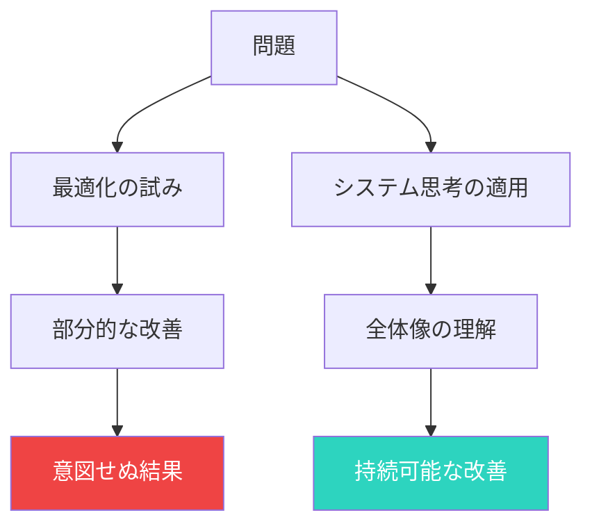
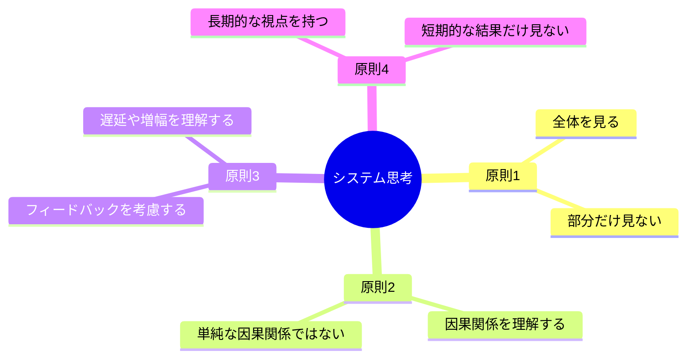
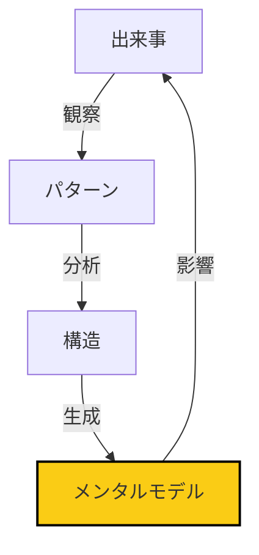
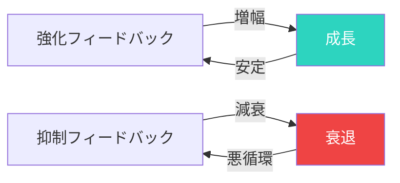
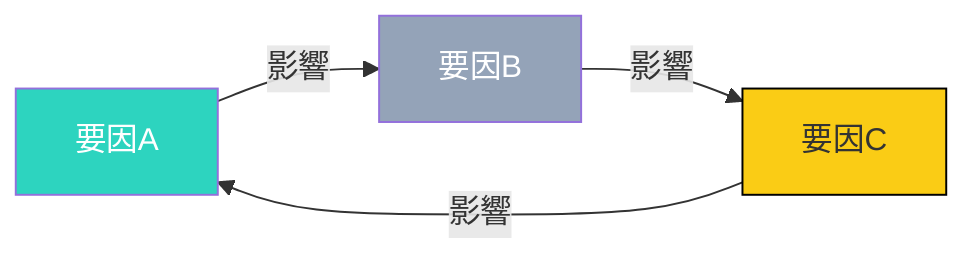
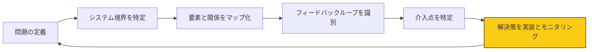

## 部分最適化の罠

「この部門の効率を上げれば、会社全体が改善するはず」

多くの人がこう考えますが、これは大きな罠です。

### 部分最適化 vs 全体最適化



**部門最適化の問題**:
- **トンネルビジョン**: 自分の部門しか見えていない
- **バックファイア効果**: 他への悪影響が無視される
- **短期的な改善**: 長期的な視点が欠如

## システム思考とは何か

### 定義

システム思考とは、全体としてのシステムを理解し、その中での因果関係やフィードバックループを把握する思考方法です。

**3つの基本要素**:

1. **要素**: システムを構成する個々の要素
2. **関係**: 要素間の相互関係
3. **目的**: システムが達成しようとしている目標

### システム思考の4つの原則



## 組織構造の理解

### 階層構造の可視化



**4つのレベル**:

1. **出来事（Events）**: 個別の出来事
   - 例: 「今日、遅刻が3件あった」

2. **パターン（Patterns）**: 繰り返される傾向
   - 例: 「毎週月曜日の朝、遅刻が多い」

3. **構造（Structures）**: パターンを生む構造
   - 例: 「月曜日は前週の残業が多く、寝不足になりがち」

4. **メンタルモデル（Mental Models）**: 構造を支える信念や仮定
   - 例: 「週末はリラックスすべき」という思い込み

### 問題解決のアプローチ

**部門最適化（出来事レベル）**:
- 遅刻した人を注意する
- 遅刻に対してペナルティを課す

**システム思考（構造レベル）**:
- 週末の業務量を減らす
- 前週の残業を抑制する
- 月曜日の業務開始時間を遅らす

## フィードバックループ

### 2種類のフィードバック



**強化フィードバック（正のフィードバック）**:
- 良い結果がさらなる良い結果を生む
- 例: 成功体験が自信を生み、さらに挑戦する

**抑制フィードバック（負のフィードバック）**:
- 悪い結果がさらなる悪い結果を生む
- 例: 失敗の恐怖が挑戦を避けさせ、さらに失敗する

### 遅延と増幅

**遅延（Delay）**: 原因から結果が出るまでの時間差

**増幅（Amplification）**: フィードバックの効果が強まること

**例**: 在庫管理システム
- 在庫が減る → 発注を増やす
- 発注が遅れる → 在庫がさらに減る
- 在庫不足 → 欠品販売の機会損失が増幅

## 因果関係の把握

### 線形因果（ループ因果）



**例**: 社員の離職率
- 離職率が上がる
- 業務負担が増える
- 満足度が下がる
- さらに離職率が上がる

### 複雑な因果関係

**非線形の関係**:
- 原因の効果が一定でない
- 小さな変化が大きな結果を生む（チップ効果）
- 閾値を超えると急激な変化

**シナジー効果**:
- 複数の要因が組み合わって、単独の効果を超える結果を生む
- 例: 良いツール × 良いトレーニング = 生産性の飛躍的向上

## 長期的な意思決定

### 短期的 vs 長期的な視点

```mermaid
xychart-beta
    title 問題解決の効果推移
    x-axis 短期的, 中期的, 長期的
    y-axis 効果
    line "部門最適化" [80, 40, 10]
    line "システム思考" [40, 60, 90]
```

**部門最適化の問題**:
- 短期的には効果が高い
- 中長期的には効果が減少
- しばしば問題を他へ押し付ける

**システム思考の強み**:
- 短期的には効果が低い
- 中長期的には効果が高い
- 問題の根本原因に取り組む

### 持続可能な解決策

**意思決定の3つの質問**:

1. **この解決策は、システム全体にどのような影響を与えるか？**
   - 意図せぬ副作用はないか
   - 他の部分に悪影響はあるか

2. **この解決策は、中長期的に持続可能か？**
   - 短期的な利益だけでなく、長期的なコストも考慮するか
   - 持続可能性をどう確保するか

3. **この解決策は、問題の根本原因に対応しているか？**
   - 症状なのか、原因なのか
   - 他の解決策との整合性はあるか

## メンタルモデルの統合的な活用

### 複数のメンタルモデルの統合

システム思考は、複数のメンタルモデルを統合的に活用します。

**主要なメンタルモデル**:

| メンタルモデル | 説明 | 活用場面 |
|-------------|------|---------|
| **バランスシート** | システムの安定と成長のバランス | 組織の設計 |
| **限界と成長** | システムの成長限界と突破 | 事業の拡大戦略 |
| **遅延調整** | フィードバックの遅延調整 | プロジェクト管理 |
| **成功の成功** | 成功がさらなる成功を生む | 顧客満足度向上 |

### メンタルモデルの実践例

**バランスシートの活用**:
- 安定（生産性を維持）と成長（イノベーション）のバランス
- 安定に偏りすぎると、停滞
- 成長に偏りすぎると、リスク増大

**遅延調整の活用**:
- 業務負担を増やすと、成果は遅れて出る
- 適切な遅延調整が必要
- 遅延を考慮した計画

## 実践的なワークフロー

### システム思考の5ステップ



### ステップ1: システム境界を特定

- システムに含める要素と除外する要素を決定
- 適切な境界を設定

### ステップ2: 要素と関係をマップ化

- 主要な要素をリストアップ
- 要素間の関係を可視化

### ステップ3: フィードバックループを識別

- 正のフィードバックループ
- 負のフィードバックループ
- バランスポイントを特定

### ステップ4: 介入点を特定

- 最も効果的な介入点を特定
- 少ない労力で最大の効果を得られる点

### ステップ5: 解決策を実装とモニタリング

- 解決策を実装
- 継続的にモニタリング
- 必要に応じて調整

## 今日から始めるアクション

### アクション1: 部分最適化の例を特定する

自分の業務や生活で、部門最適化になっている例を1つ見つけましょう。

### アクション2: 問題のシステム図を描く

システム思考を使って、問題の全体像を可視化しましょう。

### アクション3: 長期的な解決策を考える

短期的な解決だけでなく、中長期的な視点で解決策を考えましょう。

## まとめ

システム思考は、複雑な問題を全体像から理解し、持続可能な解決策を導くための強力なツールです。

部門最適化の罠に陥るのではなく、全体最適化を目指しましょう。

今日から、小さく始めましょう。

1つの問題をシステム思考で分析する。

1ヶ月後、あなたは「全体像」から問題を見るようになっているはずです。

---

## 💬 一歩踏み出したいあなたへ

この記事のテーマについて、もっと深く揘り下げたいと思いませんか？

**体験セッション（無料）**では、あなたの状況に合わせた具体的なアドバイスをお伝えします。

[→ 体験セッションの詳細を見る](/sessions)

