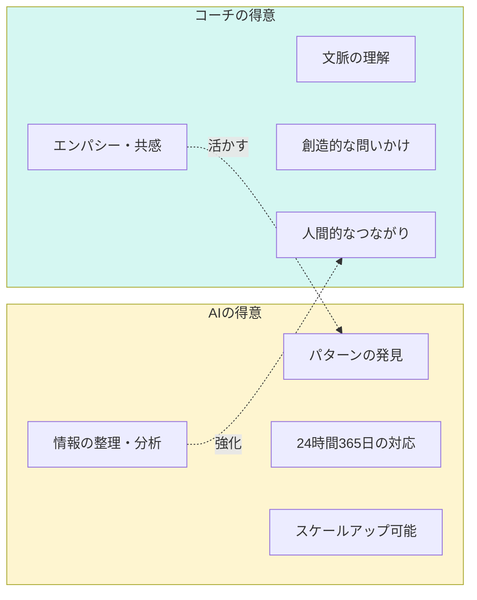
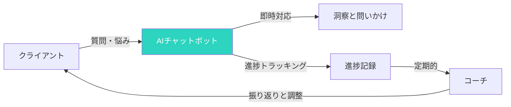

## コーチングの未来が変わる

AIの台頭により、コーチングのあり方が大きく変わりつつあります。

「AIはコーチを置き換えるのか？」

答えはNoです。しかし、AIを活用できるコーチとできないコーチでは、今後大きな差が生まれます。

## AIはコーチを補完し、強化する

### AIの得意なこと vs コーチの得意なこと



AIが得意なこと：
- 大量のデータの整理・分析
- 過去の対話からのパターン発見
- 24時間365日の即時対応
- スケールアップが容易

コーチが得意なこと：
- クライアントへの深いエンパシー
- 複雑な文脈の理解
- クリエイティブな問いかけ
- 人間的なつながりと信頼

これらを組み合わせることで、より質の高いコーチングが可能になります。

## AIを活用したコーチングの3つの形

### 形1: 事前準備の自動化

セッション前に、AIにクライアントの情報を整理・分析させることができます。

**AIができること**:
- 過去のセッション記録の要約
- クライアントの課題の進捗整理
- セッションの準備資料作成
- 関連する質問の提案

### 形2: セッション中の補助

セッション中、リアルタイムでAIを活用することも可能です。

**活用シーン**:
- 重要なキーワードや洞察の記録
- クライアントの発言の要約
- 新しい問いかけのアイデア出し
- 関連するモデルやフレームワークの検索

### 形3: セッション後のフォローアップ

セッション後、AIによる自動化で時間を大幅に節約できます。

**AIに任せること**:
- セッションの詳細なまとめ
- アクションアイテムの抽出
- クライアントへのメール案作成
- 次回の準備資料作成

## 24時間365日のセルフコーチング

### AIチャットボットの活用



クライアントはセッションの間、AIチャットボットと対話することで、コーチングを補強できます。

**チャットボットができること**:
- クライアントの悩みに即応答
- コーチングの問いかけを提供
- アクションアイテムのリマインダー
- 進捗の記録と共有

## AIを活用するための5つのステップ

### ステップ1: 適切なAIツールを選ぶ

| ツール | 特徴 | 用途 |
|--------|------|------|
| **ChatGPT** | 汎用性が高い、応答が自然 | 一般的な質問、要約、アイデア出し |
| **Claude** | 文脈理解が深い、丁寧 | セッション記録の分析、詳細な洞察 |
| **Notion AI** | 文書内での活用が容易 | クライアント記録の管理と検索 |

### ステップ2: クライアント情報をAIに安全に管理する

**重要**: クライアントのプライバシーを守るため、以下の対策が必要です。

- 個人を特定できる情報を含めない
- すべての通信を暗号化
- AIが保持するデータの設定を確認
- 定期的なデータ削除

### ステップ3: コーチング用プロンプトを作る

AIに期待する応答を得るため、具体的なプロンプトを用意しましょう。

**プロンプトの例**:

**セッション準備用**:
```
クライアント〇〇について以下を要約してください。
1. 主な課題とゴール
2. 前回セッションの進捗
3. 今回のセッションでフォーカスすべきポイント
4. 提案すべき問いかけのアイデア（最大3つ）
```

**フォローアップ用**:
```
以下のセッション記録に基づき、以下を作成してください。
1. セッションの要点（箇条書き）
2. クライアントのアクションアイテム（箇条書き）
3. クライアントへのフォローアップメール案
```

### ステップ4: AIとクライアントの間の境界を明確にする

クライアントに、AIの活用について透明にしましょう。

- どのようなAIを使っているか
- AIがどのような役割を果たしているか
- AIの限界と、どの状況でコーチが必要か

### ステップ5: 効果を測定する

AI活用がコーチングの質にどう影響しているか、定期的に測定しましょう。

**測定指標**:
- クライアントの満足度変化
- セッションの準備・フォローアップ時間の削減
- クライアントの進捗速度
- コーチ自身の負荷軽減

## AI活用の注意点

### 注意点1: AIをコーチの代わりにしない

AIは補助ツールであり、コーチの代わりではありません。

- 重要な洞察はコーチが提供する
- エンパシーと共感は人間が提供する
- 最終的な意思決定はクライアントが行う

### 注意点2: AIの限界を知る

AIには以下の限界があります。

- 文脈の深い理解が難しい
- クライアントの感情のニュアンスを感じ取れない
- 創造的な問いかけが苦手

### 注意点3: クライアントとの関係を大切にする

AIを活用しても、クライアントとの人間的なつながりが最も重要です。

- セッションは人間が主導する
- 定期的にAIを使わないセッションを持つ
- クライアントのAI活用に対する感受性を尊重する

## 今日から始めるアクション

### アクション1: AIツールの試用

無料枠で、ChatGPTやClaudeを試してみましょう。

### アクション2: セッション記録の要約をAIに任せる

次のセッション後、AIに要約をさせてみましょう。

### アクション3: クライアントにAI活用について話す

信頼関係のあるクライアントから、AI活用について相談してみましょう。

## まとめ

AIはコーチングを変えるだけでなく、強化します。

AIを活用できるコーチは、より多くのクライアントに、より質の高いコーチングを提供できます。

しかし、AIを使うだけでなく、「どのように使うか」が重要です。

AIをコーチの補助として活用し、人間的なつながりとエンパシーを大切にしましょう。

そうすることで、AI時代のコーチングの新しい形を切り開くことができます。

---

## 💬 一歩踏み出したいあなたへ

この記事のテーマについて、もっと深く揘り下げたいと思いませんか？

**体験セッション（無料）**では、あなたの状況に合わせた具体的なアドバイスをお伝えします。

[→ 体験セッションの詳細を見る](/sessions)

