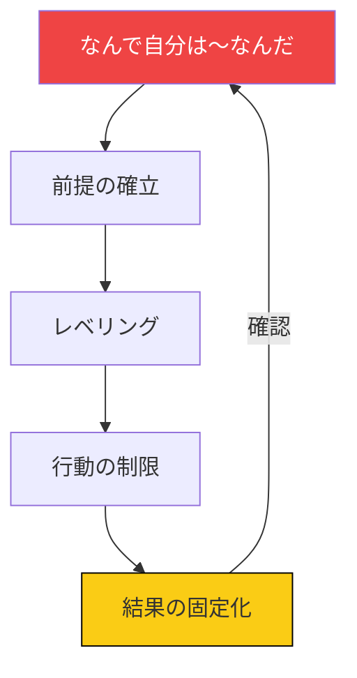
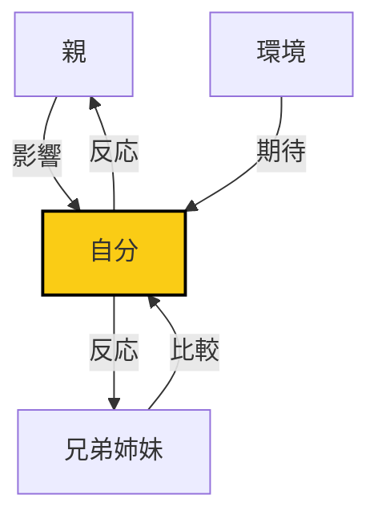
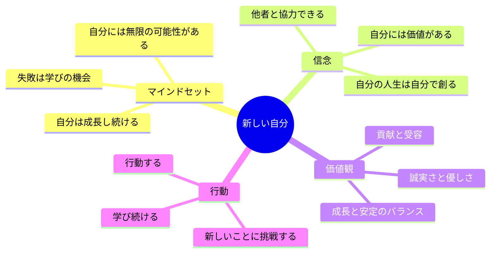
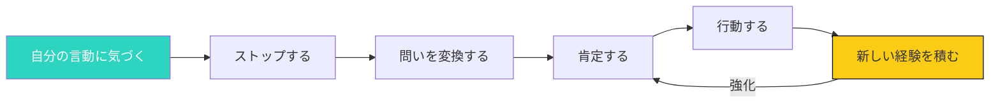

## 「なんで自分は〜なんだ」という呪い

「なんで自分は話すのが苦手なんだ」
「なんで自分はお金を持っていないんだ」
「なんで自分はモテないんだ」

あなたも、このような問いを自分に投げかけていませんか？

これらは、「なんで自分は〜なんだ」という強力な呪いです。

## 呪いの正体

### 「なんで自分は〜なんだ」の構造

**呪いの3つの要素**:

1. **前提の確立**: 「自分は〜だ」という前提を疑わない
2. **レベリング**: 自分を固定されたラベルで捉える
3. **行動の制限**: そのラベルに沿った行動しかとらなくなる

### 呪いの危険性

**1. 自己実現の否定**

「自分は〜だ」という前提は、他の可能性を否定します。

**例**: 「自分は話すのが苦手」
- 上手に話す可能性を否定
- 練習で上達する可能性を否定
- 場によって話せる可能性を否定

**2. 変化の拒否**

「自分は〜だ」が自己定義になると、変化を拒否します。

**3. 自己否定的な自己対話**

「なんで自分は〜なんだ」という問いは、自己否定的な対話を生みます。

## 自己史の客観的な分析

### 自己史の影響

自分史（子供の頃の経験、教育、環境）が、現在の自己イメージに大きな影響を与えています。

**自己史の主要な要素**:

| 要素 | 影響の例 | 形成されるマインドセット |
|-----|---------|----------------------|
| **親の言葉** | 「勉強しなさい」 | 「自分は勉強できない」 |
| **学校での経験** | いじめられた | 「自分は愛されない」 |
| **社会的な期待** | 「男は〜」 | 「自分は〜すべき」 |
| **トラウマ** | 失敗の経験 | 「自分は失敗者」 |

### 自己史の客観的な見方

**ステップ1: 影響を受けた出来事をリストアップ**

- 親から言われた言葉
- 先生や友人との出来事
- 社会的な経験
- トラウマ的な出来事

**ステップ2: それぞれがどのようなマインドセットを形成したか分析**

- どのような前提が植え付けられたか
- どのようなレベリングがされたか
- どのような行動が期待されたか

**ステップ3: そのマインドセットは今、事実かどうか判断**

- その前提は本当か
- そのレベリングは正しいか
- 今の状況に適用すべきか

**ステップ4: 再解釈する**

- 出来事を、今の視点から再解釈する
- 親の言葉は「当時のベスト」だったと理解する
- 自分を責めず、環境を客観的に見る

### 自己史の再解釈の例

**出来事**: 小学生の時、テストで点数が悪くて先生に怒られた

**古い解釈**: 「自分は勉強できない、ダメなやつ」

**新しい解釈**:
- 先生は、私がもっとできると信じて怒った
- その時は勉強する方法を知らなかった
- 今は、効果的な学習方法を知っている

## 家族や環境の影響を理解する

### システムズとしての家族

家族はシステムであり、それぞれの要素が相互作用しています。

### 家族の影響

**1. 直接的な言葉**

- 「〜しなさい」という直接的な指示
- 「〜であるべき」という期待
- 「〜してはいけない」という禁止

**2. 間接的な影響**

- 親の行動や価値観の観察
- 兄弟姉妹との比較
- 家庭内での役割分担

**3. 環境的な影響**

- 経済的状況
- 地域的文化
- 時代背景

### 環境の影響

**社会システムとしての環境**:

- 企業の文化
- 地域のコミュニティ
- メディアの影響
- 学校教育のカリキュラム

**環境の再解釈**:

- 環境は「背景」であり、「運命」ではない
- 環境の影響は大きいが、自分の選択もある
- 新しい環境を作ることも可能

## 新しい自己イメージの構築

### 理想的な自分のイメージ

「なんで自分は〜なんだ」という呪いから脱却するために、新しい自己イメージを構築します。

**自己イメージの4つの質問**:

1. **理想の自分はどうなっていたいか？**
   - どのような人間関係
   - どのようなキャリア
   - どのようなライフスタイル

2. **理想の自分は、どのようなマインドセットを持っているか？**
   - どのような信念
   - どのような価値観
   - どのような期待

3. **理想の自分は、どのように行動しているか？**
   - どのように人と接する
   - どのように仕事をする
   - どのように挑戦する

4. **理想の自分に必要な変化は何か？**
   - 今から始められること
   - 中期的に取り組むこと
   - 長期的な目標

### 自己イメージの可視化

## 脱却の実践的な方法

### 「なんで自分は〜なんだ」の5つの変換

| 古い問い | 新しい問い | 効果 |
|---------|----------|------|
| 「なんで自分は話すのが苦手なんだ」 | 「どうすれば、話すのが得意になれるか」 | 問題解決モードに移行 |
| 「なんで自分はお金を持っていないんだ」 | 「どうすれば、収入を増やせるか」 | アクション可能な問いに |
| 「なんで自分はモテないんだ」 | 「どうすれば、魅力的な人になれるか」 | 成長意識に変換 |
| 「なんで自分は失敗ばかりするんだ」 | 「失敗から何を学べるか」 | 学びモードに移行 |
| 「なんで自分は〜なんだ」 | 「どうすれば〜になれるか」 | 創造的解決に |

### 脱却の3つのステップ

### ステップ1: 気づく

「なんで自分は〜なんだ」という問いをしている自分に気づきます。

### ステップ2: 問いを変換する

「なんで自分は〜なんだ」を「どうすれば〜になれるか」に変換します。

### ステップ3: 肯定する

新しい問いに対して、肯定的に答えます。

「はい、私は〜になれる」

### ステップ4: 行動する

新しい問いに基づいて、行動します。

### ステップ5: 新しい経験を積む

行動の結果、新しい経験を積みます。

## 今日から始めるアクション

### アクション1: 「なんで自分は〜なんだ」をリストアップ

自分がよく言う「なんで自分は〜なんだ」を5つ書き出しましょう。

### アクション2: 各問いを「どうすれば」に変換する

リストアップした問いをすべて「どうすれば〜になれるか」に変換しましょう。

### アクション3: 新しい自己イメージを書き出す

理想の自分を具体的にイメージし、書き出しましょう。

### アクション4: 1つのアクションを実行する

新しい自己イメージに沿ったアクションを1つ、今日実行しましょう。

## まとめ

「なんで自分は〜なんだ」という呪いは、自分で変えることができます。

自己史を客観的に見て、新しい自己イメージを構築しましょう。

呪いに縛られるのではなく、新しい自己イメージを自由に生きましょう。

今日から、小さく始めましょう。

1つの問いを変換する。1つのアクションを実行する。

1ヶ月後、あなたは「なんで自分は〜なんだ」という呪いから脱却しているはずです。

---

## 💬 一歩踏み出したいあなたへ

この記事のテーマについて、もっと深く揘り下げたいと思いませんか？

**体験セッション（無料）**では、あなたの状況に合わせた具体的なアドバイスをお伝えします。

[→ 体験セッションの詳細を見る](/sessions)

