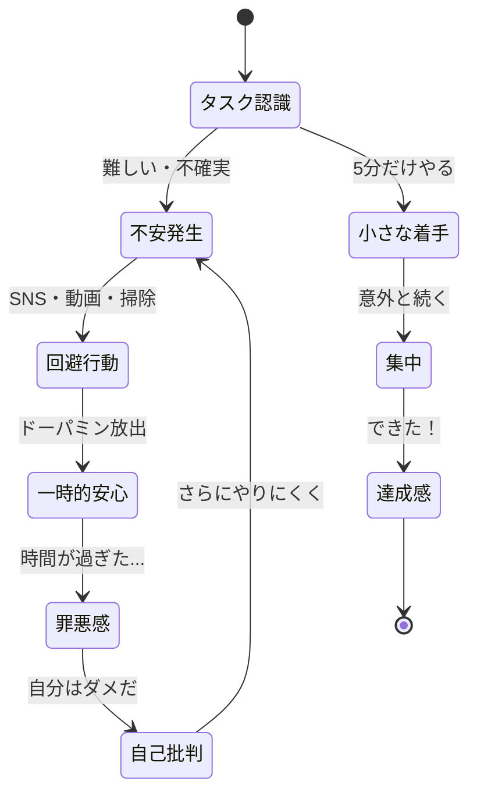
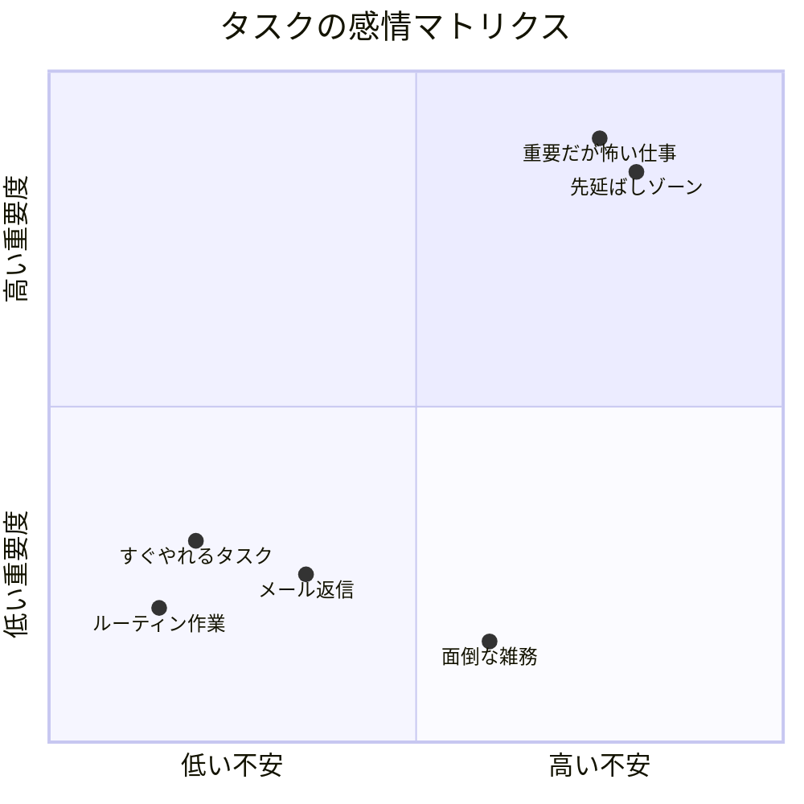

木村さん（29歳・Webデザイナー）は、納期まであと2週間のデザイン案件を抱えていた。「今日こそ取り掛かろう」と思ってPCを開くが、気づけばSNSを30分スクロールしている。「あと少しだけ...」と思いながら、YouTube動画を1本、2本。ふと時計を見ると夕方5時。「今日はもう無理だ、明日からやろう」。そう自分に言い聞かせるのは、もう10日連続だった。木村さんは怠け者なのか？ 答えはNo。木村さんの脳は、ある感情から必死に逃げていただけだった。

## 先延ばしの正体 -- 怠惰ではなく「不安回避」

「やらなきゃいけないのに、やれない」。この状態を多くの人は「意志が弱い」「怠けている」と自己批判します。しかし、心理学の研究が明らかにしたのは、まったく異なる事実でした。

**先延ばし（プロクラスティネーション）は、感情調整の問題である。**

カナダ・カールトン大学の先延ばし研究の第一人者ティモシー・ピチル博士はこう述べています。「先延ばしは時間管理の失敗ではない。感情管理の失敗である」。

タスクを見たとき、脳内で何が起きているか。そのタスクが「不安」「恐怖」「退屈」「不確実性」などのネガティブな感情を引き起こすと、脳はそこから逃げようとします。SNSやYouTubeは、その逃避先として最適な「即時充足」を提供してくれるのです。

つまり先延ばしとは、「感情の問題」であって「時間管理の問題」ではないのです。だからこそ、タスク管理ツールを導入しても、締め切りをリマインドしても、根本的な解決にはならないのです。

## なぜ「大事なこと」ほど先延ばすのか

木村さんが先延ばししていたのは、簡単な事務作業ではなくクリエイティブなデザイン案件でした。これは偶然ではありません。

### 理由1: 重要なタスクは「失敗の恐怖」が大きい

大切なプロジェクトほど、失敗したときのダメージが大きいと感じる。だから「始める」こと自体を避けてしまう。始めなければ、失敗もしない。これが脳の防衛ロジックです。

### 理由2: 完璧主義の罠

「やるなら完璧に」という思いがハードルを上げる。完璧にできる自信がないから着手できない。皮肉なことに、完璧主義者ほど先延ばしをしやすいのです。

### 理由3: 自己価値とタスクの結びつき

「このデザインの出来 = デザイナーとしての自分の価値」と無意識に結びつけている場合、失敗の恐怖はさらに増大します。タスクの結果が自分の人格評価に直結すると感じると、着手のハードルは跳ね上がります。

### 理由4: 報酬が遠い

今日デザインを少し進めても、クライアントからの評価は2週間後。脳は遠い報酬より、目の前の快楽（SNSのいいね、YouTube動画の面白さ）を優先します。これは「時間割引」と呼ばれる脳の特性です。

右上の象限 -- 「重要度が高く、不安も大きい」タスクが、最も先延ばしされやすい。まさに木村さんのデザイン案件がここに位置していました。

## 先延ばしの4つのパターン -- あなたはどのタイプ？

自分の先延ばしパターンを知ることが、適切な対処法を見つける第一歩です。

**SNSチェック型**: タスクを始める前に、ついSNSやメールをチェックしてしまう。正体は、タスクへの不安から気分転換を求める回避行動。

**準備が整うまで待つ型**: 「もう少し情報を集めてから」「環境が整ったら」と先延ばしにする。正体は完璧主義。始めることへの恐怖を、準備不足という理由で正当化している。

**締め切りギリギリ型**: 締め切り直前にならないと着手できない。正体は、緊張感がないと動けない状態。締め切りのアドレナリンが唯一の動力源になっている。

**他のことを先に片付ける型**: 重要タスクを後回しにし、簡単なタスクを先に片付ける。正体は即時充足の追求。小さな達成感で不安をごまかしている。

## ケーススタディ: 先延ばしを克服した3人

### ケース1: 木村さん（29歳・Webデザイナー） -- 「5分だけ」の魔法

木村さんは、自分が「完璧主義型」の先延ばしをしていることに気づいた。「完璧なデザインを最初から作ろうとするから、怖くて始められない」。

**対処法**: 「5分だけ、ラフスケッチを描く」というルールを作った。5分だけなら、完璧じゃなくていい。ただの落書きでいい。

結果、5分のつもりが30分、1時間と自然に作業が続くようになった。心理学ではこれを「作業興奮」と呼びます。始めてしまえば、脳が作業モードに切り替わり、不安が薄れていくのです。

**Before**: 毎日「明日こそやろう」→ 10日間ゼロ進捗 → 締め切り3日前に徹夜
**After**: 毎日5分着手 → 2週間で余裕を持って完成 → 睡眠時間+2時間

### ケース2: 高橋さん（35歳・営業マネージャー） -- 恐怖の現実検証

高橋さんは、四半期レポートを毎回先延ばしにしていた。「数字が悪かったらどうしよう」「上司に詰められるかもしれない」という不安が原因だった。

**対処法**: コーチとの対話で「失敗したら、具体的に何が起きますか？」と問われた。

書き出してみた結果:
- 数字が悪くても、クビにはならない
- 上司に詰められても、30分の会議で終わる
- 改善プランを提示すれば、評価はむしろ上がる

「想像上の最悪のシナリオ」と「現実に起こりうる結果」のギャップに気づいた。先延ばしの不安は、実際の結果より常に10倍大きく膨らんでいた。

**Before**: レポート作成を3週間先延ばし → 直前に急いで作成 → 質の低いレポート
**After**: 恐怖を書き出す → 「たいしたことない」と気づく → 早期着手 → レポートの質が向上し上司から高評価

### ケース3: 伊藤さん（26歳・大学院生） -- 開始儀式の確立

伊藤さんは、修士論文の執筆を3ヶ月先延ばしにしていた。「他のことを先に片付ける型」で、論文の代わりに部屋の掃除、買い物リストの作成、友人へのLINE返信など、次々と別のタスクをこなしていた。

**対処法**: 「論文を書く」のではなく、「お気に入りのカフェラテを淹れて、好きなジャズをかけて、Wordファイルを開く」という開始儀式を設定した。論文を書くのではなく、儀式を実行するだけ。

ファイルを開いた後、「1段落だけ書く」。たった3〜4行でいい。この小さな成功体験が、次の日の着手ハードルを下げる好循環を生んだ。

**Before**: 3ヶ月間、論文の進捗ゼロ → 指導教員との面談が恐怖
**After**: 毎日の儀式で1段落ずつ → 2ヶ月で第1稿完成 → 指導教員から「着実に進んでいるね」

## 先延ばしを克服する7つの実践テクニック

### テクニック1: 2分ルール

「2分で終わることなら、今すぐやる」。メール返信、ファイル整理、簡単な連絡。小さなタスクを即座に片付けることで、「やれた」という成功体験を積み、行動のモメンタムを作ります。

### テクニック2: タスクの極限分解

「レポートを書く」→ 「資料フォルダを開く」→ 「タイトルだけ書く」→ 「見出しを3つ並べる」。最初の一歩を極端に小さくする。着手ハードルが低ければ低いほど、不安は小さくなります。

### テクニック3: 感情の正体を言語化する

先延ばししたくなったら、「今、何を避けたがっているか」を自問する。「このタスクのどこが怖いのか？」「失敗すると何が起きると思っているか？」を紙に書き出すだけで、漠然とした不安が具体化し、対処可能になります。

### テクニック4: 環境デザイン

誘惑を物理的に遠ざける。スマホを別の部屋に置く。SNSのアプリを削除する（Webでもアクセスできるが、1ステップ増えるだけで回避行動は激減します）。作業用のカフェに行く。[ディープワーク](/blog/deep-work)の環境を意識的に作ることが重要です。

### テクニック5: セルフコンパッション

先延ばしした自分を責めると、ストレスが増え、さらに先延ばしする悪循環に陥ります。「先延ばしは人間として自然な反応だ」と受け入れ、「次はこうしよう」と前を向く。研究では、自分を許せた人のほうが、次回の先延ばしが少ないことが示されています。

### テクニック6: アカウンタビリティの設計

誰かに「今日、このタスクの第1段階を終わらせます」と宣言する。進捗を報告する。他者の目があると、やらざるを得なくなります。一人で戦わず、仲間の力を借りましょう。

### テクニック7: 価値観との接続

退屈なタスクでも、「なぜこれをやるのか」を自分の価値観や長期目標と接続する。木村さんにとって、デザイン案件は「クリエイターとして成長する」という価値観に直結していた。目の前の不安より、その先にある意味を見ることで、動機が生まれます。

## 先延ばしとの「健全な付き合い方」

実は、すべての先延ばしが悪いわけではありません。

**建設的な先延ばし**: 熟考の時間として、無意識にアイデアを醸成している場合があります。アダム・グラント教授の研究では、「適度に先延ばしした人」のほうが、創造的なアイデアを出す傾向がありました。

**問題のある先延ばし**: 自分を追い詰め、睡眠を削り、健康や人間関係を損なうレベルの先延ばしは、明確に対処が必要です。

区別のポイントは「先延ばしした後の気分」。罪悪感や自己嫌悪が伴うなら、それは問題のある先延ばしです。

先延ばしの根本にある不安への向き合い方は、[朝のルーティン設計](/blog/morning-routine)で1日の最初に重要タスクを持ってくる方法や、[ポモドーロ・テクニック](/blog/pomodoro-technique)で時間を区切る方法とも相性が良いので、併せて試してみてください。また、先延ばしの原因が「やらないことを決められない」にある場合は、[NOT TO DOリスト](/blog/not-to-do-list)の考え方が役立ちます。

---

## 「明日こそ」を「今日、5分だけ」に変えませんか？

先延ばしのパターンは、一人では気づきにくいもの。体験セッションでは、あなたの先延ばしの根本にある感情パターンを一緒に分析し、あなたに合った具体的な着手テクニックをお伝えします。「やらなきゃと思っているのに動けない」その悩み、解決の糸口は必ずあります。

[→ 体験セッションの詳細を見る](/sessions)
