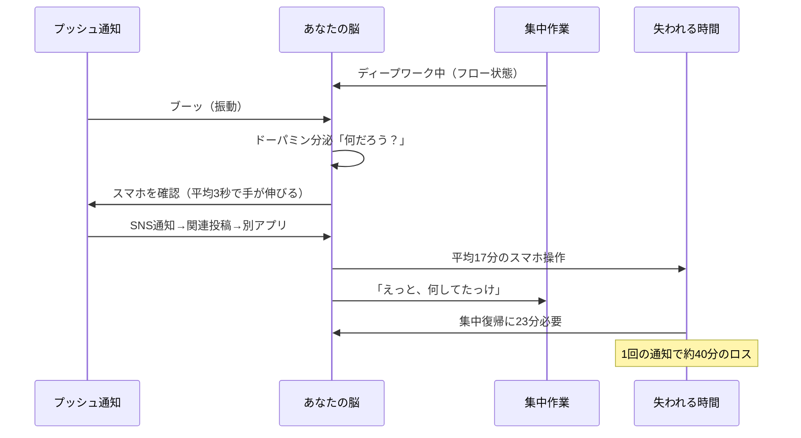
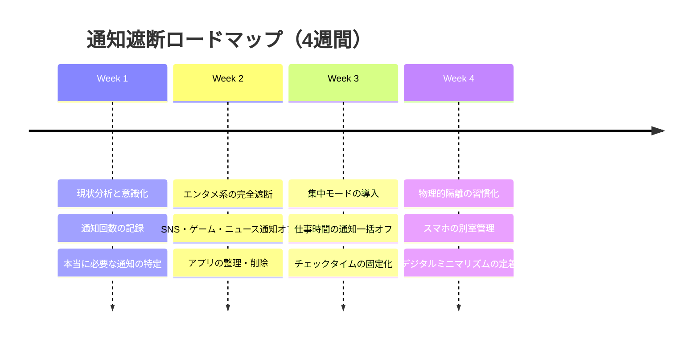
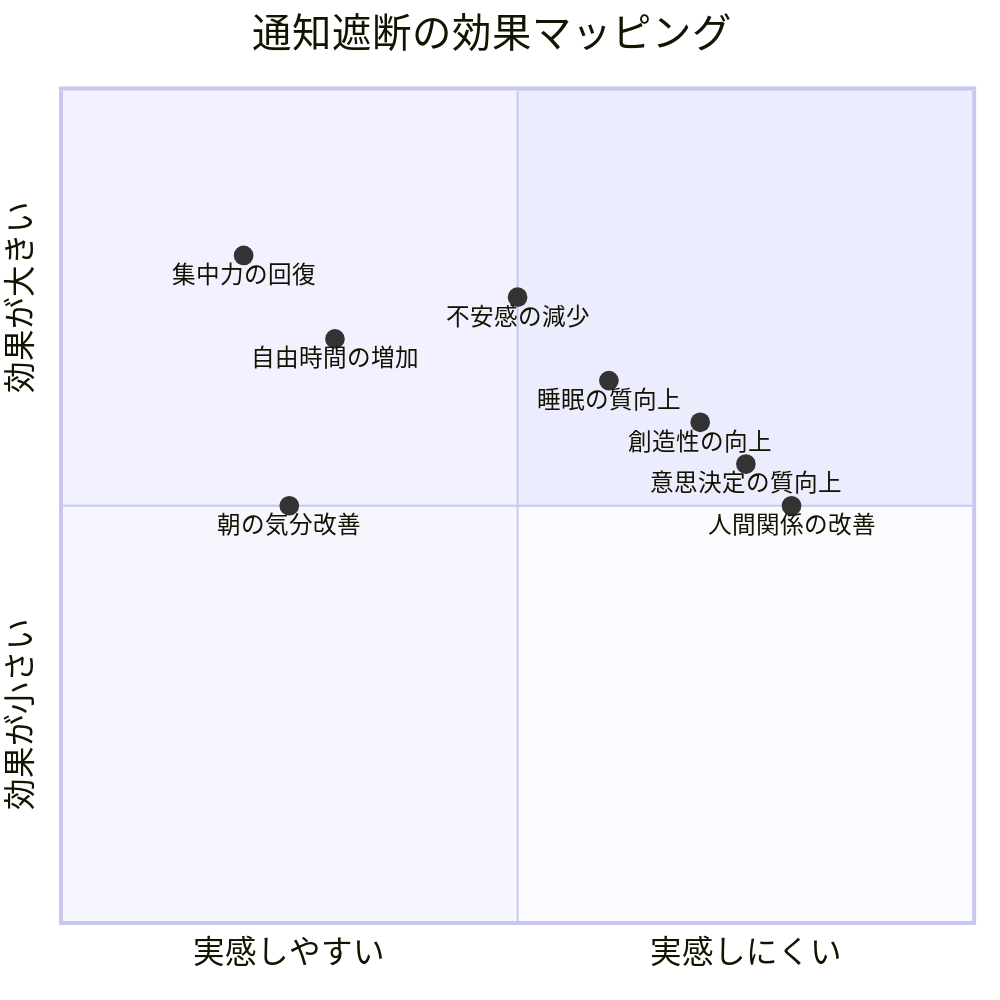

午前10時17分。企画書の核心部分を書いている最中に、ポケットが振動した。「ちょっとだけ」とスマホを見た田中麻衣（28歳・マーケティング担当）は、SNSの通知からニュースアプリ、そしてショッピングサイトのセール情報へと流れ、気づけば22分が経過していた。画面を閉じてPCに向き直ったとき、「あれ、さっき何書こうとしてたんだっけ」——この瞬間、彼女はその日3度目の「集中力リセット」を食らっていた。

## 通知があなたの脳にしていること

スマートフォンの通知は、単に「お知らせ」を届けているわけではありません。あなたの脳の報酬系を巧みにハッキングしています。

カリフォルニア大学アーバイン校のGloria Mark教授の研究によれば、**一度中断された作業への集中復帰には平均23分26秒**かかります。1日平均46回届く通知のうち、たった6回反応するだけでも、**約4時間分の深い集中時間**が消失する計算です。

### 通知中毒のメカニズム

通知が恐ろしいのは、「見なければいい」と理性では分かっていても、**脳が反応してしまう**点です。

- **変動報酬効果**：内容が予測できないからこそ脳が興奮する（スロットマシンと同じ原理）
- **FOMO（Fear of Missing Out）**：「見逃したら損する」という恐怖
- **社会的承認欲求**：いいね、コメント、メッセージは承認のシグナル
- **未完了タスク効果**：通知の赤いバッジが「処理していないタスク」として脳を刺激し続ける

## 通知遮断の4段階フレームワーク

通知遮断は「全部オフにする」という単純な話ではありません。段階的に進めることで、不安なく確実に習慣化できます。

## ケーススタディ1：マーケター田中麻衣の「通知断食」記録

冒頭の田中麻衣さんは、自分の通知状況を3日間記録した結果に愕然としました。

### Before：通知記録の実態

| 項目 | 数値 |
|------|------|
| 1日の通知回数 | 73回 |
| スマホを触った回数 | 52回 |
| 総スマホ使用時間 | 4時間12分 |
| 本当に必要だった通知 | 5回（6.8%） |
| 集中作業の最長持続時間 | 18分 |

「93%の通知が不要だったと知ったとき、怒りすら感じました」と田中さん。彼女はその日のうちに、以下の「通知断食」を開始しました。

### 実践した3つのルール

**ルール1：「通知許可リスト」方式に切り替え**

「何をオフにするか」ではなく、「何だけオンにするか」で考えました。

許可した通知：
- 電話（全て）
- メッセージ（家族・上司の3名のみ）
- カレンダー（15分前の1回のみ）
- 災害・緊急速報

それ以外は**全てオフ**。SNS、ニュース、ショッピング、ゲーム、メール——すべてです。

**ルール2：チェックタイムを1日3回に固定**

通知をオフにする代わりに、自分のタイミングで情報を取りに行くスタイルに。

- 10:00（朝の集中作業後）
- 13:00（昼休み）
- 18:00（終業時）

各10分間、まとめてチェック。これ以外の時間はスマホに触らない。

**ルール3：物理的な隔離**

デスクの引き出しにスマホを入れ、集中時間中は取り出さない。

### After：4週間後の変化

| 項目 | Before | After | 変化 |
|------|--------|-------|------|
| 1日の通知回数 | 73回 | 5回 | -93% |
| スマホ使用時間 | 4時間12分 | 45分 | -82% |
| 集中作業の最長持続時間 | 18分 | 90分超 | +400% |
| 企画書の完成スピード | 3日 | 1.5日 | +50% |
| 退勤後の疲労感 | 非常に強い | 軽い | 大幅改善 |

「最初の3日間は落ち着かなくて、引き出しを何度も開けそうになりました。でも4日目から"あ、通知なくても世界は回るんだ"と実感して、そこから一気に楽になりました」

## ケーススタディ2：エンジニア鈴木大地の「グレースケール戦略」

鈴木大地（34歳・バックエンドエンジニア）は、通知オフだけでは足りませんでした。通知をオフにしても、**自分からアプリを開いてしまう**のです。

「SNS通知をオフにしたのに、気づくとTwitterを開いている。無意識なんです」

そこで鈴木さんが試したのが「グレースケール戦略」です。

### 実践内容

1. **画面をモノクロに設定**（iPhone：設定→アクセシビリティ→画面表示とテキストサイズ→カラーフィルタ→グレースケール）
2. **ホーム画面を1画面に限定**（アプリは全てAppライブラリへ）
3. **SNSアプリを削除**（ブラウザからのみアクセス可能に）
4. **スクリーンタイムで1日30分の上限設定**

「モノクロにした瞬間、スマホへの執着が消えました。人間の脳はカラフルなものに引き寄せられるんですね。グレーの画面には、まったく"引力"がない」

### 結果：コーディング生産性の変化

- Pull Request数：月12件 → 月21件（+75%）
- バグ発生率：月8件 → 月3件（-62%）
- [ディープワーク](/blog/deep-work)の時間：1日2時間 → 1日4.5時間

「コードの品質が劇的に上がった理由は、集中の"深さ"が変わったからです。以前は浅い集中で8時間。今は深い集中で5時間。アウトプットは後者の方が圧倒的に多い」

## ケーススタディ3：管理職・高橋恵子の「緊急連絡プロトコル」

高橋恵子（42歳・部門マネージャー）の悩みは、部下からの連絡を見逃せないという立場でした。

「通知オフにしたいのは山々だけど、部下15人の問い合わせに即レスしないと仕事が止まる」

しかし実際に記録してみると、**即レスが必要だった連絡は1日平均2件**。残りの30件以上は「1-2時間後の返信で問題ない」ものでした。

### 高橋さんが導入した「緊急連絡プロトコル」

チーム全体に以下のルールを共有しました。

**緊急度レベルの定義：**
- レベルA（即時対応）：システム障害、顧客クレーム → **電話で連絡**
- レベルB（2時間以内）：承認依頼、スケジュール変更 → **チャットで連絡**
- レベルC（当日中）：報告、相談、共有事項 → **メールで連絡**

「"緊急じゃないのに即レスを求める文化"こそが、チーム全体の生産性を下げていたんです。プロトコルを導入したら、部下たちも"これは電話するほどじゃないから明日でいいか"と自分で判断できるようになりました」

### チーム全体への波及効果

- チームの残業時間：月平均42時間 → 28時間（-33%）
- 会議の「確認事項」：1回平均12件 → 5件（-58%）
- メンバー満足度調査：3.2/5.0 → 4.1/5.0

## 実践ガイド：通知遮断を今日から始める

### Phase 1：現状を数値化する（今日・15分）

スマホの設定から、通知回数とスクリーンタイムを確認します。

**iPhoneの場合：**
- 設定 → スクリーンタイム → すべてのアクティビティを確認
- 通知の項目で、アプリ別の通知回数を確認

**Androidの場合：**
- 設定 → Digital Wellbeing → ダッシュボード
- 通知数、ロック解除回数、アプリ使用時間を確認

この数字を見るだけで、多くの人が「これはまずい」と感じます。その危機感が最初のモチベーションになります。

### Phase 2：通知許可リストを作る（明日・30分）

「オフにするもの」ではなく「オンのままにするもの」を選びます。

**残すべき通知（目安は5つ以内）：**
- 電話着信
- 家族からのメッセージ
- カレンダーリマインダー
- 緊急速報（災害等）
- （仕事上どうしても必要な1つ）

これ以外は**デフォルトで全てオフ**にします。[朝のルーティン](/blog/morning-routine)を確立するためにも、朝一番の通知洪水を防ぐことが重要です。

### Phase 3：チェックタイムを設計する（今週中）

通知を自分から取りに行く時間を決めます。[ポモドーロ・テクニック](/blog/pomodoro-technique)と組み合わせると効果的です。

**推奨スケジュール：**
- 10:00（朝の集中ブロック後）
- 13:00（昼休み）
- 17:00（終業前）

各回10-15分を上限に設定。タイマーを使って時間を管理します。

### Phase 4：物理的な隔離を導入する（来週から）

設定だけでは弱い場面もあります。物理的にスマホとの距離を作りましょう。

**効果が高い順：**
1. 別の部屋に置く（最も効果的）
2. 引き出しに入れる
3. カバンの中に入れる
4. デスクの上だが裏返す（最も効果が低い）

テキサス大学の研究では、**スマホが視界にあるだけで認知能力が低下する**ことが示されています。画面オフでもポケットに入っているだけでも、脳のリソースの一部が奪われているのです。

## 通知遮断でよくある不安と対処法

### 「大事な連絡を見逃したらどうしよう」

これが最大の障壁です。しかし考えてみてください。本当に緊急な連絡は、電話で来ます。メールやチャットの通知が2時間遅れても、実害が出るケースはほとんどありません。高橋さんのケースでも、プロトコル導入後に「通知オフのせいで問題が起きた」事例はゼロでした。

### 「仕事でチャットが必須なんです」

PCのチャットアプリは開いたまま、スマホの通知だけオフにしましょう。デスクで作業しているときはPCで確認できます。移動中や会議中の「即レス」が本当に必要かを見直すと、多くの場合は不要です。

### 「SNSの更新をリアルタイムで追いたい」

SNSのリアルタイム性は、ほとんどの場合「幻想」です。1日3回チェックすれば、重要な情報は十分キャッチできます。「リアルタイムで追わないと損する」と思わせること自体が、SNSの[やらないことリスト](/blog/not-to-do-list)に載せるべき設計なのです。

## 通知遮断後の世界：何が変わるか

通知遮断を1ヶ月続けた人たちの共通体験をまとめます。

最も実感しやすいのは「集中力の回復」と「自由時間の増加」。まず最初の1週間でこの2つの変化に気づくはずです。そこから徐々に、睡眠の質や不安感の変化にも気づいていきます。

田中さんはこう語ります。「通知を止めて初めて気づいたんです。私はずっと"他人のタイミング"で生きていた。通知が来たら見る、来たら返す。自分のリズムで1日を過ごすって、こんなに快適だったんだ、と」

---

## あなたの「通知解放」を一緒に設計しませんか？

通知遮断は、やり方を間違えると仕事に支障が出たり、不安が増したりすることもあります。体験セッションでは、あなたの仕事環境・生活スタイル・性格タイプに合わせた**オーダーメイドの通知遮断プラン**を一緒に設計します。「自分の場合はどこまで遮断していいのか」を明確にしたい方は、ぜひご相談ください。

[あなた専用の通知遮断プランを作る（体験セッション）](/sessions)
