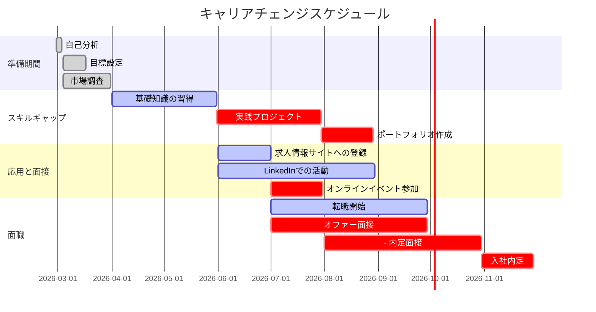

## はじめに

「30代になったら、もうキャリア転職は難しいんじゃないか...」

そう思ったことはありませんか？

でも実は、30代から転職した人の多くが、実際には「40代になってからでも成功しています」

この記事では、なぜ30代からのキャリアチェンジが成功するのか、具体的なステップと事例を紹介します。

---

## なぜ30代からでも転職できるのか

### 30代と40代の違い

```mermaid
graph TD
    subgraph 年代別の優先順位
    A[30代<br>転職スイート]
    B[35代<br>中間管理職]
    C[40代<br>管理職]
    D[45代以降<br>役員職]

    A --> B
    B --> C
    C --> D

    style A fill:#1e293b,stroke:#facc15,color:#fff
    style B fill:#2dd4bf,color:#fff
    style C fill:#4ade80,color:#fff
    style D fill:#fb923c,color:#fff
```

**30代の強み**:
- 新しいスキルを吸収する能力が高い
- 社会的なネットワークが残っている（学生時代の人間関係）
- 生活環境の大きな変化を柔軟に受け入れられる
- 次張な目標がある

### 40代の強み**:
- 実務経験と専門性が生きる
- 業務知識がある
- リーダーシップ経験がある
- 人間管理スキルがある

> 30代と40代、どちらも強みがあります。自分の強みを活かします。

---

## キャリアチェンジの3つのフェーズ

### Phase 1: 自己分析と目標設定（1ヶ月）

#### 第1週：現状の可視化

自分の現状を客観的に分析します。

| 項域 | 評価項目 | 具体的な問い |
|------|----------|----------------|
| **仕事内容** | 現前の仕事で、何を担当していましたか？ | どのようなスキルを身につけましたか？ |
| **強み** | 自分の強みは何ですか？ | 他人から言われたことは何ですか？ |
| **好きなこと** | 仕事で楽しかったことは？ | 休日の過ごし方？ |
| **苦手なこと** | どのような仕事が苦手でしたか？ | どう対処しましたか？ |
| **人生の優先順位** | 今一番大切にしていることは何？ | キャリア、家庭、健康、金銭、自己成長のどれ？ |

#### 第2週：目標設定

SMART基準で目標を設定します。

- **S** (Specific): 具体的
- **M** (Measurable): 数値で測れる
- **A** (Achievable): 達成可能
- **R** (Relevant): 関連性がある
- **T** (Time-bound): 期限を決める

**例**:
```
S: 30代の3月以内に、Web系エンジニアとしての転職を達成する
M: 年収600万円以上の実現
A: スキル要件を満たしている
R: Webエンジニアとしての求人要件
T: 3ヶ月以内
```

#### 第3〜4週：市場調査

ターゲット業界を調査します。

```mermaid
graph TD
    Research[市場調査]
    Research --> JobSites[求人情報サイト]
    Research --> Networking[人脈ネットワーキング]
    Research -> Industry[業界トレンド]
    Research -> Companies[企業研究]

    style Research fill:#facc15
```

| 調査方法 | 何を調査するか | 目的 |
|------------|----------------|------|
| 求人情報サイト | 各企業の文化・制度・給与 | 応要性の高い企業を特定 |
| LinkedIn | 自分のスキルを活かせる機会 | 軷職者との接点を探る |
| 業界のトレンド | 最新の求人要件を把握 | スキル不足を特定 |
| 企業のウェブサイト | 企業のビジョンを理解 | 面接点を探る |

### Phase 2: スキルギャップとポートフォリオ作成（2〜3ヶ月）

#### 必要なスキルの特定

| カテゴリ | 具体的なスキル | 現前の経験 | 学習方法 |
|----------|------------|----------|----------|
| **技術スキル** | プログラミング | エンジニア2年目 | Udemy・Zenn・Progateで学ぶ |
| **ビジネススキル** | プロジェクト管理 | リーダー3年目 | 書籍・実務で学ぶ |
| **コミュニケーション** | チームビルディング | チームリーダー1年目 | 班内のプロジェクトに参加 |
| **プレゼンテーション** | 企画・提案書作成 | 週1回の全体会議で話す | 社内勉強会に参加 |

#### 学習計画の策定

**週間スケジュール**:
- 平日: 2時間（仕事後の19:00〜21:00）
- 土日: 4時間（10:00〜14:00）

**3ヶ月の学習計画**:

| 期間 | 目標 | 内容 |
|------|------|------|
| **第1ヶ月** | 基礎知識の習得 | プログラミング基礎、ビジネス英会話、リーダーシップ |
| **第2ヶ月** | 実践プロジェクト | 個人開発、個人プロジェクト、OSS活動 |
| **第3ヶ月** | 面接点を探す | 軷職者とのコネクト、情報収集 |

#### ポートフォリオの作成

**必要な項目**:
1. **職務要約書** (Word/PDF)
2. **職務経歴書** (1ページ要約版)
3. **スキルマトリックス** (学んだ技術・ツール一覧)
4. **作品集** (個人プロジェクト、OSS活動のURL)
5. **自己紹介** (200文字程度)

**作成ツール**:
- Microsoft Word: 職務要約書・経歴書
- Notion: スキルマトリックス・自己紹介
- GitHub: 作品集

### Phase 3: 応用と面接（第4〜6ヶ月）

#### 求人情報サイトへの登録

| サイト名 | 特徴 | 登録内容 |
|----------|------|----------|
| **求人情報サイト** | エンジニア系、総合、フリーランス系 | 履歴、スキル、希望職種、希望条件 |
| **LinkedIn** | プロフェッショナルSNS | プロフィール、スキル、実務経歴、出版物 |
| **Wantedly** | 海外求人サイト | 英語ポートフォリオも活用可 |
| **転職エージェント** | 特化イベントの参加 | オフラインイベントでコネクションを作る |

#### 面接点の最大化

**方法1: 弱みのある人に連絡する**
- 元同僚・友人・知人の紹介を求める
- 1人で3〜5人の紹介を目指す
- 「紹介依頼」メールテンプレートを用意

**方法2: 情報サイトでメッセージを送る**
- 直接、面識者の人にDMを送る
- メッセージの文面に、自己紹介と興味を明記する

**方法3: オンラインイベント参加**
- 軷職エージェントに参加する
- 研者と話す機会を作る
- ビジネスカードを用意して名刺りを残す

### Phase 4: 面職（第6〜12ヶ月）

#### 転職のタイミング



#### 面職時の心構え

**マインド1: 「最悪の結果でも、ベストをとった」**
- 面職が失敗しても、経験にはなる
- 次張り続ける姿勢を見せて、印象を残す

**マインド2: 「自分の価値を伝える」**
- 転職者は「即戦力」を求めている
- 30代ならでは「ポテンシャルと成長性」が評価される

**マインド3: 「ターゲット企業ではなく、成長企業を探す」**
- 大手よりも、中規模〜ベンチャーで成長している会社を探す
- 職場の文化と自分の価値観が合うか確認する

---

## 成功者からの5つのアドバイス

### 1. 「スキルの掛け算で勝つ」

「エンジニアとして生きていきたら、技術選定は間違いない。」

成功した人は言います。
> 複しく、1つの技術を深掘るか、広く浅くカバーするか。どちらでも、自分の強みを活かします。

### 2. 「人間関係を大切にする」

「スキル以上に、信頼関係があれば、採用されます」

知っている人からの紹介は、応募職種であれば優先されます。

> 信頼関係は、転職成功の最短ルートです。

### 3. 「自分をブランディングする」

「自分の強みを明確に伝える」

成功した人は、自分の強みを理解し、それを明確に伝えています。

> 自分の強みを理解して、ターゲットに合うかどうかを最初に考えてください。

### 4. 「準備は8割、実行は2割」

「情報収集とポートフォリオ作成に時間を割く」

成功した人は、徹底的に準備しています。

> 準備に8割、面接と面接は2割です。準備不足で失敗する人が多いです。

### 5. 「失敗から学び続ける」

「全員が採用されるわけではありません。」

成功した人は、失敗から学び、次につなげています。

> 失敗から学んで、次の面接に活かします。

---

## よよくある8つの失敗パターン

### パターン1: 軺職後の早すぎる

転職してすぐ、元の会社に後悔する。

> 準備不足で飛び込む人が多いです。1ヶ月は最低、3ヶ月様子を見る決めてください。

### パターン2: スキル不足に気づかない

「新しいことにチャレンジ！」と飛び込むが、結局、通用するスキルがない。

> スキル不足は、転職後すぐに露呈します。事前にスキルギャップに投資しましょう。

### パターン3: ターゲット企業に固執する

「大手の方が安定」と思って応募するが、中規模〜ベンチャーの方が合う場合が多い。

> ターゲット企業と中規模〜ベンチャー、どちらが自分に合っているか客観的に考えてください。

### パターン4: 面接点が弱い

人間関係が弱く、紹介を頼めない人が失敗します。

> 人間関係は、転職成功の鍵です。紹介依頼は恥ずらず頼みましょう。

### パターン5: 自己評価が過大か過小

自分の強みを過大評価していると、適切なポジションに応募して失敗します。

> 客観的に自己評価を行い、他人からのフィードバックも取り入れてください。

### パターン6: 給柄や価値観の不一致

入社後の文化と自分の価値観が合わないと、早期に退職します。

> 入社前に文化調査を十分に行い、自分に合う企業を選んでください。

### パターン7: 給味が悪い

面接や入社後の雰囲気で失敗します。

> 最初の面接で「この会社に入りたい」と思わせているか確認してください。お互いにフィットするか、ミスマッチングが必要か客観的に考えてください。

### パターン8: 再挑戦が遅い

一度失敗してから、再挑戦するまで長期間空く人がいます。

> 失敗したら、3ヶ月以内に再挑戦してください。学び続けることが重要です。

---

## 必要チェックリスト

### 面職前の確認

- [ ] 30代でも活かせるスキルはあるか？
- [ ] ポートフォリオ（自己紹介、職務経歴、スキルマトリックス、作品集）は完成したか？
- [ ] 求人情報サイトへの登録はしたか？
- [ ] LinkedInのプロフィールは更新したか？

### 面職時の準備

- [ ] 自己紹介の練り上げ（60秒、200文字）
- [ ] 職務経歴の要約（2分）
- [ ] 企業ごとの面接で聞く質問の準備
- [ ] 自分の強みを明確に伝える練り上げ

### 面職後の対策

- [ ] 入社1ヶ月様子を見るポイントを決める
- [ ] 定期的な自己評価のスケジュールを設定する
- [ ] メンターとの面接を活かす
- [ ] 失敗したら3ヶ月以内に再挑戦する

---

## まとめ

30代からのキャリアチェンジは、一見すると大変化に見えます。

でも、自分の強みを活かし、客観的に戦略を立てれば、40代になってからでも成功可能です。

**まずは、自分の強みを明確にする。そして、それを必要としている人に伝える。**

これが、転職成功の最短ルートです。

---

## 軓職を考えている方は、セッションで話しませんか？

コーチングを受けて、キャリア戦略を一緒に考えましょう。

[30代からのキャリアチェンジ完全ガイド](/blog/30s-career-change-guide) | [キャリア戦略](/blog/category/キャリア) | [コーチング](/session)

---

## 💬 一歩踏み出したいあなたへ

この記事のテーマについて、もっと深く揘り下げたいと思いませんか？

**体験セッション（無料）**では、あなたの状況に合わせた具体的なアドバイスをお伝えします。

[→ 体験セッションの詳細を見る](/sessions)

