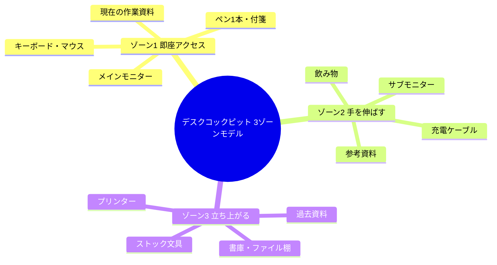
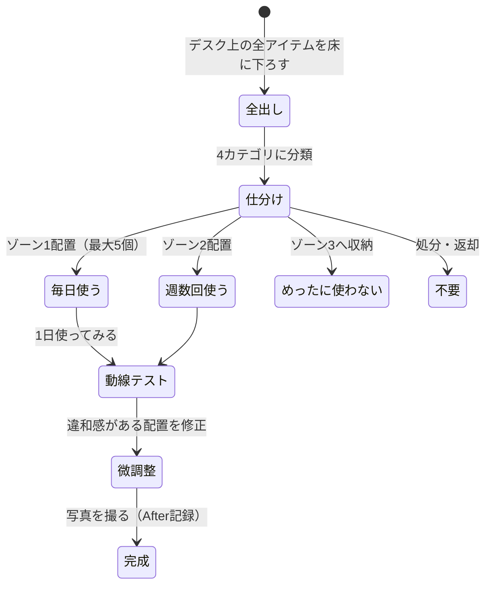

「あれ、さっきの資料どこ置いたっけ……」——デスクの書類の山をかき分けながら、木村翔太（31歳・プロジェクトマネージャー）は今日だけで4回目の「探し物タイム」に突入していた。ペン、付箋、USBケーブル、先週の会議資料。必要なものが必要なときに見つからない。イライラしながらようやく資料を発見したとき、ふと隣の席を見た。同期の高田は、デスクの上にモニターとキーボードだけ。必要なものを一瞬で取り出し、涼しい顔で作業している。「何でそんなに速いの？」と聞いた木村に、高田はこう答えた。「パイロットのコックピットと同じ。必要なものが、必要な場所に、必要な順番で並んでるだけだよ」

## 「片付け」ではなく「設計」——コックピット思考とは

デスク整理の話をすると、多くの人は「きれいに片付ける」ことを想像します。しかしコックピット化は「片付け」ではありません。**戦闘機のコックピットのように、すべての配置に合理的な理由がある環境を設計する**ことです。

パイロットのコックピットには、以下の原則があります。

- **頻度順配置**：最も使う計器は最も手が届きやすい場所に
- **文脈順配置**：作業の流れに沿って左から右（または上から下）に配置
- **緊急時アクセス**：非常用スイッチは迷わず触れる位置に
- **視覚的ノイズの排除**：不要な情報は視界に入れない

これをデスクワークに応用するのがコックピット化です。目的は「きれいなデスク」ではなく「速いデスク」——**必要な行動を最短距離で実行できる環境**を作ることです。

## コックピット化の設計思想：3ゾーンモデル

デスク周りを3つのゾーンに分割し、使用頻度と重要度に応じて物を配置します。

### ゾーン1（即座アクセス圏）：手を動かさずに届く範囲

ここには**現在の作業に直接使うものだけ**を置きます。

- キーボード、マウス（メインツール）
- 今日使う資料（1-2枚まで）
- ペン1本、付箋1束
- 水やコーヒー（ただし倒れない位置に）

**鉄則：ゾーン1に置けるのは最大5アイテム。** これを超えたら、何かをゾーン2に移動させます。

### ゾーン2（アームリーチ圏）：手を伸ばせば届く範囲

ここには**今日使う可能性があるもの**を置きます。

- サブモニター
- 参考書類、技術書
- 充電ケーブル、イヤホン
- よく使う文房具（ペンスタンド等）

### ゾーン3（スタンドアップ圏）：立ち上がって取りに行く範囲

ここには**今日使わないかもしれないもの**を収納します。

- ファイルキャビネット
- 過去の資料
- ストック文具
- 季節物・あまり使わない機器

## ケーススタディ1：探し物で1日30分失っていた木村翔太の場合

冒頭の木村翔太さんは、同期の高田に触発されて自分のデスクを分析しました。

### Before：デスクの現状分析

木村さんが1週間記録した「探し物ログ」の結果です。

| 探し物 | 1日の平均回数 | 1回あたりの時間 | 1日の合計ロス |
|--------|-------------|---------------|-------------|
| ペン・マーカー | 3回 | 45秒 | 2分15秒 |
| 資料・書類 | 5回 | 2分30秒 | 12分30秒 |
| USBケーブル | 2回 | 1分 | 2分 |
| 名刺・連絡先 | 1回 | 3分 | 3分 |
| その他（付箋、ハサミ等） | 4回 | 1分30秒 | 6分 |

**1日の合計ロス：約26分。月換算で約9時間。年換算で約108時間（13.5営業日分）。**

「まる2週間以上、年間で"探し物"してたってことですよ。ゾッとしました」と木村さん。

### 実行したコックピット化の手順

**Day 1：全出し（30分）**

デスクの上のものを全て床に下ろしました。引き出しの中身も全部出す。木村さんのデスクから出てきたのは147アイテム。

**Day 1：仕分け（45分）**

4つのカテゴリに分類しました。
- 毎日使う（12アイテム）→ ゾーン1・2に配置
- 週に数回使う（23アイテム）→ ゾーン2・3に配置
- めったに使わない（45アイテム）→ 別の収納場所へ
- 不要（67アイテム）→ 処分・返却

「147個のうち67個が不要。半分近くがゴミだったんです」

**Day 2：最適配置（1時間）**

3ゾーンモデルに従って配置を設計しました。木村さんが特にこだわったのは「作業の流れに沿った配置」です。

**左側：** インプット系（受信トレイ、参考資料）
**正面：** メイン作業（モニター、キーボード）
**右側：** アウトプット系（送信トレイ、完了ファイル）

情報が左から入って、正面で処理し、右に流れていく。この「川の流れ」の配置が、作業の自然な動線を作ります。

### After：3ヶ月後の変化

| 指標 | Before | After | 改善率 |
|------|--------|-------|--------|
| 1日の探し物時間 | 26分 | 2分以下 | -92% |
| タスク完了数 | 平均8件/日 | 平均12件/日 | +50% |
| 退勤時刻 | 19:30平均 | 18:15平均 | 1時間15分短縮 |
| ストレスレベル（自己評価） | 7/10 | 3/10 | -57% |

「デスクがきれいになったのは副産物。本当の変化は"探さなくていい安心感"です。脳のリソースが丸ごと作業に使える感じ」

## ケーススタディ2：デュアルモニターを活かしきれていなかった遠藤真理の場合

遠藤真理（27歳・UIデザイナー）は、会社からデュアルモニターを支給されていましたが、「なんとなく広い画面」としてしか使えていませんでした。

「両方の画面にウィンドウが散らばっていて、結局あちこちクリックして探してる。1画面のときと変わらない気がする」

### モニター配置の最適化

遠藤さんが実践した「画面コックピット化」のルールです。

**メインモニター（正面）：作業画面のみ**
- デザインツール（Figma）をフルスクリーンで表示
- 他のウィンドウは一切置かない
- タスクバーも自動非表示に設定

**サブモニター（30度右）：参照画面のみ**
- 上半分：参照資料（仕様書、デザインガイドライン）
- 下半分：コミュニケーション（Slack、メール）

**鉄則：メインモニターで「作る」、サブモニターで「見る」。この境界を絶対に崩さない。**

### デジタル環境のコックピット化

物理的なデスクだけでなく、PC画面内もコックピット化しました。

**デスクトップ：**
- アイコンはゼロ（全てランチャーから起動）
- 壁紙は単色のダークグレー
- ダウンロードフォルダは毎日空にする自動スクリプト

**ブラウザ：**
- タブは常に5個以内（それ以上はブックマークへ）
- タブグループで「作業用」「参照用」「個人用」を分離
- 新しいタブページはブランクに設定

「デジタル環境のノイズを減らしたら、[ディープワーク](/blog/deep-work)の時間が倍になりました。画面の中も"コックピット"なんです」

### 結果：デザイン作業の質と速度の変化

- デザイン1画面の制作時間：平均45分 → 28分（-38%）
- 修正回数（レビュー指摘数）：平均6回 → 2回（-67%）
- 1日のデザインアウトプット数：3-4画面 → 6-7画面（+80%）

「環境を変えただけでデザインの質が上がった理由は、"迷い"がなくなったから。どこに何があるか考えなくていいと、純粋にデザインだけに脳を使える」

## ケーススタディ3：在宅勤務のリビング兼用デスクを改善した中島圭介の場合

中島圭介（38歳・営業職）は、在宅勤務をリビングのダイニングテーブルで行っていました。

「子どものオモチャ、妻の書類、自分の仕事道具。全部ごちゃ混ぜ。会議中にカメラに映るのも恥ずかしいし、集中なんてできない」

在宅勤務者にとって、専用のオフィスがないのは珍しくありません。中島さんが実践したのは「可搬式コックピット」です。

### 可搬式コックピットの設計

**コンセプト：10分で展開、5分で撤収できる仕事環境**

用意したもの：
- デスクオーガナイザー（A4サイズ、仕切り付き）：仕事道具一式を収納
- ノートPCスタンド（折りたたみ式）
- ワイヤレスキーボード＆マウス（専用ポーチに収納）
- デスクマット（60x40cm）：これを広げたエリアが「コックピット」

**運用ルール：**
- 朝9時：デスクマットを広げ、オーガナイザーからツールを展開（10分）
- 18時：全てをオーガナイザーに収納、デスクマットを丸めて終了（5分）
- デスクマットの上以外には仕事道具を置かない
- 撤収後、ダイニングテーブルは完全に「家族の空間」に戻す

### 結果：仕事と家庭の境界線

| 指標 | Before | After |
|------|--------|-------|
| 仕事開始までの準備時間 | 25分（探し物含む） | 10分 |
| オンライン会議での背景問題 | 月3回以上 | ゼロ |
| 家族からのクレーム | 週2-3回 | ほぼゼロ |
| 集中作業時間 | 1日2時間 | 1日4時間 |

「デスクマットが"コックピットのスイッチ"なんです。広げると仕事モード、片付けるとオフモード。この切り替えが本当に効果的で」

中島さんの例は、[朝のルーティン](/blog/morning-routine)の設計にも応用できます。環境のスイッチを作ることで、脳が自動的にモードを切り替えるトリガーになるのです。

## 実践ガイド：あなたのデスクをコックピット化する

### Step 1：デスク監査を行う（今日・20分）

まず現状を可視化します。

**やること：**
1. デスクの写真を撮る（Before記録）
2. デスク上のアイテム数を数える
3. 「今日使ったもの」にチェックを入れる
4. チェックがないものを別の場所に一時退避

この「一時退避」がポイントです。1週間経っても取りに行かなかったものは、ゾーン3以下に降格（または処分）します。

### Step 2：3ゾーンを設計する（明日・30分）

仕分けの際は「迷ったらゾーン3」がルールです。本当に必要なら自然と取りに行くし、取りに行かないなら不要だったということです。

### Step 3：ケーブルとデジタル環境を整理する（今週末・1時間）

物理デスクが完成したら、次はデジタル環境です。

**ケーブル管理：**
- ケーブルクリップでデスク裏に固定
- 使わないケーブルは引き出しへ
- ワイヤレス化できるものは切り替え

**PC画面の整理：**
- デスクトップアイコンは10個以下
- ブラウザタブは5個以下をキープ
- [やらないことリスト](/blog/not-to-do-list)に「タブを10個以上開く」を追加

### Step 4：維持の仕組みを作る

コックピット化の最大の敵は「リバウンド」です。以下の習慣で維持します。

**毎日（2分）：終業時の「着陸前チェック」**
- ゾーン1のアイテム数を確認（5個以内か？）
- 今日使わなかったものをゾーン2以下に移動
- デスクを一拭き

**毎週金曜（10分）：「週次メンテナンス」**
- ゾーン2の見直し（本当に必要か？）
- 溜まった書類の処理
- 来週の作業に合わせた配置調整

**毎月1日（30分）：「大掃除フライト」**
- 全ゾーンの見直し
- 不要アイテムの一斉処分
- Before/After写真の比較
- 配置改善のアイデア検討

## コックピット化の科学的根拠

デスク環境が生産性に与える影響は、複数の研究で実証されています。

**プリンストン大学神経科学研究所の実験（2011年）：** 視界内の物が多いほど、脳の注意リソースが分散し、タスクパフォーマンスが低下する。つまり**散らかったデスクは、通知と同じくらい集中力を奪う**。

**ハーバードビジネスレビューの調査（2019年）：** オフィスワーカーは1日平均25分を「探し物」に費やしている。年間で約100時間、12営業日以上に相当する。

**環境心理学の研究：** 作業環境の「コントロール感」が高い人ほど、ストレスが低く、パフォーマンスが高い。コックピット化は、まさにこのコントロール感を最大化する行為です。

[決断疲れ](/blog/decision-fatigue)の研究とも関連しますが、「どこに何があるか」を毎回判断するのは、小さいながらも確実に意思決定リソースを消費します。配置を固定化すれば、その判断が不要になり、その分のリソースを本来の作業に使えます。

## よくある質問

### 「自分は散らかっている方が落ち着くタイプなんですが」

それは「散らかっている環境に慣れている」だけかもしれません。木村さんも最初は「物が少ないと不安」と感じましたが、2週間で慣れ、3週間目には「元に戻したくない」と感じるようになりました。まずは1週間試してみて、本当に生産性が変わらないか検証してみてください。

### 「共用デスクなので好きにレイアウトできません」

中島さんの「可搬式コックピット」方式が有効です。デスクマット1枚とオーガナイザー1つあれば、どんな環境でも自分のコックピットを展開できます。

### 「整理に時間をかけるのがもったいない」

初期セットアップに2-3時間、毎日の維持に2分です。一方、散らかったデスクで年間100時間以上を探し物に費やしています。投資対効果は明らかです。

---

## あなたのデスクを「最速の作業環境」に変えませんか？

デスクのコックピット化は、一人ひとりの仕事内容・作業スタイル・物理的制約によって最適解が異なります。体験セッションでは、あなたの作業内容をヒアリングした上で、**あなた専用の3ゾーン設計図**を一緒に作成します。「何を残して何を捨てるか」の判断に迷っている方も、お気軽にご相談ください。

[あなた専用のデスク設計図を作る（体験セッション）](/sessions)
