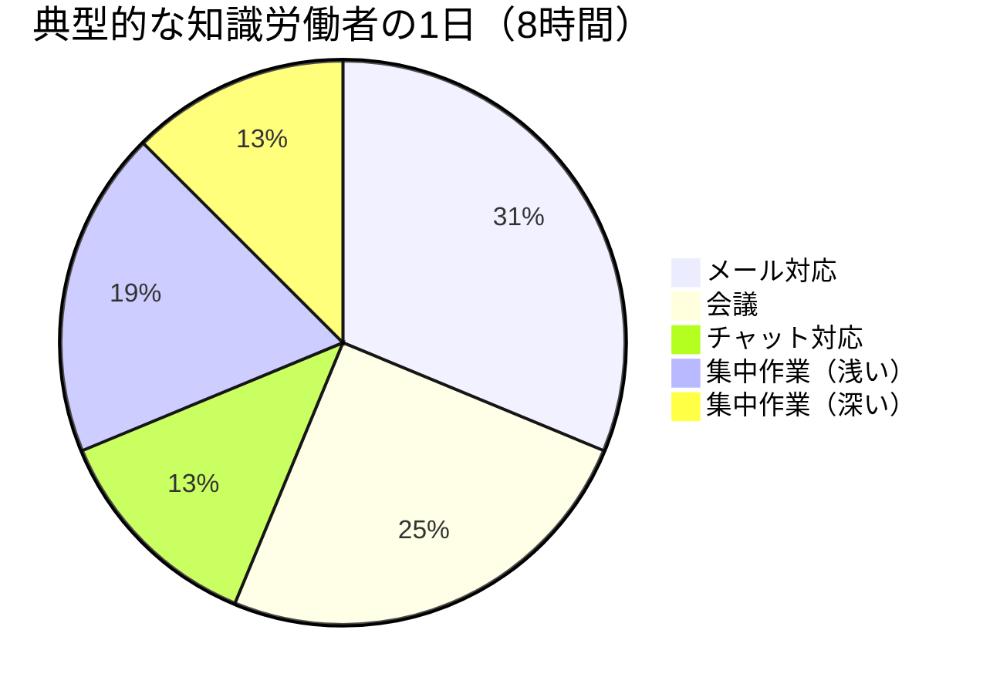
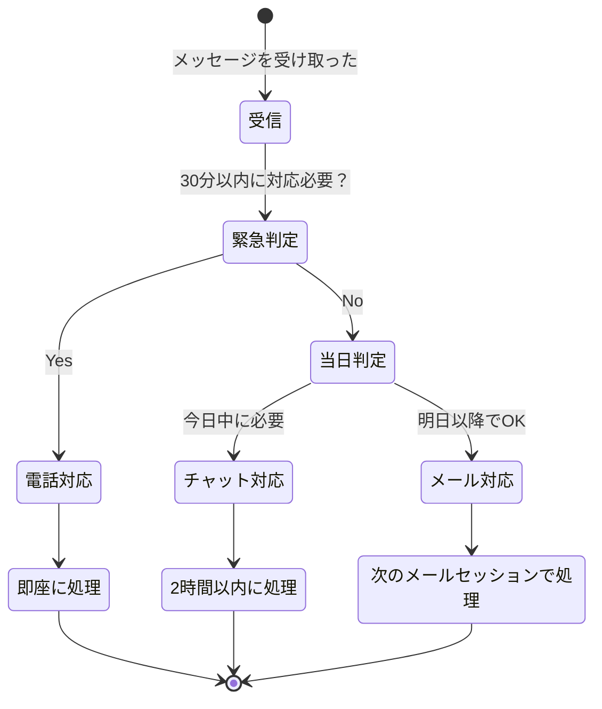

午前9時8分。出社してPCを開いた瞬間、受信トレイに32件の未読メール。片っ端から処理を始めた藤井優花（33歳・人事マネージャー）は、気づけば11時を回っていた。「あれ、今日の午前中って何する予定だったっけ」——カレンダーを見ると、10時からの2時間ブロックには「採用計画の見直し」と書いてある。最重要タスクに1秒も着手できないまま、午前中が終わろうとしていた。しかもメールの返信中にも新着が届き続け、32件のうち「今日対応が必要」だったのは、後で数えたらたった4件だった。

## 受信トレイは「他人のToDoリスト」である

メールの本質は、**あなた以外の誰かが、あなたに仕事を送りつけてくる仕組み**です。

これは悪意ではありません。しかし構造的に、メールは「他人の優先順位」で動くツールです。あなたが今日最も重要だと思っている仕事と、受信トレイに並んでいる依頼の優先順位は、ほぼ一致しません。

にもかかわらず、多くの人がメーラーを開きっぱなしにしています。これは「他人のToDoリスト」を常時監視しているのと同じです。自分の重要な仕事より、他人から届いた依頼を優先し続ける——この無自覚な習慣が、1日の生産性を半分以下に押し下げています。

**深い集中作業に使えているのは、1日わずか1時間。** 残りの7時間は、反応的な作業（メール、会議、チャット）と浅い作業に消えています。メールチェックの回数を制限するだけで、この構造を大きく変えることができます。

## 「1日3回」ルールのフレームワーク

メールチェックを1日3回に制限する方法は、単に「見ない」のではありません。**見る時間を固定し、その時間内で集中処理する**アプローチです。

```mermaid
gantt
    title 1日3回メールチェックのタイムライン
    dateFormat HH:mm
    axisFormat %H:%M

    section 朝の集中ブロック
    最重要タスク :active, 09:00, 60min

    section メールセッション1
    チェック＆即対応 :crit, 10:00, 15min
    予定化＆整理 :crit, 10:15, 15min

    section 午前の集中ブロック
    重要タスク2 :active, 10:30, 90min

    section 昼休み
    休憩 : 12:00, 60min

    section メールセッション2
    チェック＆即対応 :crit, 13:00, 15min
    予定化＆整理 :crit, 13:15, 15min

    section 午後の集中ブロック
    重要タスク3 :active, 13:30, 120min

    section メールセッション3
    チェック＆即対応 :crit, 17:00, 15min
    翌日分の整理 :crit, 17:15, 15min

    section 終業
    日次レビュー : 17:30, 30min
```

### 3回のメールセッションの設計

**セッション1：朝（10:00-10:30）**
- 朝一番にメールを見ない。最初の1時間は最重要タスクに集中
- 10:00から30分でまとめてチェック
- 2分以内で返せるものは即返信
- それ以上のものはToDoリストに「メール対応」タスクとして追加

**セッション2：昼（13:00-13:30）**
- 午前中に届いた緊急案件を処理
- 午後のスケジュールに影響する案件を確認
- 翌日以降の対応で良いものはフラグを立てて閉じる

**セッション3：夕方（17:00-17:30）**
- 当日対応が必要なものを全て処理
- 翌日の「メール対応」タスクを事前に把握
- 24時間以内のルールを守って返信

**鉄則：セッション以外の時間は、メーラーを完全に閉じる。** ブラウザのメールタブも閉じる。通知もオフ。「チラ見」は厳禁です。

## ケーススタディ1：メール中毒の人事マネージャー藤井優花の場合

冒頭の藤井優花さんは、まず自分のメール行動を3日間記録しました。

### Before：メール行動の実態

| 項目 | 数値 |
|------|------|
| 1日のメールチェック回数 | 23回 |
| 1日のメール対応時間 | 3時間15分 |
| メール間の最短間隔 | 8分 |
| 深い集中作業の最長時間 | 22分 |
| 「今日対応必須」だったメール | 全体の12% |

「23回も見ていたなんて自分でも信じられなかった。しかも9割近くが"今日じゃなくても良い"メールだった」

### 導入プロセス

藤井さんは段階的に回数を減らしました。

**Week 1：15回→10回**
- メーラーを閉じる時間を意識的に作る
- 通知は全てオフに設定
- チェック回数を手帳に正の字で記録

**Week 2：10回→5回**
- チェックする時間を大まかに固定（朝・昼前・昼後・夕方・終業）
- メーラーを閉じている時間に[ポモドーロ・テクニック](/blog/pomodoro-technique)を導入

**Week 3-4：5回→3回**
- 10:00・13:00・17:00の3セッションに完全固定
- 同僚と上司に「メール対応時間」を共有

### 最大の障壁：「返信が遅い人」と思われる恐怖

藤井さんが最も苦労したのは、「返信が遅いと思われるんじゃないか」という不安でした。

「人事部って、社内の色んな部署から相談が来るんです。"メール見てないの？"と思われたら信頼に関わると」

しかし実際に3回制を始めてみると、**苦情はゼロ**でした。理由は2つ。

1. **24時間以内に必ず返信するルール**を徹底した
2. **本当に急ぎの用件は、相手が電話やチャットで連絡してくる**

「"即レス=仕事ができる"は思い込みでした。むしろ3回制にしてからの方が、返信の質が上がったと言われるようになりました。焦って的外れな返信をしなくなったから」

### After：4週間後の変化

| 項目 | Before | After | 変化 |
|------|--------|-------|------|
| メールチェック回数 | 23回/日 | 3回/日 | -87% |
| メール対応時間 | 3時間15分 | 1時間30分 | -54% |
| 深い集中作業時間 | 22分（最長） | 90分以上 | +309% |
| 採用計画の進捗 | 2週間遅延中 | 予定通り完了 | 大幅改善 |
| 退勤時の疲労感 | 8/10 | 4/10 | -50% |

「取り戻した1時間45分で、ずっと後回しにしていた採用計画をようやく進められた。メールを処理している"忙しさ"は、成果につながる忙しさじゃなかったんです」

## ケーススタディ2：クライアント対応で即レス必須だった営業の渡辺健一の場合

渡辺健一（36歳・法人営業）は、「営業はスピードが命。メールの返信速度が商談を左右する」と信じていました。

「1日3回？　営業でそれやったら、顧客逃しますよ」——最初の反応はこうでした。

### きっかけ：数字が突きつけた現実

上司からのフィードバックで、渡辺さんのある数字が浮き彫りになりました。

- 1日のメール返信数：47件（チーム最多）
- 月間の新規商談数：3件（チーム最少）
- 提案書の作成ペース：月2本（チーム最少）

「メール返信が一番多いのに、成果が一番少ない」——この事実に渡辺さんは衝撃を受けました。

「即レスに時間を取られて、提案書を書く時間がなかった。既存顧客の細かい問い合わせに追われて、新規開拓ができていなかった」

### 導入したルール

渡辺さんが設計したメール運用ルールです。

**クライアント対応のルール：**
- 重要クライアント（上位10社）からのメール → チャットで通知が来る設定（即対応OK）
- それ以外のクライアント → 3回制のセッションで対応
- 問い合わせへの返信 → テンプレートを20種類用意して時短

**社内メールのルール：**
- 3回制を厳守
- [やらないことリスト](/blog/not-to-do-list)に「CCだけのメールを即読みする」を追加
- 「1行で返せるもの」と「検討が必要なもの」を即座に仕分け

### 結果：メール削減が売上を伸ばした

| 指標 | Before | After（3ヶ月後） |
|------|--------|-----------------|
| メール返信数 | 47件/日 | 22件/日（-53%） |
| 新規商談数 | 3件/月 | 8件/月（+167%） |
| 提案書作成数 | 2本/月 | 5本/月（+150%） |
| 月間売上 | 850万円 | 1,340万円（+58%） |
| 顧客満足度（NPS） | 32 | 38（+6pt） |

「驚いたのは、メールの返信を半分に減らしたのに、顧客満足度が上がったことです。理由を聞いたら"返信は遅くなったけど、提案の質が上がった"と。即レスの浅い返信より、少し待ってでも深い回答の方が価値があったんです」

## ケーススタディ3：「メール対応時間」をチーム全体に導入した部長・川島徹の場合

川島徹（45歳・開発部長・部下25名）は、部署全体の残業時間削減を求められていました。原因を分析したところ、**メール対応が部署全体の作業時間の28%を占めている**ことが判明しました。

「開発の部署なのに、コードを書く時間よりメールを書く時間の方が多いメンバーがいた。これは構造的な問題だと思いました」

### チーム全体への導入設計

川島さんが導入したのは、「コミュニケーションレイヤー設計」です。

**レイヤー1：即時対応（電話・対面）**
- 本当の緊急事態のみ
- 判断基準：「30分以内に対応しないとビジネスに損害が出るか？」

**レイヤー2：2時間以内対応（チャット）**
- 確認事項、軽い質問、スケジュール調整
- 判断基準：「今日中に回答が必要か？」

**レイヤー3：24時間以内対応（メール）**
- 報告、提案、ドキュメント共有
- 判断基準：「考えてから返した方が良い内容か？」

### チームへの浸透方法

川島さんはいきなり全員に強制するのではなく、段階的に広めました。

**Phase 1（2週間）：パイロットチーム3名で試行**
- 効果と課題を記録
- 他チームへの影響を確認

**Phase 2（2週間）：希望者5名を追加**
- パイロットメンバーが「布教」
- 成功体験を共有会で発表

**Phase 3（1ヶ月）：部署全体に展開**
- レイヤー設計を公式ルールに
- 「メール対応時間」をカレンダーに全員がブロック

### 結果：部署全体のパフォーマンス変化

| 指標 | Before | After（3ヶ月後） |
|------|--------|-----------------|
| 部署平均残業時間 | 38時間/月 | 22時間/月（-42%） |
| プロジェクト納期遵守率 | 67% | 89%（+22pt） |
| メンバー満足度 | 3.1/5.0 | 4.3/5.0（+1.2pt） |
| 部門間コミュニケーション不満 | 月12件 | 月3件（-75%） |

「意外だったのは、コミュニケーション不満が減ったことです。メールの回数は減ったのに、1通あたりの情報量と質が上がった。"何度もやり取りする"より"1回で完結する"メールが増えたんです」

## 実践ガイド：1日3回ルールを導入する

### Phase 1：現状を記録する（今日から3日間）

まずは自分のメール行動を客観視します。

**記録する項目：**
- メールを開いた時刻（全て）
- 1回あたりの滞在時間
- 対応したメールの件数
- 「今日対応が必須だった」メールにマーク

3日間の記録が完了したら、以下を計算してください。
- 1日平均のチェック回数
- 1日のメール対応合計時間
- 「今日対応必須」メールの割合

この数字が、あなたの「改善余地」の大きさを示しています。

### Phase 2：環境を遮断する（4日目）

記録が終わったら、メールを見ない環境を作ります。

**スマホ：** メール通知を完全オフ。メールアプリをホーム画面から削除。

**PC：** メーラーの自動起動をオフ。ブラウザのメールタブを閉じる。デスクトップ通知をオフ。

### Phase 3：3セッション制を開始する（2週目〜）

10:00、13:00、17:00の3回に固定します。

**各セッションの進め方（30分）：**

| 時間 | やること |
|------|---------|
| 0-5分 | 新着の一覧確認、重要度の判別 |
| 5-15分 | 2分以内で返せるものを即処理 |
| 15-25分 | 対応が必要なものをToDoに追加 |
| 25-30分 | 処理済みをアーカイブ、受信トレイを空にする |

**受信トレイゼロの原則：** セッション終了時、受信トレイには何も残さない。全てのメールが「返信済み」「ToDoに追加」「アーカイブ」のいずれかに処理されている状態を目指します。

### Phase 4：周囲に共有する（3週目〜）

[フィードバック・マインドセット](/blog/feedback-mindset)の観点からも、周囲との期待値のすり合わせは重要です。

**共有テンプレート：**

> メール対応を10:00 / 13:00 / 17:00の3回に集中させています。
> 緊急のご用件は電話またはチャットでお知らせください。
> メールは必ず24時間以内に返信いたします。

署名欄に入れておくと、自然と浸透します。

## よくある質問と対処法

### 「上司がメールの即レスを求めてくる」

まず上司に直接相談してみてください。「メール対応を集中させて、残りの時間を○○（重要プロジェクト名）に充てたい」と伝えれば、多くの上司は理解してくれます。「即レスしません」ではなく「成果を出すために時間の使い方を変えたい」というフレームで話すのがポイントです。

### 「メール以外の通知（チャット、SNS）も問題です」

メールの3回制が定着したら、チャットにも同じ原則を適用できます。「チャットチェックタイム」を設定し、それ以外は通知オフに。[スマホ通知の完全遮断](/blog/smartphone-notification-block)と組み合わせると効果的です。

### 「1日3回で本当に回るか不安」

藤井さんも渡辺さんも、最初は同じ不安を抱えていました。しかし実際には、24時間以内に返信すれば問題が起きたケースはゼロでした。[インポスター症候群](/blog/imposter-syndrome)と同じく、「できないかもしれない」という不安は実際の危険度よりはるかに大きく感じるものです。まずは1週間だけ試してみてください。

## メール制限がもたらす本質的な変化

メールチェックを1日3回に制限することの本質は、「メールの時間を減らす」ことではありません。**自分の時間の主導権を取り戻す**ことです。

受信トレイを常時監視している状態は、「誰かが何かを送ってくるのを待つ」という受動的な姿勢です。3回制に切り替えると、「自分が決めたタイミングで、自分が選んだ順番で処理する」という能動的な姿勢に変わります。

この変化は、[ファーストプリンシプルズ思考](/blog/first-principles-thinking)にも通じます。「メールはすぐ返すべき」という常識を疑い、「そもそもメールの目的は何か？必要な情報が必要な人に届けばいいのでは？」と根本から考え直すこと。そこから、自分にとって最適な仕組みが見えてきます。

藤井さんは最後にこう語りました。「メールを制限して一番変わったのは、退勤後の時間の過ごし方です。以前は帰ってからもスマホでメールをチェックしていた。今は17:30にメールを閉じたら、その日はもう見ない。夜の時間が、本当の意味で"自分の時間"になりました」

---

## あなたの「メール習慣」を一緒に再設計しませんか？

「1日3回ルールを試したいけれど、自分の仕事でどう設計すればいいかわからない」——そんな方のために、体験セッションをご用意しています。あなたの業務内容・コミュニケーション相手・緊急度の分布を一緒に分析し、**無理なく続けられるメール運用ルール**を設計します。

[あなた専用のメール運用ルールを設計する（体験セッション）](/sessions)
