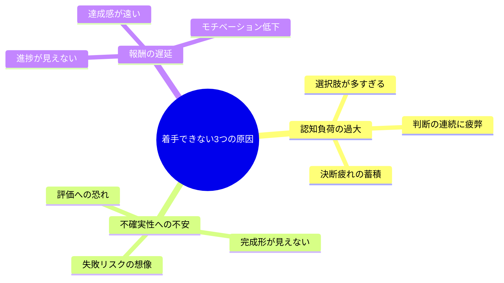
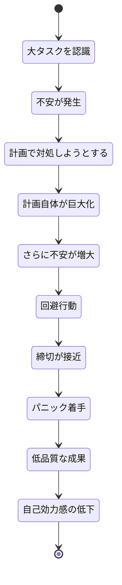

金曜16時、広告代理店の会議室。田村直人（29歳・プランナー）は、月曜締め切りの企画書を前にモニターを睨んでいた。「新規クライアント向け統合マーケティング提案書」──タイトルだけが書かれたPowerPointが、もう3時間開きっぱなしだ。「何から手をつければいいか、まったくわからない」。彼がSlackで先輩に相談したところ、返ってきたのは意外な一言だった。「全部やろうとするな。最初の10分だけ決めろ」。

この記事では、田村のように「大きすぎて動けない」状態を根本から解消する**タスク細分化の技術**を、脳科学の知見とともに体系的に解説します。

## なぜ人は「大きなタスク」の前で止まるのか

### 脳が感じる3つの脅威

大きなタスクを前にしたとき、脳は実際に「脅威」を感じています。これは怠けではなく、認知的な防御反応です。

神経科学の研究によれば、タスクの大きさが認知的な「脅威反応」を引き起こし、前頭前皮質の機能が低下します。つまり、大きなタスクを見るだけで、文字通り「頭が働かなくなる」のです。

### 先延ばしの悪循環

多くの人が陥るパターンは次の通りです。

この悪循環を断つ鍵は、「計画を完璧にすること」ではなく、「最初の一歩を極限まで小さくすること」にあります。

## 細分化フレームワーク：4ステップで動ける状態を作る

### ステップ1：完成形を30秒で描写する

まず「このタスクが完了したとき、何が存在しているか」を30秒で言語化します。完璧な計画ではなく、ゴールの輪郭だけをつかむのがポイントです。

**質問テンプレート：**
- 誰に、何を、どんな形式で渡すのか？
- 相手がそれを見て「OK」と言う最低条件は何か？
- 期限はいつで、どのレベルの完成度が求められているか？

### ステップ2：構成要素を抽出する（WBS方式）

完成形を構成する「パーツ」に分解します。ここで意識するのは「並列で進められるもの」と「順番が必要なもの」の区別です。

```mermaid
gantt
    title 企画書作成のWBS分解例
    dateFormat HH:mm
    axisFormat %H:%M
    section 構造設計
        構成を箇条書き       :a1, 09:00, 20min
        時間配分の決定       :a2, after a1, 10min
    section コンテンツ作成
        市場データ収集       :b1, 09:00, 30min
        顧客課題の整理       :b2, after a2, 20min
        解決策の言語化       :b3, after b2, 30min
    section 仕上げ
        デザイン調整         :c1, after b3, 20min
        最終チェック         :c2, after c1, 15min
```

### ステップ3：10分タスクに砕く

各パーツを「10分で終わる粒度」まで砕きます。この粒度がタスク細分化の核心です。

**10分タスクの条件：**
1. 座ったらすぐに始められる（調べ物や準備が不要）
2. 終わったかどうかが明確にわかる
3. 集中力の波に左右されない

**悪い例と良い例：**
- 悪い例：「市場調査をする」（曖昧・終わりが不明確）
- 良い例：「競合A社の直近IR資料から売上推移を3年分抜き出す」（具体的・完了基準が明確）

### ステップ4：「今すぐの1手」を実行する

細分化が終わったら、最初の10分タスクを**今この瞬間**に実行します。「明日やろう」は細分化の効果を台無しにします。

## ケーススタディ1：田村直人の企画書（広告プランナー・29歳）

冒頭の田村は、先輩のアドバイスを受けて次のように行動を変えました。

**Before：**
「統合マーケティング提案書を作る」という1行のタスクを前に3時間フリーズ。

**After：**
先輩に言われた通り、「最初の10分」だけを決定。

1. 過去の類似案件の企画書を社内サーバーから3つ探す（10分）
2. 3つの企画書の目次構成だけをメモする（10分）
3. 今回の提案の「一番伝えたいこと」を1文で書く（5分）

「最初の10分だけ」と決めた田村は、過去案件を探し始めた。すると、構成のパターンが見えてきて、「あ、これなら書ける」という感覚が生まれた。結果、金曜中にドラフトの7割が完成。「手を動かし始めたら、止まらなくなった」と田村は振り返る。

**定量的な変化：**
- 着手までの時間：3時間 → 2分
- 企画書の品質評価（上司の5段階評価）：3.2 → 4.1
- 月間の先延ばし回数：週平均4.5回 → 1.2回

## ケーススタディ2：佐々木美咲の確定申告（フリーランスデザイナー・34歳）

佐々木美咲は毎年、確定申告を「人生で一番嫌なタスク」と公言していた。領収書の山を前に、毎年3月に入ってからパニックで処理するのが恒例だった。

「去年は結局、申告期限の前日に徹夜して、控除の申請を2つ忘れたんです。金額にして8万円の損失。それで今年こそは変えようと思いました」

佐々木が導入したのは「週10分の細分化ルーティン」だった。

**毎週日曜日の10分タスク：**
- 1月第1週：会計ソフトにログインし、昨年データの引き継ぎを確認する
- 1月第2週：財布と机の上の領収書をスマホで撮影する
- 1月第3週：撮影した領収書を経費カテゴリに分類する
- 1月第4週：銀行口座の入出金明細をダウンロードする

「『確定申告をする』と考えるだけで気が重くなるけど、『領収書を撮影する』なら10分でできる。毎週少しずつ進めたら、2月中旬には全部終わっていました」

**定量的な変化：**
- 確定申告にかかった総時間：前年18時間（徹夜含む） → 今年4時間（分散処理）
- 控除の申請漏れ：2件 → 0件
- ストレスレベル（自己評価10段階）：9 → 3

## ケーススタディ3：中島健太のチーム導入（IT企業マネージャー・41歳）

中島健太は、チーム全体の先延ばし問題に悩んでいた。大型案件のたびに初動が遅れ、後半に残業が集中するパターンが繰り返されていた。

「朝会で『このプロジェクト、今日何やる？』と聞くと、みんな黙るんですよ。やることが大きすぎて、各自が何から手をつけていいかわからない状態でした」

中島が導入したのは「10分タスクカード」方式だった。

**運用ルール：**
1. 毎朝の朝会で、各メンバーが「今日やる10分タスク」を3枚のカードに書く
2. カードをボードに貼り、完了したらひっくり返す
3. 全カード完了したら次の3枚を書く

「最初は『こんな小さいタスクを書くのか？』という反応でした。でも2週間もすると、チームの動きが明らかに変わった。全員が常に『次の一手』を持っている状態になったんです」

**チームの変化（3ヶ月後）：**
- プロジェクト初動の遅延：平均5日 → 平均0.5日
- 月間残業時間：チーム平均38時間 → 19時間
- メンバーの仕事満足度（5段階）：2.8 → 4.2

## 細分化を習慣にする3つのテクニック

### テクニック1：2分ルール

細分化した結果、2分以内で終わるタスクが出てきたら、リストに書かずに即実行します。「リストに書く時間」のほうが長い作業は、その場で片づけるのが最も効率的です。

[先延ばしの心理メカニズム](/blog/procrastination-psychology)を理解すると、この「即実行」の効果がより明確になります。

### テクニック2：タイムボックス

各10分タスクにタイマーをセットして取り組みます。「10分だけ」という制限が、逆に集中力を高めます。[ポモドーロ・テクニック](/blog/pomodoro-technique)と組み合わせると、25分の中で2〜3個の10分タスクを処理できます。

### テクニック3：完了リストの活用

ToDoリストとは別に「Done（完了）リスト」を作り、終わったタスクを記録します。1日の終わりに見返すと、「今日これだけ進んだ」という達成感が翌日の推進力になります。

## 細分化の落とし穴と対策

### 落とし穴1：細分化自体が目的になる

完璧な分解計画を作ることに時間をかけすぎるパターン。計画作成は15分以内に留め、不完全でも実行に移すことが重要です。

### 落とし穴2：全体像を見失う

小さなタスクに集中するあまり、プロジェクトの方向性とずれていくパターン。週に1回は「そもそもこのプロジェクトのゴールは何か」を確認する時間を設けましょう。

### 落とし穴3：粒度のばらつき

「5分で終わるタスク」と「2時間かかるタスク」が混在するパターン。すべてのタスクを10〜30分の粒度に揃えることで、進捗のリズムが安定します。

[決断疲れ](/blog/decision-fatigue)を避けるためにも、「迷ったらとにかく小さく砕く」を原則にしましょう。

## 今日から使える細分化テンプレート

### テンプレート1：文書作成系

| 順番 | 10分タスク | 完了基準 |
|------|-----------|---------|
| 1 | 類似文書を3つ集める | ファイルがデスクトップに並んでいる |
| 2 | 目次を箇条書きする | 5〜8項目のリストがある |
| 3 | 各セクションに1文ずつ要点を書く | 全セクションに1文ずつ入っている |
| 4 | 最も得意なセクションから本文を書く | 1セクション分のドラフトがある |
| 5 | 次のセクションの本文を書く | 2セクション目が完成 |
| 6 | 残りのセクションを仕上げる | 全セクションにドラフトがある |
| 7 | 冒頭と結論を書く | 文書の最初と最後が埋まっている |
| 8 | 全体を通して読み、修正する | 赤入れが完了している |

### テンプレート2：企画・提案系

| 順番 | 10分タスク | 完了基準 |
|------|-----------|---------|
| 1 | 「誰に・何を・なぜ」を1文で書く | 1文が完成している |
| 2 | 競合の事例を3つ調べてメモする | 3社分のメモがある |
| 3 | 顧客の課題を3つリストアップする | 3つの課題が言語化されている |
| 4 | 解決策の方向性を1つ選ぶ | 方向性が1文で書かれている |
| 5 | 数字で根拠を示す（市場規模など） | 2〜3個の数字がメモされている |
| 6 | 実行スケジュールを月単位で書く | ガントチャートの骨子がある |
| 7 | 予算の概算を出す | 概算金額が記載されている |
| 8 | 全体をスライドに落とし込む | スライド枚数分の骨子がある |

## あなたの「動けないタスク」を今日、砕いてみませんか

タスク細分化は、才能やモチベーションに頼らない「技術」です。大きなタスクを前にして固まってしまうのは、あなたの意志力が弱いからではなく、脳の正常な反応です。その反応を理解した上で、「10分で終わる粒度」まで砕けば、誰でも動き出せます。

**今すぐできる3ステップ：**
1. いま先延ばしにしているタスクを1つ思い浮かべる
2. そのタスクの「最初の10分でできること」を1つ書き出す
3. タイマーを10分にセットして、今すぐ始める

---

## あなたの「先延ばしパターン」を一緒に分析しませんか？

「頭ではわかっているのに動けない」──その裏には、タスクの大きさだけでなく、完璧主義や評価への不安など、個人ごとに異なる原因が隠れています。体験セッションでは、あなた固有の「止まるパターン」を特定し、細分化の具体的な実践プランを一緒に設計します。

[あなた専用の細分化プランを作る（体験セッション）](/sessions)
