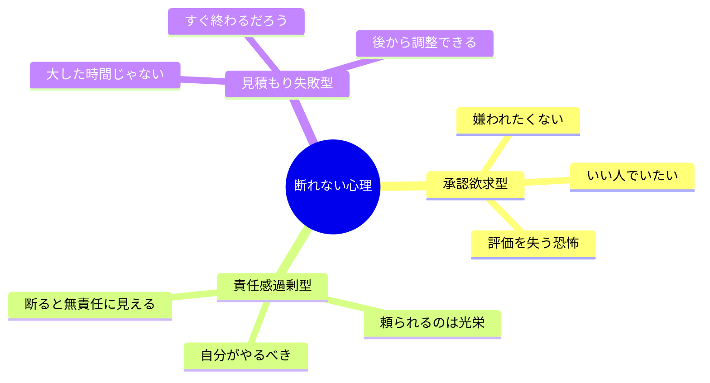
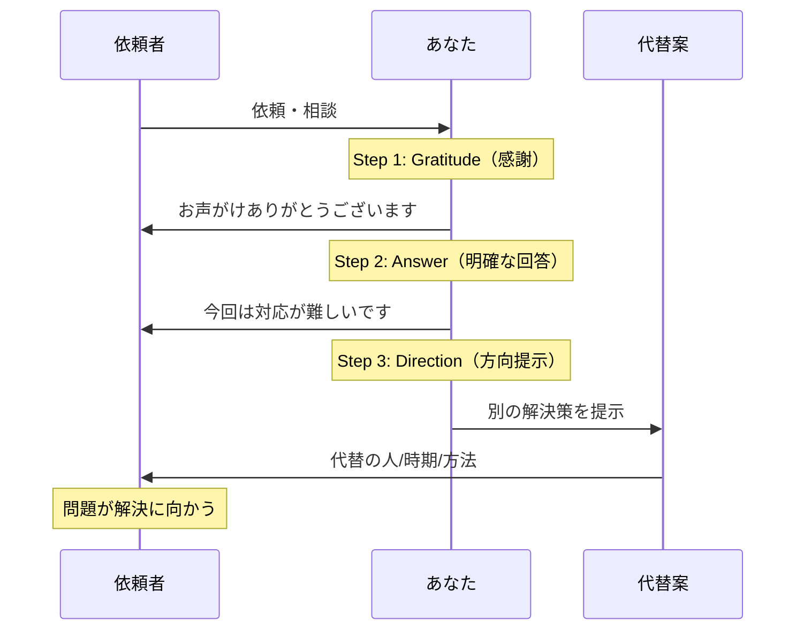
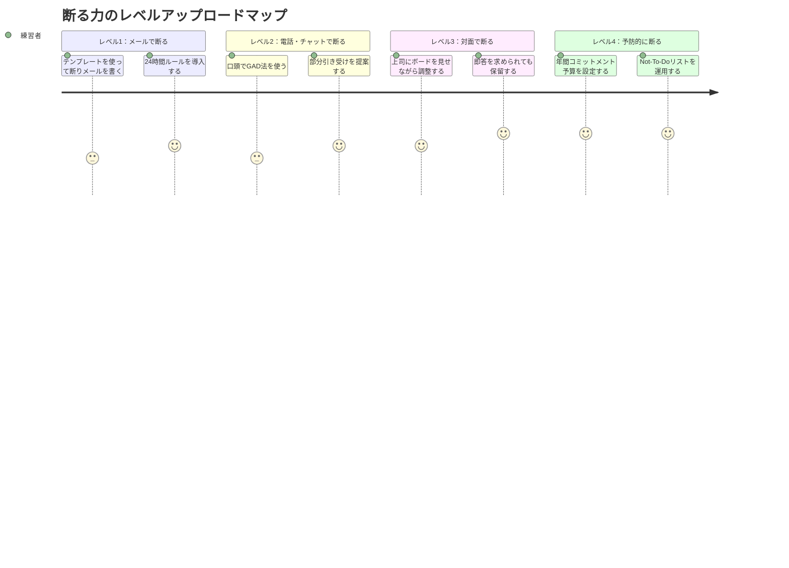

水曜17時、メーカー営業部のオフィス。小林彩香（31歳・営業主任）のデスクには、付箋が7枚貼られていた。すべて「頼まれごと」だ。後輩の提案書レビュー、他部署の展示会手伝い、上司に頼まれた社内勉強会の資料作成──。自分の担当案件の締切は明後日なのに、他人の仕事で1日が終わろうとしている。「また今日も、自分のことが何もできなかった」。帰りの電車で、彩香は目を閉じてため息をついた。

この記事では、彩香のように「頼まれると断れない」人が、関係を壊さずに自分の時間と優先順位を守るための**スマートな断り方の技術**を解説します。

## 「断れない」の正体──なぜノーが言えないのか

### 断れない人の3つの心理パターン

### 断らないことの本当のコスト

「断らない」は一見優しい行為に見えますが、実は大きなコストを払っています。

**見えるコスト：**
- 自分の最優先タスクが遅延する
- 残業時間が増加する
- 引き受けた仕事の品質が低下する

**見えないコスト：**
- 「何でも引き受ける人」というレッテルが固定化する
- 本当に重要な機会に時間を割けなくなる
- 慢性的な疲労で判断力が落ちる
- 「やらされている」感覚で仕事への満足度が下がる

ハーバード・ビジネス・レビューの調査では、「断れない人」は「適切に断れる人」と比較して、仕事の満足度が37%低く、バーンアウトのリスクが2.4倍高いという結果が出ています。

## 断り方の基本フレームワーク：GAD法

スマートな断り方の基本は、**Gratitude（感謝）→ Answer（回答）→ Direction（方向提示）** の3ステップです。

この3ステップを守ることで、「拒絶」ではなく「誠実な対応」として受け取ってもらえます。

## 状況別テンプレート──コピペで使える断り方5選

### テンプレート1：時間的制約で断る

**使う場面：** スケジュールが詰まっていて物理的に対応できないとき

> 「○○さん、ご依頼ありがとうございます。現在、△△プロジェクトが最優先で進行中で、今週はリソースが取れない状況です。来週木曜以降でしたら2時間ほど確保できますが、お急ぎでしたら□□さんが今週対応可能だと思います。□□さんにお繋ぎしましょうか？」

**ポイント：** 具体的な日付を提示することで、「断っている」のではなく「調整している」印象を与えます。

### テンプレート2：専門性の不一致で断る

**使う場面：** 自分より適任者がいるとき

> 「ご相談ありがとうございます。この分野については、□□さんが直近で類似案件を担当されていて、より的確なアドバイスができると思います。□□さんに私から声をかけておきましょうか？もし□□さんが忙しければ、私でできる範囲でサポートします。」

**ポイント：** 適任者を具体名で挙げることで、依頼者の問題解決に貢献しつつ断れます。

### テンプレート3：部分引き受けで断る

**使う場面：** 全部は無理だが一部なら対応可能なとき

> 「ご依頼ありがとうございます。資料全体の作成は今週のリソースでは難しいのですが、データ分析パートのみでしたら対応できます。データ分析を私が担当し、スライド作成は△△さんにお願いする形はいかがでしょうか？」

**ポイント：** 「全部ノー」ではなく「ここまでならイエス」を示すことで、協力的な印象を維持します。

### テンプレート4：優先順位の明示で断る

**使う場面：** 上司や重要な関係者からの依頼を断るとき

> 「ご指示ありがとうございます。現在、部長から最優先で指示されている△△案件に集中しています。新たにこちらの案件も入る場合、優先順位の調整が必要になりますが、部長に相談してもよろしいでしょうか？」

**ポイント：** 自分の判断で断るのではなく、「優先順位の意思決定を上位者に委ねる」形にすると、角が立ちません。

### テンプレート5：完全に断る（最終手段）

**使う場面：** どうしても受けられないとき

> 「お声がけいただきありがとうございます。大変恐縮ですが、現在の業務負荷を考慮し、今回はお力になれません。今後、リソースに余裕ができた際にはぜひお手伝いさせてください。」

**ポイント：** 「今回は」「現在は」という限定表現で、関係の継続を示唆します。

## ケーススタディ1：小林彩香の変化（営業主任・31歳）

冒頭の小林彩香は、コーチングセッションで自分の「断れないパターン」を分析した。

「書き出してみたら、週に平均12件の『頼まれごと』を引き受けていて、そのうち自分がやるべきものは3件だけだった。残り9件は、他の人でも対応できるか、そもそも必要ないものでした」

彩香が実践したのは「24時間ルール」だった。

**24時間ルール：**
依頼を受けたら、即答せずに「確認して明日までにお返事します」と伝える。この24時間で、以下の3つを確認する。

1. 自分の今週の最優先タスクは何か
2. この依頼は自分がやるべきか、他の人でもできるか
3. 引き受けた場合、何を犠牲にするか

「即答を避けるだけで、断れる確率が劇的に上がりました。感情で『いいですよ！』と言ってしまう前に、冷静に判断できるようになったんです」

**3ヶ月後の変化：**
- 週の「頼まれごと」引き受け数：12件 → 4件
- 自分の最優先タスクの完了率：45% → 89%
- 月間残業時間：42時間 → 18時間
- 上司からの評価：「仕事が丁寧になった」（以前は「雑になっている」と指摘されていた）

## ケーススタディ2：山口拓也の上司対応（システムエンジニア・36歳）

山口拓也の悩みは「上司からの依頼を断れない」ことだった。技術力を買われて複数のプロジェクトにアサインされ、常に3〜4件の案件を並行していた。

「上司に『これもお願い』と言われると、『わかりました』以外の言葉が出てこない。でも物理的に無理なので、結局どの案件も中途半端になっていました」

山口が導入したのは「可視化ボード」と「優先順位確認の習慣」だった。

**可視化ボード：**
自分が抱えている案件を一覧にし、それぞれの工数と締切を見える化。新しい依頼が来たとき、このボードを見せながら会話する。

「『今この状態なんですが、新しい案件を入れる場合、どれの優先度を下げますか？』と聞くようにしたんです。上司も視覚的に状況がわかるので、『じゃあこれは来月にしよう』と自然に調整してくれるようになりました」

**6ヶ月後の変化：**
- 並行案件数：常時4件 → 常時2件
- 各案件の品質スコア（社内レビュー）：平均3.1 → 平均4.3
- 上司との信頼関係：「むしろ上がった。正直に状況を伝えてくれるので、マネジメントしやすいと言われた」

## ケーススタディ3：渡辺恵理の家庭での実践（ワーキングマザー・38歳）

渡辺恵理は、職場だけでなくPTA、ママ友グループ、親戚付き合いでも「断れない」ことに苦しんでいた。

「PTA役員、町内会の手伝い、義母からの週末の食事会──全部引き受けていたら、日曜日がまったく休めなくなりました。子どもと公園に行く時間すらない。何のために頑張っているのかわからなくなったんです」

恵理が実践したのは「年間コミットメント予算」だった。

**年間コミットメント予算：**
1年間で引き受けるボランティア活動を「3つまで」と決める。新しい依頼が来たとき、「今年はもう3つの活動に参加しているので」と伝える。

「数字で上限を決めたことで、罪悪感なく断れるようになりました。『もう予算オーバーなので』と自分に言い聞かせられる。結果、引き受けた3つの活動には全力で取り組めるようになりました」

**変化：**
- 週末の自由時間：月平均4時間 → 月平均16時間
- 家族との質の高い時間：「子どもが『最近ママ楽しそうだね』と言ってくれた」
- 引き受けた活動の貢献度：「中途半端じゃなく、ちゃんとやれている感覚がある」

## 断る力を鍛える段階的トレーニング

### レベル1：まずメールで練習する

対面より心理的ハードルが低いメールから始めます。テンプレートをストックしておき、依頼が来たらコピペ＆カスタマイズ。[Not-To-Doリスト](/blog/not-to-do-list)を事前に作っておくと、「これは断るべき依頼」の判断が速くなります。

### レベル2：口頭での断りに慣れる

チャットや電話で、GAD法（感謝→回答→方向提示）を実践。最初は台本を手元に置いておくのも有効です。

### レベル3：対面で自然に断る

上司や重要な関係者に対して、可視化ボードを使いながら「優先順位の調整」として断れるようになる段階。

### レベル4：断る仕組みを作る

個々の依頼を判断するのではなく、「年間3つまで」「第2領域の活動のみ引き受ける」といったルールで予防的に管理する段階。[決断疲れ](/blog/decision-fatigue)を回避できます。

## 断る際の注意点

### やってはいけない3つのこと

1. **過剰な言い訳**：理由を長々と説明すると、逆に不誠実に見えます。「現在、最優先案件に集中しています」の一言で十分です。

2. **曖昧な保留**：「検討します」と言って放置するのは、断るより信頼を損ないます。NOならNOと明確に伝えましょう。

3. **断った後の罪悪感からの撤回**：一度断った後に「やっぱりやります」を繰り返すと、「押せば引き受ける人」というレッテルが強化されます。

### 断っても関係を維持する方法

- 断った後、別の機会で自発的に協力する
- 「今回は難しいけど、次回はぜひ」と未来の可能性を示す
- 断る際に代替案（他の人、別の時期）を必ず提示する
- [フィードバックマインドセット](/blog/feedback-mindset)を持ち、断ることも誠実なコミュニケーションの一部と捉える

## 今日、最初の「スマートなノー」を言ってみよう

「断る」ことは、自分の人生の優先順位を守る行為です。すべてにイエスと言うことは、最も重要なことにノーと言っているのと同じです。

**今週のアクションプラン：**
1. 今日：断りテンプレートを3つスマホにメモする
2. 明日：小さな依頼1つにGAD法で断ってみる
3. 今週中：24時間ルールを導入する
4. 今月中：自分の「引き受け基準」を言語化する

---

## あなたの「断れないパターン」を一緒に紐解きませんか？

「頭では断るべきだとわかっているのに、つい引き受けてしまう」──その裏には、承認欲求、自己価値観、過去の経験など、個人ごとに異なる心理パターンがあります。体験セッションでは、あなた固有の「断れない理由」を特定し、無理なく実践できる断り方の具体プランを一緒に設計します。

[あなた専用の「ノー」戦略を作る（体験セッション）](/sessions)
