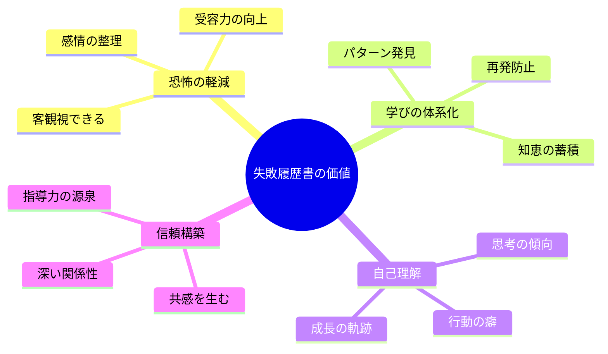
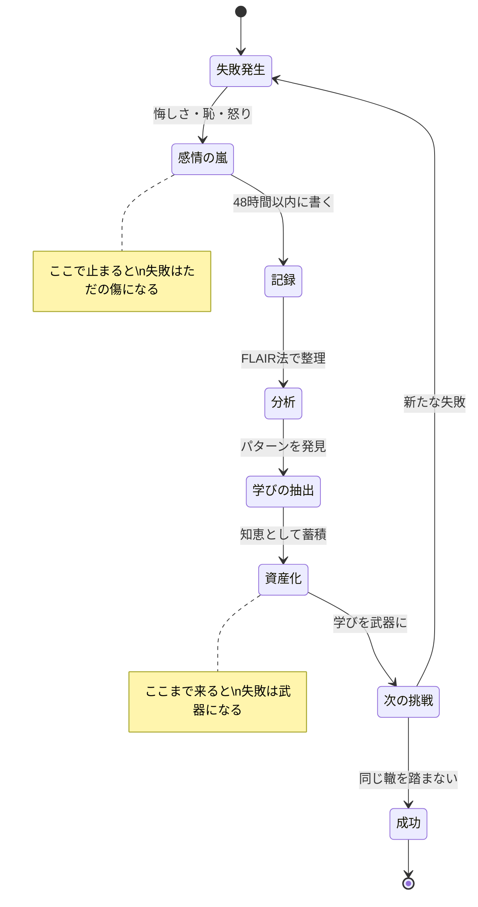
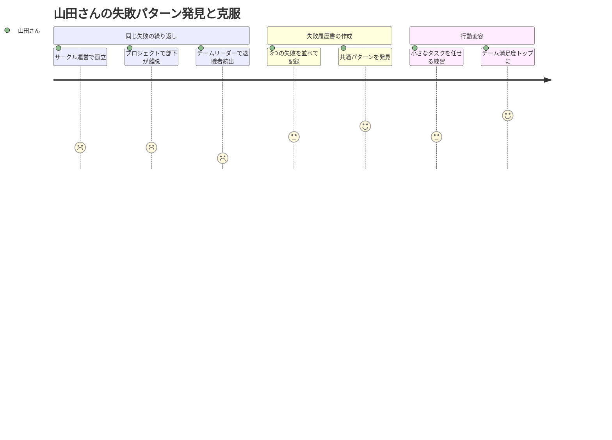
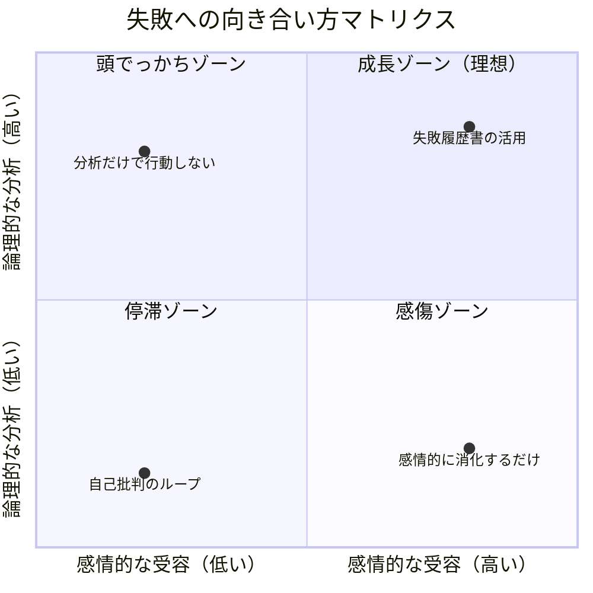

佐藤さん（35歳・IT企業マネージャー）は、転職面接でこう聞かれた。「あなたの最大の失敗は何ですか？」。頭が真っ白になった。失敗ならいくらでもある。でも、どれも「隠したい過去」でしかなかった。答えに詰まった佐藤さんは、その日の面接に落ちた。帰り道、ふと思った。「失敗を語れないということは、失敗から何も学んでいないということじゃないか？」。その夜、佐藤さんはノートを開き、人生で経験した失敗を一つずつ書き始めた。これが「失敗履歴書」との出会いだった。

## なぜ「失敗履歴書」が必要なのか

私たちは成功体験を磨き上げて履歴書に並べることには慣れている。しかし、本当に人を成長させるのは成功ではなく失敗だ。スタンフォード大学のティナ・シーリグ教授が提唱した「Failure Resume（失敗履歴書）」は、失敗を体系的に記録・分析し、そこから得た学びを可視化するツールである。

失敗を記録することには、4つの価値がある。

**失敗への恐怖の減少** -- 失敗を紙に書き出し客観視することで、感情的な反応が和らぐ。「失敗した自分」を受け入れやすくなる。

**学びの体系化** -- 失敗の中に潜む教訓を構造的に引き出せる。同じ失敗の繰り返しを防ぎ、異なる失敗からもパターンを発見できる。

**自己理解の深化** -- 自分の行動パターン、思考の癖、繰り返す課題が浮かび上がる。これは自己改善の最も確実な手がかりになる。

**信頼と共感の構築** -- 失敗を適切に語れる人は、「完璧な人」ではなく「成長し続ける人」として信頼される。

## 失敗を資産に変えるフレームワーク：FLAIR法

失敗を単なる「嫌な思い出」から「成長の資産」に変換するために、FLAIR法というフレームワークを紹介する。

| ステップ | 内容 | 問いかけ |
|---------|------|---------|
| **F**act（事実） | 何が起きたかを客観的に記述 | 感情を排除し、事実だけを書くと？ |
| **L**earning（学び） | その失敗から得た教訓 | この経験がなければ知らなかったことは？ |
| **A**nalysis（分析） | 失敗の根本原因を特定 | なぜ起きたか？自分の責任範囲は？ |
| **I**mpact（影響） | 現在の自分への影響 | この失敗は今の自分をどう形作っているか？ |
| **R**euse（再活用） | 学びの応用先を明確化 | この教訓を次にどう活かすか？ |

## ケーススタディ1：新規事業の失敗を転職の武器に変えた中村さん

中村健太さん（38歳・メーカー勤務）は、社内ベンチャーとして立ち上げた新規事業を2年で撤退させた経験がある。投資額は3,000万円。社内での評価は地に落ちた。

「あの頃は毎朝、会社に行くのが怖かった」と中村さんは振り返る。「廊下ですれ違う同僚の目が、全部"あいつが3,000万溶かしたやつだ"と言っているように感じました」。

中村さんが失敗履歴書を書き始めたのは、撤退から半年後のことだった。

**Fact（事実）**：新規事業を2年運営し、売上目標の30%しか達成できず撤退。投資額3,000万円を回収できなかった。

**Learning（学び）**：
- 市場調査と顧客ヒアリングの量が圧倒的に不足していた
- 「作れば売れる」というプロダクトアウト思考に陥っていた
- 撤退判断の基準を最初に決めていなかった

**Analysis（分析）**：根本原因は「成功への焦り」。早く結果を出したいあまり、顧客の声を聞くプロセスを省略した。

**Impact（影響）**：「仮説検証」の重要性が骨身に染みた。今では何をするにも「まず小さく試す」が口癖になっている。

**Reuse（再活用）**：この経験を活かし、転職先のスタートアップでPMとして活躍。「失敗から学んだ撤退基準の設計」を面接で語り、高い評価を得た。

「面接官に言われたんです。"失敗の話をこれだけ具体的に語れる人は初めてだ。その学びは本物ですね"って。あの3,000万円の失敗が、最高の自己投資になったんだと気づきました」。

## ケーススタディ2：人間関係の失敗パターンを発見した山田さん

山田あかりさん（29歳・人事部）は、チームリーダーに昇進して半年で、部下3人のうち2人に退職された。

「私のマネジメントが原因でした。それは分かっていたんです。でも、"何が悪かったのか"が具体的に分からなかった」。

山田さんは失敗履歴書を書く中で、驚くべきパターンを発見した。大学のサークル運営でも、前職のプロジェクトリーダーでも、同じ失敗を繰り返していたのだ。

「全部に共通していたのは、"自分で全部やった方が早い"という思考です。任せずに抱え込み、周りは"信頼されていない"と感じて離れていく。失敗履歴書を並べてみたら、10年間ずっと同じことをしていたんです」。

パターンを発見した山田さんは、「任せる練習」を始めた。最初は30分で終わるタスクから。半年後、チームの満足度調査は部署内トップになった。

「失敗履歴書がなかったら、40歳になっても50歳になっても同じ失敗を繰り返していたと思います」。

## 失敗履歴書の具体的な書き方：5ステップ

### Step 1：失敗の棚卸し（30分）

過去5年間で経験した、印象に残っている失敗を5〜10個リストアップする。大きな失敗だけでなく、小さな失敗も含める。「悔しかったこと」「恥ずかしかったこと」「後悔していること」をキーワードに思い出す。

### Step 2：FLAIR法で詳細記述（各失敗15分）

各失敗について、以下の問いに答える。
- **Fact**：何が起きたか？（事実のみ、感情は排除）
- **Learning**：この経験がなければ知らなかったことは？
- **Analysis**：なぜ起きたか？自分の責任範囲は？
- **Impact**：この失敗は今の自分をどう形作っているか？
- **Reuse**：この教訓を次にどう活かせるか？

### Step 3：パターンの発見（20分）

複数の失敗を見比べ、共通するテーマやパターンを探す。「締め切りの管理」「コミュニケーション不足」「準備不足での見切り発車」など、繰り返し現れる傾向に注目する。

### Step 4：学びの体系化（15分）

発見したパターンをカテゴリー別に整理する。「時間管理」「人間関係」「リスク管理」「意思決定」などのカテゴリーに分類し、失敗を「知識の体系」に変換する。

### Step 5：定期的な更新（月1回、10分）

失敗履歴書は一度書いて終わりではない。新しい失敗があれば追加し、過去の失敗への見方が変わったら更新する。3ヶ月、半年、1年と時間が経つにつれ、同じ失敗に対する解釈が深まっていく。

## ケーススタディ3：失敗履歴書をチームに導入した高橋さん

高橋誠さん（42歳・部長職）は、部下30人を抱えるチームで「失敗共有会」を月1回開催するようになった。きっかけは自身の失敗履歴書だった。

「最初は誰も話してくれませんでした。そりゃそうですよね、部長の前で失敗を話すなんて怖い。だから私が先に話したんです。"昔、大事なクライアントとの会食で、相手の名前を間違え続けて契約を失った話"を」。

高橋さんが自分の失敗を率直に語ったことで、チームの空気が変わった。

「部長も失敗するんだ、って。それから少しずつみんなが話し始めました。ある新人が"先週のプレゼンで、データを古いバージョンのまま出してしまった"と話した時、別のメンバーが"私も同じことやったことある。チェックリストを作ったから共有するよ"と返したんです。失敗が学びに変わる瞬間を目の前で見ました」。

導入から1年後、チームのミス報告件数は40%増加（＝隠さなくなった）、一方でミスの再発率は65%減少した。

## 失敗履歴書を書く際の3つの注意点

**自己擁護を避ける**：「でも、あの時は上司の指示が曖昧だったから...」という言い訳は失敗履歴書の価値を下げる。自分のコントロール範囲で何ができたかに集中する。

**過度な自己批判も避ける**：「私はダメな人間だ」は分析ではない。失敗は「行動の結果」であり、「人格の評価」ではない。[フィードバックを受け止める力](/blog/feedback-mindset)を鍛えることで、この区別がつきやすくなる。

**成長の証拠を必ず書く**：失敗だけを並べると自己肯定感が下がる。「この失敗があったからこそ、今の自分がある」という成長のストーリーを必ずセットで記述する。

## 失敗履歴書の活用シーン

失敗履歴書は書いたら終わりではない。さまざまな場面で活用できる。

**転職・面接の準備**：「最大の失敗は？」という定番質問に、具体的かつ成長の物語として答えられる。佐藤さんのケースが示す通り、失敗を語れることは大きな武器になる。

**メンタリング・指導の場面**：後輩や部下を指導する時、「私も同じ失敗をした」と語ることで、相手の不安が軽減される。[アイスブレイクで本音を引き出す技術](/blog/icebreak-draw-out-honest-thoughts)と組み合わせると、さらに効果的だ。

**キャリアの方向転換**：失敗パターンの分析は、自分に合わない仕事や環境を明確にしてくれる。[30代からのキャリアチェンジ](/blog/30s-career-change-guide)を考える時、失敗履歴書は最も信頼できる羅針盤になる。

**レジリエンスの強化**：失敗を記録し乗り越えた実績が積み重なると、「また失敗しても大丈夫」という確信が生まれる。これは[レジリエンス](/blog/resilience)の中核を成す能力だ。

## 今日から始める：最初の一歩

失敗履歴書は、完璧に書く必要はない。今日はたった一つの失敗だけ書いてみよう。

1. ノートかスマホのメモアプリを開く
2. 過去1年で最も印象に残った失敗を一つ選ぶ
3. FLAIR法の5つの問いに、それぞれ2〜3行で答える
4. 最後に「この失敗があったから得られたもの」を一つ書く

所要時間は15分。たった15分で、あなたの失敗は「隠したい過去」から「語れる資産」に変わり始める。

---

## あなたの失敗を、一緒に資産に変えませんか？

失敗履歴書を一人で書くのは、思ったより難しいものです。感情が邪魔をしたり、「本当にこれが学びなのか」と迷ったりする。体験セッションでは、あなたの失敗を一緒に振り返り、まだ気づいていない「資産」を掘り起こすお手伝いをします。

[→ 体験セッションに申し込む](/sessions)
