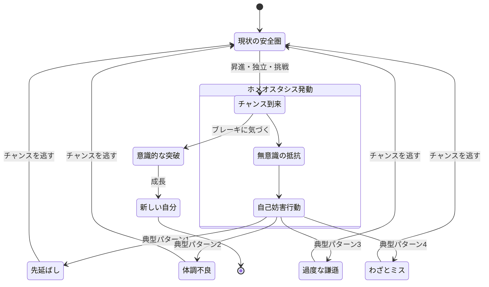
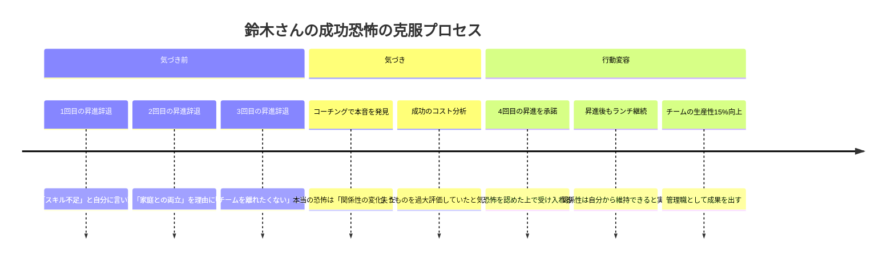
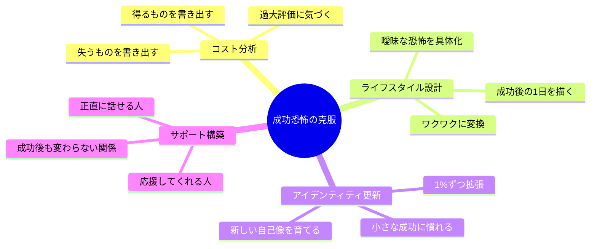

大久保さん（34歳・Webデザイナー）は、独立の準備が整っていた。ポートフォリオは完成し、最初のクライアント候補から「ぜひお願いしたい」と連絡が来ていた。あとは返信するだけ。なのに、3日間そのメールを開けなかった。「忙しかった」と自分に言い訳したが、本当は分かっていた。怖かったのだ。失敗が怖いのではない。成功してしまうことが怖かった。「独立して成功したら、今の安定した生活が変わってしまう。友人との関係も変わるかもしれない。もっと大きな期待をされて、潰れるかもしれない」。大久保さんが直面していたのは、多くの人が気づかないまま人生を制限し続ける「成功への恐怖」だった。

## 成功を恐れる心理のメカニズム

「成功が怖い」と聞くと矛盾に感じるかもしれない。しかし、これは心理学で広く認められた現象だ。アブラハム・マズローは「ヨナ・コンプレックス」という概念で、人が自己実現を避ける傾向を説明した。成功への恐怖は、主に4つの心理メカニズムから生じる。

**変化への抵抗（ホメオスタシス）** -- 脳は現状維持を安全と認識する。成功は新しい役割、環境、人間関係をもたらすが、それらは脳にとって「未知の脅威」として処理される。体温を一定に保つように、心理的にも「いつもの自分」に戻ろうとする力が働く。

**責任の重圧** -- 成功は期待と責任を増大させる。「この成功を維持しなければ」「もっと成果を出さなければ」というプレッシャーが、成功そのものを怖れさせる。一度高い山に登ると、「落ちたらもっと痛い」と感じるのと同じだ。

**関係性の変化への恐怖** -- 成功は周囲との関係を変えうる。友人からの嫉妬、家族との距離感、「上に行った人」として見られる不安。特に日本の文化では「出る杭は打たれる」という規範が、成功への無意識の抵抗を強化する。

**自己イメージとの矛盾** -- 「自分は成功するタイプじゃない」「そこそこでいい」という自己イメージが固定されていると、成功は自己概念を脅かす。無意識に自分を sabotage（妨害）して、居心地の良い自己イメージに戻ろうとする。

## あなたは成功を恐れていないか？ -- 12のチェックリスト

以下の項目に3つ以上当てはまる場合、成功への恐怖が潜んでいる可能性がある。

**自己妨害のパターン**
- 重要な機会の前に、なぜか体調を崩すことがある
- 締め切りギリギリまで手をつけず、ベストを出せない状況を作る
- 成功目前で「やっぱり無理かも」と尻込みする
- 自分の能力や成果を人前で過小評価する

**成功への抵抗感**
- 昇進や新しい挑戦の機会を「まだ早い」と断ったことがある
- 成功した時に素直に喜べず、「運が良かっただけ」と思う
- 成功した自分を想像すると、ワクワクより不安が勝つ
- 「目立ちたくない」「今のままでいい」が口癖になっている

**人間関係への影響**
- 成功すると友人関係が変わりそうで怖いと感じる
- 自分より成功していない人の前では成果を隠す
- 「すごいね」と言われると居心地が悪くなる
- 成功者に対して、無意識に距離を置いてしまう

## ケーススタディ1：昇進を3回断り続けた鈴木さん

鈴木美咲さん（37歳・メーカー企画部）は、過去3年間で上司から3回の昇進打診を受け、すべて断っていた。理由は毎回違った。「まだスキルが足りない」「今のチームを離れたくない」「家庭との両立が心配」。

コーチングセッションで「もし昇進して大成功したら、何が変わりますか？」と聞かれた時、鈴木さんの答えは意外なものだった。

「...ランチ仲間がいなくなると思います。今の同僚たちと気軽に愚痴を言い合える関係が、なくなってしまう気がする」。

鈴木さんが本当に恐れていたのは、失敗ではなく、成功による関係性の変化だった。

鈴木さんは「成功のコストとベネフィット」を紙に書き出した。すると、「失うもの」を過大評価し、「得られるもの」をほとんど考えていなかったことに気づいた。4回目の打診で昇進を受け入れ、管理職として1年目でチームの生産性を15%向上させた。そして、心配していたランチ仲間との関係は、自分から声をかけ続けることで何も変わらなかった。

## ケーススタディ2：売上が伸びるたびに営業を止めていた井上さん

井上拓也さん（31歳・フリーランスコンサルタント）には、不思議なパターンがあった。月の売上が80万円を超えると、なぜか新規営業をやめてしまうのだ。「忙しいから」と自分では思っていたが、実際にはキャパシティにはまだ余裕があった。

「80万円って、会社員時代の月収とほぼ同じなんです」と井上さんは気づいた。「それ以上稼ぐことに、無意識で罪悪感があったみたいです。"自分なんかがそんなに稼いでいいのか"って」。

これは「アッパーリミット問題」と呼ばれる現象だ。心理学者ゲイ・ヘンドリックスが著書『The Big Leap』で提唱した概念で、人には無意識の「幸福の上限」があり、それを超えると自動的にブレーキがかかる。

井上さんは3つのステップで突破した。

1. **自分の「上限」を数値化**：月収80万円がトリガーだと特定
2. **上限の由来を掘り下げ**：「会社員の給与以上を個人で稼ぐのは悪い」という親からの無意識の刷り込みだと発見
3. **新しい基準を設定**：「自分が価値を提供した分だけ受け取るのは正当だ」という信念を意識的に選択

3ヶ月後、井上さんの月収は120万円を安定的に超えるようになった。

## 成功への恐怖を克服する4つの実践法

### 1. 成功のコスト・ベネフィット分析

目標を達成した場合の「得られるもの」と「失う可能性があるもの」を客観的にリストアップする。恐怖は「失うもの」を過大評価させる傾向がある。紙に書くことで、バランスの取れた視点を取り戻せる。

### 2. 「成功した自分」のライフスタイル設計

成功後の具体的な生活を設計する。「成功したら毎日働き詰めになる」という漠然とした恐れを、「成功したら週4日働いて、金曜は家族と過ごす」という具体的なビジョンに置き換える。恐怖は曖昧さの中で増幅する。具体化すれば縮小する。

### 3. アイデンティティの段階的な更新

「成功する自分」を一気に受け入れるのではなく、段階的に馴染ませる。[朝のルーティン](/blog/morning-routine)の中で「今日の自分は昨日より少しだけ大きい」と宣言する。1%ずつ自己イメージを拡張することで、ホメオスタシスの抵抗を最小化できる。

### 4. サポートシステムの事前構築

成功しても関係が変わらない人、成功を素直に祝福してくれる人とのつながりを意識的に強化する。成功しても孤立しないという安心感が、恐怖を根本から軽減する。

## ケーススタディ3：「成功が怖い」と認めてから変わった吉田さん

吉田翔太さん（28歳・エンジニア）は、副業で開発したアプリが想定以上にダウンロードされ始めた時、「このまま伸びたらどうしよう」と思った自分に気づいた。普通なら喜ぶ場面で、恐怖を感じている。

「友人に"成功するのが怖い"と打ち明けた時、最初は笑われると思ったんです。でも友人は"俺もそうだよ"と言った。そこから楽になりました」。

吉田さんは[インポスター症候群](/blog/imposter-syndrome)の記事を読み、自分の恐怖に名前があることを知った。名前がつくと、対処できる。彼は「成功日記」をつけ始めた。小さな成功を毎日1つ記録し、成功に慣れていく訓練だ。

「最初は"今日も健康だった"レベルの小さなことしか書けなかった。でも3ヶ月続けたら、"クライアントに提案が通った"とか"新機能のリリースがうまくいった"とか、以前なら"運が良かっただけ"と片付けていたことを、素直に"自分の成果だ"と書けるようになった」。

半年後、吉田さんのアプリは月間10万ダウンロードを突破。本業でも昇格を果たした。

## 成功への恐怖と「他の心理バイアス」の関係

成功への恐怖は単独で存在するのではなく、他の心理パターンと絡み合っている。

[インポスター症候群](/blog/imposter-syndrome)は「自分は成功に値しない」という信念で、成功恐怖の最も一般的な共犯者だ。また、[サンクコスト（埋没費用）の罠](/blog/sunk-cost-fallacy)は「ここまで来たのだから変われない」と現状維持を正当化させる。そして[第一原理思考](/blog/first-principles-thinking)は、これらの無意識の前提を根本から疑い直す武器になる。

成功への恐怖に気づいたら、それは「壊れている」サインではない。むしろ「次のステージに進む準備ができた」サインだ。恐怖を感じるということは、本当に望んでいる何かがその先にあるということだから。

## 今日から始める：恐怖を味方にする3分ワーク

1. 今、先延ばしにしていることを1つ思い浮かべる
2. 「もしそれが大成功したら、何が変わるか？」と問う
3. その変化の中で「怖い」と感じるものがあれば、紙に書く
4. 書いた恐怖に対して「それでも、やる価値があるか？」と問う

答えが「Yes」なら、あとは動くだけだ。恐怖は消えなくていい。恐怖と一緒に前に進めばいい。

---

## 成功への恐怖を、一緒に外しませんか？

「頭では分かっているのに動けない」。それは意志の弱さではなく、無意識のブレーキかもしれません。体験セッションでは、あなたの中にある「成功のアッパーリミット」を一緒に特定し、外すための最初のステップを設計します。

[→ 体験セッションに申し込む](/sessions)
