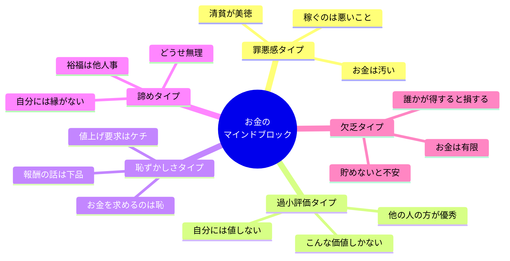
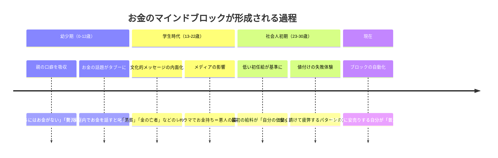
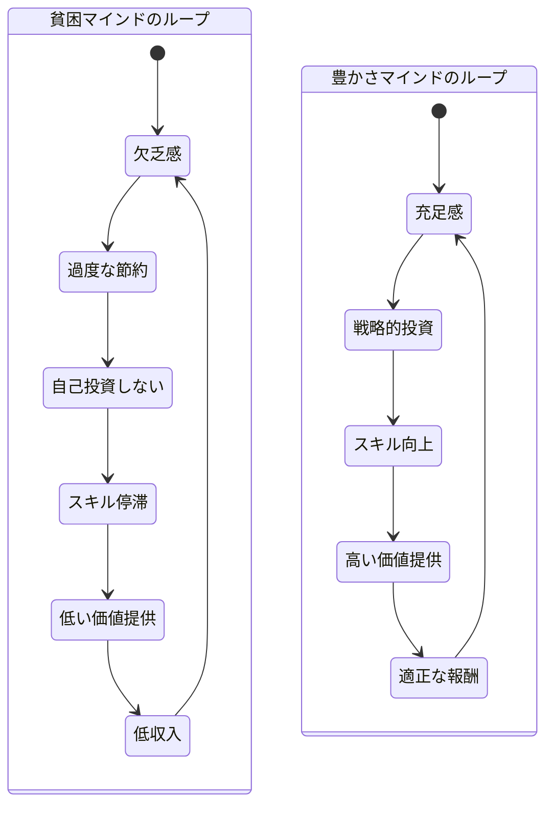

佐藤さん（34歳・フリーランスのWebデザイナー）は、クライアントとの打ち合わせで固まっていた。「今回のサイトリニューアル、いくらでお願いできますか？」と聞かれた瞬間、口から出た言葉は「え、15万円くらいで……」。本当は40万円の工数がかかると分かっていた。帰り道、スマホの計算機で時給換算して、思わずため息をついた。「また、やってしまった」――こんな経験、あなたにもないだろうか。

お金のマインドブロックは、スキルや実績とは無関係に収入の天井を作る。本記事では、ブロックの正体を可視化し、それを外して「正当な対価を受け取る自分」に変わるための実践法を紹介する。

## お金のマインドブロック、5つの類型

まず、自分がどのブロックを持っているかを知ることが出発点だ。

これらのブロックは単独で存在するのではなく、複数が絡み合っていることが多い。佐藤さんの場合は「過小評価」と「恥ずかしさ」の複合型だった。

## ブロックはどこから来るのか？

お金に対する信念は、多くの場合「自分で選んだもの」ではない。幼少期から無意識に刷り込まれたものだ。

重要なのは、これらの信念は「事実」ではなく「プログラム」だということ。プログラムは書き換えられる。

## 貧困マインドと豊かさマインド：2つのループ

お金のブロックがある人とない人では、行動パターンがまるで違う。

2つのループの違いは「能力の差」ではなく「最初の信念の差」だけだ。どちらのループに入るかは、お金に対するマインドセットが決める。

## ケーススタディ：ブロックを外した3人のリアル

### ケース1：佐藤さん（34歳・Webデザイナー）の「過小評価ブロック」

**Before**：すべての案件を15-20万円で受注。月の労働時間は250時間超。「自分にはこれくらいの価値しかない」が口癖。年収は380万円。

**転機**：コーチングで「あなたのデザインで、クライアントの売上がどれだけ上がっているか知っていますか？」と問われた。調べてみると、直近の案件でクライアントのCV率が2.3倍に。売上換算で月80万円の増収に貢献していた。

**取り組み**：
1. 過去の案件で自分がもたらした成果を数値で棚卸し
2. 「成果ベース」の価格設定に切り替え（時間売りをやめた）
3. 新規案件から段階的に単価を上げた

**After**：平均単価を40万円に。月の労働時間は160時間に減少。年収は620万円に。「自分の価値を数字で把握することで、罪悪感なく請求できるようになった」と佐藤さんは言う。

### ケース2：山田さん（41歳・会社員）の「罪悪感ブロック」

**Before**：「お金は汚い」「お金のために働くのは俗物」という信念。昇給交渉を10年間一度もしたことがない。同期より年収が120万円低い。

**転機**：娘の「パパ、お金ってもらっちゃいけないの？」という無邪気な質問にハッとした。自分の信念を娘に受け継がせたくないと思った。

**取り組み**：
1. お金の信念棚卸しワーク（「お金は○○だ」を20個書き出す）
2. 各信念の出所を特定（ほとんどが父親の口癖だった）
3. 「お金は価値交換のツールである」という新しい信念に書き換え
4. 上司に成果データを持って昇給を交渉

**After**：昇給交渉に成功し、年収が90万円アップ。「お金を受け取ることは、自分の貢献を正当に認めることだと分かった」。

### ケース3：鈴木さん（28歳・コーチ）の「恥ずかしさブロック」

**Before**：セッション料金を1回3,000円に設定。「お金の話をすると嫌われる」と思い、値上げできず。月20セッションでも月収6万円。副業として続けるか迷っていた。

**転機**：尊敬するコーチから「安い料金はクライアントのコミットメントも下げる。あなたの安売りがクライアントの成果を下げている」と指摘された。

**取り組み**：
1. 同業者の市場価格を30人分リサーチ
2. クライアントの成果（転職成功、売上アップ等）を整理
3. 料金を1回15,000円に改定（既存クライアントには3ヶ月の移行期間）
4. 値上げの理由を「より質の高いサービス提供のため」と丁寧に説明

**After**：月12セッションで月収18万円に。クライアント数は減ったが、一人ひとりの成果は向上。「料金を上げたことで、お互いの本気度が上がった」。

## お金のブロックを外す5ステップ

### ステップ1：信念の棚卸し

ノートに「お金は○○だ」「稼ぐことは○○だ」「お金持ちは○○だ」という文を、思いつくまま20個以上書き出す。書くのを止めたくなるところから本音が出てくる。

### ステップ2：出所の特定

書き出した信念のそれぞれについて、「これは誰の言葉か？」「いつ刷り込まれたか？」を記録する。自分のオリジナルの信念はほとんどないことに気づくはずだ。

### ステップ3：事実と信念の分離

各信念を「これは事実か？　それとも思い込みか？」と検証する。例えば「お金持ちは悪人」は事実ではない。寄付や社会貢献をしている富裕層は多い。

### ステップ4：新しい信念のインストール

古い信念を書き換える。

| 古い信念 | 新しい信念 |
|---------|----------|
| お金は汚い | お金は価値交換のツール |
| 稼ぐのは悪いこと | 稼ぐことは価値提供の証 |
| 自分には値しない | 自分の貢献には正当な対価がある |
| お金を求めるのは恥 | 正当な報酬を求めるのは誠実さ |
| お金は有限で奪い合い | 価値を創出すれば豊かさは広がる |

### ステップ5：行動で上書きする

信念は「頭で理解する」だけでは変わらない。小さな行動で上書きする必要がある。

- **今週**：自分のスキル・経験の市場価値を3つの情報源で調査する
- **今月**：次の見積もり・交渉で、いつもより10%高い金額を提示してみる
- **3ヶ月後**：成果ベースの価格設定を1つの案件で試す

## 健全なお金の関係を維持する習慣

ブロックを外した後も、古いパターンは戻ろうとする。以下の習慣で「豊かさマインド」を維持しよう。

**お金のパーパス（目的）を明確にする**：何のために稼ぐのかを言語化する。「家族との時間を確保するため」「自分のスキルをさらに高めるため」など、お金の先にある価値を意識することで、健全な動機が生まれる。

**価値提供ファーストの思考**：「いくら稼げるか」ではなく「どれだけの価値を届けられるか」を先に考える。価値提供が先、対価は後。この順番が逆転すると、お金への執着が生まれる。

**豊かさの循環に参加する**：得たお金を自己投資・学び・他者への還元に使う。お金を循環させることで、[欠乏感ではなく充足感が育つ](/blog/first-principles-thinking)。

**お金のリテラシーを継続的に高める**：無知が不安を生み、不安がブロックを生む。[決断疲れ](/blog/decision-fatigue)を減らすためにも、お金に関する知識を定期的にアップデートしよう。

## お金のブロックチェックリスト

以下に当てはまるものがあれば、マインドブロックが作動している可能性が高い。

- [ ] 自分のサービスの値段を言うとき、声が小さくなる
- [ ] 「安くてもいいから仕事がほしい」と思うことがある
- [ ] 値上げの話をすると胸がざわつく
- [ ] 同業者の高い料金を見ると「あの人は特別だから」と思う
- [ ] お金の話題になると居心地が悪い
- [ ] 「お金より大事なものがある」を言い訳にしている
- [ ] 成功している人を見ると、どこか後ろめたさを感じる

3つ以上該当したら、この記事のステップ1から始めてみてほしい。

## まとめ：お金のブロックは「外せる」

お金のマインドブロックは、あなたの能力の問題ではない。過去に刷り込まれた「プログラム」の問題だ。そして、プログラムは書き換えることができる。

佐藤さんが年収を240万円上げたのも、山田さんが10年ぶりに昇給交渉に成功したのも、鈴木さんが月収を3倍にしたのも、「スキルが劇的に上がった」からではない。お金に対する信念を変えたからだ。

[インポスター症候群](/blog/imposter-syndrome)と同じく、お金のブロックも「自分は本当はもっとできるのに」という自己過小評価の一種。まずは今日、ノートを開いて「お金は○○だ」と20個書き出すところから始めてほしい。

---

## あなたのお金のブロック、一緒に特定しませんか？

この記事で紹介した「信念の棚卸し」は、一人でやると無意識の盲点に気づきにくいもの。体験セッションでは、対話を通じてあなた固有のマインドブロックを特定し、具体的な書き換えプランを一緒に作ります。

[無料体験セッションに申し込む](/sessions)
