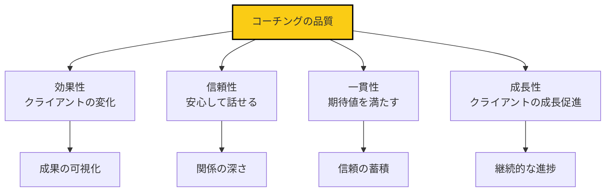
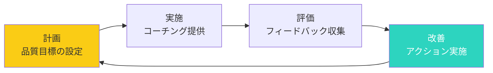

## 品質がビジネスを決める

コーチングにおいて、品質はすべてです。

クライアント満足度、リピート率、紹介数、収益性。これらすべては、コーチングの品質に直結しています。

しかし、品質をどう測り、どう向上させるのでしょうか？

## コーチングの品質とは何か

### 品質の4要素

## 品質指標の設定

### 定量的指標

**1. クライアント満足度**

毎回のセッション後に簡易なアンケート：
- セッションの満足度（1〜5）
- 期待値の達成度（1〜5）
- 推奨意欲（NPS）：「友人に推奨しますか？（0〜10）」

**2. 成果指標**

クライアントの進捗を定量化：
- 目標達成率
- 行動変化の頻度
- 主観的な変化のスコア

**3. エンゲージメント**

コーチングへの参加度：
- セッション出席率
- アクションアイテムの完了率
- セッション間の準備状況

### 定性的指標

**1. クライアントの言葉**

セッション中の言動：
- 「分かりやすい」「助かる」といった肯定的な言葉
- 新しい気づきや洞察の発言
- 行動へのコミットメント

**2. 自己評価**

コーチ自身の振り返り：
- セッションの質（1〜5）
- 満足度（1〜5）
- 改善点（自由記述）

## ベストプラクティス

### セッション前の準備

**1. クライアントの事前分析**

前回のセッション記録を確認：
- 達成したアクション
- 残った課題
- 新しい状況や変化

**2. 構成の設計**

セッションの流れを計画：
- 今日のテーマ
- 重要な問いかけ
- 予想される展開

**3. 自身の状態の整備**

コーチとしての心構え：
- 中立的な姿勢
- フルプレゼンス
- 観察と傾聴の準備

### セッション中の実践

**1. 質問の質を高める**

効果的な質問の特徴：
- **オープンエンド**: 「はい/いいえ」で答えられない
- **焦点化**: 1つの問いに集中
- **洞察を促す**: 表層を超える問い

**良い質問の例**:
- 「どう思いますか？」ではなく「何に気づきましたか？」
- 「なぜそう思いますか？」ではなく「その結論に至った道筋を教えてください」

**2. 傾聴の深化**

深い傾聴の実践：
- 話を遮らない
- 言葉だけでなく、感情やエネルギーも感じ取る
- 言い換えや要約で理解を示す

**3. 沈黙の活用**

沈黙を恐れない：
- クライアントの思考を促す時間
- 感情を整理する空間
- 新しい気づきが生まれる瞬間

### セッション後の振り返り

**1. セッションの記録**

重要なポイントをメモ：
- クライアントの気づき
- 決定したアクション
- 次回のテーマ

**2. フィードバックの収集**

クライアントからのフィードバック：
- 今日のセッションはどうでしたか？
- 何が役立ちましたか？
- 何が違和感じましたか？

**3. 自己振り返り**

コーチ自身の振り返り：
- うまくいった点
- 改善が必要な点
- 学んだこと

## フィードバック収集のシステム

### 定期的なフィードバック

**3ヶ月ごとの詳細レビュー**

包括的な質問：
- コーチングの全体的な満足度
- 期待値の達成状況
- 具体的な変化の有無
- 改善してほしい点
- 継続意向

**毎回の簡易フィードバック**

短いアンケート（3問以内）：
1. 今日のセッションの満足度は？（1〜5）
2. 最も役立った点は？
3. 次回に期待することは？

### 360度フィードバック

複数の視点からの評価：
- **クライアント**: 直接受益者
- **同業者**: コーチとしての視点
- **メンター**: 専門的な視点

## 持続的な改善フレームワーク

### PDCAサイクルの応用

### 月間レビューの実践

**毎月の質問**:

1. **今月のベストセッションは？**
   - 何がうまくいった？
   - 何がクライアントに響いた？

2. **今月の改善点は？**
   - どのスキルを強化したい？
   - 何を変える必要がある？

3. **来月の目標は？**
   - 何に焦点を当てる？
   - どのような改善アクションをとる？

### プロフェッショナル・デベロップメント

**1. 継続的な学習**

- コーチング関連書籍の読書
- ワークショップやセミナーへの参加
- メンターシップやスーパービジョン

**2. 実践練習**

- ロールプレイング
- ピア・コーチング
- モックセッション

**3. コミュニティ参加**

- コーチングコミュニティへの参加
- 定例会への参加
- 知見の共有

## コーチングの品質チェックリスト

### セッション前

- [ ] クライアントの進捗を把握した
- [ ] セッションの構成を設計した
- [ ] 重要な問いかけを準備した
- [ ] 自身の状態を整えた

### セッション中

- [ ] オープンな質問をした
- [ ] 深く傾聴した
- [ ] 沈黙を活用した
- [ ] 適切なタイミングで介入した
- [ ] クライアントの洞察を引き出した

### セッション後

- [ ] セッション記録を作成した
- [ ] クライアントのフィードバックを収集した
- [ ] 自己振り返りを行った
- [ ] 次回の準備を始めた

## 今日から始めるアクション

### アクション1: 品質指標を設定する

今日、クライアントに満足度アンケートを実施しましょう。

### アクション2: 月間レビューを開始する

来月から、毎月の品質レビューを始めましょう。

### アクション3: 1冊のコーチング本を読む

来月中に、コーチング関連書籍を1冊読みましょう。

## まとめ

コーチングの品質は、意識的な努力で向上します。

品質指標を設定し、フィードバックを収集し、持続的に改善する。

このサイクルを回し続けることで、コーチングの質は向上し続けます。

品質は、ビジネスのすべてです。

今日から、品質向上にコミットしましょう。
