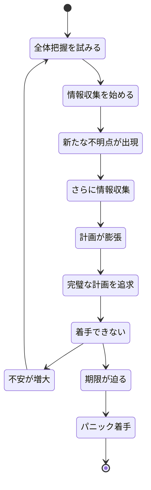
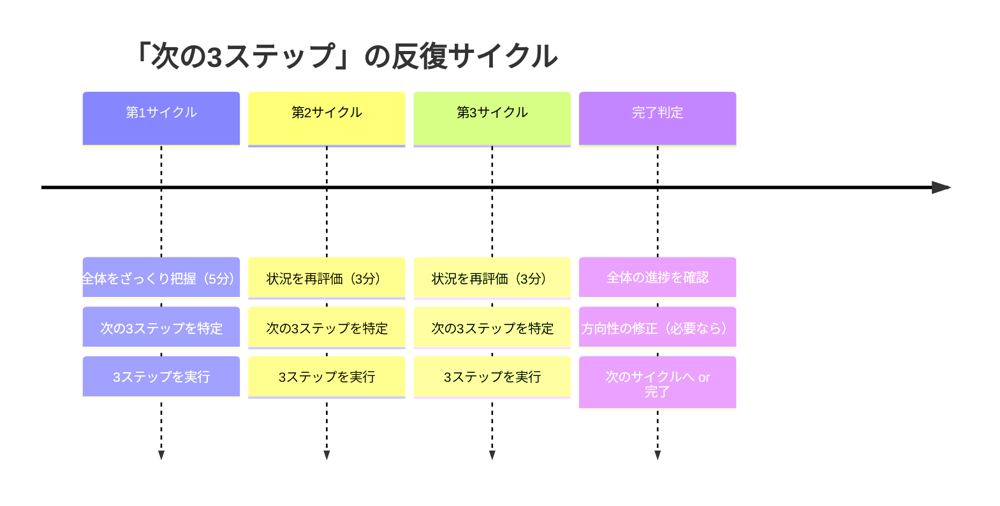

月曜朝9時、コンサルティング会社の会議室。新卒2年目の永井翔太（24歳）は、マネージャーから渡された資料を見て固まった。「来月のクライアント向け業務改善提案──現状分析、課題抽出、解決策設計、実行計画、予算策定、リスク分析、スケジュール作成──」。タスクリストは20行を超えていた。永井は小声でつぶやいた。「……どこから手をつければいいんですか」。マネージャーは笑って言った。「全部見るな。次にやる3つだけ決めろ。それが終わったら、また3つだ」。

この記事では、永井のように「全体が大きすぎて動けない」状態を解消する**「次の3ステップ」アプローチ**を解説します。

## 「全体を把握してから動く」が失敗する理由

### 分析麻痺（Analysis Paralysis）の構造

多くの人は「まず全体像を理解してから動こう」と考えます。しかし、タスクが複雑になるほど、この戦略は逆効果になります。

この「分析麻痺」に陥る根本原因は、**人間のワーキングメモリの限界**にあります。認知科学の研究では、人間が同時に保持・操作できる情報チャンクは3〜5個とされています。20個のタスクを一度に把握しようとすること自体が、脳の処理能力を超えているのです。

### 「3」が最適な理由

なぜ「次の5ステップ」でも「次の1ステップ」でもなく「3」なのか。

- **1ステップだと視野が狭すぎる**：次の一手しか見えず、方向感覚を失いやすい
- **5ステップ以上だと多すぎる**：ワーキングメモリの容量を超え、管理コストが増える
- **3ステップが最適**：「起点→展開→到達点」という自然な流れを作れる。次の着地点が見えているので安心感がある

## 「次の3ステップ」フレームワーク

### Phase 1：全体をざっくり把握する（5分限定）

全体像の把握は必要ですが、5分を上限にします。目的は「完璧な計画」ではなく「方角の確認」です。

**やること：**
- 完成形を1文で言語化する（例：「クライアントが『このプランで行こう』と言う提案書」）
- 大きなマイルストーンを3つだけ決める（例：「分析完了」「解決策確定」「資料完成」）
- 締切から逆算して、各マイルストーンの目安日を書く

**やらないこと：**
- 全タスクの洗い出し
- 詳細なスケジュール作成
- リスクの網羅的な分析

### Phase 2：次の3ステップを特定する

最初のマイルストーンに向かう「次の3ステップ」を決めます。

**良い3ステップの条件：**

| 条件 | 良い例 | 悪い例 |
|------|-------|-------|
| 具体的 | 「A社の売上データを3年分ダウンロード」 | 「データを集める」 |
| 時間が明確 | 「30分で完了」 | 「時間があるときに」 |
| 完了基準がある | 「Excelにグラフが1枚できている」 | 「だいたい終わったら」 |
| 依存関係が明確 | 「Step 1が終わったらStep 2に進む」 | 「どれからでもいい」 |

### Phase 3：実行して再評価する

3ステップを実行し終えたら、3分間の「再評価タイム」を取ります。

**再評価で確認すること：**
1. 3ステップは想定通りに進んだか？
2. 新しくわかったことはあるか？
3. 全体の方向性は合っているか？

この再評価に基づいて、次の3ステップを決定します。計画は「一度作って終わり」ではなく、3ステップごとに更新されていくものです。

## ケーススタディ1：永井翔太の提案書（コンサルタント・24歳）

冒頭の永井翔太は、マネージャーのアドバイスを受けて「次の3ステップ」アプローチを実践した。

**Before：**
20項目のタスクリストを見て3日間フリーズ。4日目にパニックで着手し、品質の低い提案書を提出。

**After：**
マネージャーのアドバイスに従い、まず5分で全体を把握。

**最初の3ステップ（月曜午前）：**
1. 過去の類似案件の提案書をチーム内で3つ共有してもらう（15分）
2. 3つの提案書の構成パターンを比較メモする（30分）
3. 今回のクライアントの「一番の課題」を1文で定義する（20分）

「3つだけなら、すぐ取りかかれた。終わってみたら、次にやるべきことが自然に見えてきた」

**次の3ステップ（月曜午後）：**
4. クライアントの業界データを3つの情報源から収集する（1時間）
5. データから読み取れる課題を箇条書きにする（30分）
6. 課題の優先順位をつけ、上位3つに絞る（20分）

「この調子で、毎回3つずつ進めていったら、水曜にはドラフトが完成していた。前回は金曜ギリギリだったのに」

**定量的な変化：**
- 提案書完成までの日数：5日（パニック着手）→ 3日（計画的進行）
- マネージャーからの修正指示：平均12箇所 → 平均3箇所
- 永井自身のストレスレベル（10段階）：9 → 4

## ケーススタディ2：橋本理恵の転職活動（経理・33歳）

橋本理恵は、3年間「転職したい」と思いながら、一歩も動けずにいた。

「『転職活動をする』って考えるだけで、やることの多さに圧倒されるんです。自己分析、業界研究、履歴書、職務経歴書、面接対策、企業選び……。考えるだけで疲れて、結局『今の会社でいいか』となる。でも日曜の夜にはまた『辞めたい』と思う。その繰り返しが3年」

橋本がコーチングで導入したのは「週末の3ステップ」方式だった。

**第1週の3ステップ：**
1. 転職サイトに登録する（15分）
2. 「経理 転職」で求人を10件ブックマークする（20分）
3. ブックマークした求人の共通点を3つ書き出す（15分）

「転職サイトに登録するだけなら、土曜の朝に15分でできた。10件ブックマークしてみたら、自分が求めている条件が見えてきた。『あ、私はリモートワークが重要なんだ』って」

**第2週の3ステップ：**
4. 自分の職務経歴を箇条書きで書き出す（30分）
5. 箇条書きを職務経歴書のテンプレートに流し込む（30分）
6. 友人に読んでもらいフィードバックをもらう（30分）

**第6週の3ステップ：**
16. 面接対策で「志望動機」を3パターン書く（30分）
17. 鏡の前で自己紹介を3回練習する（15分）
18. 第一志望の企業に応募する（10分）

「3年間動けなかったのに、6週間で応募まで進んだ。毎週3つだけだから、負担感がまったくなかった。しかも、毎週『3つ終わった』という達成感があるから、次の週も自然にやる気が出た」

**結果：** 2ヶ月後に第二志望の企業から内定。年収は30万円アップ。「全体を見て動けなかった3年間がもったいなかった」。

## ケーススタディ3：藤田大輔の新規事業（スタートアップCTO・39歳）

藤田大輔は、新規プロダクトの開発プロジェクトで「次の3ステップ」をチーム運営に導入した。

「スタートアップだから、要件が毎週変わる。半年のロードマップを引いても、2週間で陳腐化する。チームメンバーが『結局何やればいいんですか？』と聞いてくる状態が続いていました」

藤田が導入したのは「スプリント3ステップ」方式。

**運用ルール：**
1. 月曜朝に、チーム全員で「今週のゴール」を1文で定義する
2. そのゴールに向けた「最初の3ステップ」を各メンバーが宣言する
3. 水曜に「再評価」して、残りの3ステップを決定する
4. 金曜に振り返り

「不確実性の高い環境では、長期計画より『次の3ステップ』のほうが機能する。方向が変わっても、3ステップ分のロスで済むから」

**チームの変化（3ヶ月後）：**
- スプリント完了率：42% → 87%
- チームの士気（5段階アンケート）：2.9 → 4.4
- プロダクトリリースまでの期間：当初予定6ヶ月 → 実績4ヶ月

## 「次の3ステップ」を日常に組み込むコツ

### コツ1：朝の5分で3ステップを書く

[朝のルーティン](/blog/morning-routine)に「今日の3ステップを書く」を組み込みます。手帳でもスマホのメモでも構いません。重要なのは、1日の最初に「今日はこの3つだけやる」と決めることです。

### コツ2：3ステップ完了後の「ミニ祝杯」

3ステップが終わったら、小さな報酬を自分に与えます。コーヒーを淹れる、5分間ストレッチする、好きな音楽を1曲聴くなど。この報酬が、次の3ステップへのモチベーションになります。

### コツ3：月1回の「方向確認」

3ステップの繰り返しに没頭すると、全体の方向性とずれる可能性があります。月に1回、30分の「方向確認タイム」を設け、「そもそもこのプロジェクトのゴールは何だったか」を振り返りましょう。

### コツ4：「次の3ステップ」をチームで共有する

個人で使うだけでなく、チームミーティングで「各自の次の3ステップ」を共有すると、進捗の可視化と相互支援が自然に生まれます。[ディープワーク](/blog/deep-work)の時間確保にも役立ちます。

## 「全体が見えない不安」への処方箋

「次の3ステップ」アプローチに対する最も多い不安は、「全体を把握しないで大丈夫なのか」というものです。

答えは「大丈夫」です。なぜなら：

1. **全体は、歩きながら見える**──3ステップずつ進むことで、最初は見えなかった全体像が徐々に明らかになります
2. **完璧な計画は存在しない**──どんなに綿密な計画も、実行段階で変更が必要になります。3ステップ単位で軌道修正するほうが、現実に適応しやすい
3. **動いている人にはフィードバックが来る**──手を止めて計画している人には何も起きませんが、動いている人には周囲からの情報やフィードバックが集まります

## 今日、最初の3ステップを決めてみよう

**今すぐできる3ステップ：**
1. いま「全体が大きすぎて動けていない」と感じるタスクを1つ選ぶ
2. そのタスクの「完成形」を1文で書く
3. 最初にやるべき3ステップを、それぞれ所要時間つきで書き出す

この3つが終わったら、あなたはもう「分析麻痺」から抜け出しています。次の3ステップを決めて、また進むだけです。

---

## あなたの「動けないプロジェクト」を一緒に分解しませんか？

「全体が大きすぎて手がつけられない」──キャリアチェンジ、副業の立ち上げ、資格取得、人間関係の改善。どんなテーマでも、「次の3ステップ」に落とし込めば動き出せます。体験セッションでは、あなたが今最も進めたいプロジェクトを題材に、最初の3ステップを一緒に設計します。

[あなたの「最初の3ステップ」を一緒に決める（体験セッション）](/sessions)
