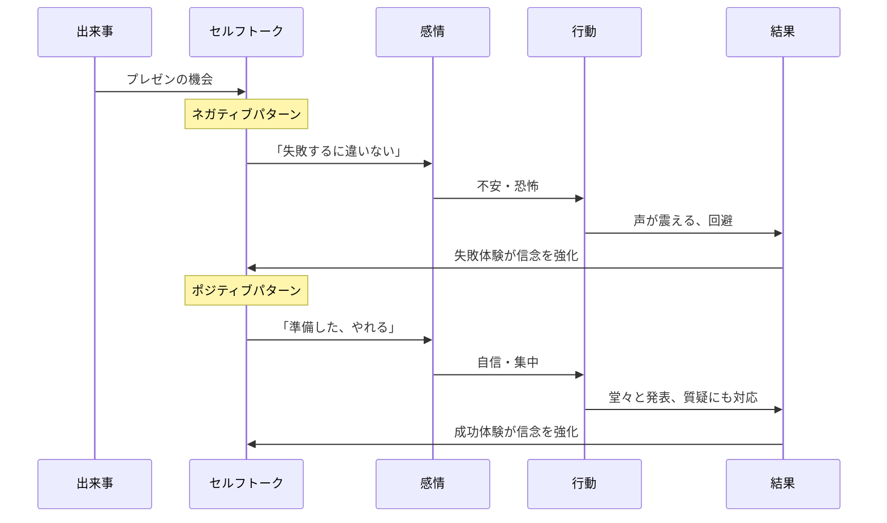
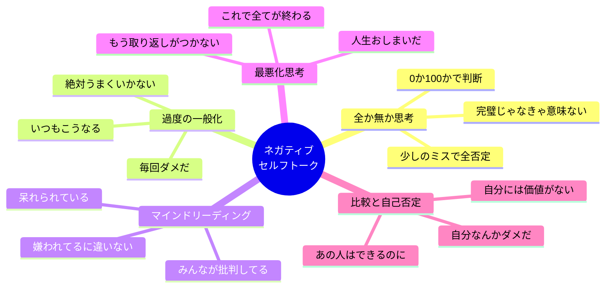

中村さん（29歳・マーケティング担当）は、プレゼン資料の最終確認をしながら、頭の中でこんな声を聞いていた。「どうせ突っ込まれるに決まってる」「前回もグダグダだったし」「部長は絶対がっかりする」。実際にプレゼンが始まると、声が震え、質疑応答では頭が真っ白に。終わった後、同僚に「内容は良かったのにもったいないね」と言われて気づいた――自分を潰していたのは、準備不足ではなく、頭の中の声だった。

研究によると、人は1日に約6万回の思考をしており、そのうち約80%がネガティブな内容だ。この「セルフトーク（自己対話）」の質が、感情・行動・結果のすべてを左右している。本記事では、ネガティブなセルフトークのパターンを見抜き、内なる批判者を「味方」に変える具体的な方法を解説する。

## セルフトークが人生を決めるメカニズム

脳は、自分が発する言葉を外部からの情報と同様に処理する。つまり、「自分が自分に言う言葉」が、そのまま自分の現実を作る。



注目すべきは、出来事そのものは同じだということ。プレゼンという状況は変わらない。変わるのは、その状況に対して自分が「何と言うか」だけだ。

## ネガティブセルフトーク：5つの危険パターン

まず、自分のネガティブセルフトークのパターンを認識することが第一歩。以下の5タイプのどれが自分に当てはまるか、チェックしてみよう。



これらのパターンには共通点がある。すべて「事実」ではなく「解釈」だということ。そして、その解釈は書き換えることができる。

## ケーススタディ：セルフトークを変えた3人の変化

### ケース1：中村さん（29歳・マーケティング担当）の「最悪化思考」

**Before**：プレゼン前に必ず「失敗する」「笑われる」というセルフトークが始まる。それが的中するかのように本番で緊張し、実力の半分も出せない。上司からの評価はCランク。

**取り組み**：セルフトークの記録を2週間続けた。すると、ネガティブなセルフトークの90%が「未来の失敗予測」だと判明。コーチのアドバイスで、「失敗するかも」を「準備した分だけ良くなる」に書き換える練習を開始。プレゼン前に3回、鏡の前で「自分は準備した。あとはやるだけだ」と声に出して言うルーティンを導入。

**After**（3ヶ月後）：プレゼンの緊張度が10段階で8→4に低下。上司の評価がAランクに。「セルフトークを変えただけで、やっていることは同じなのに結果が全然違う」と中村さんは驚く。

### ケース2：田中さん（36歳・エンジニアリーダー）の「比較と自己否定」

**Before**：優秀な後輩が入ってきてから、「自分はもう必要ない」「あいつの方がずっとできる」というセルフトークが止まらない。会議で発言できなくなり、[インポスター症候群](/blog/imposter-syndrome)に近い状態に。

**取り組み**：「第三者視点リフレーミング」を実践。「もし親友が同じことを言っていたら、何と返す？」と自問する習慣を作った。さらに、「できない」を「まだできていない」に言い換える「まだメソッド」を導入。

**After**（2ヶ月後）：後輩の強みと自分の強みが異なることを客観的に認識できるように。「後輩はコーディングが速い。自分はアーキテクチャ設計とチームマネジメントが強い」と言語化。会議での発言が増え、チーム全体の生産性が15%向上。

### ケース3：木村さん（44歳・個人事業主）の「全か無か思考」

**Before**：「完璧じゃなければ出す意味がない」というセルフトークで、ブログを3ヶ月間1記事も公開できず。SNSの投稿も「こんな内容では恥ずかしい」と下書きが50件溜まっていた。

**取り組み**：「70点で出す」というマントラを設定。毎朝「完璧より完了。今日も70点を出そう」と声に出す習慣を導入。さらに、内なる批判者に「ミスター・パーフェクト」と名前をつけて、「パーフェクトさん、今日はお休みして」と対話するユーモア法を実践。

**After**（1ヶ月後）：ブログを週2本公開、SNSも毎日投稿できるように。アウトプット量が10倍になり、問い合わせが月3件→月12件に増加。「完璧を手放したら、むしろ成果が上がった」と木村さんは笑う。

## セルフトークを書き換える7つのテクニック

### テクニック1：記録する（気づきフェーズ）

1日3回（朝・昼・夜）、スマホのメモに「今、自分に何と言っているか」を書き出す。3日間続けるだけで、自分のネガティブパターンが浮き彫りになる。

### テクニック2：「本当に？」と疑う

ネガティブなセルフトークが浮かんだら、「それは事実？　証拠は？」と問いかける。「いつも失敗する」→ 本当にいつも？ 前回はうまくいったのでは？

### テクニック3：「まだ」を追加する

「できない」を「まだできていない」に。「わからない」を「まだわかっていない」に。たった2文字で、固定から成長へ視点が切り替わる。

### テクニック4：「でも」を「だから」に変換する

「難しい、**でも**やってみよう」→「難しい、**だから**やりがいがある」。接続詞を変えるだけで、困難が動機に変わる。

### テクニック5：第三者視点で話す

「私はダメだ」ではなく「○○（自分の名前）は今、落ち込んでいるんだな」と名前で呼ぶ。心理学の研究で、第三者視点のセルフトークは感情のコントロールを大幅に改善することが示されている。

### テクニック6：親友テスト

「この状況で親友が同じことを言っていたら、自分は何と返すか？」と考える。他人には言えないほど厳しい言葉を、自分にだけ許していることに気づくはずだ。

### テクニック7：内なる批判者に名前をつける

批判的な声に「ネガティブ先生」「心配性のタナカ」など名前をつける。名前をつけると、その声と自分を分離できる。「あ、またネガティブ先生が来た」と客観視できるようになる。

## 内なる批判者を「味方」にする

ここが重要なポイントだ。内なる批判者を「黙らせる」のではなく、「味方に変える」。

批判者の声は、実はあなたを守ろうとしている。失敗を恐れて安全な行動を促しているのだ。だから、敵視するのではなく対話する。

```mermaid
journey
    title 内なる批判者との関係変化
    section Phase 1: 無意識（多くの人の現在地）
      批判者に支配される: 2
      自動的にネガティブ思考: 2
      行動が制限される: 1
    section Phase 2: 気づき
      セルフトークを記録する: 4
      パターンを認識する: 4
      批判者の存在に気づく: 5
    section Phase 3: 対話
      批判者の意図を理解する: 5
      感謝を伝える: 6
      建設的な提案に変換してもらう: 7
    section Phase 4: 協働
      批判者が「良きアドバイザー」に: 8
      適切なリスク評価ができる: 8
      自信と慎重さのバランス: 9
```

**具体的な対話の方法**：

1. **意図を聞く**：「なぜその警告をしているの？」と問いかける
2. **感謝する**：「守ろうとしてくれてありがとう」と伝える
3. **交渉する**：「ダメだ」を「ここを改善すればもっと良くなる」に翻訳してもらう
4. **役割を再定義する**：批判者を「品質管理担当」に昇格させる

## 1日のセルフトーク改善ルーティン

セルフトークの質は、筋トレと同じで毎日のトレーニングで向上する。

| タイミング | やること | 所要時間 |
|-----------|---------|---------|
| 朝（起床時） | 鏡の前でポジティブ宣言「今日も自分を信じよう」 | 1分 |
| 午前中 | セルフトーク記録（今の自分への声を書き出す） | 2分 |
| 昼休み | 午前中の記録を見返し、ネガティブを1つリフレーミング | 3分 |
| 困難時 | マントラ発動「一歩ずつ。大丈夫。成長の機会だ」 | 30秒 |
| 就寝前 | 今日できたこと3つを声に出す | 2分 |

合計わずか8分半。この習慣を[朝のルーティン](/blog/morning-routine)に組み込むだけで、1ヶ月後には明らかな変化を感じるはずだ。

## セルフトーク変換クイックリファレンス

すぐに使える書き換え例を一覧にしておく。

| ネガティブ | 変換後 |
|-----------|--------|
| また失敗した | 学びを得た。次はここを変えよう |
| 自分には無理だ | まだ方法を見つけていないだけだ |
| どうせうまくいかない | やってみなければ分からない |
| あの人に比べて自分は… | 自分には自分の強みがある |
| 完璧じゃなきゃ意味がない | 70点で出して、改善を重ねよう |
| みんなに嫌われている | 全員の評価をコントロールする必要はない |
| もう取り返しがつかない | ここから何ができるかを考えよう |

## まとめ：あなたの最大の味方は、あなた自身の声

中村さんがプレゼンで成果を出せるようになったのも、田中さんがインポスター症候群を克服したのも、木村さんがアウトプット量を10倍にしたのも、外部環境は何も変わっていない。変わったのは「自分が自分にかける言葉」だけだ。

1日6万回の思考。その一つひとつは小さいが、積み重なれば人生を形作る。[フィードバックの受け取り方](/blog/feedback-mindset)を変えるのと同じように、自分へのフィードバック（＝セルフトーク）の質を変えることは、最もコスパの高い自己投資だ。

今日からできるアクションは1つだけ。スマホのメモを開いて、今この瞬間の「頭の中の声」を書き出してみてほしい。[深い集中状態](/blog/deep-work)に入るためにも、まずは内なるノイズを可視化することから始めよう。

---

## あなたのセルフトークパターン、一緒に分析しませんか？

「自分では気づけないネガティブパターン」は誰にでもある。体験セッションでは、対話を通じてあなた固有のセルフトークの癖を可視化し、今日から使える書き換えフレーズを一緒に作ります。

[無料体験セッションに申し込む](/sessions)
