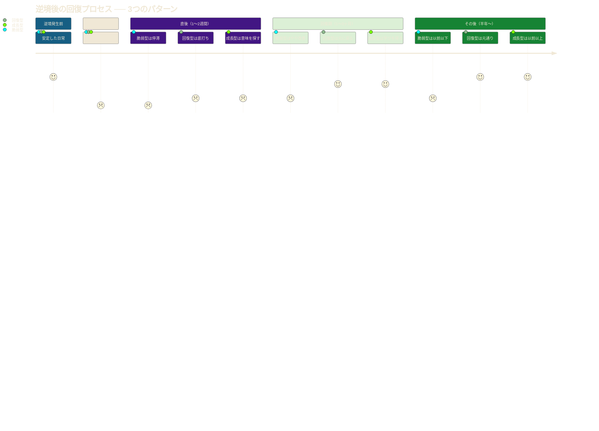
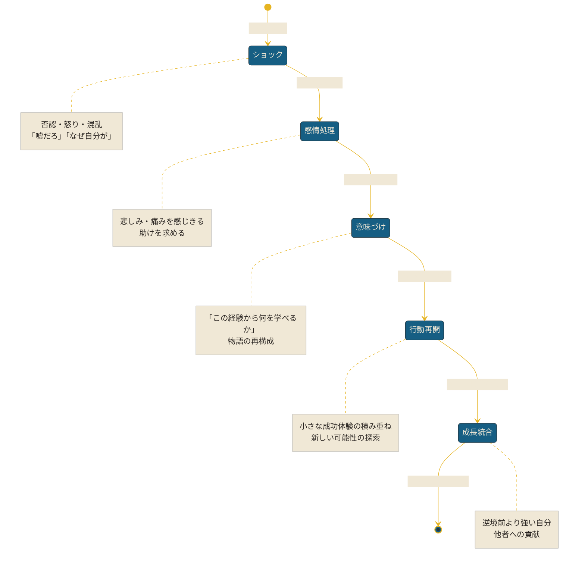

「もう無理だ。会社、辞めます」

高橋さん（37歳）が上司にそう伝えたのは、3年間かけて育てたプロジェクトが、経営判断で突然中止になった翌日だった。チームメンバー8人の配置転換、クライアントへの謝罪、積み上げたコードの廃棄。3年分の努力が、一枚の社内メールで消えた。

退職届を出した翌週、高橋さんは自宅のソファでぼんやりとテレビを見ていた。何もする気が起きない。友人からの連絡も返さない。「自分の3年間は何だったのか」という問いだけが、頭の中でループしていた。

それから1年半後。高橋さんはスタートアップのCTOとして、以前の3倍の規模のプロジェクトを率いている。年収も1.5倍になった。

「あの経験がなかったら、今の自分はいない。本気でそう思います」

高橋さんに何が起きたのか。そして、逆境から立ち直る力 ── レジリエンスとは何なのか。この記事では、レジリエンスの本質と、それを鍛える具体的な方法を、実際の回復ストーリーとともに解説する。

---

## レジリエンスとは何か

### 「折れない」ではなく「戻る」力

レジリエンス（resilience）は「回復力」「弾力性」と訳される心理学の概念だ。よく誤解されるが、レジリエンスは**「困難に対して何も感じない強さ」ではない**。

レジリエンスの高い人は、困難を深く感じる。痛みを経験する。落ち込む。泣くこともある。違いは、**そこから回復し、さらに成長するプロセス**にある。

竹をイメージしてほしい。強風で大きくしなるが、風が止めば元に戻る。嵐の後、根はさらに深くなっている。レジリエンスとは、まさにこの「しなやかさ」のことだ。

### 逆境への3つの反応パターン

- **脆弱型：** 逆境に打ちのめされ、長期間回復できない。「なぜ自分だけ」と嘆き続ける。
- **回復型：** 落ち込むが、時間とともに元の状態に戻る。「まぁ、仕方ない」と受け入れる。
- **成長型（ポストトラウマティック・グロース）：** 逆境を通じて以前より強くなる。「この経験があったから、今がある」と捉える。

レジリエンスを鍛えることで、誰でも「回復型」から「成長型」へと移行できる。

---

## レジリエンスの4つの柱

### 1. 現実を受け入れる

起きたことを否定せず、まず事実として受け入れる。「なぜ自分が」と嘆くより「さて、どうするか」と考える。

これは「諦め」ではない。**「変えられないことを受け入れ、変えられることに集中する」**という戦略的な姿勢だ。

### 2. 意味を見出す

困難の中に、学びや成長の機会を見出す。「これが自分に何を教えてくれているか」と問う。

心理学者ヴィクトール・フランクルは、ナチスの強制収容所という極限状態で「苦しみの中にも意味を見出せる者だけが生き残る」ことを発見した。

### 3. 即興的に適応する

計画通りにいかなくても、その場で対応できる力。完璧な計画を求めるのではなく、「今ある材料で最善を尽くす」柔軟さ。

### 4. つながりを活用する

一人で抱え込まず、他者のサポートを求められること。弱さを見せることは、弱さではない。助けを求める力こそが、回復を加速させる。

---

## レジリエンスの回復サイクル

逆境からの回復は、以下の5段階を経る。

**重要なのは、このサイクルの「感情処理」を飛ばさないこと。** 痛みを感じることを避けて「大丈夫、大丈夫」と無理にポジティブに振る舞うと、回復が遅れるか、後から大きな反動が来る。

---

## ケーススタディ：逆境から立ち直った3人のストーリー

### ケース1：高橋さん（37歳）-- プロジェクト中止から、スタートアップCTOへ

冒頭で紹介した高橋さんの回復プロセスを詳しく見てみよう。

**逆境の内容：** 3年間率いたプロジェクトが経営判断で突然中止。チーム解散。

**回復の転機：**
退職後2ヶ月間は「何もしない時間」を過ごした。焦って次の仕事を探すのではなく、痛みを感じきることを選んだ。

転機は、元チームメンバーの一人からの電話だった。「高橋さんのプロジェクトで学んだことが、今の仕事でめちゃくちゃ役に立ってます」。その一言で、3年間の仕事が「無駄」ではなかったと気づいた。

**意味づけのプロセス：**
高橋さんはノートに「あのプロジェクトから学んだこと」を書き出した。技術的なスキルだけでなく、「チームビルディング」「不確実性の中での意思決定」「ステークホルダーとの交渉」など、プロジェクトが中止にならなければ得られなかった経験がリストに並んだ。

**結果：** 退職から4ヶ月後、知人の紹介でスタートアップのCTOに就任。「プロジェクト中止の経験があるからこそ、今のスタートアップで"撤退判断"を冷静にできる」と語る。

### ケース2：岡田さん（42歳）-- 降格人事からの復活

**逆境の内容：** 部長職から課長職への降格。理由は「業績不振」。同期の目が痛い。

**Before：**
- 毎朝会社に行くのが辛い
- 「自分には価値がない」という思考ループ
- 睡眠の質が著しく低下
- 家族との関係も悪化

**岡田さんが実践した5つのこと：**

1. **感情を書き出す** -- 毎晩、感じたことをノートに書いた。美しい文章でなくていい。「悔しい」「情けない」「腹が立つ」、生の感情をそのまま。
2. **信頼できる人に話す** -- 元上司に「正直、辛い」と打ち明けた。「俺も35歳のとき、同じ経験をした」と聞いて、自分だけじゃないと安心した。
3. **小さな成功体験を積む** -- 降格後の仕事で、小さなプロジェクトを一つ成功させた。「自分はまだやれる」という感覚を取り戻した。
4. **体を動かす** -- 毎朝30分のジョギングを始めた。身体を動かすと、頭の中のネガティブな声が静まる。
5. **学びに変える** -- 「なぜ業績不振になったか」を冷静に分析し、マネジメントの改善点をリストアップした。

**After（1年後）：**
- 課長職で前年比130%の業績を達成
- 部長職に再昇格
- 「降格の経験で、現場の視点を取り戻せた。それが今の強みになっている」

### ケース3：鈴木さん（31歳）-- 起業失敗から会社員への回帰

**逆境の内容：** 2年間の起業に失敗。貯金は底をつき、借金200万円。

**最も辛かった瞬間：**
「起業します！」とSNSで宣言した手前、失敗を認めるのが怖かった。しかし、家賃の支払いが滞り始め、現実を直視せざるを得なくなった。

**回復のきっかけ：**
鈴木さんは、起業家コミュニティの先輩に相談した。先輩は言った。「失敗は"終わり"じゃない。"データ"だよ。2年間で何がわかった？」

この言葉で、鈴木さんの中で「失敗」が「実験結果」に再定義された。

**意味づけ：**
起業で得たスキルを棚卸しした結果、「事業計画策定」「顧客開拓」「財務管理」「マーケティング」など、会社員では得られない実践的な経験が山のようにあった。

**結果：** IT企業の新規事業部門に入社。年収は起業前の1.3倍。「起業経験者」としてのスキルセットが高く評価された。借金も2年で完済。

---

## レジリエンスを鍛える7つの実践法

### 1. 「逆境の正常化」を行う

困難は人生の異常事態ではなく、自然な一部だと受け入れる。「なぜ自分だけ」という思考から、「これも人生の一部」という思考に変える。

**実践：** 尊敬する人の伝記やインタビューを読む。成功者のほぼ全員が、重大な挫折を経験していることに気づくだろう。

### 2. 楽観的な解釈を練習する

心理学者マーティン・セリグマンの研究によると、楽観的な人と悲観的な人の違いは、困難の「解釈の仕方」にある。

| 解釈の軸 | 悲観的 | 楽観的 |
|----------|--------|--------|
| 持続性 | 「これは永遠に続く」 | 「これは一時的なものだ」 |
| 範囲 | 「すべてがダメだ」 | 「この領域だけの問題だ」 |
| 制御 | 「自分にはどうしようもない」 | 「自分にできることがある」 |

**実践：** 困難に直面したとき、「一時的・限定的・対処可能」の3つの視点で再解釈する習慣をつける。

### 3. 「英雄の物語」として再構成する

自分の経験を、困難を乗り越える物語として再構成する。「苦難があったからこそ、今の自分がある」というナラティブを作る。

**実践：** 過去に乗り越えた困難を3つ書き出し、「あのとき何が辛くて、どう乗り越えて、何を学んだか」をストーリーとして書く。これを読み返すことで、「自分は乗り越えられる人間だ」という自己認識が強化される。

### 4. 小さな一歩を積み重ねる

大きな問題を、対処可能な小さなステップに分解する。「全部一度に解決しよう」としない。

**実践：** 「今日、この1時間でできる最小の一歩は何か？」と自問する。メール1通を送る。書類1枚を整理する。電話を1本かける。小さな完了体験が、回復への自信を生む。

### 5. 身体からアプローチする

メンタルの回復に、身体の状態は直結する。

- **睡眠：** 7〜8時間を確保。睡眠不足はレジリエンスを最大40%低下させる
- **運動：** 週3回、30分以上の有酸素運動。うつ症状の軽減効果は抗うつ薬と同等という研究もある
- **栄養：** 加工食品を減らし、野菜・果物・タンパク質を増やす
- **呼吸：** 1日3回、深呼吸を5分間。副交感神経を活性化させる

### 6. 他者に貢献する

自分の苦しみだけに囚われず、他者に貢献することで視点が広がる。ボランティア、後輩へのアドバイス、家族の手伝い。「自分は誰かの役に立てる」という実感が、回復力を高める。

### 7. 「過去の克服リスト」を作る

過去に乗り越えた困難を書き出し、定期的に読み返す。「あの時も辛かった。でも乗り越えた」という実績の再認識が、今の困難への対処力を高める。

自分の価値を疑い始めたら、[インポスター症候群との向き合い方](/blog/overcome-imposter-syndrome)も合わせて読んでほしい。「自分はダメだ」という声の正体がわかるだけで、随分と楽になる。

---

## 組織・チームのレジリエンス

個人だけでなく、チームや組織のレジリエンスも重要だ。

### 心理的安全性の構築

失敗を恐れず問題を報告できる環境を作る。困難を隠さず早期に対応できる土壌を育てることで、小さな問題が大きな危機に発展するのを防ぐ。

### 多様性と冗長性

一つの方法に依存せず、多様なアプローチとバックアップを持つ。キーパーソンが倒れてもチームが機能する体制を。

### 学習文化の醸成

失敗を「学びの機会」として捉え、改善を続ける文化を作る。失敗後のレトロスペクティブ（振り返り）を定例化する。

### 社会的絆の強化

チームメンバー間の信頼と絆を強化し、困難時の相互支援の基盤を作る。業務外のコミュニケーションが、いざという時のセーフティネットになる。

---

## よくある質問

**Q. レジリエンスは生まれつきの性格ですか？**
いいえ。レジリエンスは**筋肉のように鍛えられる能力**です。遺伝的な要素はありますが、環境・経験・意識的なトレーニングで大きく変えられます。

**Q. 「ポジティブに考えよう」と無理に明るくすることとの違いは？**
大きく違います。レジリエンスは、痛みや悲しみを「感じた上で」回復する力です。感情を抑圧して「大丈夫」と振る舞うのは「有毒なポジティブ」と呼ばれ、回復を遅らせます。

**Q. 逆境がないと、レジリエンスは鍛えられないのですか？**
小さな困難や不快な経験からも鍛えられます。新しいことに挑戦する、苦手な仕事に取り組む、冷たいシャワーを浴びる。日常の中の「小さな不快」が、レジリエンスのトレーニングになります。

**Q. 「もう無理」と感じるときは、どうすればいいですか？**
それは、助けを求めるべきサインです。信頼できる人に話す、カウンセラーに相談する、メンタルヘルスの専門機関に連絡する。一人で耐えることは、レジリエンスではありません。

---

## まとめ：逆境は終わりではなく、始まりになる

レジリエンスとは、「何も感じない強さ」ではない。痛みを感じ、悲しみを経験し、それでも立ち上がる**しなやかさ**のことだ。

高橋さんは言った。「プロジェクトが中止になった日、人生で一番辛かった。でも今、あの経験があったから今の自分がいると本気で思える」

今あなたが直面している困難が何であれ、それは終わりではない。まだ途中のページだ。

**今日からできる3つのこと：**
1. **感じる** -- 辛い感情を否定せず、感じきる。紙に書き出す。
2. **話す** -- 信頼できる一人に「正直、辛い」と伝える。
3. **動く** -- 明日の朝、15分だけ外を歩く。身体が動けば、心も動き始める。

過去の判断に囚われているなら、[サンクコストの罠から抜け出す方法](/blog/decision-fatigue)も参考にしてほしい。「ここまで来たから」という思い込みを手放すことも、回復の一歩だ。

---

## 一人で抱え込まないでください

逆境の渦中にいるとき、一人で考え続けると思考がネガティブなループに入りやすくなります。**体験セッション（無料）**では、あなたの状況を整理し、回復への具体的な一歩を一緒に見つけます。

[→ 体験セッションの詳細を見る](/sessions)
