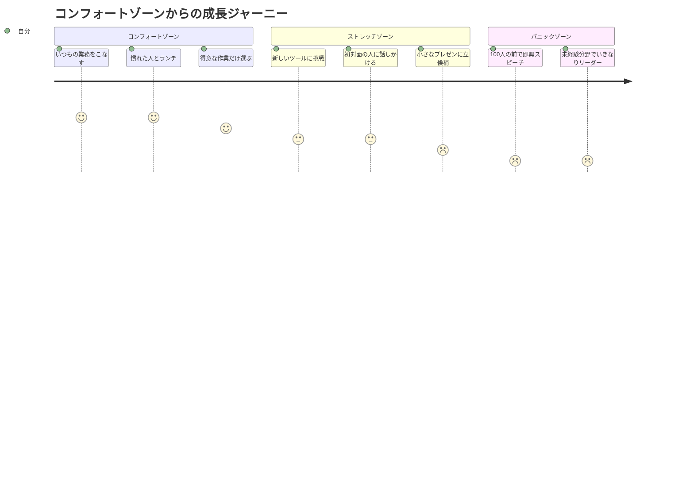
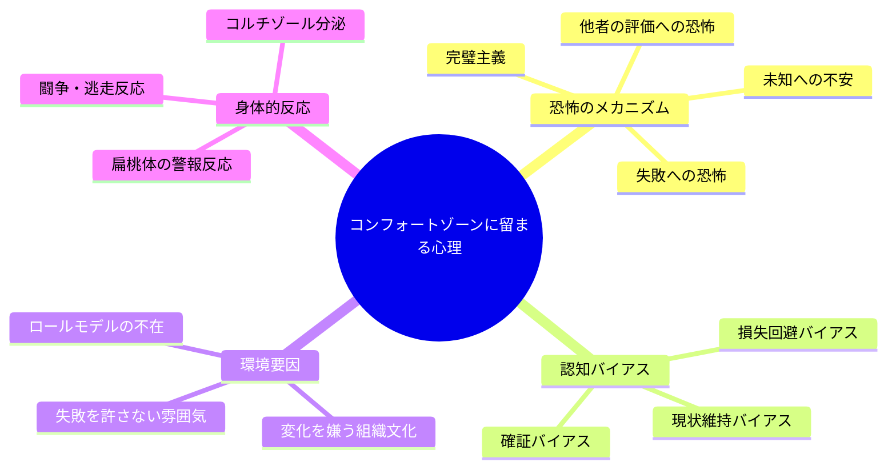
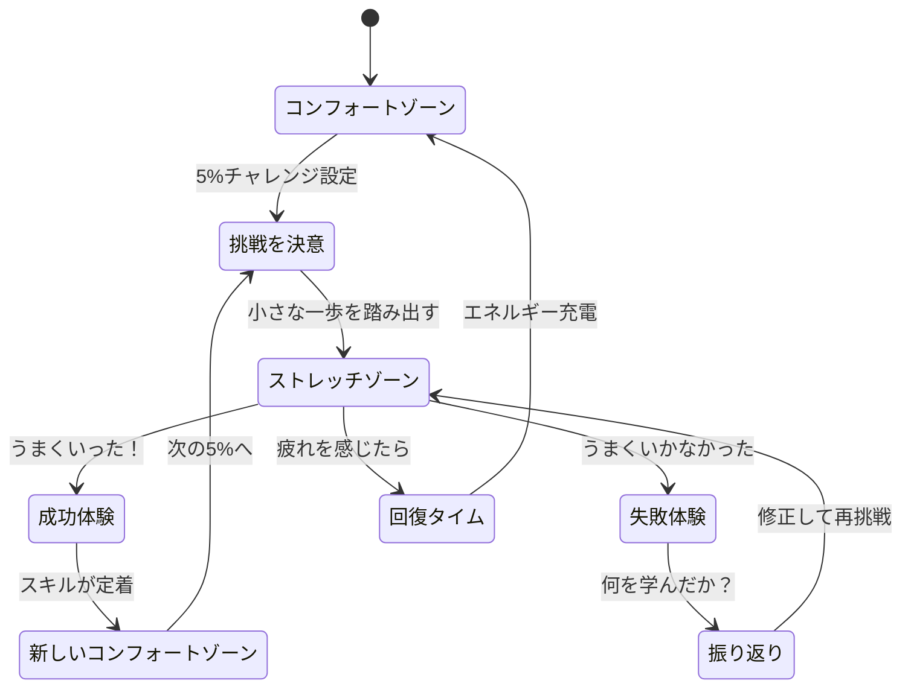

佐藤さん（29歳・ITエンジニア）は、入社5年目にしてある違和感に気づいた。毎日の業務はそつなくこなせる。上司からの評価も悪くない。でも、ここ2年間で「新しくできるようになったこと」が一つも思い浮かばない。同期の山田は社内公募でAI推進チームに異動し、週末には技術カンファレンスで登壇している。「自分は何をしていたんだろう」――そんな焦りを覚えた金曜の夜、佐藤さんは自分が「コンフォートゾーン」に閉じこもっていたことに初めて気づいた。

## コンフォートゾーンの3層構造を理解する

人間の行動領域は、大きく3つのゾーンに分かれます。この構造を正確に理解することが、安全に成長するための第一歩です。

**コンフォートゾーン**は、ストレスや不安がほとんどなく、自信を持って行動できる領域です。脳はエネルギー消費を最小化するために、ここに留まろうとする本能を持っています。

**ストレッチゾーン**は、適度な緊張と挑戦がある「成長の最適領域」です。神経科学の研究では、この適度なストレス状態で脳の神経可塑性（ニューロプラスティシティ）が最も活性化されることがわかっています。

**パニックゾーン**は、ストレスが過剰になり、思考が停止する領域です。ここに長くいるとコルチゾール（ストレスホルモン）が過剰分泌され、バーンアウトや学習性無力感を引き起こします。

成長の鍵は明確です。**パニックゾーンを避けながら、ストレッチゾーンで意図的に活動する**こと。これが「安全な挑戦」の本質です。

## なぜ人はコンフォートゾーンに閉じこもるのか

コンフォートゾーンから出られない理由を理解することは、そこから出るための戦略を立てる上で不可欠です。

特に日本のビジネス環境では、「出る杭は打たれる」文化や、失敗に対する低い許容度が、コンフォートゾーンへの固執を強化しています。しかし、VUCAの時代において「変化しないリスク」は「変化するリスク」よりもはるかに大きいのが現実です。

## 5つの実践フレームワーク：安全にゾーンを広げる

### 1. 5%チャレンジルール

今の自分から**たった5%だけ**新しいことに踏み出します。脳にとって「処理可能な範囲の新しさ」を提供することで、パニックゾーンに入らずに成長を促せます。

- プレゼンが苦手 → まずは3人のチームミーティングで1回だけ発言する
- 英語が不安 → 毎朝1つの英語ニュースの見出しだけ読む
- 人脈づくりが苦手 → 社内チャットで知らない人に1つだけリアクションをつける

### 2. 好奇心ドリブン・アプローチ

「怖いからやらなきゃ」ではなく「面白そうだから試してみよう」という動機に切り替えます。恐怖ベースの動機付けはコルチゾールを増やしますが、好奇心ベースの動機付けはドーパミンを分泌し、学習効率を高めます。

### 3. 実験マインドセット

すべての挑戦を「実験」として捉えます。実験に失敗はありません。あるのは「仮説が支持されたか、されなかったか」というデータだけです。この認知的リフレーミングにより、挑戦へのハードルが大幅に下がります。

### 4. ストレッチ＆リカバリーのリズム

挑戦の後にはコンフォートゾーンに戻って回復する時間を確保します。筋トレと同じで、負荷をかけた後の休息が成長を定着させます。週に2〜3回のストレッチチャレンジと、それ以外の日の安定した日常を意図的にデザインしましょう。

### 5. セーフティネットの構築

挑戦する前に「最悪の場合どうなるか」「そのとき誰に相談できるか」を明確にしておきます。安全基地があるからこそ、冒険に出られるのです。

## ケーススタディ：3人のコンフォートゾーン突破ストーリー

### Case 1：営業からマーケティングへの挑戦 ── 高橋さん（34歳・営業職）

高橋さんは営業成績で社内トップ5に入る実力者だった。しかし、「このままでは40代で市場価値が急落する」という危機感があった。

「営業は得意なんです。でも、得意なことだけやっていて本当にいいのかなと。デジタルマーケティングに興味はあったけど、完全に未知の世界で怖かった」

高橋さんが取った**5%チャレンジ**のステップ：

| 週 | チャレンジ内容 | 難易度 |
|---|---|---|
| 1-2週目 | マーケティング部の社内勉強会を見学 | ★☆☆☆☆ |
| 3-4週目 | Google Analyticsの無料コースを毎日15分 | ★★☆☆☆ |
| 5-6週目 | 自分の営業データをマーケ視点で分析してみる | ★★★☆☆ |
| 7-8週目 | マーケティング部に「営業×マーケ」の改善提案を持ち込む | ★★★★☆ |

結果、8週間後にはマーケティング部との合同プロジェクトのリーダーに抜擢。「1年前の自分に言いたい。『得意なことだけやってる場合じゃないよ』って」と高橋さんは振り返る。

### Case 2：人前で話せなかった技術者の変化 ── 鈴木さん（27歳・バックエンドエンジニア）

鈴木さんは優秀なエンジニアだったが、チームミーティングでほとんど発言できなかった。「自分の意見が間違っていたらどうしよう」という恐怖が常にあったという。

「会議中、頭の中では100回くらい発言を組み立てるんです。でも口に出す前に誰かが先に言ってしまう。それを繰り返すうちに、自分は発言しなくていい人間なんだと思い込むようになりました」

鈴木さんの上司は、[アイスブレイクで本音を引き出すテクニック](/blog/icebreak-draw-out-honest-thoughts)を参考に、心理的安全性の高いチーム環境を作った上で、鈴木さんに以下のステップを提案した：

1. **Slackで意見を文章で投稿する**（対面の恐怖を回避）
2. **2人だけの1on1で口頭で意見を言う**（聴衆を最小化）
3. **5人のチーム会議で1つだけ質問する**（発言のハードルを下げる）
4. **月次の部門会議で3分間の報告をする**（準備時間を十分に確保）

3ヶ月後、鈴木さんは社内LT会で15分間の技術発表を成功させた。「最初の一歩は、Slackに『これ、こうしたほうが良くないですか？』と書いただけ。たった1行が人生を変えました」

### Case 3：転職を踏み出せなかった30代の決断 ── 中村さん（36歳・経理職）

中村さんは12年間同じ会社で経理を担当していた。業務にやりがいは感じられなくなっていたが、「この歳で転職なんて」という思いが足を引っ張っていた。

「同じことの繰り返しなのに、それが安心だったんです。でも、日曜の夜に月曜のことを考えると胃が痛くなる。それでも辞められない。これって[サンクコストの罠](/blog/sunk-cost-fallacy)ですよね」

中村さんは**実験マインドセット**を採用した。「転職する」ではなく「転職市場を調査する実験をする」とリフレーミングしたことで、最初の一歩が軽くなった。

- 実験1：転職サイトに登録してスカウトが来るか確認する（結果：2週間で8件のスカウト）
- 実験2：カジュアル面談を3社受けてみる（結果：自分のスキルが意外と評価されると実感）
- 実験3：本格的に面接を受けてみる（結果：2社から内定）

「実験だと思ったら、全然怖くなかった。データを集めているだけですから」。中村さんは最終的にスタートアップのCFO候補として転職し、年収が120万円アップした。

## 「まだ」の力：失敗を成長プロセスに変換する

コンフォートゾーンを広げる過程で失敗は避けられません。重要なのは、失敗に対する**認知フレーム**を変えることです。

スタンフォード大学のキャロル・ドゥエック教授が提唱した「グロースマインドセット」の中核にあるのが、「**まだ（yet）**」という言葉の力です。

- 「プレゼンができない」→「プレゼンが**まだ**できていない」
- 「英語で会議ができない」→「英語で会議が**まだ**できていない」
- 「リーダーシップを発揮できない」→「リーダーシップを**まだ**発揮できていない」

たった2文字を加えるだけで、「固定された能力の限界」が「成長の途中経過」に変わります。[レジリエンスの高め方](/blog/resilience)でも触れている通り、回復力の高い人は失敗を「終わり」ではなく「通過点」として捉えています。

## 今日から始める「コンフォートゾーン拡張プラン」

理論を知っているだけでは何も変わりません。[ポモドーロ・テクニック](/blog/pomodoro-technique)のように、小さく区切って実行することが大切です。以下の3ステップを、今日から試してみてください。

**ステップ1：自分のコンフォートゾーンを書き出す（10分）**
紙やメモアプリに「自分が楽にできること」「避けていること」「やりたいけど怖いこと」を書き出します。自分のゾーンの境界線を可視化することが、最初の一歩です。

**ステップ2：5%チャレンジを1つ決める（5分）**
「避けていること」リストの中から、最も小さく・最もリスクの低いものを1つ選びます。「失敗しても笑い話になるレベル」が目安です。

**ステップ3：48時間以内に実行する**
決めたら48時間以内に実行します。時間が経つほど脳は「やらない理由」を巧みに作り出します。完璧でなくていい。「やった」という事実が、次の挑戦への自信になります。

---

## あなたの「最初の5%」を一緒に見つけませんか？

コンフォートゾーンを広げたいけれど、何から始めればいいかわからない。そんなとき、第三者の視点が突破口になることがあります。体験セッションでは、あなたの現在地を一緒に整理し、無理のない「最初の5%チャレンジ」を具体的に設計します。

[体験セッションに申し込む](/sessions)
