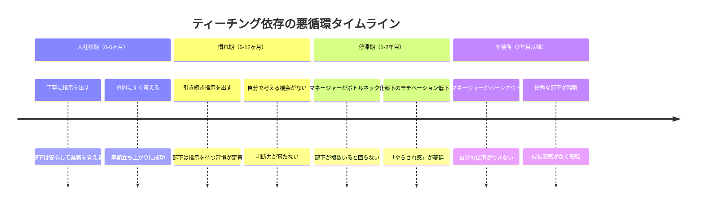
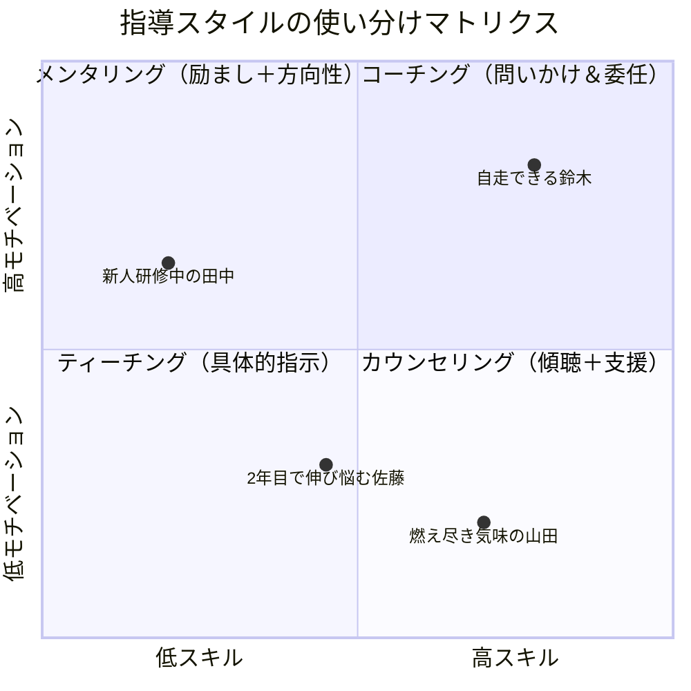
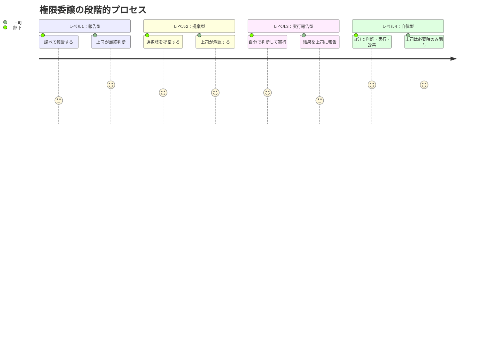

「すみません、これどうしたらいいですか？」――木村さん（38歳・開発チームマネージャー）は、部下の田中から1日に平均12回この質問を受けていた。Slackの通知が鳴るたびに手が止まり、自分のタスクはいつも後回し。ある日、退社時刻が23時を超えたとき、ふと気づいた。「自分が丁寧に教えれば教えるほど、田中は自分で考えなくなっている」。木村さんが直面していたのは、多くのマネージャーが陥る**ティーチングの罠**だった。

## ティーチングの限界：「良い上司」が組織を弱くする逆説

ティーチング（答えを教える指導法）は、新人研修や緊急時には有効です。しかし、長期的に続けると深刻な副作用が生じます。

**依存の構造化**：指示を与え続けると、部下は「上司に聞けば正解がもらえる」と学習します。これは部下の怠慢ではなく、マネージャーが無意識に作った**学習された無力感**です。

**創造性の窒息**：「正解」を与え続けると、部下は正解以外の選択肢を考えなくなります。イノベーションの芽が、丁寧な指導によって摘み取られるのです。

**責任の希薄化**：「上司に言われた通りにやった」という言い訳が成立する環境では、当事者意識は育ちません。

**スケーラビリティの欠如**：マネージャー1人のキャパシティが、チーム全体の上限になります。部下が5人になれば、1日60回の質問に対応することになります。

## ティーチングとコーチングの本質的な違い

ティーチングとコーチングは対立概念ではなく、**状況に応じて使い分ける補完的なスキル**です。

| 項目 | ティーチング | コーチング |
|---|---|---|
| 基本姿勢 | 「答えを教える」 | 「答えを引き出す」 |
| 主語 | マネージャー | 部下本人 |
| 効果が出るまで | 即効性がある | 時間がかかる |
| 長期的効果 | 依存を生みやすい | 自律性が育つ |
| マネージャーの負荷 | 短期的に低い、長期的に高い | 短期的に高い、長期的に低い |
| 適する場面 | 緊急時、完全に未知の領域 | 部下にある程度の知識がある場面 |

## コーチング転換の5つの実践テクニック

### テクニック1：「質問リダイレクト」

部下が「どうしたらいいですか？」と聞いてきたら、答えを返す前に**必ず質問で返す**。

- 「あなたはどう思う？」
- 「どんな選択肢が考えられる？」
- 「もし自分が決めるとしたら、どうする？」

最初は沈黙が続きます。この**沈黙に耐える力**がコーチングの核心です。10秒、20秒、時には30秒。相手が考えている証拠だと捉え、じっと待ちましょう。

### テクニック2：「70点GO」ルール

部下の提案が70点以上なら、修正せずにそのまま実行させます。100点を求めて毎回修正すると、部下は「どうせ直されるなら考えても無駄」と学習します。70点で走らせ、結果から学ばせるほうが、長期的には遥かに効果的です。

### テクニック3：「失敗の事前許可」

プロジェクト開始時に「このプロジェクトでは、致命的でない失敗は歓迎する。失敗したら、何を学んだかだけ教えてほしい」と明言します。[フィードバックを成長に変えるマインドセット](/blog/feedback-mindset)でも解説している通り、心理的安全性がなければ挑戦は生まれません。

### テクニック4：「振り返りの儀式化」

週に1回、15分の振り返りタイムを設けます。3つの問いだけを使います：

1. 「今週、自分で判断できたことは何？」
2. 「迷ったとき、どう考えて決めた？」
3. 「来週、自分で決めたいことは何？」

### テクニック5：「段階的権限委譲」

一気に全権を委譲するとパニックゾーンに入ります。段階的に権限の範囲を広げていきましょう。

## ケーススタディ：3人のマネージャーの転換ストーリー

### Case 1：質問地獄から脱出した木村さん（38歳・開発チームマネージャー）

冒頭の木村さんは、ある月曜日から「質問リダイレクト」を実践し始めた。

「最初の1週間は地獄でした。田中に『どう思う？』と返すと、彼は困った顔をして黙る。その沈黙が耐えられなくて、つい答えを言いそうになる。でも、歯を食いしばって待ちました」

最初の2週間は、チームの意思決定スピードが40%低下した。しかし3週目から変化が起きた。

「田中が『自分はAだと思うんですけど、どうですか』と聞いてくるようになったんです。質問の質が変わった。『どうしたらいいですか？』から『Aで合ってますか？』に変わった」

2ヶ月後のデータ：
- 田中からの質問回数：1日12回 → 1日3回（75%減）
- 木村さんの残業時間：月40時間 → 月15時間（62%減）
- チームの自律的な意思決定数：週2件 → 週11件（5.5倍）

「今は逆に、田中が後輩に『どう思う？』と聞いている。コーチングは伝染するんですね」

### Case 2：ベテラン社員の扱いに悩んでいた渡辺さん（42歳・営業部長）

渡辺さんの課題は、50代のベテラン社員・大島さん（53歳）だった。大島さんは経験豊富だが、新しい営業手法（デジタルツールの活用）に強い抵抗を示していた。

「最初はティーチングで押し通そうとしました。『このツールを使ってください』と。でも大島さんは『前のやり方で十分だ』と反発するばかり。」

渡辺さんは[AI時代の「問う力」](/blog/ai-era-question-power)のアプローチを参考に、指示ではなく問いかけに切り替えた。

「大島さん、お客様から『他社はオンラインで即見積もりが出るのに』と言われたとき、どう感じますか？」

この問いかけが転機になった。大島さん自身が「このままではまずい」と気づいたのだ。

「自分で気づいたことは、人に言われたことの10倍強い。大島さんは今では新人にデジタルツールの使い方を教えています。教え方は少し古風ですけどね（笑）」

### Case 3：「優しすぎる」マネージャーの変革 ── 小林さん（31歳・マーケティングチームリーダー）

小林さんは部下思いの優しいリーダーだったが、その「優しさ」がチームの成長を阻んでいた。

「部下が少しでも困っていると、すぐに手を出してしまう。仕事を巻き取ってしまう。結果的に、私だけが忙しくて、チームメンバーは暇。しかも彼らは『成長できない』と不満を持っていた。良かれと思ってやっていたことが、逆効果だったんです」

小林さんが導入したのは「70点GO」ルールだった。

「最初は本当につらかった。部下の企画書を見て、『ここ、こうしたほうがいいのに』と100箇所くらい直したくなる。でも70点なら出す。実際に出してみると、クライアントの反応は悪くない。私の100点とチームの70点は、チーム全体の成長を考えたら、70点のほうが価値が高い」

半年後の結果：
- チームメンバーの企画提出数：月3件 → 月12件（4倍）
- 小林さんの企画書レビュー時間：週10時間 → 週3時間（70%減）
- チーム満足度スコア（社内サーベイ）：3.2 → 4.6（5点満点）

## コーチング転換でよくある失敗と対策

**失敗1：一気にコーチングに切り替える**
昨日まで全部教えてくれた上司が、突然「自分で考えて」と言い出したら、部下は混乱します。「来月からは、Aの領域について自分で判断してほしい。その代わりBの領域は引き続きサポートする」と、段階的に移行しましょう。

**失敗2：緊急時にもコーチングを使う**
納期が今日の案件で「あなたはどう思う？」とやっている場合ではありません。緊急度が高い場面ではティーチング、余裕がある場面ではコーチングと、意識的に使い分けます。

**失敗3：答えを誘導する**
「Aだと思わない？」は質問ではなく、指示の変形です。オープンクエスチョンで、本当に相手の考えを引き出すことを意識しましょう。

## 今日から実践できる「コーチング転換」3ステップ

**ステップ1：明日の会議で「1回だけ」質問で返す**
部下から質問されたとき、1回だけ「あなたはどう思う？」と返してみましょう。全部をコーチングに変える必要はありません。まず1回。[朝のルーティン](/blog/morning-routine)に「今日は1回コーチングする」と書くだけでも意識が変わります。

**ステップ2：「沈黙カウント」を始める**
質問で返した後、心の中で10秒数えてください。ほとんどの場合、10秒以内に相手が何か話し始めます。この10秒間が、部下の思考力を鍛える黄金の時間です。

**ステップ3：1週間後に振り返る**
1週間コーチングを意識したら、「部下の質問の質がどう変わったか」をメモしてください。「どうしたらいいですか？」が「Aで進めていいですか？」に変わっていたら、コーチング転換は確実に始まっています。

---

## あなたのチームに合った「コーチング転換」を一緒に設計しませんか？

「理論はわかったけど、うちのチームでどう始めればいいかわからない」「特定の部下への接し方に悩んでいる」――そんな方には、体験セッションでお話を伺いながら、あなたのチーム状況に最適なコーチング転換プランを一緒に作ります。

[体験セッションに申し込む](/sessions)
