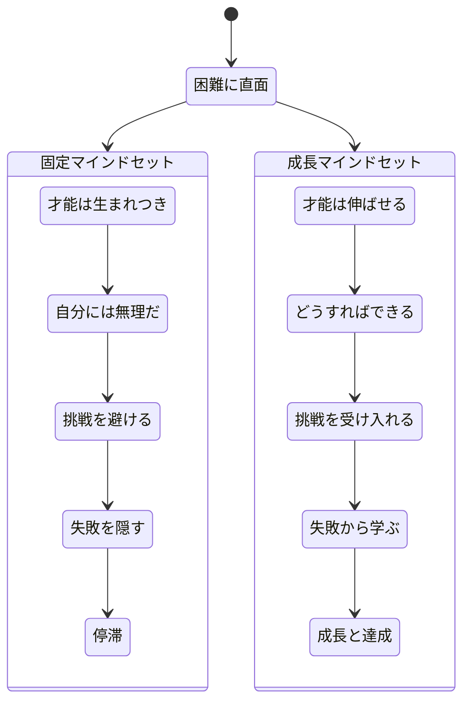
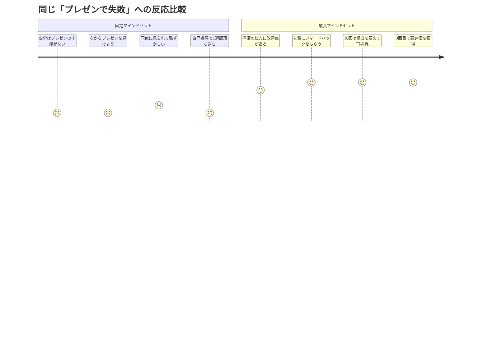
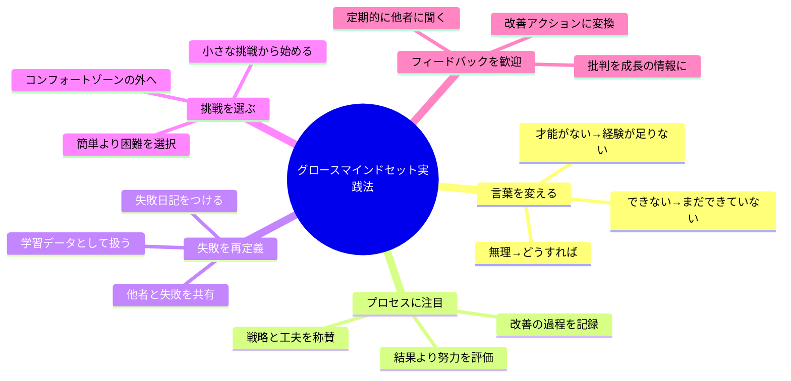

佐藤さん（28歳・エンジニア）は、新しいプログラミング言語の勉強を始めて3日で挫折した。「やっぱり自分にはセンスがないんだ」。そう呟いてテキストを閉じた彼女に、先輩の中村さんはこう言った。「佐藤さん、それ"固定マインドセット"の罠にハマってるよ。才能って、生まれつきじゃなくて育てるものなんだ」。この一言が、佐藤さんのキャリアを大きく変えることになる。

## グロースマインドセットとは何か

スタンフォード大学のキャロル・ドウェック教授が30年以上の研究で明らかにした概念。人間のマインドセットは大きく2つに分かれる。

**フィックスマインドセット（固定マインドセット）**は、才能や知的能力は生まれつき決まっていて変えられないという信念だ。このマインドセットを持つ人は、失敗を「能力の欠如」の証拠と捉え、挑戦を避ける傾向がある。

**グロースマインドセット（成長マインドセット）**は、才能や能力は努力・学習・経験によって成長できるという信念だ。失敗を「学習の機会」として捉え、挑戦を歓迎する。

ドウェック教授の研究によると、グロースマインドセットを持つ人は困難に直面しても諦めず、結果としてより高い成果を達成する。

## 同じ状況でもマインドセットで反応が変わる

「状況」は変えられなくても、「解釈」は変えられる。これがグロースマインドセットの核心だ。

具体的なシーン別の違いを見てみよう。

**困難な課題に直面した時**
- 固定：「自分には無理だ。才能がない」 → 諦める
- 成長：「まだできていない。練習すればできるようになる」 → 挑戦し続ける

**失敗した時**
- 固定：「自分は失敗者だ。能力がない証拠だ」 → 自己否定
- 成長：「学習の機会だ。次はどうすれば良いか」 → 分析と改善

**他人の成功を見た時**
- 固定：「あの人は才能がある。私とは違う」 → 嫉妬や脱力感
- 成長：「あの人は努力した結果だ。私も学べる」 → 刺激と学習の機会

**努力について**
- 固定：「努力するのは才能がない証拠だ」 → 努力を嫌う
- 成長：「努力は能力を育てる手段だ」 → 努力を歓迎する

## ケーススタディ1：エンジニアの佐藤さんの場合

冒頭の佐藤さんは、先輩のアドバイスをきっかけにグロースマインドセットを意識するようになった。

**Before**：新しい技術に触れるたびに「自分には向いていない」と感じ、3日で挫折。入社2年目でスキルセットが入社時とほぼ同じ状態だった。

佐藤さんが実践したこと：
1. 「できない」を「まだできていない」に言い換える習慣をつけた
2. 学習記録をつけ、1週間前の自分と比較するようにした
3. エラーが出たら「学習データが増えた」と捉え直した

**After**：6ヶ月後、新しいプログラミング言語を習得し、社内プロジェクトのリーダーに抜擢。「あのとき"まだ"という言葉を覚えたことが全てを変えた」と佐藤さんは振り返る。学習継続率は3日から平均42日に伸びた。

## ケーススタディ2：営業マネージャーの鈴木さんの場合

鈴木さん（41歳・営業マネージャー）は、部下の成績が伸び悩んでいることに頭を抱えていた。

**Before**：「あいつは営業センスがない」「この子は数字に弱い」と、部下を固定的な評価で見ていた。チーム全体の達成率は目標の72%。離職率は年間25%と高かった。

鈴木さんが変えたこと：
1. 部下への声かけを変えた。「結果が出なかったね」→「このアプローチから何を学んだ？」
2. 週次の1on1で、失敗を共有する時間を設けた。鈴木さん自身も失敗談を話した
3. 「今月の成長ポイント」を評価項目に追加した

「最初は部下に『急にどうしたんですか？』と怪訝な顔をされました」と鈴木さんは笑う。

**After**：1年後、チームの目標達成率は72%から94%に改善。離職率は25%から8%に低下。「人を"才能"で見なくなってから、チームが劇的に変わった」と鈴木さんは語る。

## ケーススタディ3：転職活動中の山田さんの場合

山田さん（35歳・経理職）は、30代半ばでのキャリアチェンジに不安を感じていた。

**Before**：「35歳で未経験の分野に行くなんて無謀だ」「若い人にはかなわない」と考え、転職サイトを開いては閉じる日々。3ヶ月間、1社も応募できなかった。

山田さんのマインドシフト：
1. 「35歳だから遅い」→「35歳の経験があるから価値がある」と再定義
2. 不採用を「自分に合わない企業が分かった」というデータとして捉えた
3. 毎日1つ、新しい分野の知識をインプットする習慣を始めた

**After**：転職活動開始から4ヶ月、IT企業のプロジェクトマネージャー職に内定。「経理の細かい数字管理の経験が、プロジェクト管理で活きている」と山田さん。面接で不採用になった8社の経験も、面接スキルの向上に直結した。

## グロースマインドセットを培う5つの実践法

### 1. 「まだ」の魔法を使う

「できない」を「まだできていない」に変えるだけで、脳の認知が変わる。この一語が「成長の途上にいる自分」を肯定する。

**今日からできること**：スマホのロック画面に「まだ、の途中」と書いた画像を設定する。1日に3回は「まだ」を使う場面を意識する。

### 2. プロセスを称賛する

結果だけでなく、そこに至る努力・戦略・工夫を評価する習慣をつける。自分に対しても、周囲に対しても。

「良い成績だね」→「あの勉強法は効果的だったね」
「すごい成果だ」→「粘り強く取り組んだ姿勢が素晴らしい」

### 3. 失敗を「学習データ」として記録する

失敗を「能力の欠如」ではなく「次に活かせるデータ」として扱う。週に1回、以下のフォーマットで振り返りをする。

- **何が起きたか**：事実のみ記録
- **何を学んだか**：気づきを言語化
- **次にどうするか**：具体的なアクション

### 4. 意図的にコンフォートゾーンの外に出る

「簡単にできること」ばかり選んでいると、成長は止まる。週に1つ、「ちょっと難しい」タスクを意図的に選ぶ。

### 5. フィードバックを積極的に求める

批判的なフィードバックこそ「成長のための情報」だ。月に1回は信頼できる人に「自分の改善点は何か」を聞いてみよう。フィードバックの受け取り方についてさらに詳しくは、[フィードバックを味方にする方法](/blog/feedback-mindset)も参考にしてほしい。

## 組織・教育への応用

グロースマインドセットは個人だけでなく、チームや組織にも応用できる。

**教育の場面**：子供や生徒に対して、結果ではなく努力とプロセスを称賛する。「頭が良いね」ではなく「よく頑張ったね」「良い方法を見つけたね」とフィードバックする。

**マネジメント**：部下の失敗を責めるのではなく、学習の機会として扱う。鈴木さんのケースのように「何を学んだか」「次はどうするか」を問うことで、成長を促す。

**組織文化**：「挑戦を歓迎し、失敗から学ぶ」文化を作る。リーダーが自らの失敗を共有することで、心理的安全性が高まり、チーム全体のパフォーマンスが向上する。

## よくある誤解を解く

**「努力すれば何でもできる」ではない**。グロースマインドセットは「努力すれば必ず成功する」という意味ではない。努力は能力を育てる手段であり、方向性や戦略も重要だ。

**「現状を肯定する」わけではない**。今の能力の低さを受け入れて終わりではなく、「ここから伸びる」という成長の可能性を信じるものだ。

**「全てが努力で決まる」わけではない**。環境や機会、周囲のサポートなどの外的要因も重要。グロースマインドセットは、自分がコントロールできる「内面の信念」に焦点を当てたものだ。

## レジリエンスとの相乗効果

グロースマインドセットは、[レジリエンス（回復力）](/blog/resilience)と密接に関わっている。困難から立ち直る力と、困難を成長の機会と捉える力は、互いを強化し合う。

また、キャリアの転換期にいる方は、[30代のキャリアチェンジガイド](/blog/30s-career-change-guide)と合わせて読むと、山田さんのような実践的な一歩が踏み出しやすくなるだろう。

## 今日から始める3つのアクション

1. **「まだ」リストを作る**：今「できない」と思っていることを3つ書き出し、全て「まだできていない」に書き換える（所要時間：5分）
2. **失敗日記を始める**：今日の小さな失敗を1つ記録し、「何を学んだか」を書く（所要時間：3分）
3. **声かけを変える**：自分や周囲に対して「結果」ではなく「プロセス」を1回褒める（所要時間：1分）

---

## あなたの「まだ」を一緒に見つけませんか？

「自分には才能がない」と感じている分野、実は"まだ"伸びしろがあるだけかもしれません。体験セッションでは、あなたの思考パターンを一緒に分析し、グロースマインドセットへの切り替えポイントを具体的にお伝えします。

[→ 体験セッションに申し込む](/sessions)
