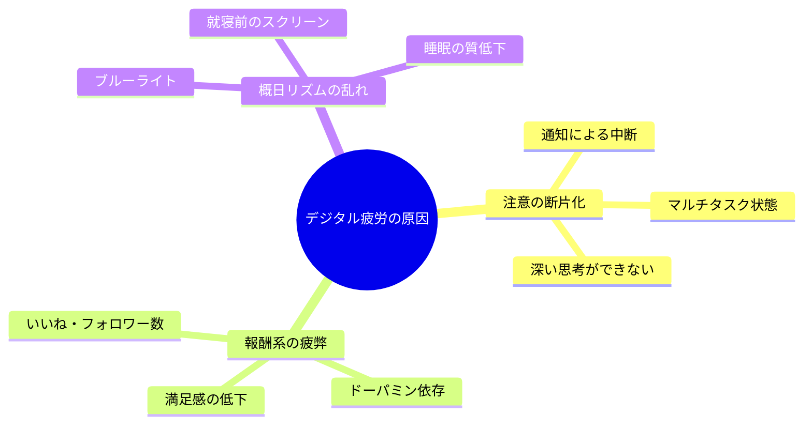
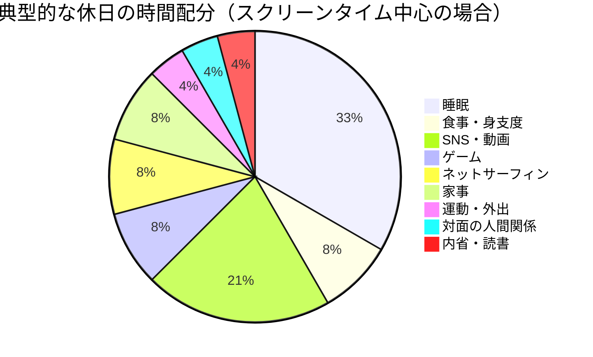
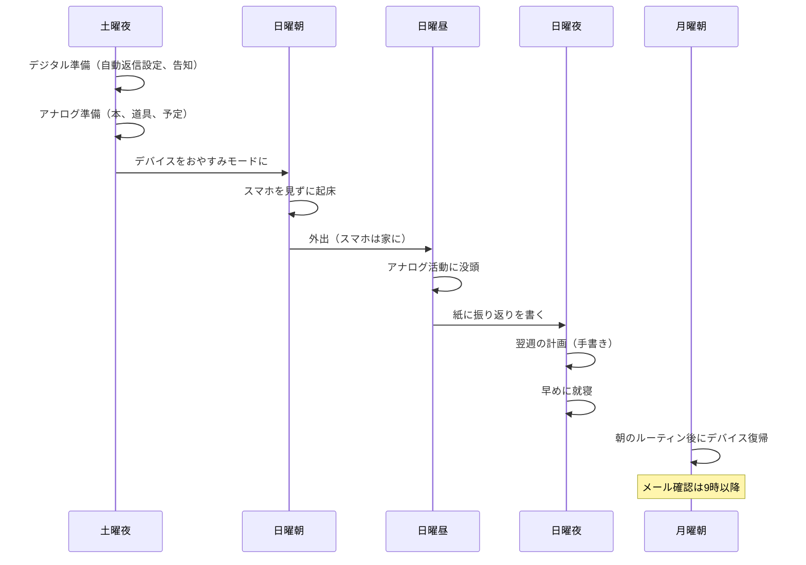

日曜の夜22時、IT企業マーケターの三浦碧（28歳）はベッドの中でInstagramをスクロールしていた。「あと5分だけ」──気づけば深夜1時。目が冴えて眠れない。翌朝の月曜は案の定、ぼんやりしたまま午前中が終わった。会議中にSlackの通知が気になり、企画書を書いている途中でニュースサイトを開き、気づけば17時。「今日、何か成果を出しただろうか？」三浦は自問した。この「生産性のない月曜日」は、実は日曜の過ごし方に原因があった。

この記事では、三浦のように「デジタル漬けの週末」を過ごしている人に向けて、**週1回のデジタル断食**で脳をリセットし、月曜日から高いパフォーマンスを発揮する具体的な方法を解説します。

## デジタル疲労の科学──なぜ「休日にスマホ」では休めないのか

### 脳が休まらない3つの理由

カリフォルニア大学アーバイン校の研究によれば、スマートフォンを1日に平均96回確認する人の注意持続時間は、そうでない人と比較して47%短いことがわかっています。さらに、中断された作業に戻るまでに平均23分15秒かかるというマイクロソフトリサーチのデータもあります。

つまり、スマホを触りながらの「休日」は、脳にとって休息ではなく**負荷**なのです。

### 現代人のスクリーンタイムの実態

日本人の平均スクリーンタイムは1日約7.5時間（総務省調査）。週末に限ると、「自由に使える時間」のほぼすべてがスクリーンの前で消費されているケースも珍しくありません。

このように、1日の約9時間（5+2+2）がスクリーン前の活動です。これでは、脳は平日と同じ「情報処理モード」から切り替わりません。

## デジタル断食の効果──何が変わるのか

### 3つの回復効果

**1. 注意力の回復**
デジタルデバイスから離れることで、「注意の断片化」が修復されます。自然環境で過ごした場合、注意回復の効果はさらに高まります（ART理論：Attention Restoration Theory）。

**2. 創造性の復活**
脳がデフォルトモードネットワーク（DMN）に入りやすくなり、創造的思考が活性化します。偉大な発見やアイデアの多くは、シャワー中や散歩中──つまり「何もしていない」ときに生まれています。

**3. 睡眠の質向上**
就寝前3時間のスクリーンタイムを排除するだけで、メラトニンの分泌が正常化し、入眠潜時が平均14分短縮されるという研究結果があります。

## 3段階のデジタル断食プラン

### レベル1：ライト断食（入門者向け・4時間）

**対象：** デジタル断食が初めての人
**時間：** 日曜日の午後13:00〜17:00

**ルール：**
- SNSアプリを見ない
- メール・チャットを確認しない
- 動画サービスを使わない
- ニュースサイトを開かない

**許可すること：**
- 電話（通話のみ）
- 音楽再生
- 地図アプリ（外出時のみ）
- カメラ

**おすすめ活動：**
- 公園や自然の中を散歩する
- 紙の本を読む
- カフェで友人と会う
- 料理をする

### レベル2：スタンダード断食（標準・12時間）

**対象：** ライト断食に慣れた人
**時間：** 日曜日の7:00〜19:00

**ルール：**
- スマホは「おやすみモード」にして別室に置く
- PCは起動しない
- テレビは見ない

**許可すること：**
- 緊急の電話のみ
- 紙の本・雑誌
- アナログな音楽（ラジオ、CDなど）

**おすすめ活動：**
- 朝のジョギングや散歩
- 美術館・博物館に行く
- 友人や家族とボードゲーム
- 手書きのジャーナリング

### レベル3：フル断食（上級者向け・24時間）

**対象：** デジタル断食の効果を実感している人
**時間：** 土曜日21:00〜日曜日21:00

**ルール：**
- 全デバイスの電源を切り、引き出しにしまう
- 時計もアナログ式を使う
- 人工的なエンターテイメントは最小限

**おすすめ活動：**
- 日帰り旅行（電車の中では紙の本）
- キャンプやハイキング
- 陶芸や絵を描くなどの手作業
- 瞑想・ヨガ

## ケーススタディ1：三浦碧の月曜革命（ITマーケター・28歳）

冒頭の三浦碧は、まずレベル1の「4時間断食」から始めた。

「正直、最初の30分は手持ち無沙汰でした。スマホに手が伸びそうになるんです。でも、近所のカフェに紙の本を持って行ったら、2時間があっという間に過ぎた。こんなに集中して本を読めたのは何年ぶりだろう、と思いました」

4週間のレベル1実践後、三浦はレベル2（12時間）に移行。

「日曜を『デジタルなし』で過ごした翌日の月曜が、明らかに違うんです。頭がクリアで、午前中に企画書の骨子が書ける。以前は午前中ずっとぼんやりしていたのに」

**三浦の変化（2ヶ月後）：**
- 月曜午前の集中力（自己評価10段階）：3 → 8
- 月曜日のタスク完了数：平均2.1 → 平均4.8
- 睡眠の質（Sleep Cycle計測）：平均スコア62 → 79
- 週のストレスレベル：「明らかに下がった。日曜のリセットがあるから、金曜に追い込まれても『日曜に充電できる』と思える」

## ケーススタディ2：高橋誠一の家族関係改善（営業部長・45歳）

高橋誠一は、妻から「週末も仕事のメールばかり見てるよね」と指摘されていた。中学生の娘からは「パパ、いつもスマホいじってるよね」と言われ、衝撃を受けた。

「子どもの話を聞いてるつもりだったんですが、実際はスマホを片手に『うんうん』と生返事をしていたんです。娘がそれを見ていた」

高橋が始めたのは「家族デジタル断食」。日曜日は家族全員でデバイスを引き出しに入れ、一緒にアナログな活動をするルールにした。

「最初は中学生の娘が猛反発しましたよ。でも、ボードゲームを始めたら意外と盛り上がって。『パパ、なんで毎週この日を作らなかったの？』と逆に言われました」

**高橋家の変化（3ヶ月後）：**
- 家族の会話時間（日曜日）：平均15分 → 平均3時間
- 娘の「パパと過ごしたい」発言回数：月0回 → 月4回
- 妻の満足度（本人談）：「夫が『ここにいる』と感じるようになった」
- 高橋自身：「月曜日に仕事で良いアイデアが出るようになった。家族との会話が、意外と仕事のヒントになっている」

## ケーススタディ3：岡田彩乃の睡眠改善（Webデザイナー・30歳）

岡田彩乃は慢性的な不眠に悩んでいた。毎晩ベッドでスマホを見てから寝る習慣があり、入眠に1時間以上かかることも珍しくなかった。

「22時にベッドに入るんですが、X（旧Twitter）を見始めると止まらない。気づくと0時を過ぎていて、そこから目が冴えて1時まで眠れない。毎朝6時起きなので、常に寝不足です」

岡田が導入したのは「段階的デジタルサンセット」。

**デジタルサンセットのルール：**
- 日曜日のみ、19時以降すべてのデバイスをオフにする
- 19時〜22時は紙の本、ストレッチ、ジャーナリングで過ごす
- アロマキャンドルとアナログ音楽で「切り替え」の合図を作る

「最初の日曜日、19時にスマホを切ったとき、正直不安でした。でもアロマの香りの中で本を読んでいたら、自然と眠くなって21時半に就寝。翌朝5時半に自然に目が覚めたとき、体が軽くて驚きました」

**岡田の変化（1ヶ月後）：**
- 日曜夜の入眠時間：平均65分 → 平均12分
- 月曜朝の疲労感（10段階）：8 → 3
- 「デジタルサンセット」の平日への拡張：水曜・金曜にも実施開始
- 肌荒れ：「なぜか改善した。睡眠の質が上がったからだと思う」

## デジタル断食を成功させるための準備

### 事前の心構え

**FOMO（Fear of Missing Out：見逃し恐怖）への対処**

デジタル断食で最大の障壁は「何かを見逃すのではないか」という不安です。しかし、実際には：

- 日曜日に見逃した情報の99%は、月曜日にキャッチアップできる
- 「緊急の連絡」と思っているものの大半は、翌日で間に合う
- むしろ、情報から距離を置くことで「本当に重要なこと」が見えてくる

[朝のルーティン](/blog/morning-routine)と組み合わせると、月曜朝の復帰がスムーズになります。

### 周囲への事前告知

- 「日曜はデジタル断食をしています」と関係者に伝える
- 緊急連絡先（家族の電話番号など）を共有する
- SNSのプロフィールに「日曜は返信遅れます」と記載する

## 効果を最大化するための組み合わせ

デジタル断食単体でも効果はありますが、他の習慣と組み合わせることでさらに効果が高まります。

- **[ポモドーロ・テクニック](/blog/pomodoro-technique)** と組み合わせ：月曜日の集中力を活かして、ポモドーロで一気にタスクを進める
- **[ディープワーク](/blog/deep-work)** と組み合わせ：デジタル断食で回復した注意力を、月曜午前のディープワーク時間に充てる

## 効果測定：何を記録すべきか

デジタル断食の効果を実感するために、以下の指標を週単位で記録しましょう。

| 指標 | 測定方法 | 期待される変化 |
|------|---------|-------------|
| 月曜午前の集中力 | 自己評価（10段階） | 2〜3ポイント向上 |
| 月曜のタスク完了数 | タスク管理ツール | 1.5〜2倍に増加 |
| 睡眠の質 | 睡眠アプリのスコア | 10〜20ポイント向上 |
| 週のストレスレベル | 自己評価（10段階） | 2〜3ポイント低下 |
| 創造的アイデアの数 | メモに記録 | 週2〜3個増加 |

4週間継続すれば、データに明確な変化が現れるはずです。

## 今週の日曜日、4時間だけ試してみませんか

デジタル断食は「我慢」ではありません。脳に必要な回復時間を与え、自分自身と周囲の人との質の高い時間を取り戻す行為です。

**今週のアクションプラン：**
1. 今日：日曜の午後4時間のスケジュールを空ける
2. 土曜夜：スマホの自動返信を設定し、読みたい本を準備する
3. 日曜午後：4時間、デバイスから離れて過ごす
4. 月曜朝：「いつもと違う」感覚があるか、メモする

---

## あなたの「デジタルとの付き合い方」を一緒にデザインしませんか？

「スマホを手放せない」「週末も仕事のことが頭から離れない」──その状態が続くと、パフォーマンスだけでなく、人間関係や健康にも影響が出ます。体験セッションでは、あなたの生活パターンに合わせた「デジタル断食プラン」と、月曜日から最大のパフォーマンスを発揮するための週末の過ごし方を一緒に設計します。

[あなた専用のデジタル断食プランを作る（体験セッション）](/sessions)
