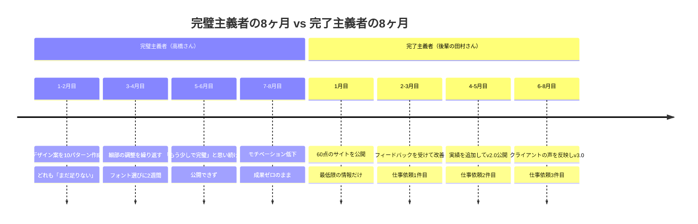
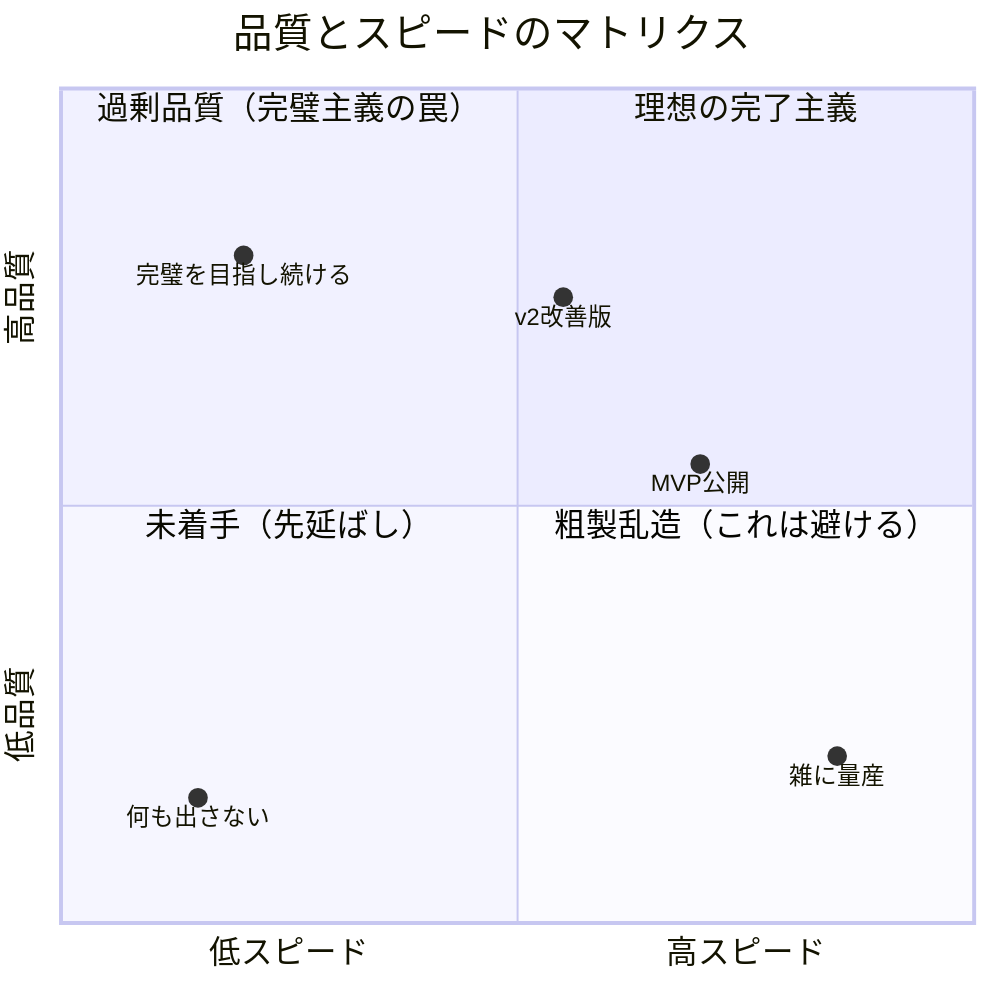

高橋さん（34歳・Webデザイナー）は、個人ポートフォリオサイトの制作に8ヶ月かけていた。「フォントの組み合わせがまだ納得いかない」「アニメーションをもう少し滑らかにしたい」。気づけば同期の後輩が先にポートフォリオを公開し、そこから仕事の依頼を3件獲得していた。高橋さんのサイトは、まだローカル環境にしかなかった。

## 完璧主義が奪うもの

完璧を目指すこと自体は悪くない。問題は、完璧を理由に「完了」を先延ばしにすることだ。

### 完璧主義が引き起こす4つの問題

**1. アクションの永久先延ばし**
「準備が整ったら始める」は、永遠に来ない。完璧な準備など存在しないからだ。

**2. 機会の損失**
市場のタイミングや機会は、あなたの完璧を待ってくれない。準備をしている間に、競合に先を越されたり、トレンドが過ぎ去ったりする。

**3. フィードバック不在の独りよがり**
一人で完璧を追求していると、外部からのフィードバックが得られない。結果として、誰も求めていないものが出来上がるリスクが高まる。

**4. 精神的な消耗**
終わりのない改善は、ストレスと不安を増大させる。永遠に満足できない状態は、[決断疲れ](/blog/decision-fatigue)にもつながる。

## 「完了」が生む好循環

「まずは終わらせる」ことで、以下の好循環が生まれる。

**リアルなフィードバックの獲得**：世に出したものに対して、実際のユーザーからの反応が得られる。これは自分だけで完璧を追求するより、はるかに価値のある情報だ。

**学習サイクルの加速**：完成→フィードバック→改善のサイクルを早く回せるため、実質的な成長速度が上がる。

**自己効力感の構築**：「終わらせた」という経験が積み重なることで、次の挑戦への自信が生まれる。

## ケーススタディ1：デザイナーの高橋さん、その後

先輩に「とにかく今週中に公開しろ」と言われた高橋さんは、渋々60点のサイトを公開した。

**Before**：8ヶ月間制作し続け、公開ゼロ。仕事の依頼もゼロ。「もっと良くなってから」が口癖。

高橋さんが変えたこと：
1. 「完璧なポートフォリオ」→「今の実力を見せるポートフォリオ」と目的を再定義
2. 公開後に届いたDMで「作品の説明文が分かりにくい」というフィードバックを受け、即日修正
3. 2週間ごとにアップデートする「更新サイクル」を設定

**After**：公開から3ヶ月で4件の仕事依頼。「8ヶ月かけて0点だったものが、60点で出した瞬間に動き出した。完璧は、出してから追いかければいい」と高橋さんは語る。

## ケーススタディ2：起業準備中の伊藤さんの場合

伊藤さん（29歳・会社員）は、副業でオンライン英会話サービスを立ち上げようとしていた。

**Before**：事業計画書を6回書き直し、ロゴを3回デザインし直し、料金プランを何度もシミュレーション。1年経っても生徒はゼロ。「まだビジネスモデルが完成していない」が理由だった。

伊藤さんのターニングポイント：
- 知人に「最初の生徒を1人見つけるだけでいいんじゃない？」と言われた
- その週末、SNSで「英会話の練習相手になります。1回500円」と投稿
- 3日後に最初の申し込みが来た

**After**：最初の1人から始めて、口コミで広がり、半年後には月20人の生徒を抱えるまでに成長。料金体系もレッスン内容も、生徒のフィードバックを元に何度も変えた。「事業計画書の6回目の書き直しより、最初の1回のレッスンの方がはるかに学びが多かった」と伊藤さん。売上は月10万円を超えた。

## ケーススタディ3：ブログ執筆に悩む渡辺さんの場合

渡辺さん（38歳・人事担当）は、採用ブランディングのために社内ブログの立ち上げを任された。

**Before**：「専門家に笑われるような記事は出せない」と考え、1記事に2週間かけて推敲。3ヶ月で公開できたのは4記事。PVはほぼゼロ。

渡辺さんの方針転換：
1. 1記事の制作時間を「最長3時間」と決めた
2. 「100人中1人に役立てば成功」と基準を下げた
3. 公開後にSNSの反応を見て、人気テーマを深掘りする方式に変えた

**After**：3ヶ月で20記事を公開。そのうち3記事がSNSで拡散され、採用応募者の30%が「ブログを読んだ」と回答するように。「2週間かけた完璧な1記事より、3時間で書いた20記事の方が圧倒的に成果が出た」と渡辺さん。

## 「良い enough」の定義フレームワーク

完了主義は「粗製乱造」ではない。「これで出して良い」のラインを明確にすることが重要だ。

### 「完了」の基準を決める3つの問い

**1.「これはユーザーに最低限の価値を届けられるか？」**
MVP（最小限実行可能製品）の発想。全機能を揃えなくても、核となる価値が伝わればOK。

**2.「致命的な欠陥はないか？」**
些細な不備は許容する。ただし、信頼を損なうようなミス（誤情報、重大なバグなど）だけはチェックする。

**3.「フィードバックを受けて改善できる状態か？」**
一度出したら終わりではなく、改善し続けるための仕組みがあるかを確認する。

## 完璧主義を完了主義に変える5つの実践法

### 1. 締め切りを「神聖なもの」にする

「完璧になったら」ではなく「この日までに」と決める。時間で区切ることで完了を強制する。締め切り後の「もう少し修正したい」という衝動は、次のバージョンに回す。

### 2. 60点チャレンジをする

低リスクなタスクで「意図的に60点で出す」練習をする。SNSの投稿、社内チャットでの提案、ちょっとしたアイデアメモ。「60点でも世界は終わらない」という体験を重ねよう。

### 3. 「完了リスト」をつける

ToDoリストだけでなく、「完了したことリスト（Done List）」を毎日書く。終わらせたタスクを可視化することで、完了の達成感を味わい、完璧主義からの脱却が加速する。

### 4. バージョン番号をつける

「完成品」ではなく「v1.0」と名づける。v1.0があるということは、v1.1もv2.0もあるということ。「最初から完璧である必要はない」という意識が自然に生まれる。

### 5. 「完璧は存在しない」と自覚する

何をもって完璧とするか、明確に定義できるだろうか？できないなら、存在しないゴールを追いかけていることになる。[第一原理思考](/blog/first-principles-thinking)で、本当に必要なことだけに集中しよう。

## 品質とスピードのバランス

注意したいのは、完了主義は「質を捨てろ」という意味ではないこと。

**文脈に応じた判断が必要だ**。医療や航空など、人命に関わる分野では完璧が求められる。しかし多くのビジネスや創造的な活動では、適切な品質で素早くリリースし、改善を重ねるアプローチが有効だ。

Facebookの社内スローガン「Done is better than perfect」が有名だが、これは「雑にやれ」ではなく「完璧を理由に出さないことが最大のリスクだ」という意味だ。

朝の習慣づくりにも同じことが言える。[完璧な朝のルーティン](/blog/morning-routine)を目指すより、まず1つだけ習慣を始めて、そこから調整していく方がうまくいく。

## 今日から始める3つのアクション

1. **「v1.0リスト」を作る**：今止まっているタスクを1つ選び、「v1.0として出すために最低限必要なこと」を3つだけ書き出す（所要時間：5分）
2. **60点投稿をする**：SNSやチャットで、推敲しすぎずに1つ投稿してみる（所要時間：3分）
3. **完了リストを始める**：今日終わらせたことを3つ書き出す。小さなことでOK（所要時間：2分）

集中して一気に完了させたいなら、[ポモドーロ・テクニック](/blog/pomodoro-technique)を組み合わせるのも効果的だ。25分で区切ることで、「この時間内にv1.0を仕上げる」という意識が自然に生まれる。

---

## 「出せない」を「出してみる」に変えませんか？

完璧を求めて止まっているプロジェクト、ありませんか？体験セッションでは、あなたの「完璧主義ブレーキ」がどこにかかっているかを一緒に特定し、最初の一歩を踏み出すための具体的なプランを作ります。

[→ 体験セッションに申し込む](/sessions)
