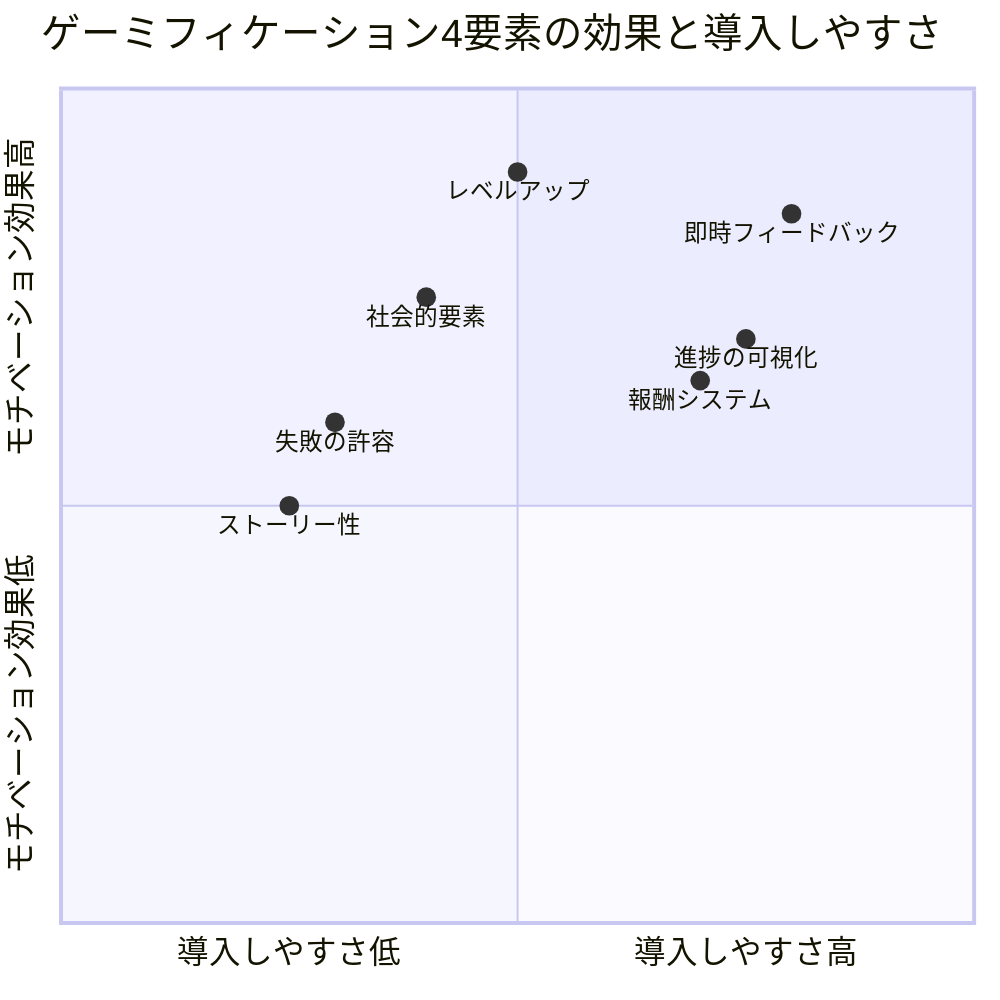

水曜20時、自宅のデスク。SE3年目の宮田航平（26歳）は、資格試験の問題集を開いて5分で閉じた。「今日もダメだ」。応用情報技術者試験まであと3ヶ月。毎晩「今日こそ勉強する」と思うのに、テキストを開くとYouTubeに逃げてしまう。一方で、スマホのRPGゲームは毎日ログインし、2時間以上プレイしている。「ゲームだと2時間余裕なのに、勉強は5分も持たない。この差は何なんだ」──ある日、宮田はふと気づいた。「ゲームが続く仕組みを、勉強に入れたらどうなるだろう？」

この記事では、宮田のように「やるべきことが続かない」人に向けて、**ゲームデザインの原理を日常に応用するゲーミフィケーション**の技術を解説します。

## なぜゲームは「やめられない」のか──4つの心理メカニズム

ゲームが人を惹きつけるのは偶然ではありません。数十年にわたるゲームデザインの研究が、人間の心理を巧みに利用する4つの仕組みを生み出しました。



### メカニズム1：即時フィードバック

ゲームでは、ボタンを押した瞬間に結果が返ってきます。敵を倒せば経験値が増え、アイテムを拾えばインベントリに追加される。この「行動→結果」のループが極めて短い。

一方、現実の勉強や仕事は、フィードバックが返ってくるまで数週間〜数ヶ月かかります。この「フィードバックの遅延」が、モチベーション低下の最大の原因です。

### メカニズム2：進捗の可視化

RPGのHP/MPバー、経験値ゲージ、マップの踏破率──ゲームでは「自分がどこまで進んだか」が常に見えています。この可視化が「あと少し」という粘りを生み出します。

### メカニズム3：段階的な難易度設計

良いゲームは、プレイヤーのスキルに合わせて難易度が上がります。簡単すぎると退屈、難しすぎると挫折。この「ちょうどいい難しさ」がフロー状態を生み出し、没頭感を作ります。

### メカニズム4：失敗の安全性

ゲームでは、失敗しても「ゲームオーバー→リトライ」で何度でもやり直せます。この「失敗のコストが低い」環境が、挑戦意欲を維持します。

## ゲーミフィケーション設計の5要素

現実のタスクにゲーム要素を組み込むための5つの設計要素を紹介します。

```mermaid
journey
    title ゲーミフィケーション導入の5ステップ
    section Step 1: ポイント設計
      タスクにポイントを割り当てる: 4: 設計者
      ポイントの貯め方を決める: 4: 設計者
    section Step 2: レベル設計
      スキルレベルの段階を定義する: 3: 設計者
      各レベルの到達条件を設定する: 4: 設計者
    section Step 3: 報酬設計
      ポイントに応じた報酬を決める: 5: 設計者
      達成バッジを作成する: 4: 設計者
    section Step 4: ストーリー設計
      タスクをクエストとして定義する: 3: 設計者
      全体をキャンペーンとして構成する: 3: 設計者
    section Step 5: 社会的要素
      仲間と進捗を共有する: 4: 設計者
      チームクエストを設定する: 4: 設計者
```

### 要素1：ポイントシステム

すべてのタスクにポイントを割り当てます。

| タスクの種類 | ポイント | 例 |
|-------------|---------|-----|
| 日常タスク（5〜15分） | 1P | メール整理、簡単な返信 |
| 標準タスク（30〜60分） | 3P | 資料作成、ミーティング準備 |
| チャレンジタスク（難度高） | 5P | プレゼン、新規提案 |
| 継続ボーナス（連続達成） | +2P | 3日連続で朝の習慣を実行 |

**報酬の設定例：**
- 30P：好きなカフェでケーキを食べる
- 100P：欲しかった本を買う
- 300P：週末に日帰り旅行

### 要素2：レベルとランクシステム

スキルや習慣を「レベル」で可視化します。

**英語学習の場合：**
- Lv.1「見習い」：基本単語100個を覚えた
- Lv.3「冒険者」：英語の記事を1本読み通せた
- Lv.5「戦士」：英語でメールを書けた
- Lv.7「魔法使い」：英語でプレゼンを1回やった
- Lv.10「勇者」：英語で会議をファシリテートできた

### 要素3：バッジと実績

特定の条件を満たしたときに解除される「実績」を設定します。

**実績の例：**
- 「早起き戦士」：5時起きを7日連続達成
- 「鉄人」：1ヶ月無欠勤＋毎日運動
- 「読書の鬼」：1ヶ月で5冊読了
- 「断り上手」：1週間で適切に3回「ノー」と言えた
- 「集中の達人」：ポモドーロ8セット連続達成

### 要素4：ストーリーとクエスト

タスクを「クエスト」として定義し、物語性を持たせます。

**資格試験の例：**
- メインクエスト：「知識の魔王を倒せ──応用情報技術者試験合格への旅」
- サブクエスト1：「ネットワークの迷宮を攻略する（Chapter 3の問題を全問正解）」
- サブクエスト2：「データベースのドラゴンを討伐する（SQL演習50問クリア）」
- 日課クエスト：「毎日の修行──過去問5問を解く」

### 要素5：社会的要素

一人で続けるより、仲間がいたほうが続きます。

- **ギルド（仲間）**：同じ目標を持つ2〜3人でグループを組む
- **週次レイド（集団戦）**：週1回、進捗を共有する会を開く
- **PvP（対戦）**：友人とポイントを競い合う（健全な競争に限る）

## ケーススタディ1：宮田航平の資格試験攻略（SE・26歳）

冒頭の宮田航平は、「ゲーミフィケーション勉強法」を自分で設計した。

**宮田のシステム設計：**

1. **ポイント制**：過去問1問正解＝1P、章末問題全問正解＝10P
2. **レベル制**：Lv.1「新米」→ Lv.5「中堅」→ Lv.10「上級」（正答率で判定）
3. **報酬設計**：50P＝新しいゲームソフト購入、200P＝1日ゲーム三昧の日を作る
4. **ストーリー**：「ITの魔王を倒す勇者の冒険記」（手帳に冒険日誌を記録）
5. **ギルド**：会社の同僚2人と「資格ギルド」を結成、週1で進捗報告

「自分でもバカバカしいと思ったけど、めちゃくちゃ効いた。問題を解くたびにポイントが貯まるのが嬉しくて、気づいたら2時間勉強していた。ゲームと同じ2時間なのに、こっちのほうが達成感がある」

**Before：**
- 1日の勉強時間：平均5分（テキストを開いて閉じるだけ）
- 週の学習進捗：ほぼゼロ
- モチベーション：「やらなきゃいけないのにできない」罪悪感

**After（2ヶ月後）：**
- 1日の勉強時間：平均1.5時間
- 週の過去問演習数：35問（0問 → 35問）
- 模試の正答率：42% → 71%
- 最終結果：合格（合格率23.5%の試験で一発合格）

「ギルドの2人と『今週のボス戦（模試）の結果報告会』をやるのが楽しみになった。一人だったら絶対に続かなかった」

## ケーススタディ2：大塚紀子の家事革命（ワーキングマザー・36歳）

大塚紀子は、仕事と育児の合間の家事に疲弊していた。

「家事って終わりがないんです。洗濯、掃除、料理、片付け……。やってもやっても達成感がない。それがストレスの原因だと気づきました」

大塚が導入したのは「家事クエストボード」。

**家事クエストボードの設計：**
- キッチンの冷蔵庫にホワイトボードを設置
- 家事ごとにポイントを設定（洗濯1P、料理2P、水回り掃除3P）
- 家族全員でポイントを貯め、週末の「ファミリー報酬」を解禁する
- 小学3年生の息子には「お手伝いクエスト」（ゴミ捨て1P、お皿洗い2P）

「息子が『ママ、今日のクエストなに？』って聞いてくるようになった。ゲーム感覚で家事を手伝ってくれるし、夫も『俺もポイント欲しい』って言い出した」

**大塚家の変化（1ヶ月後）：**
- 紀子の家事負担：100% → 60%（夫と息子が残り40%を分担）
- 週末のファミリー報酬：回転寿司、映画館、公園でバーベキューなど
- 紀子のストレスレベル（10段階）：8 → 4
- 息子の発言：「お手伝いって意外と楽しいね」

## ケーススタディ3：松本裕介の営業改革（保険営業・32歳）

松本裕介は、飛び込み営業への恐怖心に悩んでいた。

「電話をかけるのも、ドアをノックするのも、毎回心臓がバクバクする。断られるのがわかっているから、『あと1件だけ』が言えない。月末には数字が足りなくて、上司に詰められる」

松本が導入したのは「営業RPG」。

**松本の営業RPGルール：**
- 電話1本＝1XP（経験値）
- アポイント獲得＝10XP
- 成約＝50XP
- 1日のXPを記録し、レベルアップを目指す
- 「断られた」は「経験値を獲得した」と解釈する

「一番変わったのは、断られたときの気持ちです。以前は『また失敗した』と落ち込んでいたけど、今は『1XP獲得。あと9XPでレベルアップ』と思える。断られることが、むしろ『経験値稼ぎ』になった」

**松本の変化（3ヶ月後）：**
- 1日の架電数：15本 → 35本
- 月間アポイント数：8件 → 22件
- 月間成約数：2件 → 6件
- 営業への恐怖心（10段階）：9 → 4
- 上司からの評価：「何があった？ 別人みたいだ」

## ゲーミフィケーションの設計ポイントと注意点

### 自分の「プレイヤータイプ」を知る

ゲームデザインの研究者リチャード・バートルは、プレイヤーを4タイプに分類しました。自分のタイプに合ったゲーミフィケーションを設計すると、効果が高まります。

| タイプ | 特徴 | 効果的な要素 |
|-------|------|------------|
| アチーバー（達成者） | 目標達成に喜びを感じる | レベルアップ、実績バッジ |
| エクスプローラー（探索者） | 新しい発見にワクワクする | 隠し実績、新しい分野への挑戦 |
| ソーシャライザー（社交者） | 仲間との交流が楽しい | ギルド、チームクエスト |
| キラー（競争者） | 競争に勝つことに燃える | ランキング、PvP要素 |

### 注意点1：外発的動機と内発的動機のバランス

ゲーミフィケーションは外発的動機（報酬のためにやる）に依存しがちです。しかし、長期的には内発的動機（その活動自体が楽しい）を育てることが重要です。

[成長マインドセット](/blog/growth-mindset)と組み合わせることで、ゲーム要素がなくても「成長している実感」自体が報酬になる状態を目指しましょう。

### 注意点2：管理コストの肥大化

ポイント計算、レベル管理、バッジ作成──ゲーミフィケーション自体に時間を取られすぎると本末転倒です。システムはシンプルに保ち、管理に1日5分以上かけないことをルールにしましょう。

### 注意点3：ゲーム化しやすいタスクへの偏り

ポイントが付きやすいタスクばかり優先して、本質的に重要だがゲーム化しにくいタスク（人間関係の構築、深い思考など）を後回しにしないよう注意します。[セルフトーク](/blog/self-talk)で「これは本当に重要なことか？」と定期的に自問する習慣が有効です。

## 今日から始めるゲーミフィケーション──最小構成

大がかりなシステムを作る必要はありません。今日から始められる最小構成はこれだけです。

**ミニマム・ゲーミフィケーション：**
1. 今日やるタスクを3つ書き出す
2. 各タスクにポイントを割り当てる（簡単＝1P、普通＝3P、難しい＝5P）
3. 全タスク完了で自分に小さな報酬を与える（コンビニスイーツ、15分の自由時間など）

これだけで、「やるべきこと」が「クリアしたいクエスト」に変わります。

---

## あなた専用の「クエストデザイン」を一緒に作りませんか？

「ゲーミフィケーションの考え方はわかったけど、自分の状況にどう適用すればいいかわからない」──そんな方のために、体験セッションでは、あなたの性格タイプ・仕事内容・目標に合わせた「オーダーメイドのゲーミフィケーションシステム」を一緒に設計します。退屈な日常が冒険に変わる瞬間を体験してみませんか？

[あなた専用のクエストを設計する（体験セッション）](/sessions)
