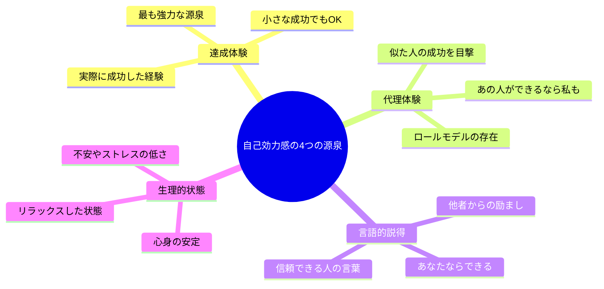
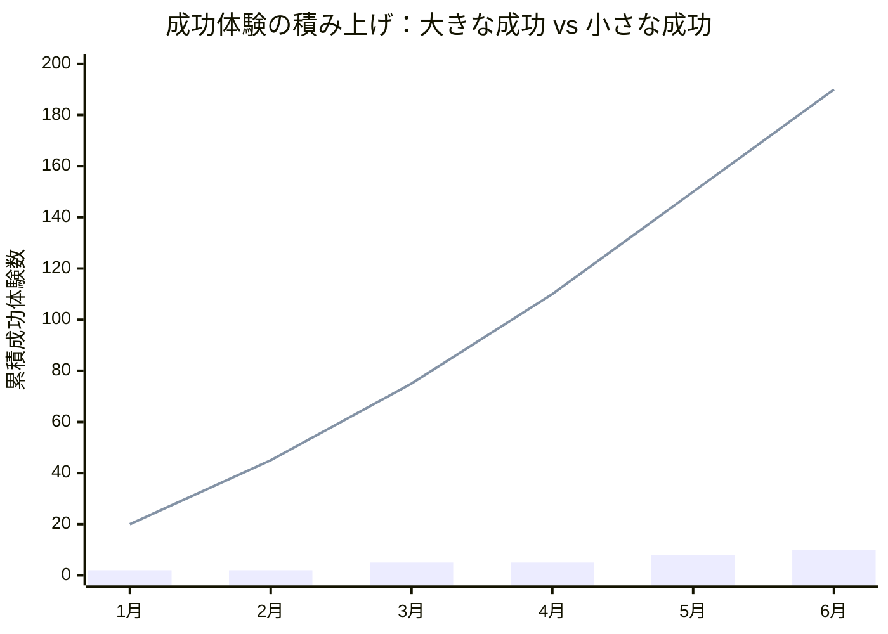
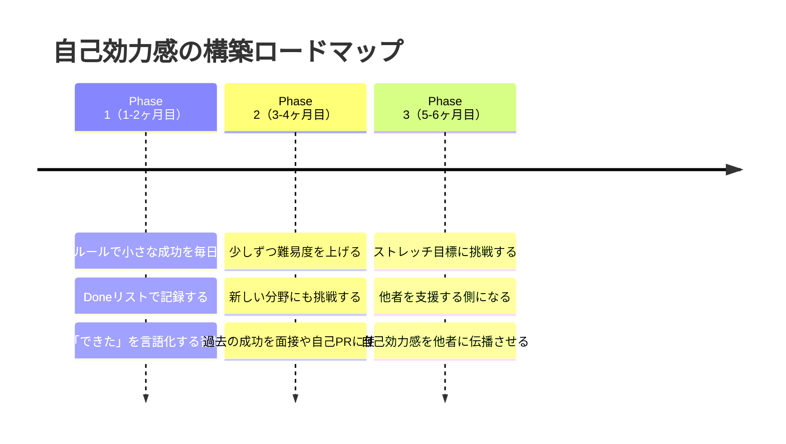

月曜の朝9時、人材会社の面談室。転職エージェントの前で、元SEの川島健一（35歳）は自分の経歴を語りながら、ずっとうつむいていた。「前職では3年間、要件定義からテストまで一通りやっていましたが……特に誇れる実績はないです」。エージェントが聞いた。「10人以上のチームをリードしていたんですよね？それはすごいことですよ」。川島は首を横に振った。「いや、みんなが優秀だっただけです。僕は特に何もしていません」。──客観的に見れば十分な実績があるのに、「自分にはできる」という感覚がまったくない。これが**自己効力感の低下**という問題だ。

この記事では、川島のように「能力はあるのに自信がない」人が、**小さな成功の積み重ね**で自己効力感を確実に育てていく方法を解説します。

## 自己効力感とは何か──自信とは違う「確信」の力

### バンデューラの自己効力感理論

心理学者アルバート・バンデューラが提唱した「自己効力感（Self-Efficacy）」は、単なる自信とは異なります。

- **自信**：「なんとなく、自分はうまくいく気がする」（漠然とした感覚）
- **自己効力感**：「このタスクなら、自分にはできるという根拠がある」（具体的な確信）

自己効力感が高い人は、困難な状況でも粘り強く取り組み、結果的に高い成果を出します。自己効力感が低い人は、能力があっても「どうせ無理」と思い、挑戦を避けてしまいます。

### 自己効力感の4つの源泉

この4つの中で、最も強力なのが**達成体験（マスタリー体験）**です。どんなに人から「あなたならできる」と言われても、自分自身が「できた」という体験をしない限り、自己効力感は定着しません。

## なぜ「小さな成功」が効くのか

### 大きな成功を待つ危険性

多くの人は、「大きな成功」──昇進、プロジェクトの成功、資格合格──で自信をつけようとします。しかし、大きな成功には3つの問題があります。

1. **頻度が低い**：年に数回しか訪れない
2. **リスクが高い**：失敗したときのダメージが大きい
3. **他者依存が多い**：自分の力だけでは制御できない要素がある

### 小さな成功の圧倒的な優位性

一方、小さな成功は：

1. **毎日積める**：朝のルーティンをこなすだけでも成功体験
2. **失敗リスクが低い**：95%の確率で達成できるレベルに設定できる
3. **自分で制御できる**：他者の評価に依存しない

上のグラフで、棒グラフが「大きな成功だけを狙う場合」、折れ線グラフが「小さな成功を毎日積む場合」の累積成功体験数です。6ヶ月後には19倍の差が開いています。

## 「小さな成功」の設計方法──5つの原則

### 原則1：95%ルール

タスクの難易度を「95%の確率で達成できる」レベルに設定します。

- 悪い例：「毎日1時間ジムで筋トレする」（習慣化前の人には達成率50%以下）
- 良い例：「毎日靴を履いて玄関を出る」（達成率99%）

### 原則2：完了基準を明確にする

「だいたいやった」ではなく、「やったかどうか」がイエス/ノーで判断できる基準を設定します。

- 悪い例：「英語を勉強する」（何をもって完了？）
- 良い例：「英単語アプリで10問解く」（10問解いたら完了）

### 原則3：朝に設計する

1日の最初に「今日の小さな成功3つ」を決めます。夜に決めると、疲労で判断力が鈍り、ハードルが上がりすぎる傾向があります。

### 原則4：記録する

完了したタスクを「Done（完了）リスト」に記録します。ToDoリストは「まだやっていないこと」を突きつけてきますが、Doneリストは「もうやったこと」を見せてくれます。

### 原則5：段階的にレベルを上げる

1週間連続で達成できたら、少しだけ難易度を上げます。「玄関を出る」→「50メートル歩く」→「公園まで歩く」→「15分ジョギング」と段階的に。

## ケーススタディ1：川島健一の自己効力感復活（元SE・35歳）

冒頭の川島健一は、コーチングセッションで「小さな成功リスト」の作成に取り組んだ。

「まず、過去の成功体験を書き出してください」──コーチにそう言われたとき、川島は「何もない」と答えた。しかし、コーチの質問に導かれて掘り下げていくと、意外な事実が浮かび上がった。

**川島が「成功」と認識していなかった実績：**
- 10人のチームを3年間リードし、離職者ゼロ
- 炎上プロジェクトを引き継ぎ、3ヶ月で正常化
- 後輩2人を育て、2人とも独り立ち
- 顧客満足度調査でチーム評価が社内1位

「書き出してみたら、自分でも驚きました。こんなにやっていたんだ、と。でも当時は『みんなのおかげ』としか思えなかった」

コーチングでは、これらの過去の実績を再認識した上で、毎日の「小さな成功」を積む仕組みを設計した。

**川島のデイリー成功リスト：**
- 朝：今日の3タスクを書き出す → 書いたら「成功1」
- 午前：最も重要なタスクを1つ完了する → 完了したら「成功2」
- 午後：新しいことを1つ学ぶ（記事を読む、動画を見る） → 学んだら「成功3」
- 夜：今日の3つの成功をノートに記録する

**3ヶ月後の変化：**
- 転職面接での自己アピール：「特に実績はない」→「チームマネジメントと炎上案件の立て直しが得意です」
- 面接通過率：20%（5社中1社）→ 60%（5社中3社）
- 最終的に、年収80万円アップで希望の企業に内定
- 川島のコメント：「毎日ノートに成功を書いていたら、『俺、意外とやれる人間なんだな』と思えるようになった」

## ケーススタディ2：森田あかりの産休復帰（マーケター・32歳）

森田あかりは、1年間の産休から職場に復帰したとき、自己効力感が著しく低下していた。

「1年間、仕事から離れていたんです。復帰したら、ツールは変わっている、メンバーも変わっている、トレンドもわからない。『自分はもう戦力外なんだ』と本気で思いました」

復帰初日、森田は会議で一言も発言できなかった。かつてはチームのムードメーカーだったのに。

「家に帰って泣きました。でも、夫に『最初から完璧にやろうとするな。今日1個できたことを教えてくれ』と言われて、考え直したんです。今日できたこと……メールを50通読んで、全体の状況を把握した。これは小さいけど、できたことだよね、と」

森田が始めたのは「復帰100日チャレンジ」。

**復帰100日チャレンジのルール：**
- 毎日1つ、「今日の小さな成功」をスマホのメモに記録する
- 成功の基準は「昨日の自分より1ミリでも前に進んだこと」
- 100日で100個の成功を貯める

**森田の成功リスト（抜粋）：**
- Day 1：メール50通を読んで状況を把握した
- Day 7：会議で1回質問できた
- Day 14：後輩に1つアドバイスをした
- Day 30：企画書のドラフトを1本書いた
- Day 60：クライアントミーティングで提案をした
- Day 90：新規プロジェクトのリーダーに手を挙げた
- Day 100：チーム全体のキャンペーン戦略を発表した

「100日後にリストを見返したとき、涙が出ました。Day 1の自分と、Day 100の自分はまるで別人。でも、毎日1つずつ積んだだけなんです。特別なことは何もしていない」

**定量的な変化：**
- 会議での発言回数（週平均）：0回 → 8回
- 上司からの評価（半期）：「期待通り」→「期待以上」
- 自己効力感スコア（一般性自己効力感尺度）：16点 → 31点（40点満点）

## ケーススタディ3：吉村太一の部下育成（課長・44歳）

吉村太一は、自信のない部下の育成に悩んでいた。入社3年目の部下・田中（仮名）は、能力があるのにいつも「自分には無理です」と言って難しい仕事を避ける。

「田中は頭が良いし、作業も丁寧。でも、新しい仕事を振ると『僕にはちょっと……』と必ず言う。無理に任せても、不安でパフォーマンスが出ない。どうすればいいかわからなかった」

吉村がコーチングで学んだのは「成功の階段設計」。

**田中のための成功の階段：**
1. 既存業務の中で、少しだけ新しい要素がある仕事を任せる
2. 成功したら、具体的に何が良かったかをフィードバックする
3. 次は少しだけ難易度を上げた仕事を任せる
4. 「前回の○○ができたなら、今回もできる」と過去の成功に紐づけて説明する

「『この仕事、田中ならできると思う』だけじゃダメなんです。『先月のA案件でデータ分析をやり遂げたよね。今回のB案件も同じ手法が使える。だから田中にお願いしたい』──こう言うと、田中の反応が全然違った」

**田中の変化（6ヶ月後）：**
- 「自分には無理です」の発言回数：月平均8回 → 月平均1回
- 自発的な提案回数：月0回 → 月3回
- 担当業務の範囲：定型業務のみ → 新規企画にも参画
- 田中本人のコメント：「吉村課長に『前回できたでしょ』と言われると、確かにできたな、と思えるんです。その積み重ねで、今は新しい仕事も『やってみます』と言えるようになりました」

## 失敗時の自己効力感維持法

小さな成功を積んでいても、失敗は必ず起きます。失敗時に自己効力感を維持するための3つの技法を紹介します。

### 技法1：失敗の文脈化

「自分はダメだ」（永続的・全般的）ではなく、「この状況では、この方法がうまくいかなかった」（一時的・限定的）と解釈します。

[インポスター症候群](/blog/imposter-syndrome)に陥りやすい人は特に、この「文脈化」を意識的に行うことが重要です。

### 技法2：「まだ」の魔法

「できなかった」を「まだできていない」に言い換えます。この一語の追加が、失敗を「成長の途中」として再定義します。

### 技法3：成功リストの見返し

落ち込んだとき、これまでの「Done（完了）リスト」を見返します。「自分にはこれだけの成功体験がある」という客観的な事実が、一時的な失敗による自己効力感の低下を防ぎます。

## 長期的な自己効力感の構築戦略

### Phase 1：基盤を作る（1-2ヶ月目）

毎日の小さな成功を積み、Doneリストで記録する。この段階では難易度を上げない。「毎日成功している」というパターンを脳に刻むことが目的です。

### Phase 2：領域を広げる（3-4ヶ月目）

Phase 1で安定したら、新しい分野にも小さな挑戦を始めます。[成長マインドセット](/blog/growth-mindset)を持ち、「失敗しても学びがある」と捉えられる状態を目指します。

### Phase 3：影響力を広げる（5-6ヶ月目）

自分の自己効力感が安定したら、吉村のように他者の自己効力感を育てる側になります。他者を支援することで、自分の自己効力感もさらに強化されます。

## 今日の「小さな成功」を1つ、記録してみよう

**今すぐできる3ステップ：**
1. スマホのメモアプリを開き、「成功リスト」というタイトルのメモを作る
2. 今日ここまでで「できたこと」を1つ書く（この記事を最後まで読んだことでもOK）
3. 明日の朝、「今日達成する小さな成功3つ」を書いてから仕事を始める

自己効力感は、才能ではなく「仕組み」で育てられます。今日の1つの成功が、明日の「自分ならできる」を作ります。

---

## あなたの「自信のなさ」の正体を一緒に探りませんか？

「能力はあるのに自信がない」「実績はあるのに認められている気がしない」──その根底には、過去の経験や思い込みが複雑に絡み合っています。体験セッションでは、あなたの自己効力感の現在地を測定し、「小さな成功」の積み上げプランを一緒に設計します。あなたの中にすでにある「できた実績」を、確信に変えてみませんか？

[自己効力感の現在地を測る（体験セッション）](/sessions)
