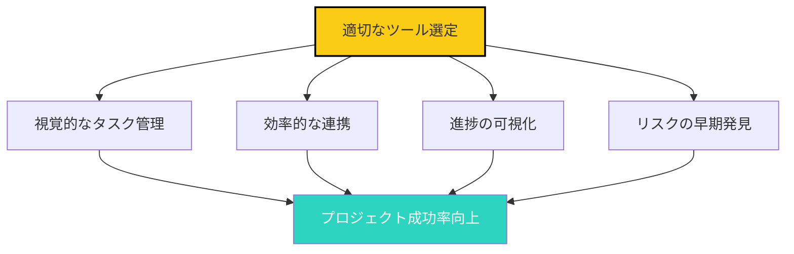
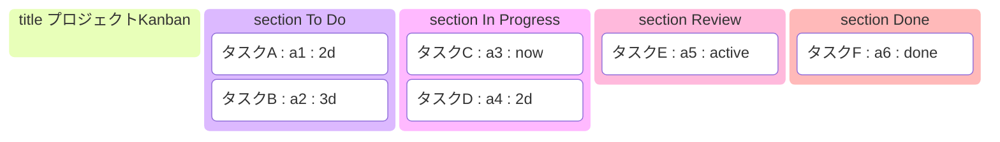
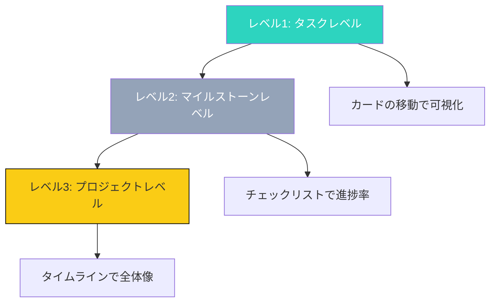
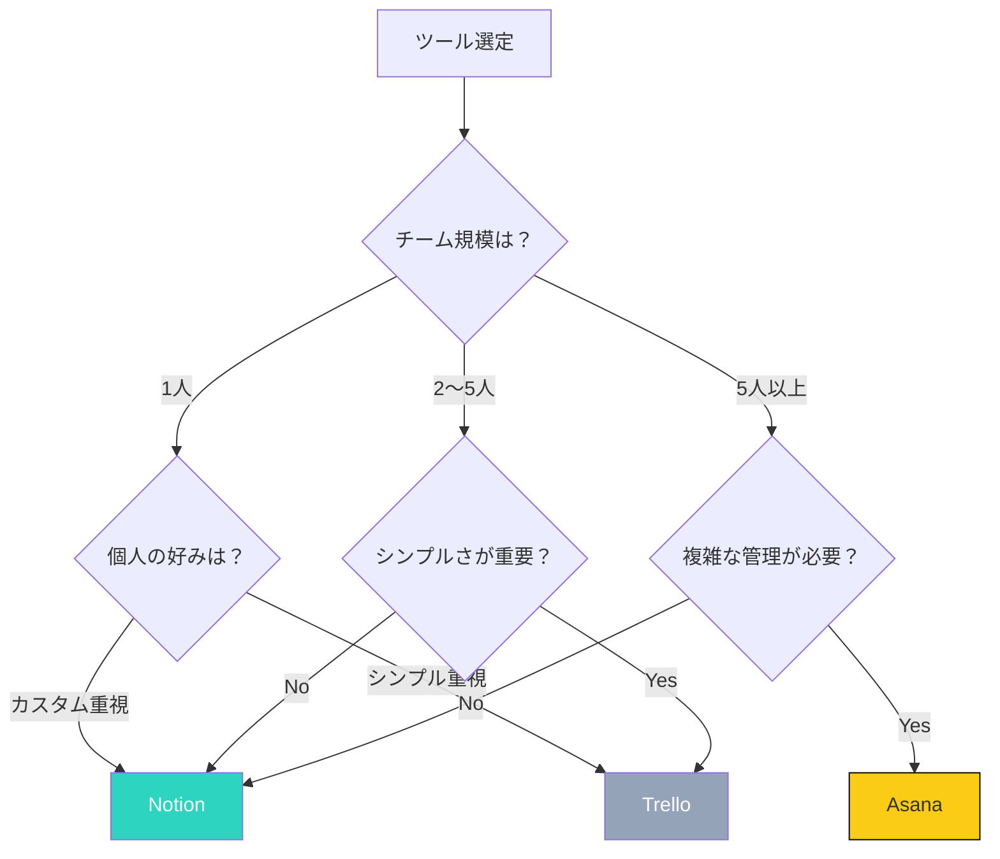

## プロジェクト管理ツールの重要性

「プロジェクトがうまく進まない」「タスクが見えない」「チームとの連携が困難」

これらの課題は、適切なプロジェクト管理ツールを活用することで、大きく改善できます。

### ツール選定が重要な理由



## 主要なツールの比較

### Notion

**特徴**:
- オールインワンワークスペース
- 高度なカスタマイズ性
- データベース機能が強力

**メリット**:
- 自由度が高い
- 文書管理もできる
- テンプレートが豊富

**デメリット**:
- 学習コストが高い
- 初期設定に時間がかかる
- モバイルアプリの機能制限

**適したケース**:
- 個人の高度な管理
- ドキュメントとタスクの統合
- カスタムワークフローの構築

### Trello

**特徴**:
- シンプルなKanban方式
- 直感的なインターフェース
- 豊富な統合機能

**メリット**:
- 学習コストが極めて低い
- 直感的で使いやすい
- チーム連携が容易

**デメリット**:
- 高度な機能が不足
- 大規模なプロジェクトに不向き
- 統合機能の制限

**適したケース**:
- 小規模チーム（2〜5人）
- シンプルなタスク管理
- Kanban方式を好む場合

### Asana

**特徴**:
- プロジェクト管理に特化
- タイムライン機能が充実
- チーム連携機能が強力

**メリット**:
- プロジェクト管理に最適化
- タイムラインで期間を視覚化
- リソース管理ができる

**デメリット**:
- 個人使用にはオーバースペック
- 有料プランが必要（チーム機能）
- カスタマイズ性が低い

**適したケース**:
- 中〜大規模チーム（5〜20人）
- 複雑なプロジェクト管理
- 期間管理が重要な場合

### 比較表

| 項目 | Notion | Trello | Asana |
|-----|--------|--------|-------|
| **学習コスト** | 高 | 低 | 中 |
| **カスタマイズ性** | 高 | 低 | 中 |
| **チーム連携** | 中 | 高 | 高 |
| **プロジェクト管理** | 中 | 低 | 高 |
| **ドキュメント管理** | 高 | 低 | 低 |
| **価格（個人）** | 無料 | 無料 | 無料〜1,078円/月 |
| **価格（チーム）** | 8ドル/月〜 | 5ドル/月〜 | 10.99ドル/月〜 |

## Kanban方式によるタスク視覚化

### Kanbanの基本構造



### Kanbanの3つの原則

**1. 各タスクをカードとして可視化**

タスク情報を明確に：
- タイトル
- 説明
- 担当者
- 期限
- 優先順位

**2. 状態（列）で進捗を管理**

基本的な列構造：
- **To Do**: 未着手のタスク
- **In Progress**: 現在進行中のタスク
- **Review**: レビュー待ち
- **Done**: 完了したタスク

**3. WIP（Work In Progress）制限**

進行中のタスク数を制限：
- 理由: 多くのタスクを同時に進めると効率が下がる
- 目安: 1人あたり2〜3タスク

## 進捗管理の可視化

### 進捗管理の3つのレベル



### レベル1: タスクレベル

- 各タスクの進捗を管理
- カードの移動で可視化
- チェックリストで詳細進捗

**チェックリストの活用**:
- タスクを小さなステップに分解
- 各ステップ完了時にチェック
- 進捗率をパーセンテージで表示

### レベル2: マイルストーンレベル

- プロジェクトをマイルストーンに分解
- 各マイルストーンの期限を設定
- マイルストーンごとの進捗を管理

**マイルストーンの例**:
```
マイルストーン1: 要件定義完了（2週間）
マイルストーン2: 設計完了（4週間）
マイルストーン3: 開発完了（8週間）
マイルストーン4: テスト完了（10週間）
マイルストーン5: リリース（12週間）
```

### レベル3: プロジェクトレベル

- 全体の進捗をタイムラインで可視化
- 各マイルストーンの期間を管理
- リソース配分を最適化

**タイムラインの活用**:
- ガントチャートで期間を視覚化
- 依存関係を明確化
- 期限遅延リスクを可視化

## チーム連携の最適化

### 連携機能の活用

| 機能 | Notion | Trello | Asana |
|-----|--------|--------|-------|
| **@メンション** | ✅ | ✅ | ✅ |
| **コメント機能** | ✅ | ✅ | ✅ |
| **アサイン** | ✅ | ✅ | ✅ |
| **期限通知** | ✅ | ✅ | ✅ |
| **アクティビティログ** | ✅ | ✅ | ✅ |

### チーム連携のベストプラクティス

**1. 役割の明確化**

各メンバーの役割と責任を定義：
- プロジェクトマネージャー
- 開発者
- デザイナー
- テスター

**2. コミュニケーションのルール**

- フィードバックは公開で行う
- @メンションの使用ルール
- 通知のタイミングを決める

**3. 定期的な同期**

- 毎週の定例会議
- マイルストーンごとのレビュー
- イシュー解決のための会議

## ツール選定の決定フロー

### 選定のための5つの質問



## 今日から始めるアクション

### アクション1: 現在の課題を明確にする

現在、プロジェクト管理でどのような課題があるか、3つ書き出しましょう。

### アクション2: 試用を始める

3つのツール（Notion、Trello、Asana）の無料プランを試してみましょう。

### アクション3: 1つのプロジェクトを移行する

現在進行中の1つのプロジェクトを選定し、選定したツールに移行しましょう。

## まとめ

プロジェクト管理ツールは、プロジェクトの成功に直結しています。

自分のニーズ（チーム規模、複雑性、好み）に合ったツールを選びましょう。

最も重要なのは、ツールを「使い倒す」ことではなく、プロジェクトの成功に活用すること。

今日から、小さく始めましょう。

1つのプロジェクトから。徐々に拡張して。

1ヶ月後、あなたは「プロジェクト管理の達人」になっているはずです。

---

## 💬 一歩踏み出したいあなたへ

この記事のテーマについて、もっと深く揘り下げたいと思いませんか？

**体験セッション（無料）**では、あなたの状況に合わせた具体的なアドバイスをお伝えします。

[→ 体験セッションの詳細を見る](/sessions)

