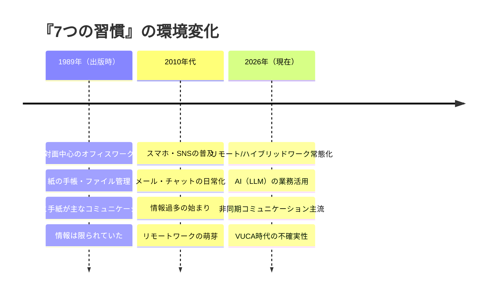
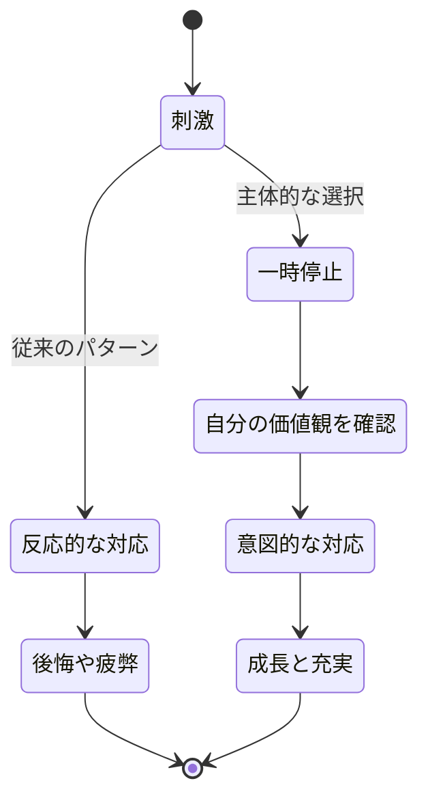
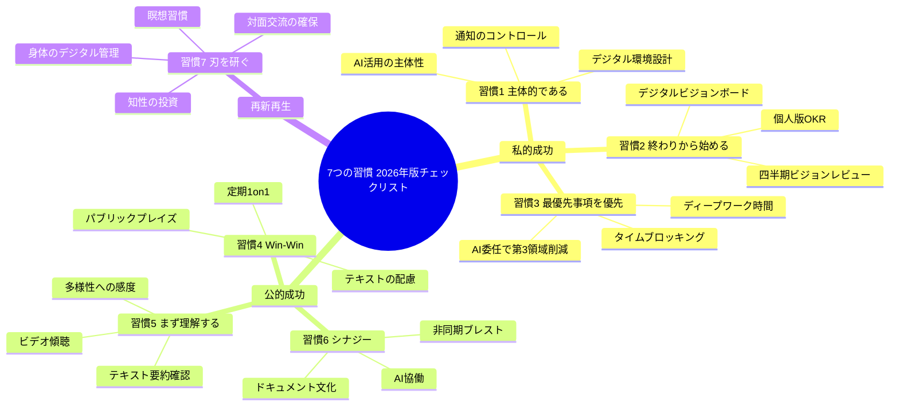

土曜の午後、都内のカフェ。広告代理店のチームリーダー・沢村真司（37歳）は、書棚で見つけた『7つの習慣』を手に取った。学生時代に読んで感動した名著だ。ページをめくりながら、沢村はつぶやいた。「書いてあることは正しいと思う。でも、1989年の本だよな。Slack、Zoom、AI、リモートワーク──当時は存在しなかったものだらけだ。今の自分にどう当てはめればいいんだ？」

この記事では、沢村と同じ疑問を持つすべてのビジネスパーソンに向けて、**スティーブン・コヴィーの『7つの習慣』を2026年の働き方に合わせてアップデート**する具体的な方法を解説します。

## なぜ『7つの習慣』は今もなお有効なのか

『7つの習慣』が出版から37年経っても読み継がれている理由は、テクニックではなく**原則**を扱っているからです。テクニックは時代とともに陳腐化しますが、「誠実さ」「主体性」「相互理解」といった原則は普遍的です。

しかし、原則を**実践する手段**は時代に合わせてアップデートが必要です。コヴィーが想定していたのは、対面中心のオフィスワーク。現代は、リモートワーク、非同期コミュニケーション、AI活用という新しい文脈があります。

## 7つの習慣──原則と現代版アップデート

### 習慣1：主体的である（Be Proactive）

**原則：** 刺激と反応の間には選択の自由がある。環境のせいにせず、自分の反応を選ぶ。

**1989年の課題：** 上司や組織の方針に振り回されない主体性
**2026年の課題：** 通知・情報・AIに振り回されない主体性

**現代の実践法：**
- **通知のコントロール**：プッシュ通知を全オフにし、自分のタイミングで情報を取りに行く（プル型）
- **AIとの主体的な付き合い方**：AIの提案をそのまま採用するのではなく、「自分はどう考えるか」を先に言語化してからAIに相談する
- **デジタル環境の設計**：スマホのホーム画面、ブラウザのブックマーク、アプリの配置を「自分の意図」に基づいて設計する
- **SNSの能動的な使い方**：フィードを受動的にスクロールするのではなく、「何を発信するか」を主体的に決める

### 習慣2：終わりを思い描くことから始める（Begin with the End in Mind）

**原則：** すべてのものは二度作られる。まず頭の中で、次に現実に。

**1989年の課題：** 人生のミッションステートメントを書く
**2026年の課題：** 変化が激しい時代に、柔軟なビジョンを持つ

**現代の実践法：**
- **四半期ビジョンレビュー**：年1回のミッションステートメントではなく、3ヶ月ごとに「この3ヶ月で何を実現したいか」を見直す
- **北極星とコンパス**：長期の「北極星（人生の方向性）」は固定しつつ、「コンパス（3ヶ月の方向性）」は柔軟に調整する
- **デジタルビジョンボード**：Notionやmiroに「理想の状態」を視覚的にまとめ、毎朝確認する
- **OKR（Objectives and Key Results）**の個人版を導入し、四半期ごとに目標と成果指標を設定する

### 習慣3：最優先事項を優先する（Put First Things First）

**原則：** 「緊急だが重要でないこと」ではなく、「重要だが緊急でないこと（第2領域）」に時間を投資する。

**1989年の課題：** 紙の手帳で時間管理をする
**2026年の課題：** 常時接続・通知の洪水の中で第2領域の時間を確保する

**現代の実践法：**
- **タイムブロッキング**：Googleカレンダーに「第2領域の時間」を先に入れ、他の予定はその周りに配置する
- **デジタルデトックス時間**：毎日2時間、すべての通知をオフにする[ディープワーク](/blog/deep-work)の時間を確保する
- **Not-To-Doリスト**：やらないことを明文化し、無意識の時間浪費を防ぐ。[Not-To-Doリスト](/blog/not-to-do-list)の記事で詳しく解説しています
- **AI活用による第3領域の削減**：「緊急だが重要でない」定型タスク（メールの要約、議事録作成、データ整理）はAIに委任し、浮いた時間を第2領域に充てる

### 習慣4：Win-Winを考える（Think Win-Win）

**原則：** 相互利益を追求し、全員が満足できる解決策を探す。

**1989年の課題：** 対面での交渉・調整でWin-Winを実現する
**2026年の課題：** リモート環境でのテキスト主体のコミュニケーションでWin-Winを構築する

**現代の実践法：**
- **テキストコミュニケーションの意図的な配慮**：チャットでは感情が伝わりにくいため、意識的にポジティブな言葉を選ぶ。「これ間違ってます」ではなく「ここを修正するとさらに良くなりそうです」
- **定期的な1on1**：リモート環境では雑談が減るため、週1回15分の1on1で信頼関係を意識的に構築する
- **非同期でのWin-Win設計**：提案や依頼をする際、相手が返答しやすいように「選択肢A/B/C」を提示し、相手の時間を尊重する
- **パブリック・プレイズ**：Slackのパブリックチャンネルで同僚の貢献を称えることで、リモートでも信頼の文化を作る

### 習慣5：まず理解し、そして理解される（Seek First to Understand, Then to Be Understood）

**原則：** 共感的傾聴で相手を理解し、その後に自分の考えを伝える。

**1989年の課題：** 対面での傾聴スキルを磨く
**2026年の課題：** 多様なバックグラウンドの人々と、テキスト・ビデオ・対面を使い分けて理解し合う

**現代の実践法：**
- **ビデオ通話での意識的な傾聴**：画面を見ながらの「ながら聞き」を避け、カメラをオンにし、うなずきや表情で「聞いている」ことを伝える
- **テキストでの理解確認**：チャットでは「つまり○○ということですね？」と要約して返信し、認識のずれを早期に発見する
- **多様性への感度**：異なる文化・世代・職種の人が使う言葉の背景を想像する。同じ言葉でも意味が異なることがある
- **[フィードバックマインドセット](/blog/feedback-mindset)**：フィードバックを受けるとき、まず「相手は何を伝えたいのか」を理解してから反応する

### 習慣6：シナジーを創り出す（Synergize）

**原則：** 1+1を3以上にする。相違点を強みとして活用する。

**1989年の課題：** チームでの対面ブレインストーミング
**2026年の課題：** リモート・非同期・AI協働でのシナジー創出

**現代の実践法：**
- **非同期ブレインストーミング**：Miro、FigJam、Notionなどのツールで、各自が好きな時間にアイデアを追加し、発散と収束を分離する
- **AI×人間のシナジー**：AIをブレストパートナーとして使い、人間が出したアイデアをAIに拡張・批判・統合させる。AIが出した案を人間が判断する
- **ダイバーシティの意識的な活用**：異なる専門領域の人をプロジェクトに巻き込み、「自分では思いつかない視点」を取り入れる
- **ドキュメント文化**：議論の過程と結論を文書化し、非同期でも全員が同じ理解を持てるようにする

### 習慣7：刃を研ぐ（Sharpen the Saw）

**原則：** 身体、知性、精神、社会/感情の4つの側面を定期的に再生する。

**1989年の課題：** 忙しさの中で自己更新の時間を確保する
**2026年の課題：** バーンアウト・情報疲労が蔓延する時代に、持続可能なパフォーマンスを維持する

**現代の実践法：**
- **身体**：Apple WatchやFitbitで運動・睡眠を数値管理。「週150分の有酸素運動」を定量目標として設定
- **知性**：AIの時代だからこそ、「考える力」を鍛える。AIに答えを聞く前に自分で考え、AIを「答え合わせ」に使う
- **精神**：瞑想アプリ（Headspace、Meditopia）を活用した5分間の瞑想を日課にする
- **社会/感情**：週に1回、デジタルではなく対面で人と会う時間を意識的に作る

## ケーススタディ1：沢村真司の「主体性」復活（広告代理店チームリーダー・37歳）

冒頭の沢村真司は、7つの習慣を読み直した後、「習慣1：主体的である」を現代版に実践し始めた。

「問題は、1日中Slackの通知に振り回されていたことでした。通知が来るたびに作業を中断し、すぐに返信する。それが『主体的に仕事をしている』と思っていたけど、実際は最も反応的な働き方だった」

沢村が導入した変更：
- 朝9時〜11時は「主体的集中タイム」として、Slackの通知をすべてオフ
- この2時間で、その日の最も重要な仕事（第2領域）に取り組む
- チームメンバーには「9-11時は応答不可。緊急時は電話で」と宣言
- AIを使って定型メールの下書きを自動化し、浮いた時間を戦略思考に充てる

「たった2時間の『通知オフ』で、1日の生産性が激変した。午前中に1本の企画書が書ける。以前は1日かけても書けなかったのに」

**沢村の変化（2ヶ月後）：**
- 午前中のタスク完了数：平均0.8 → 平均2.3
- 企画書の提出リードタイム：平均5日 → 平均2日
- チームメンバーからの評価：「リーダーが落ち着いた。相談しやすくなった」
- 沢村自身：「反応する時間を減らしたら、考える時間が生まれた。これがコヴィーの言う『主体的である』ということだった」

## ケーススタディ2：谷口美月の「Win-Win」実践（人事マネージャー・40歳）

谷口美月は、リモートワーク環境でのチームマネジメントに苦戦していた。

「対面なら表情を見ながら調整できたんですが、リモートだとチャットの文面だけで判断するしかない。メンバー同士の誤解が増え、チームの雰囲気が悪くなっていました」

谷口が「習慣4：Win-Win」と「習慣5：まず理解する」を組み合わせて実践した方法：

**Weekly Win-Win Session（週15分）：**
1. 毎週金曜15時、チーム全員でビデオ通話
2. 各自が「今週、チームメンバーに感謝したいこと」を1つ発表
3. 次の週に「自分が貢献したいこと」を1つ宣言
4. 困っていることがあれば共有し、全員で解決策を出す

「最初は照れくさがっていたメンバーも、3週目くらいから自然に感謝を言い合えるようになった。驚いたのは、テキストでのコミュニケーションも変わったこと。チャットでの誤解が激減しました」

**チームの変化（3ヶ月後）：**
- チーム内のコンフリクト件数：月平均5件 → 月平均1件
- メンバーのエンゲージメントスコア（社内調査）：3.1 → 4.4（5点満点）
- チームの離職率：年間20% → 0%（3ヶ月間離職ゼロ）
- 谷口のコメント：「コヴィーの原則は、リモートでもちゃんと機能する。やり方を変えればいいだけだった」

## ケーススタディ3：北川陽介の「刃を研ぐ」（フリーランスエンジニア・42歳）

北川陽介は、フリーランス歴10年のベテランエンジニア。しかし、慢性的な疲労と無気力に悩んでいた。

「受注は安定しているけど、毎日同じような作業の繰り返し。新しい技術を学ぶ気力もない。体重は5kg増え、趣味だったランニングもやめてしまった。『このままでいいのか』と思うけど、何をすればいいかわからない」

北川がコーチングで取り組んだのは「習慣7：刃を研ぐ」の4領域を、デジタルツールで定量管理する方法。

**北川の「刃を研ぐ」ダッシュボード：**

| 領域 | 指標 | ツール | 週次目標 |
|------|------|-------|---------|
| 身体 | 運動時間 | Apple Watch | 150分/週 |
| 身体 | 睡眠スコア | Sleep Cycle | 平均75以上 |
| 知性 | 学習時間 | Toggl | 3時間/週 |
| 知性 | 本の読了 | Notion | 2冊/月 |
| 精神 | 瞑想 | Headspace | 5分×5日/週 |
| 精神 | ジャーナリング | 紙のノート | 毎朝10分 |
| 社会/感情 | 対面の交流 | カレンダー | 週1回以上 |
| 社会/感情 | 感謝の記録 | メモアプリ | 毎日1つ |

「数字で管理し始めたら、自分がいかに『刃を研いでいなかったか』が明確になった。運動ゼロ、学習ゼロ、瞑想ゼロ、対面交流ゼロ。鈍った刃で木を切っているようなものだった」

**北川の変化（3ヶ月後）：**
- 週の運動時間：0分 → 160分（目標達成）
- 体重：78kg → 73kg（-5kg）
- 新しい技術の学習：Rust言語を習得開始、初のOSSコントリビュート
- フリーランス単価：据え置き → 20%アップ（新技術の習得がきっかけ）
- 精神状態：「毎朝のジャーナリングで、自分が何を大切にしているかを思い出せた。ただ稼ぐだけじゃなく、成長している実感が必要だった」

## 7つの習慣の実践チェックリスト──2026年版

## 今日から始める「7つの習慣」現代版──最初の1週間

すべてを一度に始める必要はありません。まずは1週間で、以下の3つだけ実践してみましょう。

**Day 1-2（習慣1）：** 午前中の2時間、通知をオフにして最優先タスクに取り組む
**Day 3-4（習慣3）：** Googleカレンダーに「第2領域の時間」を30分ブロックする
**Day 5-7（習慣7）：** 15分の散歩か運動を毎日行い、記録する

この3つが定着したら、次の習慣に進みましょう。[朝のルーティン](/blog/morning-routine)と組み合わせると、習慣化がスムーズになります。

---

## 『7つの習慣』をあなたの仕事に落とし込みませんか？

「本を読んで感動したけど、自分の仕事にどう適用すればいいかわからない」──それは、原則と実践の間にギャップがあるからです。体験セッションでは、あなたの業種・職種・働き方に合わせて、7つの習慣の具体的な実践プランを一緒に設計します。37年前の知恵を、2026年のあなたの武器に変えてみませんか？

[あなた専用の『7つの習慣』実践プランを作る（体験セッション）](/sessions)
