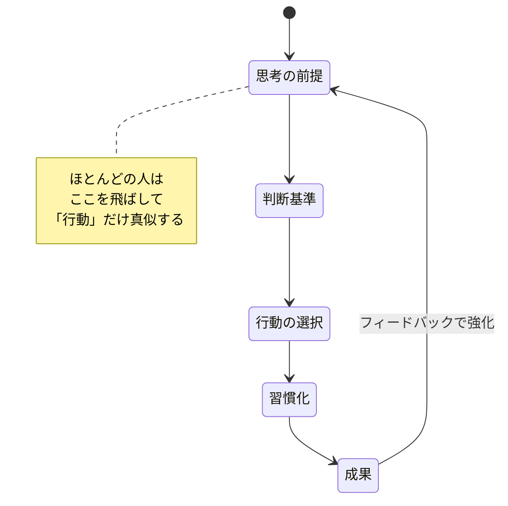
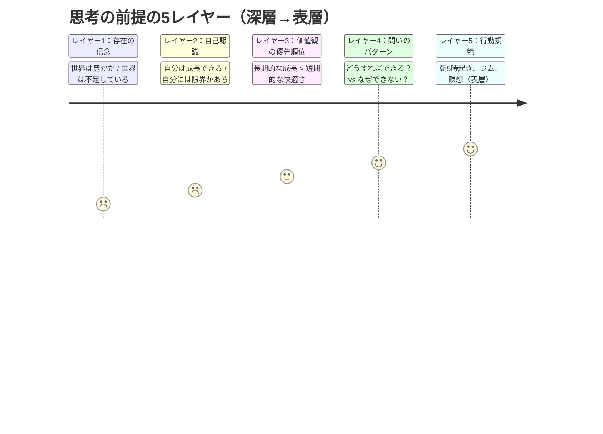
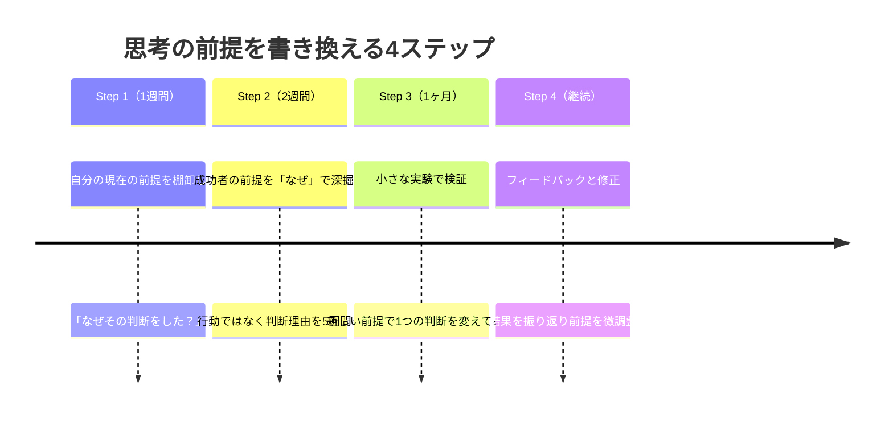

佐々木翔太（28歳・スタートアップ営業）は、ある経営者の本を読んで感動した。「毎朝5時に起きてジャーナリング。週3回のジム。砂糖を断つ。」翌日から全て真似した。2週間後、5時起きの眠気で商談に集中できず、ジムの筋肉痛で階段すら辛い。3週間目の朝、アラームを止めてベッドに沈みながらこう思った。「やっぱり俺には無理だ」――でも本当に足りなかったのは、意志力ではなく「思考の前提」だった。

## なぜ成功者の習慣を真似しても失敗するのか

書店に並ぶ成功本のほとんどは「行動」を教えてくれます。しかし、行動はあくまで「結果」であり、その行動を生み出した「思考の前提（メンタルモデル）」こそが本当のエンジンです。

行動模倣が失敗する理由は明確です。

**文脈の不一致**: 年収5億の経営者が朝5時に起きるのは、6時からCEOミーティングがあるからです。28歳の営業担当が同じ時刻に起きる理由は存在しません。

**深層構造の無視**: 同じ「ジャーナリング」でも、経営者は「今日の最重要決断は何か」と書き、真似した人は「今日のToDoリスト」を書きます。行動は同じでも、思考の前提が異なれば出力は全く違います。

**継続コストの高さ**: 自分の文脈に合わない習慣は、意志力で維持するしかありません。意志力は有限リソースであり、遅かれ早かれ枯渇します。

## 「思考の前提」とは何か――5つのレイヤー

思考の前提とは、世界をどのように解釈し、どのように判断するかという基礎的なフレームワークです。以下の5つのレイヤーで構成されています。

ほとんどの成功本はレイヤー5（行動規範）しか教えてくれません。しかし真にインパクトがあるのは、レイヤー1〜3の深層です。

### 各レイヤーの具体例

| レイヤー | 成功者の前提 | 一般的な前提 |
|---------|------------|------------|
| 存在の信念 | 「チャンスは無限にある」 | 「椅子取りゲームだ」 |
| 自己認識 | 「今の自分は発展途上」 | 「才能がないと無理」 |
| 価値観 | 「学びの速度 > 見栄え」 | 「失敗したくない」 |
| 問いのパターン | 「何を学べた？」 | 「誰のせい？」 |
| 行動規範 | 文脈に最適化された習慣 | 他者のコピー |

## ケーススタディ1：習慣コレクターからの脱出

**人物**: 高橋美咲（32歳・マーケティング担当）

**Before**: 美咲は「成功者の習慣」を片っ端から試していた。朝5時起き、ブレットプルーフコーヒー、ポモドーロ・テクニック、GTD、マインドフルネス瞑想。1年間で試した習慣は23個。続いたものは0個。

「また続かなかった。私って本当にダメだ」

コーチとの対話で、美咲の思考の前提が明らかになった。

コーチ:「美咲さん、なぜ朝5時に起きたいんですか？」
美咲:「成功者はみんなそうしてるから...」
コーチ:「美咲さん自身にとって、朝5時の価値は何ですか？」
美咲:「...考えたことなかった」

**転換点**: 美咲は「成功者の行動を真似する」という前提を、「自分の最高のパフォーマンスが出る条件を探す」に書き換えた。

**After**: 自分が最も集中できるのは夜22時〜24時だと発見。深夜に企画書を書き、翌朝はゆっくり出社するスタイルに変更。3ヶ月後、企画採用率が27%から68%に上昇。上司からは「最近の企画、切れ味が違う」と評価された。

美咲:「習慣を真似するんじゃなくて、『自分がどんな条件で最高になれるか』を探すのが大事だったんですね」

## ケーススタディ2：「責任思考」への転換

**人物**: 中村大輝（35歳・エンジニアリングマネージャー）

**Before**: チームの離職率が年間40%。中村は常に「うちの会社は給料が低いから」「最近の若い人は忍耐力がない」と外部要因のせいにしていた。経営者の本を読んで「1on1ミーティング」を導入したが、形式的な雑談で終わり、効果はゼロ。

**思考の前提の書き換え**: コーチングで「被害者思考」から「責任思考」へ転換。

中村:「会社のせいだと思ってたけど、自分がチームにとって安全な存在じゃなかったのかもしれない」

**After**: 1on1の目的を「進捗確認」から「メンバーのキャリアビジョンを一緒に考える場」に再定義。メンバーに「この会社で何を実現したい？」と問い始めた。

6ヶ月後の変化：
- 離職率: 40% → 12%
- チーム満足度スコア: 3.1 → 4.4（5段階）
- プロジェクト納期遵守率: 65% → 91%

中村:「1on1という『行動』は同じなのに、思考の前提が変わっただけで全く違う結果になった」

## ケーススタディ3：長期思考の獲得

**人物**: 小林理恵（29歳・フリーランスデザイナー）

**Before**: 月収50万円だが、毎月の売上確保に追われて疲弊。SNSで見かけた成功デザイナーの真似をして、ポートフォリオサイトを豪華にしたり、Twitterで毎日投稿したりしたが、単価は変わらず。

**思考の前提の違い**: 成功デザイナーは「1件の深い関係 > 10件の浅い取引」という長期思考を持っていた。小林は「今月の売上」にしか目が向いていなかった。

コーチ:「理恵さん、今の仕事の中で、1年後も続くものはどれですか？」
小林:「...1つもないかもしれません」

**After**: 「毎月の新規獲得」から「3社との深い継続関係」に方針転換。最初の3ヶ月は月収が35万円に下がったが、6ヶ月後には月収82万円に。さらに紹介が紹介を呼び、営業活動がほぼ不要に。

小林:「見えてる景色が全然違います。前は毎月『次の仕事どうしよう』って不安だったのが、今は3ヶ月先まで見えてて安心して創作に集中できる」

## 思考の前提を書き換える4ステップ

成功者の思考の前提を自分のものにするための実践的なプロセスです。

### Step 1: 自分の思考の前提を言語化する

まず、自分が無意識に持っている前提を明らかにします。

**実践ワーク**: 今週、重要な判断をするたびに以下を記録してください。
- 何を判断したか
- なぜその選択肢を選んだか
- その判断の背後にある「当たり前」は何か

例えば「値引き依頼にすぐ応じた」なら、背後には「断ると仕事がなくなる」という前提がある。この前提は本当に正しいのか？

### Step 2: 成功者の前提を「行動」ではなく「判断理由」で学ぶ

本やインタビューを読むとき、「何をしたか」ではなく「なぜそう判断したか」に注目します。

**「なぜ」の5回掘り**:
1. なぜ朝5時に起きる？ → CEOミーティングがあるから
2. なぜ朝にCEOミーティング？ → 朝が最も判断力が高いから
3. なぜ判断力を重視？ → 経営は判断の質がすべてだから
4. なぜ判断の質にこだわる？ → 一つの判断で100人の人生が変わるから
5. なぜそこまで責任を感じる？ → **「リーダーの仕事は意思決定だ」という前提**

ここで初めて、「朝5時起き」の本当の意味が見えます。学ぶべきは起床時刻ではなく、「自分の判断力が最も高い時間帯に最重要の意思決定をする」という前提です。

### Step 3: 小さな実験で新しい前提を検証する

学んだ前提を、いきなり全面採用するのではなく、小さな領域で実験します。

例: 「チャンスは無限にある」という前提を試す
- 今週、1つの案件で値引きせずに提案してみる
- 結果がどうなるか観察する
- 前提が自分の文脈で機能するか検証する

### Step 4: フィードバックループを回す

実験結果をもとに、前提を微調整します。成功者の前提をそのままコピーするのではなく、自分の環境・性格・価値観に合わせてカスタマイズすることが重要です。

## 今日から始められる3つの実践

**実践1: 「前提日記」をつける（5分/日）**

毎晩、今日の最も重要な判断を1つ選び、「この判断の背後にある自分の前提は何か？」を書き出します。1ヶ月続けると、自分の思考パターンが驚くほど明確になります。

**実践2: 「なぜ5回」読書法**

次に成功本を読むとき、ハイライトするのは「行動」ではなく「判断理由」。その理由について「なぜ？」を5回繰り返し、深層の前提を掘り当てます。

**実践3: 週1回の「前提チャレンジ」**

毎週1つ、自分の前提を意識的に反転させて行動してみます。「断ると嫌われる」なら、1つだけ丁寧に断ってみる。結果を観察し、前提の妥当性を検証します。

## 関連記事

思考の前提を深掘りするために、以下の記事も参考にしてください。

- [成長マインドセットの本質](/blog/growth-mindset) ― 「能力は伸ばせる」という前提がなぜ成果を変えるのか
- [第一原理思考で本質を見抜く](/blog/first-principles-thinking) ― 常識の前提を疑い、ゼロから考え直す技術
- [フィードバックを成長の燃料に変える方法](/blog/feedback-mindset) ― 他者からのフィードバックで自分の前提を更新する

---

## あなただけの「成功の前提」を見つけませんか？

他人の習慣を真似するのではなく、あなた自身の文脈に最適化された「思考の前提」を見つけること。それが本当の意味での成功への近道です。

**体験セッション（無料）**では、あなたが無意識に持っている思考の前提を一緒に言語化し、「何を書き換えれば最も大きな変化が起きるか」を特定します。佐々木さんや高橋さんのように、前提が変わった瞬間に行動は自然と変わり始めます。

[→ 体験セッションに申し込む](/sessions)
