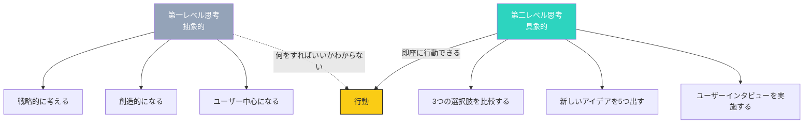
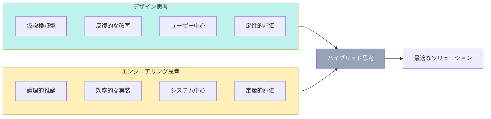

## 抽象的な言葉が行動を止める

「もっと戦略的に考えろ」「もっと創造的になれ」「もっとユーザー中心になれ」

これらの言葉を聞いて、即座に行動できますか？

多くの人が「はい」と答えますが、実際には何をすればいいかわからず、動けません。

これが「抽象的思考」の限界です。

## 第一レベル思考 vs 第二レベル思考

### 思考のレベル

### 第一レベル思考の特徴

- **抽象的な言葉**: 「戦略」「創造」「革新」
- **一方的な指示**: 「もっと〜」という形
- **結果に焦点**: 「何を得たいか」は明確
- **行動が不明**: 「どうすればいいか」が不明確

### 第二レベル思考の特徴

- **具体的な言葉**: 「3つの選択肢」「5つのアイデア」「インタビュー」
- **明確なステップ**: 「最初に〜、次に〜」という形
- **プロセスに焦点**: 「どのように達成するか」が明確
- **即座に行動可能**: すぐに実行できる

## 抽象的な概念を具体化するプロセス

### 具体化の5ステップ

### ステップ1: 例を挙げる

「戦略的に考える」→ 具体的な例を挙げる：
- 3つの競合を分析する
- 市場の3つのトレンドを調べる
- 自社の強みを3つ挙げる

### ステップ2: 測定可能な指標に変換

「創造的になる」→ 測定可能な指標：
- 1週間に新しいアイデアを5つ出す
- チームメンバーに1週間に3回提案する
- 既存のプロセスを1ヶ月に3つ改善する

### ステップ3: ステップに分解

「ユーザー中心になる」→ ステップに分解：
1. ユーザーインタビューを3人実施する
2. ユーザージャーニーマップを作成する
3. ユーザーの課題を5つ特定する
4. 課題解決のためのソリューションを3つ考える

### ステップ4: タイムラインを設定

「戦略的に考える」→ タイムライン：
- 週1: 競合分析
- 週2: 市場調査
- 週3: 強み分析
- 週4: 戦略立案

### ステップ5: 即座に実行可能な行動

「創造的になる」→ 即座に実行可能な行動：
- 今日: 新しいアイデアを3つ出す
- 明日: チームメンバーに提案する
- 明後日: プロセス改善のアイデアを1つ出す

## 実務で使える思考フレームワーク

### 1. 5W2Hの活用

**第一レベル**: 「戦略的に考えろ」
**第二レベル（5W2H）**:
- **What（何を）**: 具体的な成果物
- **Why（なぜ）**: 目的と背景
- **Who（誰が）**: 担当者と関係者
- **When（いつ）**: タイムライン
- **Where（どこで）**: 場所とツール
- **How（どのように）**: 実行方法
- **How much（いくら）**: 予算とリソース

### 2. SMART目標の活用

**第一レベル**: 「成果を出せ」
**第二レベル（SMART）**:
- **Specific（具体的）**: 「売上を上げる」→「新規顧客を20人獲得する」
- **Measurable（測定可能）**: 「成功する」→「KPIの達成率90%以上」
- **Achievable（達成可能）**: 「不可能」→「挑戦的だが達成可能」
- **Relevant（関連性）**: 企業の目標に合致している
- **Time-bound（期限あり）**: 「年内」→「12月31日まで」

### 3. SCAMPER法の活用

**第一レベル**: 「創造的になれ」
**第二レベル（SCAMPER）**:
- **Substitute（置換）**: 何かを別のものに置き換える
- **Combine（結合）**: 既存の要素を結合する
- **Adapt（適応）**: 他の分野のアイデアを適応する
- **Modify（修正）**: 大小や形を修正する
- **Put to other uses（他用途）**: 他の用途を見つける
- **Eliminate（除去）**: 不必要な要素を除去する
- **Reverse（逆転）**: 順序や向きを逆転する

## デザインとエンジニアリングの思考差

### デザイン思考 vs エンジニアリング思考

### デザイン思考の強み

- **ユーザー理解**: 深いユーザー理解
- **クリエイティビティ**: 新しいアイデアの創出
- **反復的改善**: ユーザーフィードバックに基づく改善

### エンジニアリング思考の強み

- **論理的整合性**: 一貫性のある実装
- **効率性**: 最適化された実装
- **再現性**: 同じ結果の再現

### ハイブリッド思考の実践

**1. デザイン思考で仮説を立てる**

「ユーザーはXが必要だ」

**2. エンジニアリング思考で実装する」

「Xを効率的に実装する」

**3. デザイン思考で評価する**

「ユーザーはXをどう感じるか」

**4. エンジニアリング思考で改善する**

「Xをどのように効率化できるか」

## 第二レベル思考の練習方法

### 練習1: 抽象的な言葉のリストアップ

日常的に使う抽象的な言葉を書き出す：
- 戦略的
- 創造的
- イノベーティブ
- ユーザー中心
- 効率的

### 練習2: 第二レベルへの変換

各抽象的な言葉を第二レベルに変換：
- 「戦略的に」→「3つの選択肢を比較する」
- 「創造的に」→「新しいアイデアを5つ出す」
- 「イノベーティブに」→「既存の常識を覆すアプローチを試す」

### 練習3: 即座の実行

第二レベルの思考を即座に実行する：
- 今日: 3つの選択肢を比較する
- 明日: 新しいアイデアを5つ出す
- 明後日: 常識を覆すアプローチを1つ試す

## 今日から始めるアクション

### アクション1: 抽象的な言葉のリストを作る

日常的に使う抽象的な言葉を5つ書き出しましょう。

### アクション2: 第二レベルへの変換

リストアップした言葉を第二レベルに変換しましょう。

### アクション3: 1つを実行する

変換した行動を1つ、今日実行しましょう。

## まとめ

第二レベル思考は、抽象的な言葉を具体的な行動に変換する力です。

「何をすればいいかわからない」という悩みは、第二レベル思考で解決できます。

今日から、意識的に第二レベル思考を使いましょう。

抽象的な言葉を聞いたら、「どうすればいいか」を自分に問いかけましょう。

具体的なステップ、測定可能な指標、即座に実行可能な行動。

これらを意識するだけで、行動の質は劇的に向上します。
