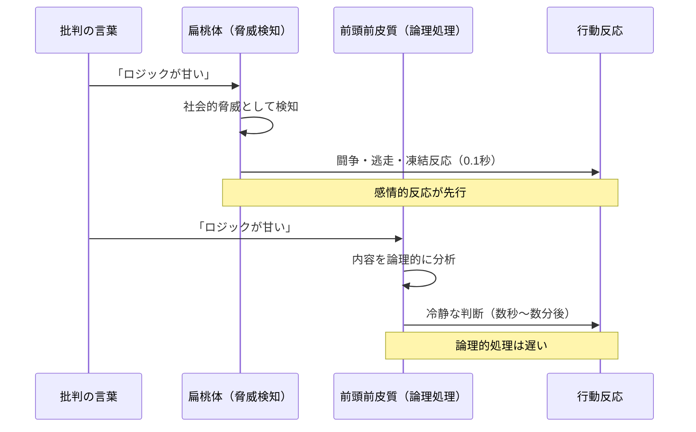
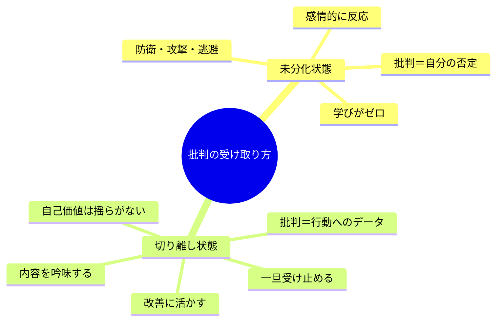
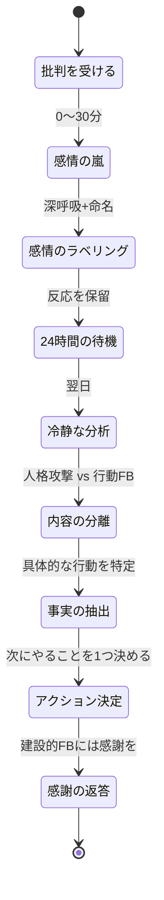

企画会議で上司の山本部長が言った。「鈴木さん、この提案書、ロジックが甘いね。クライアントの課題分析がもう一段深くないと通らないよ。」鈴木彩花（31歳・企画職）は頭が真っ白になった。会議室を出た後、トイレの個室で5分間動けなかった。「私はダメな人間だ」「もう企画なんて任せてもらえない」――上司が指摘したのは「提案書のロジック」だけ。なのに、彩花の心は「人格全体」を否定されたと受け取っていた。

## 批判が「攻撃」に感じられるメカニズム

批判を受けたとき、心拍数が上がり、顔が熱くなり、言葉が出なくなる。この反応は「弱いから」ではありません。人間の脳に組み込まれた防衛メカニズムです。



進化的に、集団からの否定的評価は「排除の脅威」でした。原始時代、集団から追い出されることは死を意味したため、批判に対して脳は「生存の危機」と同じレベルの警報を発します。

この反応が起きる4つの心理パターンがあります。

**人格と行動の未分化**: 「私の提案書がダメ」ではなく「私がダメ」と受け取る。行動と人格の境界線が曖昧なため、行動への批判が自己全体の否定に変換される。

**自己価値の外部依存**: 自分の価値を「他者からの評価」に依存させている。評価が下がる＝自分の価値が下がると感じる。

**完璧主義の罠**: 「間違えてはいけない」という前提があるため、指摘を受けること自体が「あってはならないこと」になる。

**過去の傷の再活性化**: 幼少期や過去の経験で受けた否定的な評価が、現在の批判によって再活性化される。

## 「人格」と「行動」を切り離すフレームワーク

切り離しの核心は、「私は（存在）」と「私がした（行動）」を明確に区別することです。



### 切り離しの3ステップ

**ステップ1: ラベリング（感情の認識）**

批判を受けた瞬間、自分の感情に名前をつけます。「今、怒りを感じている」「恥ずかしさがある」「悲しい」。感情にラベルを貼る行為自体が、扁桃体の活動を抑制し、前頭前皮質（論理的思考）を活性化させることが、fMRI研究で確認されています。

**ステップ2: 翻訳（人格→行動への変換）**

受け取った批判を「行動レベル」に翻訳します。

| 受け取り方（人格レベル） | 翻訳後（行動レベル） |
|---|---|
| 「私はダメだ」 | 「この提案書のロジックに改善点がある」 |
| 「私は能力がない」 | 「このスキルをもう一段磨く余地がある」 |
| 「嫌われている」 | 「この行動が相手に不快感を与えた」 |

**ステップ3: 抽出（改善アクションの特定）**

翻訳した批判から、具体的に「次に何を変えるか」を1つだけ決めます。1つに絞ることで実行可能性が高まり、「批判→改善→成長」のサイクルが回り始めます。

## ケーススタディ1：提案書を否定された企画職

**人物**: 鈴木彩花（31歳・企画職）

**Before**: 冒頭のエピソードの彩花。上司からのフィードバックを毎回「人格否定」と受け取り、会議後は半日以上モチベーションが低下。年間の企画提出数は12本で、チーム平均の半分以下。「どうせ否定される」と思い、挑戦的な企画を出せなくなっていた。

コーチ:「山本部長の言葉を、もう一度正確に思い出してみてください」
彩花:「『ロジックが甘い。課題分析をもう一段深く』...って言ってました」
コーチ:「そこに『彩花さんはダメな人間だ』という言葉はありましたか？」
彩花:「...いいえ。でもそう聞こえたんです」
コーチ:「その『翻訳』は、彩花さんの脳が自動的にやっていたんですね」

**実践したこと**:
1. 批判を受けたらまず深呼吸し、感情をラベリング（「今、恥ずかしさがある」）
2. 上司の発言を「そのまま」ノートに書き出す（自分の解釈を加えない）
3. 翌日、冷静な状態で「行動レベルの改善点」を抽出する

**After（4ヶ月後）**:
- 企画提出数: 12本/年 → 28本/年
- 採用率: 17% → 41%
- 上司との関係: 「最近の鈴木さん、フィードバックの受け止め方が変わったね。安心して厳しいことも言える」

彩花:「批判が怖くなくなったわけじゃない。でも、批判と自分の価値は別物だって、頭じゃなくて体で分かるようになった」

## ケーススタディ2：部下からの評価に打ちのめされたマネージャー

**人物**: 岡田健太郎（42歳・営業部マネージャー）

**Before**: 360度評価で部下から「岡田さんは話を聞いてくれない」「一方的に指示するだけ」というコメントが複数。岡田は1週間ほとんど眠れなかった。「15年もマネジメントやってきたのに、全否定された」

**転換点**: コーチとの対話で、批判の「内容」と「感情」を分離するワークを実施。

コーチ:「岡田さん、部下のコメントを感情を抜きにして、事実だけ取り出してみましょう」
岡田:「...『話を聞いてくれない』。確かに、最近は結論だけ伝えて、部下の意見を聞く時間を取ってなかった」
コーチ:「15年のマネジメント経験すべてが否定されたわけではないですよね？」
岡田:「そうですね...最近の半年くらい、忙しさにかまけて変わってしまっていたかも」

**実践したこと**:
- 1on1で最初の5分は「聞く時間」として設定（自分は質問だけ）
- 部下の発言をそのままノートに書き出す習慣
- 月1回、部下に「最近の自分のマネジメントで改善点はある？」と聞く

**After（6ヶ月後）**:
- 次回360度評価: 「話を聞いてくれない」のコメントがゼロに
- チーム売上: 前年比118%
- 岡田自身のストレススコア: 78点 → 52点（低いほど良い）

岡田:「批判を攻撃じゃなくて、部下からのギフトだと思えるようになった。あの360度評価がなかったら、自分のズレに気づけなかった」

## ケーススタディ3：SNSでの批判に心を折られたフリーランス

**人物**: 田中千尋（27歳・Webライター）

**Before**: 初めて書いた有料noteが話題になり、SNSで「内容が薄い」「この程度で金を取るのか」とコメントがついた。3日間何も書けなくなり、有料コンテンツの公開を完全にやめてしまった。売上は月8万円で低迷。

**転換点**: 批判コメントを「人格攻撃」と「内容フィードバック」に分類するワークを実施。

| コメント | 分類 | 活用法 |
|---------|------|--------|
| 「内容が薄い」 | 内容FB | 具体的にどこが薄いか分析 |
| 「金を取るのか」 | 感情的攻撃 | スルー対象 |
| 「具体例が少ない」 | 内容FB | 次回、事例を3つ以上入れる |
| 「偉そう」 | 感情的攻撃 | スルー対象 |

**After（3ヶ月後）**:
- 有料note再開。批判コメントの中の「内容FB」だけを改善に活用
- 2作目以降の評価: 星4.2 → 4.7（5段階）
- 月収: 8万円 → 23万円
- フォロワー: 批判をきっかけに「成長する姿」に共感する読者が増え、2,300人 → 5,800人

田中:「批判の中にも『使える情報』と『ただのノイズ』がある。それを分けられるようになったら、批判が怖くなくなった」

## 「24時間ルール」と実践ワーク

批判を受けた直後に最善の判断はできません。感情が先行している状態では、扁桃体が前頭前皮質を乗っ取っているからです。



### 今日から使える実践ワーク

**ワーク1: 感情温度計（毎日1分）**

批判を受けたとき（またはその記憶が蘇ったとき）、感情の強さを0〜10で記録します。「怒り:7、恥:8、悲しみ:4」のように。数値化すること自体が、感情から距離を取る効果があります。

**ワーク2: 批判の翻訳ノート（週1回5分）**

今週受けた批判を1つ選び、以下のテンプレートで書き出します。

```
■ 相手が言った言葉（原文そのまま）:
■ 私が受け取った意味:
■ 行動レベルに翻訳すると:
■ 次に変えること（1つだけ）:
```

**ワーク3: 「最悪の批判」シミュレーション（月1回10分）**

想像しうる最も厳しい批判を紙に書き出し、それに対して「行動レベルの翻訳」と「改善アクション」を準備しておきます。事前に練習しておくと、実際に批判を受けたときの衝撃が大幅に軽減されます。

## 批判を「歓迎」できるマインドセットへ

最終的に目指すのは、批判を「恐れない」ではなく「歓迎する」マインドセットです。

なぜなら、批判は「自分では見えない盲点」を教えてくれる唯一の手段だからです。鏡を見なければ、顔についた汚れに気づけないのと同じ。批判は、あなたの成長にとっての鏡です。

ただし重要なのは、すべての批判を受け入れる必要はないということ。以下の基準で判断します。

- **その人は、あなたの成長を願っている人か？** → Yes なら、耳が痛くても聞く価値がある
- **批判の内容に、具体的な行動への指摘があるか？** → Yes なら、改善材料として使える
- **同じ指摘を、複数の人から受けているか？** → Yes なら、高確率で真実

## 関連記事

- [フィードバックを成長の燃料に変える方法](/blog/feedback-mindset) ― 批判だけでなく、あらゆるフィードバックを活用する技術
- [インポスター症候群を乗り越える](/blog/imposter-syndrome) ― 「自分はここにいるべきじゃない」という声との向き合い方
- [セルフトークを味方につける](/blog/self-talk) ― 批判を受けた後の内なる声をコントロールする方法

---

## 批判が「怖い」から「ありがたい」に変わる体験をしませんか？

頭では分かっていても、批判を受けた瞬間の感情反応は簡単には変わりません。だからこそ、第三者との対話の中で「切り離し」の練習をすることが効果的です。

**体験セッション（無料）**では、あなたが最近受けた批判を題材に、「人格と行動の切り離し」を実際に体験していただきます。鈴木さんのように「批判と自分の価値は別物だ」と体で分かる感覚を、ぜひ味わってみてください。

[→ 体験セッションに申し込む](/sessions)
