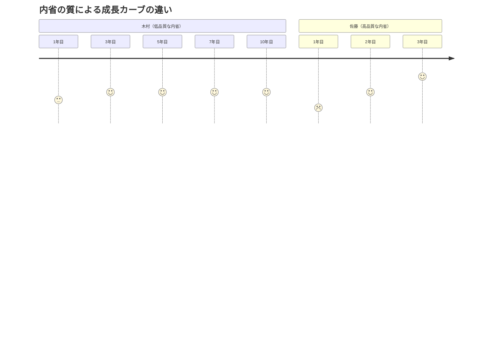
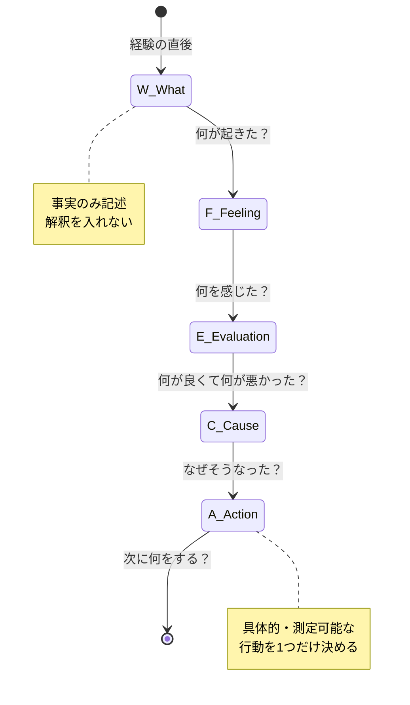
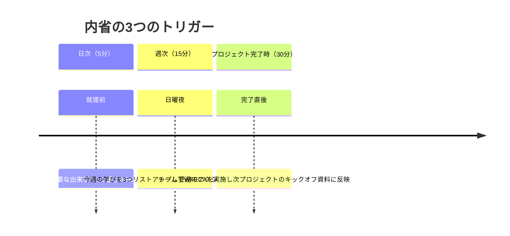

木村達也（36歳・IT企業プロジェクトマネージャー）は、10年目のプロマネだ。しかし年次評価で部長に言われた言葉が刺さった。「木村くん、10年の経験があるのに、同じ失敗を繰り返してるよね。3年目の佐藤さんの方が成長速度が速い。」帰り道、木村は考えた。確かに、自分はプロジェクトが終わるたびに「反省会」はやってきた。しかし振り返ってみると、反省会で出た改善策が次のプロジェクトに活かされたことは、ほぼゼロだった。

## 「経験年数」と「成長」は比例しない

ジョン・デューイの有名な言葉があります。「私たちは経験から学ぶのではなく、経験について反省することから学ぶ。」

10年の経験を持つ木村と、3年目の佐藤。この差を生んでいたのは、経験の量ではなく「内省の質」でした。



### 低品質な内省の特徴

木村のような「低品質な内省」には、以下のパターンがあります。

- **反省止まり**: 「ダメだった」で終わり、具体的な改善策がない
- **表面的**: 「コミュニケーション不足だった」と大雑把な分析で終わる
- **感情優先**: 「つらかった」「大変だった」という感情の吐き出しだけ
- **一方向**: 自分の視点だけで振り返り、他者の視点が欠落
- **孤立**: 振り返りの結果が次の行動に接続されていない

### 高品質な内省の特徴

一方、佐藤のような「高品質な内省」は次の要素を含みます。

- **構造化**: 何が・なぜ・次にどうするかが明確
- **具体的**: 行動レベルまで落とし込まれている
- **多角的**: 自分・相手・第三者の複数視点から分析
- **接続**: 学びが次のアクションに直結している
- **累積**: 過去の学びが蓄積され、パターンとして認識されている

## 効果的な内省のフレームワーク「WFECA」

ギブスのリフレクティブサイクルをベースに、実践しやすくカスタマイズしたフレームワークです。



### 各ステップの詳細

**W（What / 記述）**: 何が起きたかを客観的に書きます。「上手くいかなかった」ではなく、「プレゼンの質疑応答で、佐藤部長の3つ目の質問に答えられなかった」のように具体的に。

**F（Feeling / 感情）**: その時に感じた感情を正直に書きます。「焦った」「恥ずかしかった」「実は少し安心した」。感情を認識すること自体が、次の分析の精度を高めます。

**E（Evaluation / 評価）**: 何が上手くいき、何が上手くいかなかったかを分けます。失敗の振り返りだけでなく、「上手くいった部分」も必ず書く。成功要因も貴重な学びです。

**C（Cause / 原因分析）**: なぜそうなったかを掘り下げます。ここで「なぜ」を3〜5回繰り返すと、表面的な原因ではなく構造的な原因に辿り着けます。

**A（Action / 行動計画）**: 次に同じ状況があったとき、何をするかを具体的に1つだけ決めます。「もっと準備する」ではなく、「質疑応答で想定される質問を10個書き出し、それぞれの回答を200字で用意する」のように。

## ケーススタディ1：反省会が形骸化していたPM

**人物**: 木村達也（36歳・プロジェクトマネージャー）

**Before**: プロジェクト終了後に毎回「反省会」を実施。しかし中身は「忙しかった」「大変だった」「次はもっと余裕を持とう」という抽象的な感想の共有。議事録はあるが、次のプロジェクトで誰も読み返さない。同じパターンの遅延が5年間で8回発生。

コーチ:「木村さん、過去5回の反省会の議事録を見せていただけますか？」
木村:「はい...あ、5回とも『コミュニケーション不足』って書いてありますね」
コーチ:「同じ原因が5回出ている。つまり、反省はしているけど改善はしていない。なぜだと思いますか？」
木村:「...具体的に何を変えるか、決めてなかったからだと思います」

**実践したこと**: WFECAフレームワークの導入。特に「A（行動計画）」を「誰が・何を・いつまでに」まで落とし込み、次のプロジェクトのキックオフで共有するルールに変更。

**After（6ヶ月後）**:
- プロジェクト遅延率: 67% → 15%
- チームの反省会参加意欲: 「形だけの会議」から「学びがある」に変化
- 木村自身: 「10年目で初めて、経験が本当に蓄積されてる感覚がある」

## ケーススタディ2：「私は内省しています」の罠

**人物**: 渡辺まどか（28歳・人事コンサルタント）

**Before**: 毎晩30分のジャーナリングを3年継続。ノートは12冊に及ぶ。しかし上司から「まどかさん、同じミスが多い」と指摘される。

コーチがノートを見せてもらうと、内容の80%が「感情の吐き出し」だった。

```
今日もクライアントの前でうまく話せなかった。
つらい。自分が嫌になる。もっと頑張らないと。
明日は絶対うまくやる。
```

コーチ:「まどかさん、このジャーナリングで、具体的に何が変わりましたか？」
渡辺:「...気持ちは楽になります。でも、行動は変わってないかも」
コーチ:「感情を書くのは大切です。でもそこで止まると、内省ではなく『感情の排出』で終わってしまう」

**実践したこと**: ジャーナリングの最後に必ず「WFECA」のAを書くルールに。「明日、具体的に何を1つ変えるか？」を書かないと閉じない。

**After（3ヶ月後）**:
- クライアント面談の満足度: 3.4 → 4.2（5段階）
- 同じミスの再発率: 月平均3回 → 0.5回
- 渡辺自身: 「ノートの質が変わったら、人生の質が変わった。今まで3年間、ただ感情を流してただけだった」

## ケーススタディ3：成功体験からも学ぶ

**人物**: 松本俊介（45歳・営業部長）

**Before**: 松本はトップセールスとして20年のキャリアを持つ。しかし部下に営業を教えるのが苦手だった。「感覚でやってるからなあ...」が口癖。成功の理由を言語化できず、部下は「松本さんみたいには無理」と諦めモード。

コーチ:「松本さん、先月の大型契約、どうやって取れたんですか？」
松本:「まあ、フィーリングですかね」
コーチ:「もう少し具体的に。最初に何をしましたか？」
松本:「えーと...先にクライアントの業界の最新ニュースを10本読んで、相手が今何に悩んでるか仮説を立てて...」
コーチ:「それ、フィーリングじゃないですよね？」

**実践したこと**: 成功した商談のたびにWFECAで内省。特に「E（評価）」で「何が上手くいったか」を丁寧に言語化。

**After（4ヶ月後）**:
- 松本の営業メソッドが「松本式3ステップ商談」として体系化
- 部下の成約率: チーム平均18% → 29%
- 松本自身: 「自分のやってることを言葉にしたら、自分でも再現性が上がった。感覚じゃなくて、仕組みだったんだ」

## 内省を習慣化する「3つのトリガー」

内省は「やろうと思ったときにやる」では続きません。以下の3つのトリガーを設定します。



### 日次の内省テンプレート（5分）

```
■ 今日最も印象的だった出来事:
■ 感じたこと（感情を1つ）:
■ 上手くいった点:
■ 改善できた点:
■ 明日、1つだけ変えること:
```

これを毎日5分。これだけで、1ヶ月後には30件の「学び→アクション」が蓄積されます。

## 内省の質を高める3つのコツ

**コツ1: 「なぜ」を3回繰り返す**

「プレゼンが上手くいかなかった」→ なぜ？→「準備不足だった」→ なぜ？→「前日に別の作業が入った」→ なぜ？→「優先順位のルールが曖昧だった」。3回の「なぜ」で、表面的な原因から構造的な原因に到達します。

**コツ2: 成功と失敗を同じ比重で振り返る**

失敗の振り返りは自然にやりますが、成功の振り返りは見落としがちです。「なぜ上手くいったか」を言語化することで、再現性が高まり、他者にも共有できるようになります。

**コツ3: 他者の視点を借りる**

自分一人の内省には限界があります。信頼できる同僚やコーチとの対話を通じて、自分では気づかない盲点が照らされます。「あのとき、相手はどう感じていたと思う？」という問いが、内省の深度を一段引き上げます。

## 関連記事

- [フィードバックを成長の燃料に変える方法](/blog/feedback-mindset) ― 他者からのフィードバックを内省に活かすテクニック
- [ポモドーロ・テクニックで集中と振り返りのリズムを作る](/blog/pomodoro-technique) ― 25分の集中と5分の内省を組み合わせる
- [成長マインドセットの本質](/blog/growth-mindset) ― 「経験から学べる」という信念が内省の質を高める理由

---

## あなたの内省を「次のアクション」に変えませんか？

内省の習慣はあるのに成長を感じられない。あるいは、振り返りが「反省」で止まって行動に繋がらない。そんな壁を感じている方にこそ、第三者との対話が効果的です。

**体験セッション（無料）**では、あなたの最近の経験を題材に、WFECAフレームワークを実際に体験していただきます。木村さんのように「10年目で初めて経験が蓄積されてる感覚」を味わい、渡辺さんのように「ノートの質が変わったら人生の質が変わる」体験を、ぜひしてみてください。

[→ 体験セッションに申し込む](/sessions)
