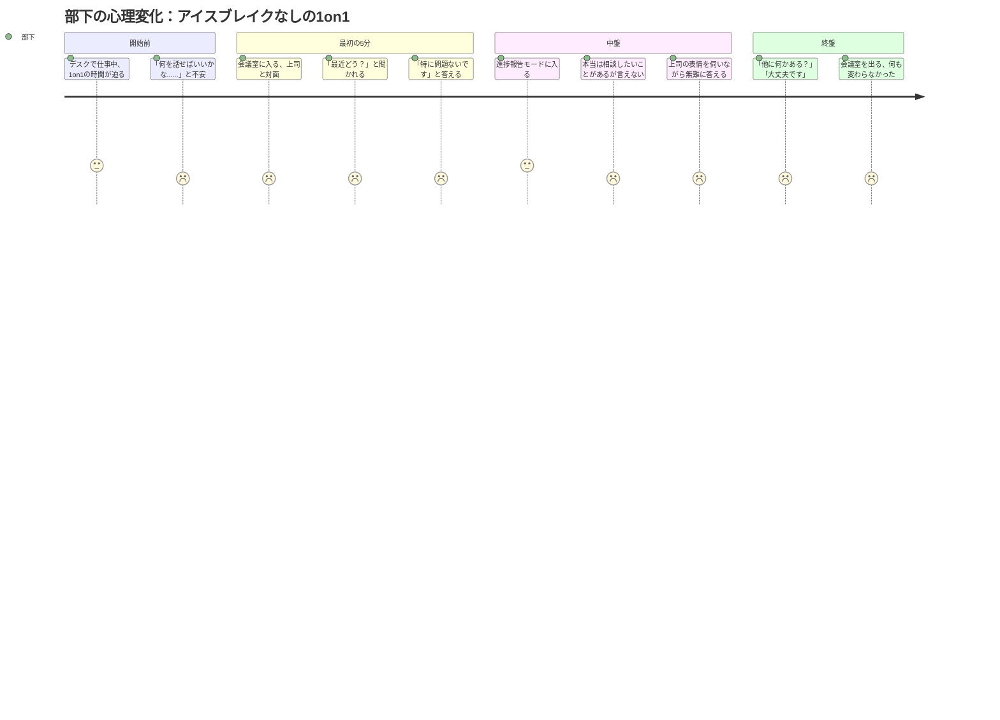
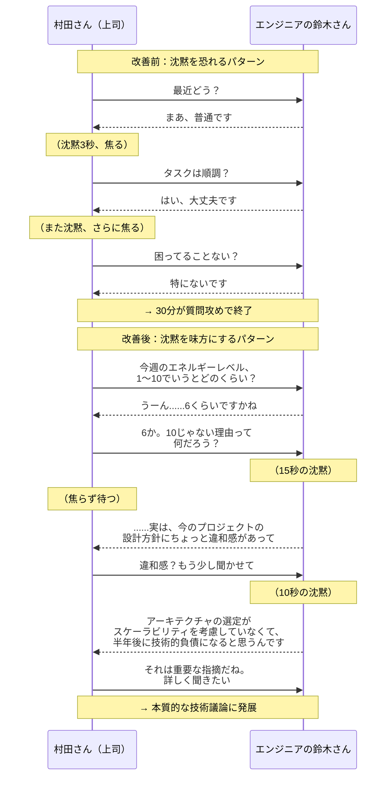
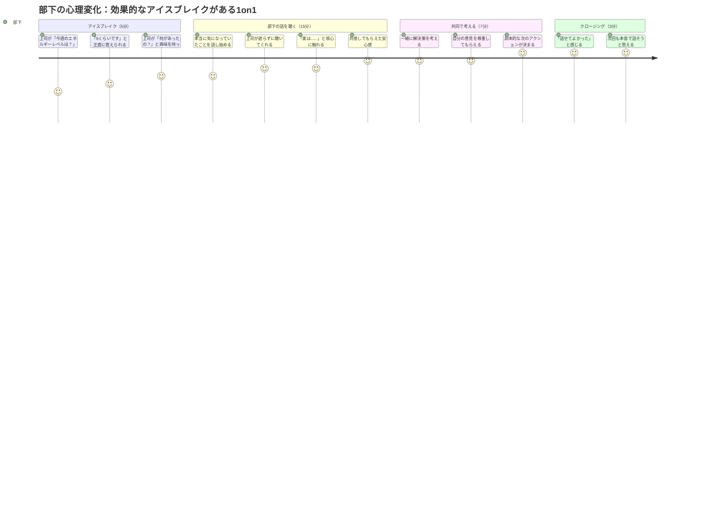

「最近どう？」

「あ、特に問題ないです」

「そう。じゃあ、今週のタスクの進捗を......」

月曜日の午前10時。会議室のドアが閉まった瞬間から、1on1の30分間は「進捗確認の場」に変わってしまう。本当は言いたいことがあるのに、部下は「特に問題ないです」の一言で蓋をする。上司も「問題がないならいいか」と次の議題に移る。

営業部門のマネージャー・高橋さん（仮名・44歳）は、まさにこのパターンに陥っていました。

「8人の部下と毎週1on1をやっているんですが、全員『大丈夫です』で終わるんですよ。でも、実際にはメンバー同士の軋轢もあるし、モチベーションが下がっている人もいる。それなのに、1on1では何も出てこない」

高橋さんが見落としていたのは、**1on1の最初の5分間の設計**でした。業務の話に入る前の「心理的な助走」——アイスブレイクの質が、残りの25分間の深さをすべて決めていたのです。

## なぜ部下は1on1で本音を話さないのか

部下が本音を話さない理由は、大きく3つあります。

**1. 評価への恐怖**
「こんなことを言ったら、評価に影響するかもしれない」という防衛本能。特に直属の上司との1on1では、この恐怖が無意識に働きます。

**2. 迷惑をかけたくない気持ち**
「忙しい上司の時間を取っているのだから、手短に終わらせよう」という配慮。日本の組織文化では特に強く現れます。

**3. 話す準備ができていない**
デスクから会議室に移動して、いきなり「何か困っていることは？」と聞かれても、頭の切り替えが追いつかない。心が「業務モード」から「対話モード」に切り替わるには、時間が必要なのです。

この図が示すように、アイスブレイクなしの1on1では、部下の心理的安全性が一度も高まらないまま30分が過ぎていきます。

では、アイスブレイクを丁寧に設計するとどうなるのか。高橋さんの変化を見てみましょう。

## ケース1：高橋さんの「天気質問」が変えた1on1

私のセッションで、高橋さんにまず提案したのは**「今の気持ちを天気で例える」**というシンプルなアイスブレイクでした。

「今日の気分を天気で例えると、どんな感じですか？」

最初、高橋さんは半信半疑でした。「そんな子どもっぽい質問で、大人が本音を話すようになるんですか？」

しかし、翌週の1on1で試してみると、驚くことが起きました。

入社3年目の小林さん（仮名）との1on1。高橋さんが「今日の気持ち、天気で例えるとどんな感じ？」と聞くと、小林さんは一瞬戸惑ったあと、こう答えました。

「......曇り時々雨、ですかね」

「おお、曇り時々雨か。何が雨の部分？」

「実は......先週のプレゼン、自分としてはうまくいったと思ったんですけど、クライアントの反応が微妙で......」

ここから、小林さんが3週間ずっと一人で抱えていた悩みが堰を切ったように出てきました。クライアントとのコミュニケーションの不安、先輩社員との関係性、自分のスキルへの自信のなさ。

「今まで何回も『困っていることはない？』って聞いてたのに、一度も出てこなかった話が、天気の質問一つで全部出てきたんです」と高橋さんは驚きを隠せませんでした。

**なぜ「天気質問」が効くのか？**

直接的に「悩みはある？」と聞くと、部下は「大丈夫です」と答えざるを得ない。それは「弱さを見せること」に直結するからです。しかし「天気で例えると？」という比喩的な質問は、一段階クッションを挟むことで心理的ハードルを下げます。「曇り」と答えるのは、「悩んでいます」と言うよりずっと簡単なのです。

## 効果的なアイスブレイクの3つの型

高橋さんの事例をきっかけに、1on1のアイスブレイクを体系化しました。大きく分けて3つの型があります。

### 型1：メタファー型（心の状態を間接的に聞く）

- 「今の気分を天気で例えると？」
- 「今週のエネルギーレベルを1〜10で表すと？」
- 「今の仕事を色で表すと何色？」

**効果**：心理的ハードルが低く、自然と感情が出てくる。初めての1on1や、関係構築の初期段階に特に有効。

### 型2：ポジティブフォーカス型（良かったことから入る）

- 「今週、ちょっと嬉しかったことは何かあった？」
- 「最近、仕事以外で楽しかったことは？」
- 「前回話してくれた〇〇、その後どうなった？」

**効果**：ポジティブな話題から始めることで、場の雰囲気が和らぐ。慣れてきた関係でのバリエーションとして有効。

### 型3：自己開示型（上司が先に弱みを見せる）

- 「実は僕、今週ちょっと失敗しちゃって......」
- 「最近読んだ本で考えさせられたことがあってさ」
- 「正直、今月の数字にはちょっと焦ってるんだよね」

**効果**：上司が先に自己開示することで「この場は弱さを見せていい場所」というメッセージを伝える。最も強力だが、上司側の勇気が必要。

## ケース2：沈黙を恐れなくなった村田さん

村田さん（仮名・39歳）は、IT企業のテックリード。エンジニア8名のチームを率いていましたが、1on1が苦手でした。

「エンジニアって、基本的に口数が少ないんですよ。アイスブレイクをしても沈黙が続いて、気まずくなってすぐ本題に入っちゃう」

村田さんの問題は「沈黙を恐れていること」でした。部下が黙ると、自分が何か話さなければと焦って、質問を重ねてしまう。結果、部下は「聞かれたことに答える」だけのモードになり、自発的な発言が出てこない。

改善のポイントは2つでした。

**1. 数値化する質問で具体性を引き出す**
「どう？」ではなく「1〜10で？」と聞くことで、部下は具体的な数字を答えざるを得ない。そして「10じゃない理由」を聞くことで、自然とネガティブな要素が言語化される。

**2. 沈黙を15秒間待つ**
村田さんには「部下が黙ったら、心の中で15秒数えてください。15秒経つまで、絶対に口を開かないでください」と伝えました。

最初は苦痛だったそうです。「3秒で口を開きたくなる。10秒が永遠に感じる。でも、15秒待つと、部下が自分から話し始めるんですよ」

村田さんのチームでは、この「15秒ルール」を導入してから3ヶ月で、1on1での部下の発言量が**平均2.8倍**に増加。さらに、チームのエンゲージメントスコアが**4.1から4.7に上昇**しました。

「沈黙は気まずさじゃなく、部下が考えている時間だったんですね」と村田さんは言います。

## アイスブレイクの「してはいけない」5つの落とし穴

効果的なアイスブレイクがある一方で、逆効果になるパターンもあります。

### 落とし穴1：形式的すぎるアイスブレイク

「はい、じゃあアイスブレイクね。最近どう？......OK、じゃあ本題に入ろうか」

これでは「アイスブレイクという名前のタスク」になってしまい、心理的安全性は生まれません。大切なのは、相手の答えに**本気で興味を持つこと**です。

### 落とし穴2：プライベートに踏み込みすぎる

「彼女（彼氏）はいるの？」「休日は何してるの？」

信頼関係が構築されていない段階でプライベートに踏み込むと、逆に警戒されます。最初は仕事に近い領域から始め、関係性の深まりに応じて範囲を広げましょう。

### 落とし穴3：毎回同じ質問

「いつも同じこと聞かれるんで、答えを用意してから行くようになりました」——こう言われたら赤信号。バリエーションを持たせ、予測不能な新鮮さを保ちましょう。

### 落とし穴4：自分の話ばかりする

「自己開示型」のアイスブレイクは有効ですが、上司の話が長くなりすぎると、部下の時間を奪ってしまいます。自己開示は30秒以内に収め、すぐに部下にバトンを渡しましょう。

### 落とし穴5：アイスブレイクの答えを評価に使う

「先週『つらい』って言ってたよね。大丈夫？ パフォーマンスに影響出てない？」——これをやると、二度と本音は出てきません。アイスブレイクで得た情報は**評価とは完全に切り離す**ことが鉄則です。

## 1on1全体の設計：アイスブレイクを起点に

アイスブレイクは「おまけ」ではなく、1on1全体の設計の起点です。以下の時間配分を推奨します。

**30分の1on1の理想的な構成：**

| フェーズ | 時間 | 内容 |
|---------|------|------|
| アイスブレイク | 5分 | 心理的安全性の確保、感情の確認 |
| 部下の話を聴く | 15分 | 部下が話したいことを優先 |
| 共同で考える | 7分 | 課題の整理、次のアクションの合意 |
| クロージング | 3分 | 今日の1on1の振り返り、次回への申し送り |

重要なのは、**「部下の話を聴く」が全体の50%を占める**こと。上司が話す時間は全体の30%以下に抑えます。

アイスブレイクが成功した1on1では、部下の心理的安全性が段階的に高まり、セッション後半では本質的な対話が生まれます。

## 明日の1on1から使えるアイスブレイク質問集

最後に、すぐに使える質問を場面別にまとめます。

**関係構築の初期段階：**
- 「今日の気分を天気で表すと？」
- 「今週、エネルギーレベルは1〜10でいうとどのくらい？」
- 「最近、『これは良かったな』と思った瞬間はある？」

**関係が深まってきた段階：**
- 「前回話してくれた〇〇、その後どうなった？」
- 「今、一番頭を使っていることって何？」
- 「もし今週もう1日休みがあったら、何に使う？」

**チームの変化があったとき：**
- 「最近のチームの雰囲気、どう感じてる？」
- 「新しいプロジェクトが始まって、率直にどう？」
- 「何か僕（私）にできることはある？」

**上司の自己開示として：**
- 「実は今週、ちょっと反省していることがあって......」
- 「最近こんなことを考えていてさ、聞いてくれる？」
- 「正直に言うと、今月は僕もちょっとプレッシャーを感じてて」

## まとめ：最初の5分が、すべてを変える

高橋さんは、アイスブレイクの改善から3ヶ月後、こう報告してくれました。

「8人全員が『大丈夫です』で終わっていた1on1が、今では時間が足りなくなるくらい話してくれるようになりました。特に、入社2年目の小林さんがチーム改善の提案書を自発的に出してきたのには驚きました。1on1で『もっとこうしたい』と話すうちに、自分でアクションを起こすようになったんです」

1on1の成功を決めるのは、議題の質でも上司のアドバイス力でもありません。**最初の5分間で、部下が「この場は安全だ」と感じられるかどうか**。それがすべてです。

明日の1on1、「最近どう？」の代わりに「今日の気分を天気で例えると？」と聞いてみてください。たった一つの質問が、部下との関係を根本から変えるかもしれません。

---

**関連記事：**
- [人を変える「パワフルクエスチョン」の技術](/blog/powerful-questions-transformation) - 本音を引き出す質問力を深掘り
- [沈黙を味方にする：考える時間の力](/blog/silence-ally-thinking-time) - 沈黙の活用法を詳しく解説
- [GROWモデル実践ガイド](/blog/grow-model-practical-guide) - 1on1で使えるコーチングフレームワーク

---

## 1on1の質を根本から変えたい方へ

「部下との1on1がうまくいかない」「チームの本音が見えない」という悩みをお持ちの方へ。

**体験セッション（無料）**では、あなたの実際の1on1の状況をヒアリングし、具体的な改善策を一緒に設計します。マネジメントの悩みは一人で抱えず、プロと一緒に解きましょう。

[→ 体験セッションに申し込む](/sessions)
